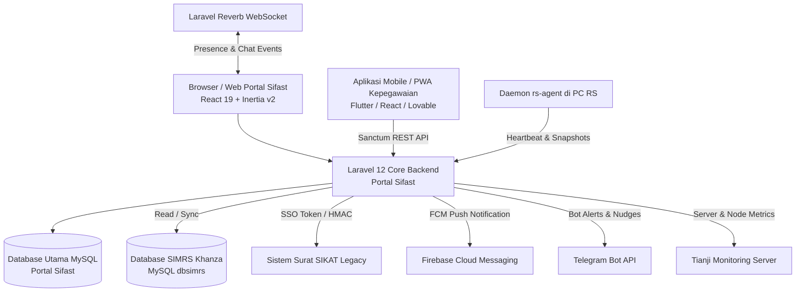

# 🧭 Portal Sifast Developer Onboarding Guide: Overview & Peta Panduan

Selamat datang di tim pengembang **Portal Sifast (RS Aisyiyah Siti Fatimah Tulangan)**! 

Dokumen ini disusun khusus sebagai panduan komprehensif bagi developer baru agar dapat memahami arsitektur, domain bisnis, alur kerja teknis, integrasi sistem, dan standar penulisan kode di seluruh ekosistem Portal Sifast secara cepat dan mendalam.

---

## 🏥 Tentang Portal Sifast

**Portal Sifast** adalah platform terpadu internal rumah sakit berbasis web dan API yang berfungsi sebagai pusat layanan operasional, manajemen aset, helpdesk teknologi informasi & pemeliharaan (ITIL v4), penjaminan mutu rumah sakit (SIMMUTU), tata naskah regulasi, tanggap darurat (Panic Button & Emergency Tracking), patroli keamanan, penggajian (Payroll), hingga headless CMS untuk Website Resmi RS Aisyiyah Siti Fatimah Tulangan.

### Ekosistem Sistem Terhubung:

---

## 📚 Struktur Modul Dokumentasi Onboarding

Panduan onboarding ini dipecah ke dalam beberapa dokumen tematik di dalam direktori `docs/developer-onboarding/`:

| No | Dokumen | Fokus Pembahasan |
| :--- | :--- | :--- |
| **01** | [`01-ARSITEKTUR-DAN-TECH-STACK.md`](./01-ARSITEKTUR-DAN-TECH-STACK.md) | Arsitektur Full-Stack (Laravel 12 + Inertia React 19), Dual Database Connection (`mysql` & `dbsimrs`), Real-time Reverb, Sanctum & Fortify. |
| **02** | [`02-STRUKTUR-PROJECT-DAN-STANDAR-KODE.md`](./02-STRUKTUR-PROJECT-DAN-STANDAR-KODE.md) | Struktur folder backend/frontend, konvensi penamaan, Role-Based Access Control (RBAC) & Flag Permission granular, Wayfinder Type-Safe Routing. |
| **02b** | [`02b-PANDUAN-FRONTEND-REACT-INERTIA-UNTUK-LARAVEL-DEV.md`](./02b-PANDUAN-FRONTEND-REACT-INERTIA-UNTUK-LARAVEL-DEV.md) | Panduan Transisi Frontend: Blade/jQuery ke React 19/Inertia v2, Wayfinder Routing, Form Management, Tailwind v4, Reverb Real-Time, & Debugging. |
| **03** | [`03-MODUL-HELPDESK-ITIL-TICKETING.md`](./03-MODUL-HELPDESK-ITIL-TICKETING.md) | Modul ITIL v4 Helpdesk: Tiket, Kategori/Prioritas, SLA Engine, Escalation, Sparepart/Vendor Cost, AI Documentation & Recommendation, Telegram Bot. |
| **04** | [`04-MODUL-ASET-DAN-INVENTARIS.md`](./04-MODUL-ASET-DAN-INVENTARIS.md) | Perbedaan Inventaris SIMRS (Read-Only) vs Aset Portal Sifast, Alkes/ASPAK vs Non-Alkes, Mutasi Lokasi, Peminjaman, Audit Fisik & QR Scanner. |
| **05** | [`05-MODUL-SIMMUTU.md`](./05-MODUL-SIMMUTU.md) | Sistem Informasi Manajemen Mutu: Indikator Nasional/Lokal, Target, Formula Numerator/Denominator, Realisasi Harian/Bulanan, Scoring Periode & Rekap Departemen. |
| **06** | [`06-MODUL-TATA-NASKAH-REGULASI.md`](./06-MODUL-TATA-NASKAH-REGULASI.md) | Manajemen Naskah Dinas Arahan, Penomoran Otomatis Klasifikasi/Sifat, State Transition Dokumen, Multi-Versi, Distribusi, dan SSO Token ke SIKAT. |
| **07** | [`07-MODUL-EMERGENCY-PANIC-BUTTON.md`](./07-MODUL-EMERGENCY-PANIC-BUTTON.md) | Sistem Tanggap Darurat: Panic Button Mobile, Geolocation GPS & Haversine Distance Tracking, Push Notification FCM, Command Center Dashboard. |
| **08** | [`08-MODUL-PATROLI-KEAMANAN.md`](./08-MODUL-PATROLI-KEAMANAN.md) | Patroli Satpam Digital: Master Area & Ruangan (QR Code Titik Patroli), Checklist Template Dinamis, Mobile Check-in & Laporan Patroli. |
| **09** | [`09-MODUL-PAYROLL-DAN-MONITORING-INFRASTRUKTUR.md`](./09-MODUL-PAYROLL-DAN-MONITORING-INFRASTRUKTUR.md) | Modul Penggajian (Import Excel/CSV, Multi-komponen, Approval/Rollback, Slip Gaji Mobile/Email) & Monitoring Infrastruktur (Tianji API + RS Agent Daemon). |
| **10** | [`10-MODUL-WEB-OFFICIAL-DAN-CMS.md`](./10-MODUL-WEB-OFFICIAL-DAN-CMS.md) | Headless CMS Website Publik: Artikel, Kamar Inap, Poliklinik & Jadwal Dokter SIMRS, Promo, Rekanan, Kritik/Saran, Instagram Graph API & Berita RSS Muhammadiyah. |
| **11** | [`11-REALTIME-WEBSOCKET-DAN-PRESENSI.md`](./11-REALTIME-WEBSOCKET-DAN-PRESENSI.md) | Arsitektur WebSocket Laravel Reverb, Laravel Echo React, Presence Channel, Tracking User Online, dan Internal Chat Realtime. |
| **12** | [`12-PANDUAN-SETUP-LOKAL-DAN-DEPLOYMENT.md`](./12-PANDUAN-SETUP-LOKAL-DAN-DEPLOYMENT.md) | Panduan Menyiapkan Lingkungan Development Lokal, Konfigurasi `.env`, Menjalankan Concurrently, Daftar Artisan Command Operasional, Deployment & Troubleshooting. |

---

## 🎯 Rekomendasi Urutan Belajar Developer Baru

1. **Hari ke-1 (Fondasi & Lingkungan Kerja):** Baca [`01-ARSITEKTUR-DAN-TECH-STACK.md`](./01-ARSITEKTUR-DAN-TECH-STACK.md) dan [`02-STRUKTUR-PROJECT-DAN-STANDAR-KODE.md`](./02-STRUKTUR-PROJECT-DAN-STANDAR-KODE.md), lalu praktikkan instalasi di [`12-PANDUAN-SETUP-LOKAL-DAN-DEPLOYMENT.md`](./12-PANDUAN-SETUP-LOKAL-DAN-DEPLOYMENT.md).
2. **Hari ke-2 (Transisi Frontend & Modul Operasional IT):** Baca modul [`02b-PANDUAN-FRONTEND-REACT-INERTIA-UNTUK-LARAVEL-DEV.md`](./02b-PANDUAN-FRONTEND-REACT-INERTIA-UNTUK-LARAVEL-DEV.md) untuk menguasai arsitektur React & Inertia, lalu pahami alur kerja ITIL pada [`03-MODUL-HELPDESK-ITIL-TICKETING.md`](./03-MODUL-HELPDESK-ITIL-TICKETING.md) dan pengelolaan aset pada [`04-MODUL-ASET-DAN-INVENTARIS.md`](./04-MODUL-ASET-DAN-INVENTARIS.md).
3. **Hari ke-3 (Modul Mutu, Naskah & Darurat):** Baca [`05`](./05-MODUL-SIMMUTU.md), [`06`](./06-MODUL-TATA-NASKAH-REGULASI.md), dan [`07`](./07-MODUL-EMERGENCY-PANIC-BUTTON.md).
4. **Hari ke-4 (Keamanan, Payroll, CMS & Real-time):** Baca [`08`](./08-MODUL-PATROLI-KEAMANAN.md), [`09`](./09-MODUL-PAYROLL-DAN-MONITORING-INFRASTRUKTUR.md), [`10`](./10-MODUL-WEB-OFFICIAL-DAN-CMS.md), dan [`11`](./11-REALTIME-WEBSOCKET-DAN-PRESENSI.md).
