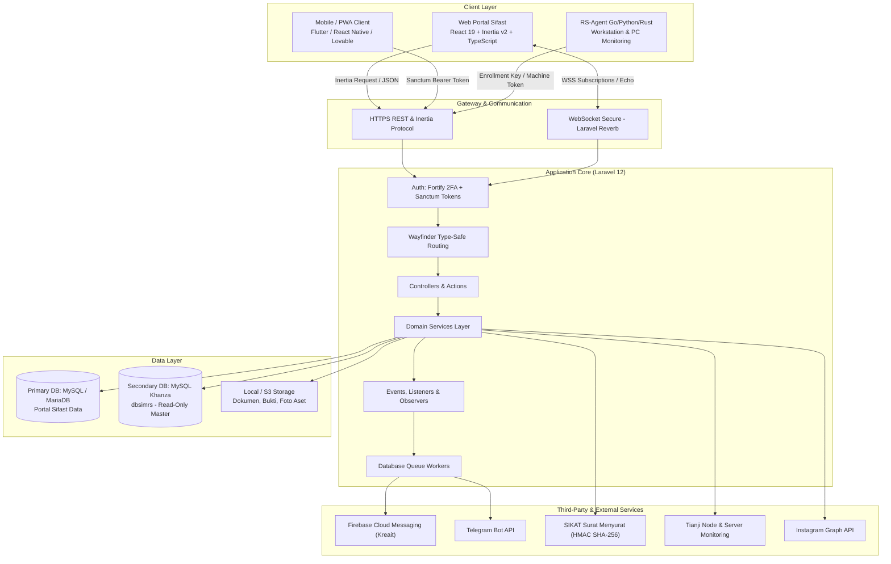

# 🏗️ Modul 01: Arsitektur Sistem dan Tech Stack

Dokumen ini menjelaskan fondasi teknologi, arsitektur perangkat lunak, serta strategi integrasi basis data ganda (*dual database connection*) yang digunakan dalam Portal Sifast.

---

## 1. Diagram Arsitektur Tingkat Tinggi



---

## 2. Rincian Tech Stack

### 🚀 Backend
* **Runtime & Framework:** PHP `^8.2`, Laravel `^12.0` (arsitektur modern tanpa `app/Http/Kernel.php`, konfigurasi terpusat di `bootstrap/app.php` dan `bootstrap/providers.php`).
* **Autentikasi & Keamanan:**
  * `laravel/fortify` (`^1.30`) — Otentikasi sesi web, Two-Factor Authentication (2FA), password resets.
  * `laravel/sanctum` (`^4.0`) — Autentikasi token API untuk integrasi sistem kepegawaian, aplikasi mobile patroli & panic button, serta token SSO.
* **Realtime WebSockets:**
  * `laravel/reverb` (`^1.7`) — Server WebSocket native bertenaga tinggi untuk push events, chat internal, dan user presence tracking.
* **Integrasi Eksternal:**
  * `kreait/laravel-firebase` (`^7.2`) — Integrasi Firebase Cloud Messaging (FCM) untuk push notification darurat (Panic Button).
  * `laravel-notification-channels/telegram` — Notifikasi otomatis tiket IT dan alert broadcast ke grup teknisi.
  * `bacon/bacon-qr-code` (`^3.1`) — Generator QR Code SVG/PNG untuk label aset, titik patroli satpam, dan verifikasi dokumen.
* **Testing & Code Quality:**
  * `pestphp/pest` (`^4.3`) — Modern PHP testing framework.
  * `laravel/pint` (`^1.24`) — PHP code style fixer (berbasis PSR-12 / Laravel standards).
  * `laravel/pail` (`^1.2.2`) — Real-time interactive log tailing di terminal.

### 🎨 Frontend
* **Framework & UI Core:**
  * `React` (`^19.2.0`) & `React-DOM` (`^19.2.0`).
  * `Inertia.js React` (`^2.3.7`) — Arsitektur Single Page Application (SPA) tanpa perlu membangun GraphQL/REST API redundan untuk view web.
  * `TypeScript` (`^5.7.2`) — Strict typing di seluruh komponen, hooks, types, dan props.
* **Styling & Design System:**
  * `Tailwind CSS` (`^4.0.0`) dengan `@tailwindcss/vite` (`^4.1.11`).
  * `@radix-ui/*` & `@headlessui/react` — Komponen headless accessible (Dialog, Dropdown Menu, Select, Collapsible, Tooltip, Avatar).
  * `lucide-react` (`^0.475.0`) — Standard ikon grafis antarmuka.
  * `clsx` & `tailwind-merge` (`twMerge`) — Utility class composing.
* **Visualisasi & Peta:**
  * `leaflet` (`^1.9.4`) & `react-leaflet` (`^5.0.0`) — Peta digital lokasi darurat / officer tracking.
  * `recharts` (`^3.7.0`) — Grafik analitik dashboard, monitoring tiket ITIL, dan capaian SIMMUTU.
* **Realtime Client:**
  * `laravel-echo` (`^2.3.4`) & `pusher-js` (`^8.5.0`) terhubung ke Reverb.
* **Routing DX:**
  * `@laravel/vite-plugin-wayfinder` (`^0.1.3`) & `laravel/wayfinder` — Auto-generated type-safe routes untuk memanggil nama rute Laravel langsung di TypeScript.

---

## 3. Arsitektur Dual Database Connection

Portal Sifast mengadopsi pola arsitektur **Dual Database** untuk memisahkan data operasional aplikasi baru dengan database historis SIMRS Khanza:

```mermaid
graph LR
    subgraph PortalDB ["Database Utama (MySQL / Default)"]
        direction TB
        T_Users["users"]
        T_Tickets["tickets"]
        T_Aset["aset & audit_asets"]
        T_Mutu["mutu_indicators & realisations"]
        T_Dokumen["dokumens & tatanaskah"]
        T_Emergency["emergency_reports"]
        T_Patroli["patroli_checkins"]
        T_Payroll["employee_salaries"]
        T_WebOfficial["web_official_articles"]
        T_Devices["monitored_devices"]
    end

    subgraph SimrsDB ["Database SIMRS Khanza (dbsimrs - Read Only)"]
        direction TB
        S_Pegawai["pegawai & petugas"]
        S_Dokter["dokter & jadwal"]
        S_Departemen["departemen"]
        S_Inventaris["inventaris & inventaris_barang"]
        S_Poli["poliklinik"]
    end

    PortalDB -.->|Relasi Logical via simrs_nik, kd_dokter, no_inventaris| SimrsDB
```



### Konfigurasi Koneksi (`config/database.php`):
1. **`mysql` (Default):**
   * Mengatur seluruh tabel utama Portal Sifast.
   * Dikelola penuh melalui Laravel Migrations (`database/migrations/`).
2. **`dbsimrs` (SIMRS Khanza):**
   * Host / Database yang mengarah ke database SIMRS Khanza RS.
   * Model Eloquent yang membaca koneksi ini memiliki properti:
     ```php
     protected $connection = 'dbsimrs';
     ```
   * Contoh Model SIMRS: [`Pegawai`](file:///Users/adijaya/MyFiles/Projects/RSAisyiahSitiFatimahTulangan/PortalSifast/app/Models/Pegawai.php), [`Dokter`](file:///Users/adijaya/MyFiles/Projects/RSAisyiahSitiFatimahTulangan/PortalSifast/app/Models/Dokter.php), [`Inventaris`](file:///Users/adijaya/MyFiles/Projects/RSAisyiahSitiFatimahTulangan/PortalSifast/app/Models/Inventaris.php), [`Departemen`](file:///Users/adijaya/MyFiles/Projects/RSAisyiahSitiFatimahTulangan/PortalSifast/app/Models/Departemen.php).
   * **Aturan Kritis:** Jangan pernah menjalankan migrasi alter tabel pada koneksi `dbsimrs`. Koneksi ini sifatnya *read-only* atau lookup untuk integrasi.

---

## 4. Pola Komunikasi Realtime & Background Processing

1. **Queue Connection (`database`):**
   * Tugas berat seperti broadcast push notification FCM, pengiriman webhook Telegram, aggregasi laporan harian, dan pemrosesan bulk email slip gaji dijalankan via background queue worker.
2. **Event & Broadcasting (Laravel Reverb):**
   * Menggunakan channel publik, private (`private-chat.{id}`), dan presence channel (`presence-online-users`).
   * Konfigurasi tersimpan di `routes/channels.php` dan `app/Events/`.
3. **Penyimpanan Berkas (Filesystem Disks):**
   * `public` disk untuk aset yang dapat diakses publik (foto dokter, banner promosi, thumbnail artikel).
   * `local` (private) disk untuk dokumen sensitif (slip gaji PDF, berkas naskah dinas regulasi, lampiran tiket IT internal) yang hanya bisa diunduh setelah melewati middleware otorisasi.
