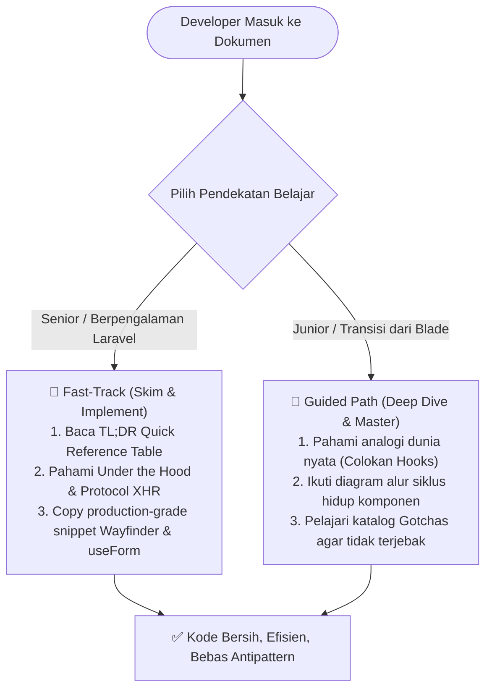
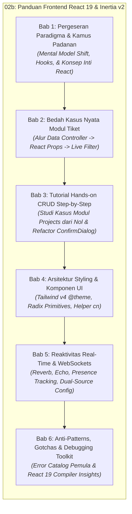

# ⚛️ Modul 02b: Panduan Frontend React 19 & Inertia.js v2 untuk Developer Laravel (Transisi dari Blade & jQuery)

Dokumen ini merupakan panduan komprehensif bagi developer Laravel di lingkungan RS Aisyiyah Siti Fatimah Tulangan (Sifast) untuk memahami dan menguasai arsitektur frontend modern berbasis **React 19**, **Inertia.js v2**, **TypeScript**, **Tailwind CSS v4**, **Radix UI Primitives**, dan **Laravel Wayfinder**.

Modul ini dirancang khusus untuk menjembatani pergeseran paradigma dari pola monolitik tradisional (Blade templates, jQuery `$('#id')`, manual AJAX, dan routing Ziggy `route()`) menuju arsitektur modern berbasis state reaktif yang cepat, terstruktur, dan type-safe.

---

## Metadata & Target Pembaca

| Entitas | Rincian |
| :--- | :--- |
| **Kode Dokumen** | `MOD-02B-FE-REACT-INERTIA` |
| **Versi Dokumen** | 1.0.0 (Tahap Fondasi & Bab 1 Lengkap) |
| **Status Dokumen** | Produksi Aktif / Terverifikasi |
| **Tanggal Pembaruan** | 2026-09-03 |
| **Tech Stack Utama** | React 19, Inertia.js v2, TypeScript 5+, Tailwind CSS v4, Radix UI Primitives, Laravel Wayfinder |
| **Target Pembaca** | **Junior Developer** (memerlukan analogi intuitif, panduan langkah-demi-langkah, dan solusi gotchas)<br/>**Senior Developer** (memerlukan matriks padanan cepat, arsitektur under-the-hood, dan rationale desain) |
| **Kaitan Modul Terkait** | [`00-INDEX-DAN-PANDUAN-MEMBACA.md`](./00-INDEX-DAN-PANDUAN-MEMBACA.md)<br/>[`01-ARSITEKTUR-DAN-TECH-STACK.md`](./01-ARSITEKTUR-DAN-TECH-STACK.md)<br/>[`02-STRUKTUR-PROJECT-DAN-STANDAR-KODE.md`](./02-STRUKTUR-PROJECT-DAN-STANDAR-KODE.md)<br/>[`11-REALTIME-WEBSOCKET-DAN-PRESENSI.md`](./11-REALTIME-WEBSOCKET-DAN-PRESENSI.md) |

---

## 🧭 Filosofi Desain Dual-Audience ("Skim or Deep Dive")

Untuk melayani pengembang dengan latar belakang pengalaman yang beragam, seluruh modul ini mengadopsi prinsip **Dual-Layer Information Architecture**:



* **Bagi Developer Senior (Fast-Track / Skim-Friendly):**
  * Di setiap bab disediakan **TL;DR Matrix** berisi komparasi sintaks langsung. Anda dapat membaca tabel dalam 1-2 menit dan langsung mengetahui padanan fitur tanpa membaca narasi panjang.
  * Dilengkapi callout **"Under the Hood & Architectural Rationale"**: Mengapa Wayfinder menggantikan Ziggy, bagaimana protokol `X-Inertia` menangani partial reloads dan browser history, serta mengapa React 19 Compiler mengotomatisasi memoization tanpa manual `useMemo`.
* **Bagi Developer Junior (Guided / Intuitive-Friendly):**
  * Disertai **analogi dunia nyata** yang menjembatani kebiasaan lama di Blade dan jQuery.
  * **Diagram alur visual (Mermaid)** untuk memahami siklus request-response dan perpindahan state.
  * Anotasi kode yang jelas pada studi kasus nyata di repositori Sifast.
  * Bagian khusus **"Gotchas & Jebakan Pemula"** yang merinci pesan error umum (seperti *"Objects are not valid as a React child"*, input form membeku, atau layar putih kosong) beserta solusinya.

---

## 🗺️ Peta Alur Modul (Roadmap 6 Bab)

Modul ini tersusun ke dalam 6 bab bertahap yang membimbing Anda dari pemahaman mental model hingga debugging tingkat lanjut:



---

## Bab 1: Pergeseran Paradigma & Kamus Padanan (Blade/jQuery vs React 19/Inertia v2)

Perbedaan terbesar antara pengembangan Laravel Blade konvensional dan React/Inertia terletak pada **siapa yang bertanggung jawab merender HTML dan mengelola state**:
1. **Dunia Blade & jQuery:** Server membuat HTML secara lengkap pada setiap request. Jika ada perubahan dinamis di browser, jQuery mencari elemen DOM menggunakan selector (`$('#id')`), lalu memanipulasi teks, class, atau atribut secara imperatif (*Imperative DOM-Driven*).
2. **Dunia React & Inertia:** Server hanya mengirimkan data mentah (JSON props), sedangkan browser merender UI menggunakan komponen React. Tampilan antarmuka adalah representasi langsung dari data state saat ini (*Declarative State-Driven*):
   $$\text{UI} = f(\text{state})$$
   Anda tidak pernah menyentuh DOM secara langsung. Anda hanya mengubah state, dan React secara otomatis memperbarui bagian DOM yang terdampak.

---

### 1.1 TL;DR Matrix Padanan Cepat (Bagi Senior)

Tabel berikut merangkum padanan langsung fitur-fitur yang biasa Anda gunakan di Blade dan jQuery dengan padanannya di React 19 dan Inertia.js v2 di Portal Sifast:

| Fitur / Kebutuhan | Pola Lama (Blade & jQuery) | Pola Modern (React 19 & Inertia v2 di Sifast) | Keterangan & Prinsip Desain |
| :--- | :--- | :--- | :--- |
| **Kondisional Render** | `@if($isAdmin)`<br/>`  <span>Admin</span>`<br/>`@else`<br/>`  <span>Staff</span>`<br/>`@endif` | `{isAdmin ? (`<br/>`  <span>Admin</span>`<br/>`) : (`<br/>`  <span>Staff</span>`<br/>`)}`<br/><br/>*Atau jika tanpa else:*<br/>`{isAdmin && <span>Admin</span>}` | Ekspresi JavaScript murni di dalam kurung kurawal `{}` JSX. Hindari ternary bersarang yang terlalu dalam. |
| **Perulangan Daftar** | `@foreach($tickets as $item)`<br/>`  <div>{{ $item->title }}</div>`<br/>`@endforeach` | `{tickets.map((item) => (`<br/>`  <div key={item.id}>{item.title}</div>`<br/>`))}` | Wajib menyertakan atribut `key={item.id}` unik pada elemen terluar untuk efisiensi diffing Virtual DOM. |
| **Proteksi CSRF Form** | `<form method="POST">`<br/>`  @csrf`<br/>`  ...`<br/>`</form>` | *Otomatis (Zero Config)*<br/>Inertia & Axios membaca cookie `XSRF-TOKEN` dan menyertakannya di header HTTP `X-XSRF-TOKEN`. | Tidak perlu tag `<input type="hidden" name="_token">` manual di form React. |
| **Membaca Nilai Input** | `const val = $('#title').val();` | `const { data } = useForm({ title: '' });`<br/>`console.log(data.title);` | Komponen terkontrol (*Controlled Component*). Nilai input selalu dicerminkan oleh state. |
| **Mengubah Nilai Input** | `$('#title').val('Komputer Rusak');` | `setData('title', 'Komputer Rusak');` | Mengubah state memicu sinkronisasi otomatis ke atribut `value` input HTML. |
| **Memperbarui Konten DOM** | `$('#status-badge').html('`<span class="badge">Selesai</span>`');` | `const [status, setStatus] = useState('open');`<br/>`...`<br/>`<Badge>{status}</Badge>` | UI dideklarasikan sekali. Tampilan berubah reaktif saat `setStatus('closed')` dipanggil. |
| **Menampilkan Validasi Error** | `@error('title')`<br/>`  <span class="text-red-500">{{ $message }}</span>`<br/>`@enderror` | `<InputError message={errors.title} />`<br/>*(dari hook `useForm` Inertia)* | Validasi server dari `FormRequest` Laravel dipetakan langsung ke objek `errors`. |
| **URL Routing Helper** | `route('tickets.show', $ticket->id)` *(Ziggy global)* | `import { show } from '@/routes/tickets';`<br/>`<Link href={show(ticket.id).url}>Detail</Link>` | **Laravel Wayfinder**: Route helper modular, type-safe saat kompilasi TypeScript, dan tree-shakeable. |
| **Navigasi Antar Halaman** | `<a href="/tickets" class="btn">Daftar Tiket</a>` | `import { Link } from '@inertiajs/react';`<br/>`<Link href="/tickets" className="btn">Daftar Tiket</Link>` | `<Link>` mencegat klik browser untuk melakukan request XHR tanpa reload penuh (*Single Page Application*). |
| **Flash Session Message** | `@if(session('success'))`<br/>`  <div class="alert">{{ session('success') }}</div>`<br/>`@endif` | `const { flash } = usePage().props;`<br/>`{flash.success && <Alert>{flash.success}</Alert>}` | Shared props dari middleware `HandleInertiaRequests` dapat diakses di mana saja via `usePage()`. |
| **Autentikasi User** | `Auth::user()->name`<br/>`@auth ... @endauth` | `const { auth } = usePage().props;`<br/>`<span>{auth.user.name}</span>` | Data user login tersedia secara global di seluruh komponen halaman React. |

> [!TIP]
> **Mental Model Shift untuk Developer Senior:**
> Lupakan siklus *"Cari elemen di DOM lalu ubah propertinya"* ala jQuery. Dalam React, Anda tidak pernah memerintahkan browser untuk *"menambahkan class `hidden` ke tombol A"* atau *"mengganti teks elemen `#total`"*. Sebaliknya, tentukan kondisi data:
> ```tsx
> const [isLoading, setIsLoading] = useState(false);
> // Tampilan secara deklaratif merespon isLoading:
> <Button disabled={isLoading}>
>   {isLoading ? 'Menyimpan...' : 'Simpan Tiket'}
> </Button>
> ```
> Saat `setIsLoading(true)` dipanggil, React mengevaluasi ulang JSX dan memperbarui DOM secara presisi dan efisien.

---

### 1.2 Arsitektur Single Blade Shell (`resources/views/app.blade.php`)

Salah satu kejutan terbesar bagi pengembang Laravel yang baru berpindah ke Inertia adalah: **Mengapa folder `resources/views/` hampir kosong?**

Di Portal Sifast, seluruh antarmuka web dilayani oleh satu-satunya file Blade induk: [`resources/views/app.blade.php`](../../resources/views/app.blade.php).

#### 1. Bedah Anatomi `app.blade.php`

Berikut adalah struktur lengkap file shell induk di Portal Sifast:

```blade
<!DOCTYPE html>
<html lang="{{ str_replace('_', '-', app()->getLocale()) }}" @class(['dark' => ($appearance ?? 'system') == 'dark'])>
    <head>
        <meta charset="utf-8">
        <meta name="viewport" content="width=device-width, initial-scale=1">

        {{-- Deteksi preferensi dark mode sistem sebelum render utama agar tidak berkedip (FOUC) --}}
        <script>
            (function() {
                const appearance = '{{ $appearance ?? "system" }}';
                if (appearance === 'system') {
                    const prefersDark = window.matchMedia('(prefers-color-scheme: dark)').matches;
                    if (prefersDark) {
                        document.documentElement.classList.add('dark');
                    }
                }
            })();
        </script>

        {{-- Style inline untuk background dasar agar seirama dengan tema --}}
        <style>
            html { background: #F8FAFC; }
            html.dark { background: #0F172A; }
        </style>

        <title inertia>{{ config('app.name', 'Laravel') }}</title>

        <meta name="mobile-web-app-capable" content="yes">
        <meta name="apple-mobile-web-app-capable" content="yes">
        <meta name="apple-mobile-web-app-status-bar-style" content="default">

        <link rel="icon" href="/favicon.ico" sizes="any">
        <link rel="icon" href="/favicon.svg" type="image/svg+xml">
        <link rel="apple-touch-icon" href="/apple-touch-icon.png">

        {{-- Tipografi Inter Utama --}}
        <link rel="preconnect" href="https://fonts.googleapis.com">
        <link rel="preconnect" href="https://fonts.gstatic.com" crossorigin>
        <link href="https://fonts.googleapis.com/css2?family=Inter:wght@100;200;300;400;500;600;700;800&display=swap" rel="stylesheet">

        {{-- Konfigurasi Reverb/WebSocket dari Backend --}}
        @if(config('broadcasting.default') === 'reverb')
        @php
            $reverbHost = config('broadcasting.connections.reverb.options.client_host')
                ?? request()->getHost();
            $reverbHost = str_contains($reverbHost, ':') ? explode(':', $reverbHost)[0] : $reverbHost;

            $reverbPort = config('broadcasting.connections.reverb.options.client_port')
                ?? (int) config('broadcasting.connections.reverb.options.port', 8080);

            $reverbScheme = config('broadcasting.connections.reverb.options.client_scheme')
                ?? (config('broadcasting.connections.reverb.options.scheme') ?? 'http');

            if (request()->secure()) {
                $reverbScheme = 'https';
            }

            $reverbConfig = [
                'key' => config('broadcasting.connections.reverb.key'),
                'host' => $reverbHost,
                'port' => (int) $reverbPort,
                'scheme' => $reverbScheme,
            ];
        @endphp
        <script>
            window.REVERB_CONFIG = @json($reverbConfig);
        </script>
        @else
        <script>window.REVERB_CONFIG = null;</script>
        @endif

        @viteReactRefresh
        @vite(['resources/css/app.css', 'resources/js/app.tsx'])
        @inertiaHead
    </head>
    <body class="font-sans antialiased">
        @inertia
    </body>
</html>
```

#### 2. Peran Direktif `@inertiaHead` dan `@inertia`

* **`@inertiaHead`:** Direktif ini bertindak sebagai gerbang dinamis untuk elemen `<head>`. Ketika halaman React menentukan judul via komponen `<Head title="Daftar Tiket ITIL" />`, Inertia menyinkronkan tag `<title>` dan `<meta>` browser tanpa memerlukan full page reload.
* **`@inertia`:** Direktif ini merender sebuah elemen penampung root di dalam `<body>`:
  ```html
  <div id="app" data-page="{&quot;component&quot;:&quot;tickets/index&quot;,&quot;props&quot;:{...},&quot;url&quot;:&quot;/tickets&quot;,&quot;version&quot;:&quot;...&quot;}"></div>
  ```
  Elemen ini memuat seluruh payload JSON awal yang disiapkan oleh controller Laravel.

#### 3. Titik Temu di Client: [`resources/js/app.tsx`](../../resources/js/app.tsx)

Di sisi frontend, React 19 mengambil alih elemen `#app` melalui inisialisasi Inertia:

```tsx
// Cuplikan dari resources/js/app.tsx
createInertiaApp({
    title: (title) => (title ? `${title} - ${appName}` : appName),
    resolve: (name) =>
        resolvePageComponent(
            `./pages/${name}.tsx`,
            import.meta.glob('./pages/**/*.tsx'),
        ),
    setup({ el, App, props }) {
        const root = createRoot(el);

        root.render(
            <StrictMode>
                <App {...props} />
            </StrictMode>,
        );
    },
    progress: {
        color: '#0A9E8F', // Warna teal khas identitas RS Siti Fatimah
    },
});
```

`resolvePageComponent` secara dinamis mencocokkan string nama komponen yang dikirim dari controller Laravel (misal: `Inertia::render('tickets/index')`) dengan berkas fisik di `resources/js/pages/tickets/index.tsx`.

#### 4. Mengapa Portal Sifast Murni CSR dan Tanpa SSR?

Portal Sifast memilih arsitektur **Client-Side Rendered (CSR)** murni tanpa Server-Side Rendering (SSR) berbasis pertimbangan arsitektur dan operasional nyata rumah sakit:

1. **Latensi Intranet Rumah Sakit yang Sangat Rendah:** Seluruh unit kerja (IGD, Rawat Inap, Farmasi, Radiologi, IT) mengakses portal melalui jaringan intranet lokal (LAN/WLAN) atau VPN dedicated dengan latensi `< 5ms`.
2. **Tanpa Kebutuhan SEO Publik:** Portal Sifast adalah sistem internal rumah sakit yang berada di balik gerbang otentikasi (2FA Fortify & role permissions). Tidak ada mesin pencari publik (Googlebot) yang perlu mengindeks data operasional tiket, aset, atau rekam medis internal.
3. **Penyederhanaan Infrastruktur & Keandalan Operasional:** Mengaktifkan SSR mengharuskan tim IT mengelola daemon runtime Node.js tambahan di server produksi di samping PHP-FPM dan Nginx. Tanpa SSR, container deployment menjadi sangat ramping, deterministik, dan minim titik kegagalan (*single point of failure*).
4. **Efisiensi Caching Browser Karyawan:** Bundle JavaScript dan CSS dikompilasi oleh Vite dengan *content-hashing*. Setelah browser staf mengunduh bundle sekali di awal shift kerja, navigasi antar ratusan modul rumah sakit berlangsung instan karena hanya mentransfer payload JSON ringan.

---

### 1.3 Anatomi & Intuisi React Hooks (Bagi Junior)

Bagi pengembang yang terbiasa menulis kode PHP prosedural atau script jQuery linier, konsep *React Hooks* seringkali terasa membingungkan di awal.

> [!NOTE]
> **Analogi "Colokan Listrik":**
> Bayangkan komponen React Anda (`function TicketCard()`) adalah sebuah ruangan kosong tanpa listrik. Fungsi tersebut dieksekusi dari baris pertama hingga terakhir setiap kali komponen ditampilkan, lalu selesai.
> 
> **React Hooks (`use...`)** adalah colokan listrik (*plug & socket*) di dinding ruangan tersebut. Melalui kabel colokan ini, komponen Anda dapat terhubung ke fasilitas internal browser dan React engine:
> * Ingin punya memori ingatan yang tidak hilang saat ruangan dibersihkan? Tancapkan colokan `useState`.
> * Ingin menyalakan lampu saat staf memasuki ruangan dan mematikannya saat staf keluar? Tancapkan colokan `useEffect`.
> * Ingin mengirim formulir tiket tanpa reload halaman? Tancapkan colokan `useForm`.
> * Ingin mengetahui siapa staf yang sedang login saat ini? Tancapkan colokan `usePage`.

```
┌─────────────────────────────────────────────────────────────┐
│                    Komponen React (Fungsi)                  │
│                                                             │
│   useState ───🔌───> [Mesin State Reaktif React]            │
│   useEffect ──🔌───> [Siklus Hidup Browser & Cleanup]       │
│   useForm ────🔌───> [Manajemen Input & Validasi Inertia]   │
│   usePage ────🔌───> [Shared Props Global dari Laravel]     │
│                                                             │
│   Return: JSX Tampilan Deklaratif                           │
└─────────────────────────────────────────────────────────────┘
```

Berikut adalah hook-hook esensial yang digunakan setiap hari di Portal Sifast:

#### 1. `useState`: State Reaktif vs Variabel Biasa

Di jQuery, Anda menyimpan data sementara di atribut HTML (`<div data-id="10">`) atau variabel global `let counter = 0;`. Namun di React, mengubah variabel biasa **tidak akan memicu pembaruan layar**.

```tsx
import { useState } from 'react';

export function CounterTiket() {
    // ❌ SALAH: Mengubah variabel biasa tidak meng-update tampilan
    // let hitungan = 0;
    // const tambah = () => { hitungan++; };

    // ✅ BENAR: Gunakan useState
    // [nilai_saat_ini, fungsi_pengubah] = useState(nilai_awal);
    const [hitungan, setHitungan] = useState<number>(0);

    return (
        <div className="p-4 border rounded-lg">
            <p>Total Tiket Disetujui: <strong className="text-teal-600">{hitungan}</strong></p>
            <button 
                onClick={() => setHitungan(hitungan + 1)}
                className="px-3 py-1.5 bg-teal-600 text-white rounded hover:bg-teal-700"
            >
                Tambah Tiket
            </button>
        </div>
    );
}
```

Setiap kali `setHitungan` dipanggil dengan nilai baru, React secara otomatis memanggil ulang fungsi komponen dan memperbarui angka di layar secara instan.

#### 2. `useEffect`: Pengganti `$(document).ready()` dan Manajemen Siklus Hidup

Dalam jQuery, kita menulis:
```javascript
$(document).ready(function() {
    console.log('Halaman selesai dimuat!');
    const timer = setInterval(fetchUpdate, 5000);
});
```

Di React, operasi efek samping (*side effects*) seperti inisialisasi library pihak ketiga, timer interval, atau listener browser ditangani oleh `useEffect`:

```tsx
import { useEffect, useState } from 'react';

export function RealtimeClock() {
    const [waktu, setWaktu] = useState<string>(new Date().toLocaleTimeString());

    useEffect(() => {
        // 1. Eksekusi saat komponen pertama kali terpasang ke layar (Mount)
        console.log('Jam dinding dipasang ke layar');
        
        const timerId = setInterval(() => {
            setWaktu(new Date().toLocaleTimeString());
        }, 1000);

        // 2. Fungsi Pembersihan (Cleanup Function)
        // Wajib ada untuk mencegah memory leak saat user berpindah halaman!
        return () => {
            console.log('Komponen dilepas dari layar, menghentikan timer');
            clearInterval(timerId);
        };
    }, []); // <-- Dependency array kosong [] artinya hanya berjalan sekali saat mount

    return <span>Waktu Operasional: {waktu}</span>;
}
```

> [!WARNING]
> **Pentingnya Cleanup Function:**
> Jika Anda memasang event listener (`window.addEventListener`), timer (`setInterval`), atau koneksi WebSocket tanpa mengembalikan fungsi pembersih (`return () => ...`), proses tersebut akan terus berjalan di latar belakang meskipun user sudah berpindah halaman. Hal ini akan menyebabkan kebocoran memori (*memory leak*) yang memperlambat browser staf rumah sakit.

#### 3. `useForm` (Inertia.js): Manajemen Form Otomatis

Hook `useForm` dari `@inertiajs/react` adalah tulang punggung seluruh formulir transaksi di Portal Sifast (tiket ITIL, mutasi aset, penilaian mutu, dan presensi).

```tsx
import { useForm } from '@inertiajs/react';
import { FormEventHandler } from 'react';

export function FormBuatTiket() {
    // Inisialisasi useForm dengan field dan nilai awal
    const { data, setData, post, processing, errors, reset } = useForm({
        judul: '',
        deskripsi: '',
        prioritas: 'medium',
    });

    const handleSubmit: FormEventHandler = (e) => {
        e.preventDefault(); // Mencegah reload halaman standar browser
        
        post('/tickets', {
            onSuccess: () => {
                reset(); // Bersihkan form jika server memvalidasi sukses
                alert('Tiket berhasil dibuat!');
            },
        });
    };

    return (
        <form onSubmit={handleSubmit} className="space-y-4 max-w-md">
            <div>
                <label className="block text-sm font-medium">Judul Gangguan</label>
                <input
                    type="text"
                    value={data.judul}
                    onChange={(e) => setData('judul', e.target.value)}
                    className="w-full border p-2 rounded"
                    placeholder="Contoh: Printer IGD macet"
                />
                {/* Tampilkan error validasi Laravel secara otomatis */}
                {errors.judul && (
                    <p className="text-sm text-red-600 mt-1">{errors.judul}</p>
                )}
            </div>

            <button
                type="submit"
                disabled={processing} // Otomatis mencegah double-submit saat loading
                className="bg-teal-600 text-white px-4 py-2 rounded disabled:opacity-50"
            >
                {processing ? 'Menyimpan ke Server...' : 'Kirim Tiket'}
            </button>
        </form>
    );
}
```

Keunggulan utama `useForm`:
* Menangani state input ganda secara otomatis melalui helper `setData`.
* Melacak properti boolean `processing` untuk menonaktifkan tombol submit secara otomatis saat request sedang berjalan.
* Menerima payload error validasi HTTP 422 dari Laravel `FormRequest` dan memetakannya langsung ke objek `errors`.

#### 4. `usePage` (Inertia.js): Akses Global Shared Props

Di Blade, Anda dapat memanggil `Auth::user()` atau `session('status')` di sembarang view. Di React, data global tersebut disalurkan oleh backend via middleware `HandleInertiaRequests` dan dapat diakses dari komponen mana pun menggunakan `usePage()`:

```tsx
import { usePage } from '@inertiajs/react';

type SharedAuthProps = {
    auth: {
        user: {
            id: number;
            name: string;
            email: string;
            role: string;
        };
    };
    flash: {
        success?: string;
        error?: string;
    };
};

export function UserBadgeHeader() {
    // Akses langsung data auth dan flash tanpa perlu mengoper props dari parent
    const { auth, flash } = usePage<SharedAuthProps>().props;

    return (
        <header className="flex justify-between items-center p-4 bg-white border-b">
            <div>
                <h1 className="font-semibold text-gray-800">Portal RS Siti Fatimah</h1>
                {flash.success && (
                    <span className="text-xs bg-emerald-100 text-emerald-800 px-2 py-0.5 rounded">
                        {flash.success}
                    </span>
                )}
            </div>
            <div className="text-sm text-gray-600">
                Login sebagai: <strong className="text-gray-900">{auth.user.name}</strong> ({auth.user.role})
            </div>
        </header>
    );
}
```

#### 5. Custom Hooks Unggulan Portal Sifast

Selain hooks bawaan React dan Inertia, Portal Sifast menyediakan serangkaian custom hooks yang dapat langsung digunakan dalam pengembangan fitur:

1. **`useEcho` (via `@laravel/echo-react`):**
   Hook reaktif untuk berlangganan channel dan event WebSocket Reverb.
2. **`useUserPresence` ([`resources/js/hooks/use-user-presence.ts`](../../resources/js/hooks/use-user-presence.ts)):**
   Melacak daftar dokter dan staf rumah sakit yang sedang aktif secara online melalui presence channel `presence.users`.
3. **`useAppearance` ([`resources/js/hooks/use-appearance.tsx`](../../resources/js/hooks/use-appearance.tsx)):**
   Mengatur tema antarmuka (*System*, *Light*, *Dark*), menyinkronkan status cookie server, serta menambahkan class `.dark` pada tag `<html>`.
4. **`useWebSocketStatus` ([`resources/js/hooks/use-websocket-status.ts`](../../resources/js/hooks/use-websocket-status.ts)):**
   Menyediakan indikator status koneksi socket real-time (*connecting*, *connected*, *disconnected*, *unavailable*) untuk status bar sistem.

---

### 1.4 Konsep Inti React yang Wajib Dikuasai

Sebelum membangun halaman interaktif, pastikan Anda memahami 7 pilar fundamental React dan TypeScript berikut:

#### 1. Aturan Sintaks JSX / TSX
JSX adalah sintaks perluasan JavaScript yang menyerupai HTML namun berjalan sepenuhnya di bawah aturan JavaScript:
* **`className` alih-alih `class`:** Karena kata `class` adalah kata kunci bawaan JavaScript (*reserved keyword*).
* **`htmlFor` alih-alih `for`:** Digunakan pada elemen `<label htmlFor="nik">`.
* **Wajib Self-Closing:** Tag tanpa penutup wajib diakhiri dengan garis miring penutup (`<input />`, ``, `<hr />`, `<br />`). Lupa menambahkan `/` akan menyebabkan error kompilasi Vite.
* **Root Tunggal atau Fragment (`<> ... </>`):** Sebuah komponen harus mengembalikan satu elemen induk. Gunakan *React Fragment* `<> ... </>` jika Anda tidak ingin menambahkan tag pembungkus `<div>` yang tidak perlu ke DOM:
  ```tsx
  return (
      <>
          <Header />
          <MainContent />
          <Footer />
      </>
  );
  ```

#### 2. Komponen & Props (Sifat Read-Only / Immutability)
Props adalah argumen yang dikirim dari komponen induk ke komponen anak. **Props bersifat Read-Only (Immutable) dan dilarang keras dimutasi secara langsung.**

```tsx
type Props = {
    nomorTiket: string;
    status: 'open' | 'closed';
};

export function BadgeTiket({ nomorTiket, status }: Props) {
    // ❌ DILARANG KERAS: Mutasi props langsung
    // status = 'closed';

    return (
        <span className={status === 'open' ? 'text-amber-600' : 'text-emerald-600'}>
            #{nomorTiket} ({status.toUpperCase()})
        </span>
    );
}
```

React mengandalkan perbandingan referensi memori (*shallow comparison*) untuk mendeteksi perubahan data. Memodifikasi props secara langsung akan merusak algoritma deteksi render React.

#### 3. Controlled vs Uncontrolled Components (Misteri Input "Membeku")
Salah satu error paling sering dialami developer yang beralih dari Blade/jQuery adalah **input teks yang membeku (tidak bisa diketik sama sekali)**:

```tsx
// ⚠️ KASUS JEBAKAN: Input tidak bisa diketik
export function BrokenInput() {
    const [judul, setJudul] = useState('Printer Rusak');

    // Karena value dikunci ke variabel judul TANPA onChange handler,
    // browser menolak ketikan user baru karena React selalu merender ulang 'Printer Rusak'
    return <input type="text" value={judul} />;
}

// ✅ SOLUSI: Selalu pasangkan value dengan onChange
export function WorkingInput() {
    const [judul, setJudul] = useState('Printer Rusak');

    return (
        <input
            type="text"
            value={judul}
            onChange={(e) => setJudul(e.target.value)}
            className="border p-1 rounded"
        />
    );
}
```

Pada *Controlled Component*, elemen formulir HTML tidak menyimpan nilainya sendiri di dalam DOM internal, melainkan mendelegasikan nilai dan pembaruannya secara penuh kepada state React.

#### 4. Lifting State Up (Koordinasi Data Antar Komponen)
Jika dua komponen bersaudara membutuhkan data yang sama (misalnya komponen `PencarianTiket` dan komponen `TabelTiket`), pindahkan state ke komponen induk (*parent*), lalu oper nilai state ke bawah sebagai props dan oper fungsi pengubahnya sebagai callback:

```tsx
// Komponen Induk: Mengelola State Utama
export function ModulTiketParent() {
    const [kataKunci, setKataKunci] = useState('');

    return (
        <div className="space-y-4">
            <SearchBar value={kataKunci} onSearchChange={setKataKunci} />
            <TicketList keyword={kataKunci} />
        </div>
    );
}

// Komponen Anak 1: Input Pencarian
function SearchBar({ value, onSearchChange }: { value: string; onSearchChange: (v: string) => void }) {
    return (
        <input 
            type="text" 
            value={value} 
            onChange={(e) => onSearchChange(e.target.value)} 
            placeholder="Cari ID tiket..." 
            className="border p-2 rounded w-full"
        />
    );
}

// Komponen Anak 2: Tabel Daftar
function TicketList({ keyword }: { keyword: string }) {
    return <div>Menampilkan hasil pencarian untuk: <strong>{keyword || 'Semua'}</strong></div>;
}
```

#### 5. Atribut Wajib `key` pada `.map()` & Virtual DOM Diffing
Saat menampilkan array data menggunakan `.map()`, React mewajibkan setiap elemen memiliki atribut `key` unik:

```tsx
type ItemAset = { id: number; namaBarang: string };

export function DaftarAset({ items }: { items: ItemAset[] }) {
    return (
        <ul>
            {/* ✅ BENAR: Menggunakan ID unik database */}
            {items.map((aset) => (
                <li key={aset.id} className="py-1 border-b">
                    {aset.namaBarang}
                </li>
            ))}
        </ul>
    );
}
```

> [!CAUTION]
> **Jangan Gunakan Index Array sebagai Key (`key={index}`):**
> Jika urutan item berubah (misalnya akibat sorting atau penghapusan item di tengah tabel), React yang menggunakan `key={index}` akan keliru mengasosiasikan state komponen anak dengan posisi baris lama. Hal ini dapat menimbulkan bug fatal seperti teks input tertukar antar baris data. Selalu gunakan identifier unik persisten dari database seperti `item.id`.

#### 6. React Context sebagai Bus Data Global Ringan
React Context memungkinkan kita mendistribusikan data ke seluruh cabang komponen di bawahnya tanpa harus mengoper props secara manual di setiap tingkatan (*prop drilling*). Contoh konkret di Portal Sifast adalah `PresenceContext` yang mendistribusikan status real-time user ke navbar, sidebar, dan jendela chat.

#### 7. TypeScript Dasar untuk Komponen React
Di Portal Sifast, seluruh kode frontend ditulis menggunakan **TypeScript** untuk menjamin keamanan tipe (*type safety*) dan mencegah runtime error saat produksi.

```tsx
// 1. Definisikan antarmuka Props secara eksplisit
type StatusTiket = 'open' | 'in_progress' | 'resolved';

type TiketItemProps = {
    id: number;
    judul: string;
    prioritas: 'low' | 'medium' | 'high';
    status: StatusTiket;
    onUpdateStatus?: (id: number, statusBaru: StatusTiket) => void; // Optional callback
};

// 2. Pasangkan tipe pada parameter komponen
export function TiketRow({ id, judul, prioritas, status, onUpdateStatus }: TiketItemProps) {
    return (
        <div className="flex items-center justify-between p-3 border-b">
            <span>#{id} - {judul}</span>
            <span className="text-xs px-2 py-1 rounded bg-slate-100">{prioritas}</span>
        </div>
    );
}
```

Dengan TypeScript, IDE Anda (VS Code / Cursor / Windsurf) akan memberikan auto-completion cerdas dan segera menandai garis merah jika Anda salah mengetikkan nama field atau mengoper tipe data yang tidak sesuai.

---

### 1.5 Under the Hood: Protokol Navigasi Inertia (Bagi Senior)

Bagi pengembang berpengalaman, memahami mekanisme kerja protokol Inertia di balik layar (*under the hood*) sangat penting untuk mengoptimalkan performa dan memecahkan kendala perutean tingkat lanjut.

#### 1. Cara Kerja Navigasi Tanpa Reload

Inertia bukanlah framework SPA konvensional seperti Vue SPA atau React SPA murni yang membutuhkan API REST endpoints terpisah (`/api/v1/...`). Sebaliknya, Inertia adalah **protokol adaptor** yang menghubungkan routing Laravel yang sudah ada dengan antarmuka React.

Berikut diagram urutan navigasi request Inertia:

```mermaid
sequenceDiagram
    autonumber
    actor User as Pengguna (Browser)
    participant Link as Inertia Client (<Link>)
    participant Middleware as Laravel HandleInertiaRequests
    participant Controller as Laravel TicketController
    participant React as React 19 Root

    User->>Link: Klik <Link href="/tickets">
    Note over Link: Cegat event default browser (e.preventDefault)
    Link->>Middleware: HTTP GET /tickets (Header: X-Inertia: true)
    
    alt Request Inertia Pertama (Full Page Load)
        Middleware->>Controller: Eksekusi index()
        Controller-->>Middleware: Inertia::render('tickets/index', $props)
        Middleware-->>User: HTML Lengkap app.blade.php + data-page JSON
        User->>React: Bootstrapping createInertiaApp()
    else Navigasi Inertia Berikutnya (AJAX / XHR)
        Middleware->>Controller: Eksekusi index()
        Controller-->>Middleware: Inertia::render('tickets/index', $props)
        Middleware-->>Link: HTTP 200 JSON Payload ({ component, props, url, version })
        Note over Link: Periksa kecocokan version aset Vite
        Link->>React: Tukar komponen halaman aktif & serahkan props baru
        Link->>User: Update URL browser via window.history.pushState
    end
```

#### 2. Anatomi Payload JSON Inertia
Saat navigasi XHR terjadi, server Laravel tidak mengirimkan kode HTML. Server mengembalikan payload JSON terstruktur seperti berikut:

```json
{
  "component": "tickets/index",
  "props": {
    "auth": {
      "user": { "id": 1, "name": "Dr. Siti Aminah", "role": "medis" }
    },
    "tickets": {
      "data": [
        { "id": 101, "title": "Permintaan Kalibrasi Tensi Digital", "status": "open" }
      ],
      "current_page": 1,
      "total": 1
    },
    "filters": { "search": "", "status": "open" },
    "flash": { "success": null, "error": null }
  },
  "url": "/tickets",
  "version": "4f5b8a9c2d1e0f3a"
}
```

Client Inertia membaca field `component`, memuat file `resources/js/pages/tickets/index.tsx`, lalu merender komponen tersebut dengan menyuntikkan isi `props`.

#### 3. Partial Reloads via Opsi `only: [...]`

Pada halaman dengan data yang besar (misalnya tabel tiket dengan 50 baris beserta metadata statistik di sidebar), melakukan reload seluruh data server hanya karena user mengganti filter kategori akan membuang bandwidth dan siklus CPU database.

Inertia menyediakan fitur **Partial Reload**:

```tsx
import { router } from '@inertiajs/react';

function refreshDaftarTiketSaja() {
    router.reload({
        only: ['tickets'], // Hanya minta prop 'tickets', abaikan statistik & user props
    });
}
```

Saat perintah ini dijalankan, browser mengirimkan dua header HTTP tambahan:
* `X-Inertia-Partial-Data: tickets`
* `X-Inertia-Partial-Component: tickets/index`

Di backend Laravel, jika Anda membungkus query menggunakan closure atau `Inertia::lazy()`, query statistik lain yang berat **tidak akan dieksekusi sama sekali oleh database**:

```php
// Backend TicketController.php
return Inertia::render('tickets/index', [
    // Dieksekusi hanya jika diminta pada partial reload
    'tickets' => Ticket::filter($request)->paginate(15),
    
    // TIDAK dieksekusi jika request menyertakan only: ['tickets']
    'statistikBerat' => fn () => LaporanStatistikService::hitungTahunan(),
]);
```

#### 4. Sinkronisasi History Browser: `pushState` vs `replaceState`

Inertia memanfaatkan HTML5 History API untuk memperbarui address bar browser tanpa memicu refresh halaman:
* **`pushState` (Default):** Menambahkan entri baru ke riwayat browser. Digunakan saat user berpindah halaman atau membuka form baru (`/tickets` $\rightarrow$ `/tickets/create`). Tombol *Back* di browser akan membawa user kembali ke `/tickets`.
* **`replaceState` (`replace: true`):** Menimpa entri URL saat ini di riwayat browser tanpa menambah tumpukan riwayat baru. Sangat krusial digunakan pada **Live Search / Filter**:
  ```tsx
  router.get('/tickets', { search: query }, {
      preserveState: true,
      replace: true, // Tidak mengotori tombol 'Back' browser
  });
  ```
  Dengan opsi `replace: true`, user tidak perlu menekan tombol *Back* sebanyak 20 kali hanya untuk membatalkan 20 karakter yang mereka ketikkan di kotak pencarian.

---

*Lanjutkan membaca ke [Bab 2: Bedah Kasus Nyata Modul Tiket ITIL](#bab-2-bedah-kasus-nyata-modul-tiket-itil-tahap-1-analisis) (segera hadir di Task 4).*
