# ⚛️ Modul 02b: Panduan Frontend React 19 & Inertia.js v2 untuk Developer Laravel (Transisi dari Blade & jQuery)

Dokumen ini merupakan panduan komprehensif bagi developer Laravel di lingkungan RS Aisyiyah Siti Fatimah Tulangan (Sifast) untuk memahami dan menguasai arsitektur frontend modern berbasis **React 19**, **Inertia.js v2**, **TypeScript**, **Tailwind CSS v4**, **Radix UI Primitives**, dan **Laravel Wayfinder**.

Modul ini dirancang khusus untuk menjembatani pergeseran paradigma dari pola monolitik tradisional (Blade templates, jQuery `$('#id')`, manual AJAX, dan routing Ziggy `route()`) menuju arsitektur modern berbasis state reaktif yang cepat, terstruktur, dan type-safe.

---

## Metadata & Target Pembaca

| Entitas | Rincian |
| :--- | :--- |
| **Kode Dokumen** | `MOD-02B-FE-REACT-INERTIA` |
| **Versi Dokumen** | 2.0.0 (Lengkap Seluruh 6 Bab: Fondasi, Kasus Nyata, CRUD, Styling, WebSockets, & Debugging Toolkit) |
| **Status Dokumen** | Produksi Aktif / Terverifikasi |
| **Tanggal Pembaruan** | 2026-09-03 |
| **Tech Stack Utama** | React 19, Inertia.js v2, TypeScript 5+, Tailwind CSS v4, Radix UI Primitives, Laravel Wayfinder |
| **Target Pembaca** | **Junior Developer** (memerlukan analogi intuitif, panduan langkah-demi-langkah, dan solusi gotchas)<br/>**Senior Developer** (memerlukan matriks padanan cepat, arsitektur under-the-hood, dan rationale desain) |
| **Kaitan Modul Terkait** | [`00-INDEX-DAN-PANDUAN-MEMBACA.md`](./00-INDEX-DAN-PANDUAN-MEMBACA.md)<br/>[`01-ARSITEKTUR-DAN-TECH-STACK.md`](./01-ARSITEKTUR-DAN-TECH-STACK.md)<br/>[`02-STRUKTUR-PROJECT-DAN-STANDAR-KODE.md`](./02-STRUKTUR-PROJECT-DAN-STANDAR-KODE.md)<br/>[`11-REALTIME-WEBSOCKET-DAN-PRESENSI.md`](./11-REALTIME-WEBSOCKET-DAN-PRESENSI.md) |

---

## 🧭 Filosofi Desain Dual-Audience ("Skim or Deep Dive")

Untuk melayani pengembang dengan latar belakang pengalaman yang beragam, seluruh modul ini mengadopsi prinsip **Dual-Layer Information Architecture**:


* **Bagi Developer Senior (Fast-Track / Skim-Friendly):**
  * Di setiap bab disediakan **TL;DR Matrix** berisi komparasi sintaks langsung. Anda dapat membaca tabel dalam 1-2 menit dan langsung mengetahui padanan fitur tanpa membaca narasi panjang.
  * Dilengkapi callout **"Under the Hood & Architectural Rationale"**: Mengapa Wayfinder menggantikan Ziggy, bagaimana protokol `X-Inertia` menangani partial reloads dan browser history, serta mengapa React 19 Compiler mengotomatisasi memoization tanpa manual `useMemo`.
* **Bagi Developer Junior (Guided / Intuitive-Friendly):**
  * Disertai **analogi dunia nyata** yang menjembatani kebiasaan lama di Blade dan jQuery.
  * **Diagram alur visual (Mermaid)** untuk memahami siklus request-response dan perpindahan state.
  * Anotasi kode yang jelas pada studi kasus nyata di repositori Sifast.
  * Bagian khusus **"Gotchas & Jebakan Pemula"** yang merinci pesan error umum (seperti *"Objects are not valid as a React child"*, input form membeku, atau layar putih kosong) beserta solusinya.

---

## 🗺️ Peta Alur Modul (Roadmap 6 Bab)

Modul ini tersusun ke dalam 6 bab bertahap yang membimbing Anda dari pemahaman mental model hingga debugging tingkat lanjut:

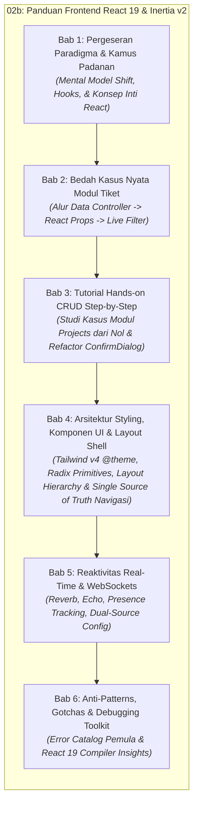

---

## Bab 1: Pergeseran Paradigma & Kamus Padanan (Blade/jQuery vs React 19/Inertia v2)

Perbedaan terbesar antara pengembangan Laravel Blade konvensional dan React/Inertia terletak pada **siapa yang bertanggung jawab merender HTML dan mengelola state**:
1. **Dunia Blade & jQuery:** Server membuat HTML secara lengkap pada setiap request. Jika ada perubahan dinamis di browser, jQuery mencari elemen DOM menggunakan selector (`$('#id')`), lalu memanipulasi teks, class, atau atribut secara imperatif (*Imperative DOM-Driven*).
2. **Dunia React & Inertia:** Server hanya mengirimkan data mentah (JSON props), sedangkan browser merender UI menggunakan komponen React. Tampilan antarmuka adalah representasi langsung dari data state saat ini (*Declarative State-Driven*):
   $$\text{UI} = f(\text{state})$$
   Anda tidak pernah menyentuh DOM secara langsung. Anda hanya mengubah state, dan React secara otomatis memperbarui bagian DOM yang terdampak.

---

### 1.1 TL;DR Matrix Padanan Cepat (Bagi Senior)

Tabel berikut merangkum padanan langsung fitur-fitur yang biasa Anda gunakan di Blade dan jQuery dengan padanannya di React 19 dan Inertia.js v2 di Portal Sifast:

| Fitur / Kebutuhan | Pola Lama (Blade & jQuery) | Pola Modern (React 19 & Inertia v2 di Sifast) | Keterangan & Prinsip Desain |
| :--- | :--- | :--- | :--- |
| **Kondisional Render** | `@if($isAdmin)`<br/>`  <span>Admin</span>`<br/>`@else`<br/>`  <span>Staff</span>`<br/>`@endif` | `{isAdmin ? (`<br/>`  <span>Admin</span>`<br/>`) : (`<br/>`  <span>Staff</span>`<br/>`)}`<br/><br/>*Atau jika tanpa else:*<br/>`{isAdmin && <span>Admin</span>}` | Ekspresi JavaScript murni di dalam kurung kurawal `{}` JSX. Hindari ternary bersarang yang terlalu dalam. |
| **Perulangan Daftar** | `@foreach($tickets as $item)`<br/>`  <div>{{ $item->title }}</div>`<br/>`@endforeach` | `{tickets.map((item) => (`<br/>`  <div key={item.id}>{item.title}</div>`<br/>`))}` | Wajib menyertakan atribut `key={item.id}` unik pada elemen terluar untuk efisiensi diffing Virtual DOM. |
| **Proteksi CSRF Form** | `<form method="POST">`<br/>`  @csrf`<br/>`  ...`<br/>`</form>` | *Otomatis (Zero Config)*<br/>Inertia & Axios membaca cookie `XSRF-TOKEN` dan menyertakannya di header HTTP `X-XSRF-TOKEN`. | Tidak perlu tag `<input type="hidden" name="_token">` manual di form React. |
| **Membaca Nilai Input** | `const val = $('#title').val();` | `const { data } = useForm({ title: '' });`<br/>`console.log(data.title);` | Komponen terkontrol (*Controlled Component*). Nilai input selalu dicerminkan oleh state. |
| **Mengubah Nilai Input** | `$('#title').val('Komputer Rusak');` | `setData('title', 'Komputer Rusak');` | Mengubah state memicu sinkronisasi otomatis ke atribut `value` input HTML. |
| **Memperbarui Konten DOM** | `$('#status-badge').html('`<span class="badge">Selesai</span>`');` | `const [status, setStatus] = useState('open');`<br/>`...`<br/>`<Badge>{status}</Badge>` | UI dideklarasikan sekali. Tampilan berubah reaktif saat `setStatus('closed')` dipanggil. |
| **Menampilkan Validasi Error** | `@error('title')`<br/>`  <span class="text-red-500">{{ $message }}</span>`<br/>`@enderror` | `<InputError message={errors.title} />`<br/>*(dari hook `useForm` Inertia)* | Validasi server dari `FormRequest` Laravel dipetakan langsung ke objek `errors`. |
| **URL Routing Helper** | `route('tickets.show', $ticket->id)` *(Ziggy global)* | `import { show } from '@/routes/tickets';`<br/>`<Link href={show(ticket.id).url}>Detail</Link>` | **Laravel Wayfinder**: Route helper modular, type-safe saat kompilasi TypeScript, dan tree-shakeable. |
| **Navigasi Antar Halaman** | `<a href="/tickets" class="btn">Daftar Tiket</a>` | `import { Link } from '@inertiajs/react';`<br/>`<Link href="/tickets" className="btn">Daftar Tiket</Link>` | `<Link>` mencegat klik browser untuk melakukan request XHR tanpa reload penuh (*Single Page Application*). |
| **Flash Session Message** | `@if(session('success'))`<br/>`  <div class="alert">{{ session('success') }}</div>`<br/>`@endif` | `const { flash } = usePage().props;`<br/>`{flash.success && <Alert>{flash.success}</Alert>}` | Shared props dari middleware `HandleInertiaRequests` dapat diakses di mana saja via `usePage()`. |
| **Autentikasi User** | `Auth::user()->name`<br/>`@auth ... @endauth` | `const { auth } = usePage().props;`<br/>`<span>{auth.user.name}</span>` | Data user login tersedia secara global di seluruh komponen halaman React. |

> [!TIP]
> **Mental Model Shift untuk Developer Senior:**
> Lupakan siklus *"Cari elemen di DOM lalu ubah propertinya"* ala jQuery. Dalam React, Anda tidak pernah memerintahkan browser untuk *"menambahkan class `hidden` ke tombol A"* atau *"mengganti teks elemen `#total`"*. Sebaliknya, tentukan kondisi data:
> ```tsx
> const [isLoading, setIsLoading] = useState(false);
> // Tampilan secara deklaratif merespon isLoading:
> <Button disabled={isLoading}>
>   {isLoading ? 'Menyimpan...' : 'Simpan Tiket'}
> </Button>
> ```
> Saat `setIsLoading(true)` dipanggil, React mengevaluasi ulang JSX dan memperbarui DOM secara presisi dan efisien.

---

### 1.2 Arsitektur Single Blade Shell (`resources/views/app.blade.php`)

Salah satu kejutan terbesar bagi pengembang Laravel yang baru berpindah ke Inertia adalah: **Mengapa folder `resources/views/` hampir kosong?**

Di Portal Sifast, seluruh antarmuka web dilayani oleh satu-satunya file Blade induk: [`resources/views/app.blade.php`](../../resources/views/app.blade.php).

#### 1. Bedah Anatomi `app.blade.php`

Berikut adalah struktur lengkap file shell induk di Portal Sifast:

```blade
<!DOCTYPE html>
<html lang="{{ str_replace('_', '-', app()->getLocale()) }}" @class(['dark' => ($appearance ?? 'system') == 'dark'])>
    <head>
        <meta charset="utf-8">
        <meta name="viewport" content="width=device-width, initial-scale=1">

        {{-- Deteksi preferensi dark mode sistem sebelum render utama agar tidak berkedip (FOUC) --}}
        <script>
            (function() {
                const appearance = '{{ $appearance ?? "system" }}';
                if (appearance === 'system') {
                    const prefersDark = window.matchMedia('(prefers-color-scheme: dark)').matches;
                    if (prefersDark) {
                        document.documentElement.classList.add('dark');
                    }
                }
            })();
        </script>

        {{-- Style inline untuk background dasar agar seirama dengan tema --}}
        <style>
            html { background: #F8FAFC; }
            html.dark { background: #0F172A; }
        </style>

        <title inertia>{{ config('app.name', 'Laravel') }}</title>

        <meta name="mobile-web-app-capable" content="yes">
        <meta name="apple-mobile-web-app-capable" content="yes">
        <meta name="apple-mobile-web-app-status-bar-style" content="default">

        <link rel="icon" href="/favicon.ico" sizes="any">
        <link rel="icon" href="/favicon.svg" type="image/svg+xml">
        <link rel="apple-touch-icon" href="/apple-touch-icon.png">

        {{-- Tipografi Inter Utama --}}
        <link rel="preconnect" href="https://fonts.googleapis.com">
        <link rel="preconnect" href="https://fonts.gstatic.com" crossorigin>
        <link href="https://fonts.googleapis.com/css2?family=Inter:wght@100;200;300;400;500;600;700;800&display=swap" rel="stylesheet">

        {{-- Konfigurasi Reverb/WebSocket dari Backend --}}
        @if(config('broadcasting.default') === 'reverb')
        @php
            $reverbHost = config('broadcasting.connections.reverb.options.client_host')
                ?? request()->getHost();
            $reverbHost = str_contains($reverbHost, ':') ? explode(':', $reverbHost)[0] : $reverbHost;

            $reverbPort = config('broadcasting.connections.reverb.options.client_port')
                ?? (int) config('broadcasting.connections.reverb.options.port', 8080);

            $reverbScheme = config('broadcasting.connections.reverb.options.client_scheme')
                ?? (config('broadcasting.connections.reverb.options.scheme') ?? 'http');

            if (request()->secure()) {
                $reverbScheme = 'https';
            }

            $reverbConfig = [
                'key' => config('broadcasting.connections.reverb.key'),
                'host' => $reverbHost,
                'port' => (int) $reverbPort,
                'scheme' => $reverbScheme,
            ];
        @endphp
        <script>
            window.REVERB_CONFIG = @json($reverbConfig);
        </script>
        @else
        <script>window.REVERB_CONFIG = null;</script>
        @endif

        @viteReactRefresh
        @vite(['resources/css/app.css', 'resources/js/app.tsx'])
        @inertiaHead
    </head>
    <body class="font-sans antialiased">
        @inertia
    </body>
</html>
```

#### 2. Peran Direktif `@inertiaHead` dan `@inertia`

* **`@inertiaHead`:** Direktif ini bertindak sebagai gerbang dinamis untuk elemen `<head>`. Ketika halaman React menentukan judul via komponen `<Head title="Daftar Tiket ITIL" />`, Inertia menyinkronkan tag `<title>` dan `<meta>` browser tanpa memerlukan full page reload.
* **`@inertia`:** Direktif ini merender sebuah elemen penampung root di dalam `<body>`:
  ```html
  <div id="app" data-page="{&quot;component&quot;:&quot;tickets/index&quot;,&quot;props&quot;:{...},&quot;url&quot;:&quot;/tickets&quot;,&quot;version&quot;:&quot;...&quot;}"></div>
  ```
  Elemen ini memuat seluruh payload JSON awal yang disiapkan oleh controller Laravel.

#### 3. Titik Temu di Client: [`resources/js/app.tsx`](../../resources/js/app.tsx)

Di sisi frontend, React 19 mengambil alih elemen `#app` melalui inisialisasi Inertia:

```tsx
// Cuplikan dari resources/js/app.tsx
createInertiaApp({
    title: (title) => (title ? `${title} - ${appName}` : appName),
    resolve: (name) =>
        resolvePageComponent(
            `./pages/${name}.tsx`,
            import.meta.glob('./pages/**/*.tsx'),
        ),
    setup({ el, App, props }) {
        const root = createRoot(el);

        root.render(
            <StrictMode>
                <App {...props} />
            </StrictMode>,
        );
    },
    progress: {
        color: '#0A9E8F', // Warna teal khas identitas RS Siti Fatimah
    },
});
```

`resolvePageComponent` secara dinamis mencocokkan string nama komponen yang dikirim dari controller Laravel (misal: `Inertia::render('tickets/index')`) dengan berkas fisik di `resources/js/pages/tickets/index.tsx`.

#### 4. Mengapa Portal Sifast Murni CSR dan Tanpa SSR?

Portal Sifast memilih arsitektur **Client-Side Rendered (CSR)** murni tanpa Server-Side Rendering (SSR) berbasis pertimbangan arsitektur dan operasional nyata rumah sakit:

1. **Latensi Intranet Rumah Sakit yang Sangat Rendah:** Seluruh unit kerja (IGD, Rawat Inap, Farmasi, Radiologi, IT) mengakses portal melalui jaringan intranet lokal (LAN/WLAN) atau VPN dedicated dengan latensi `< 5ms`.
2. **Tanpa Kebutuhan SEO Publik:** Portal Sifast adalah sistem internal rumah sakit yang berada di balik gerbang otentikasi (2FA Fortify & role permissions). Tidak ada mesin pencari publik (Googlebot) yang perlu mengindeks data operasional tiket, aset, atau rekam medis internal.
3. **Penyederhanaan Infrastruktur & Keandalan Operasional:** Mengaktifkan SSR mengharuskan tim IT mengelola daemon runtime Node.js tambahan di server produksi di samping PHP-FPM dan Nginx. Tanpa SSR, container deployment menjadi sangat ramping, deterministik, dan minim titik kegagalan (*single point of failure*).
4. **Efisiensi Caching Browser Karyawan:** Bundle JavaScript dan CSS dikompilasi oleh Vite dengan *content-hashing*. Setelah browser staf mengunduh bundle sekali di awal shift kerja, navigasi antar ratusan modul rumah sakit berlangsung instan karena hanya mentransfer payload JSON ringan.

---

### 1.3 Anatomi & Intuisi React Hooks (Bagi Junior)

Bagi pengembang yang terbiasa menulis kode PHP prosedural atau script jQuery linier, konsep *React Hooks* seringkali terasa membingungkan di awal.

> [!NOTE]
> **Analogi "Colokan Listrik":**
> Bayangkan komponen React Anda (`function TicketCard()`) adalah sebuah ruangan kosong tanpa listrik. Fungsi tersebut dieksekusi dari baris pertama hingga terakhir setiap kali komponen ditampilkan, lalu selesai.
> 
> **React Hooks (`use...`)** adalah colokan listrik (*plug & socket*) di dinding ruangan tersebut. Melalui kabel colokan ini, komponen Anda dapat terhubung ke fasilitas internal browser dan React engine:
> * Ingin punya memori ingatan yang tidak hilang saat ruangan dibersihkan? Tancapkan colokan `useState`.
> * Ingin menyalakan lampu saat staf memasuki ruangan dan mematikannya saat staf keluar? Tancapkan colokan `useEffect`.
> * Ingin mengirim formulir tiket tanpa reload halaman? Tancapkan colokan `useForm`.
> * Ingin mengetahui siapa staf yang sedang login saat ini? Tancapkan colokan `usePage`.

```
┌─────────────────────────────────────────────────────────────┐
│                    Komponen React (Fungsi)                  │
│                                                             │
│   useState ───🔌───> [Mesin State Reaktif React]            │
│   useEffect ──🔌───> [Siklus Hidup Browser & Cleanup]       │
│   useForm ────🔌───> [Manajemen Input & Validasi Inertia]   │
│   usePage ────🔌───> [Shared Props Global dari Laravel]     │
│                                                             │
│   Return: JSX Tampilan Deklaratif                           │
└─────────────────────────────────────────────────────────────┘
```

Berikut adalah hook-hook esensial yang digunakan setiap hari di Portal Sifast:

#### 1. `useState`: State Reaktif vs Variabel Biasa

Di jQuery, Anda menyimpan data sementara di atribut HTML (`<div data-id="10">`) atau variabel global `let counter = 0;`. Namun di React, mengubah variabel biasa **tidak akan memicu pembaruan layar**.

```tsx
import { useState } from 'react';

export function CounterTiket() {
    // ❌ SALAH: Mengubah variabel biasa tidak meng-update tampilan
    // let hitungan = 0;
    // const tambah = () => { hitungan++; };

    // ✅ BENAR: Gunakan useState
    // [nilai_saat_ini, fungsi_pengubah] = useState(nilai_awal);
    const [hitungan, setHitungan] = useState<number>(0);

    return (
        <div className="p-4 border rounded-lg">
            <p>Total Tiket Disetujui: <strong className="text-teal-600">{hitungan}</strong></p>
            <button 
                onClick={() => setHitungan(hitungan + 1)}
                className="px-3 py-1.5 bg-teal-600 text-white rounded hover:bg-teal-700"
            >
                Tambah Tiket
            </button>
        </div>
    );
}
```

Setiap kali `setHitungan` dipanggil dengan nilai baru, React secara otomatis memanggil ulang fungsi komponen dan memperbarui angka di layar secara instan.

#### 2. `useEffect`: Pengganti `$(document).ready()` dan Manajemen Siklus Hidup

Dalam jQuery, kita menulis:
```javascript
$(document).ready(function() {
    console.log('Halaman selesai dimuat!');
    const timer = setInterval(fetchUpdate, 5000);
});
```

Di React, operasi efek samping (*side effects*) seperti inisialisasi library pihak ketiga, timer interval, atau listener browser ditangani oleh `useEffect`:

```tsx
import { useEffect, useState } from 'react';

export function RealtimeClock() {
    const [waktu, setWaktu] = useState<string>(new Date().toLocaleTimeString());

    useEffect(() => {
        // 1. Eksekusi saat komponen pertama kali terpasang ke layar (Mount)
        console.log('Jam dinding dipasang ke layar');
        
        const timerId = setInterval(() => {
            setWaktu(new Date().toLocaleTimeString());
        }, 1000);

        // 2. Fungsi Pembersihan (Cleanup Function)
        // Wajib ada untuk mencegah memory leak saat user berpindah halaman!
        return () => {
            console.log('Komponen dilepas dari layar, menghentikan timer');
            clearInterval(timerId);
        };
    }, []); // <-- Dependency array kosong [] artinya hanya berjalan sekali saat mount

    return <span>Waktu Operasional: {waktu}</span>;
}
```

> [!WARNING]
> **Pentingnya Cleanup Function:**
> Jika Anda memasang event listener (`window.addEventListener`), timer (`setInterval`), atau koneksi WebSocket tanpa mengembalikan fungsi pembersih (`return () => ...`), proses tersebut akan terus berjalan di latar belakang meskipun user sudah berpindah halaman. Hal ini akan menyebabkan kebocoran memori (*memory leak*) yang memperlambat browser staf rumah sakit.

#### 3. `useForm` (Inertia.js): Manajemen Form Otomatis

Hook `useForm` dari `@inertiajs/react` adalah tulang punggung seluruh formulir transaksi di Portal Sifast (tiket ITIL, mutasi aset, penilaian mutu, dan presensi).

```tsx
import { useForm } from '@inertiajs/react';
import { FormEventHandler } from 'react';

export function FormBuatTiket() {
    // Inisialisasi useForm dengan field dan nilai awal
    const { data, setData, post, processing, errors, reset } = useForm({
        judul: '',
        deskripsi: '',
        prioritas: 'medium',
    });

    const handleSubmit: FormEventHandler = (e) => {
        e.preventDefault(); // Mencegah reload halaman standar browser
        
        post('/tickets', {
            onSuccess: () => {
                reset(); // Bersihkan form jika server memvalidasi sukses
                alert('Tiket berhasil dibuat!');
            },
        });
    };

    return (
        <form onSubmit={handleSubmit} className="space-y-4 max-w-md">
            <div>
                <label className="block text-sm font-medium">Judul Gangguan</label>
                <input
                    type="text"
                    value={data.judul}
                    onChange={(e) => setData('judul', e.target.value)}
                    className="w-full border p-2 rounded"
                    placeholder="Contoh: Printer IGD macet"
                />
                {/* Tampilkan error validasi Laravel secara otomatis */}
                {errors.judul && (
                    <p className="text-sm text-red-600 mt-1">{errors.judul}</p>
                )}
            </div>

            <button
                type="submit"
                disabled={processing} // Otomatis mencegah double-submit saat loading
                className="bg-teal-600 text-white px-4 py-2 rounded disabled:opacity-50"
            >
                {processing ? 'Menyimpan ke Server...' : 'Kirim Tiket'}
            </button>
        </form>
    );
}
```

Keunggulan utama `useForm`:
* Menangani state input ganda secara otomatis melalui helper `setData`.
* Melacak properti boolean `processing` untuk menonaktifkan tombol submit secara otomatis saat request sedang berjalan.
* Menerima payload error validasi HTTP 422 dari Laravel `FormRequest` dan memetakannya langsung ke objek `errors`.

#### 4. `usePage` (Inertia.js): Akses Global Shared Props

Di Blade, Anda dapat memanggil `Auth::user()` atau `session('status')` di sembarang view. Di React, data global tersebut disalurkan oleh backend via middleware `HandleInertiaRequests` dan dapat diakses dari komponen mana pun menggunakan `usePage()`:

```tsx
import { usePage } from '@inertiajs/react';

type SharedAuthProps = {
    auth: {
        user: {
            id: number;
            name: string;
            email: string;
            role: string;
        };
    };
    flash: {
        success?: string;
        error?: string;
    };
};

export function UserBadgeHeader() {
    // Akses langsung data auth dan flash tanpa perlu mengoper props dari parent
    const { auth, flash } = usePage<SharedAuthProps>().props;

    return (
        <header className="flex justify-between items-center p-4 bg-white border-b">
            <div>
                <h1 className="font-semibold text-gray-800">Portal RS Siti Fatimah</h1>
                {flash.success && (
                    <span className="text-xs bg-emerald-100 text-emerald-800 px-2 py-0.5 rounded">
                        {flash.success}
                    </span>
                )}
            </div>
            <div className="text-sm text-gray-600">
                Login sebagai: <strong className="text-gray-900">{auth.user.name}</strong> ({auth.user.role})
            </div>
        </header>
    );
}
```

#### 5. Custom Hooks Unggulan Portal Sifast

Selain hooks bawaan React dan Inertia, Portal Sifast menyediakan serangkaian custom hooks yang dapat langsung digunakan dalam pengembangan fitur:

1. **`useEcho` (via `@laravel/echo-react`):**
   Hook reaktif untuk berlangganan channel dan event WebSocket Reverb.
2. **`useUserPresence` ([`resources/js/hooks/use-user-presence.ts`](../../resources/js/hooks/use-user-presence.ts)):**
   Melacak daftar dokter dan staf rumah sakit yang sedang aktif secara online melalui presence channel `presence.users`.
3. **`useAppearance` ([`resources/js/hooks/use-appearance.tsx`](../../resources/js/hooks/use-appearance.tsx)):**
   Mengatur tema antarmuka (*System*, *Light*, *Dark*), menyinkronkan status cookie server, serta menambahkan class `.dark` pada tag `<html>`.
4. **`useWebSocketStatus` ([`resources/js/hooks/use-websocket-status.ts`](../../resources/js/hooks/use-websocket-status.ts)):**
   Menyediakan indikator status koneksi socket real-time (*connecting*, *connected*, *disconnected*, *unavailable*) untuk status bar sistem.

---

### 1.4 Konsep Inti React yang Wajib Dikuasai

Sebelum membangun halaman interaktif, pastikan Anda memahami 7 pilar fundamental React dan TypeScript berikut:

#### 1. Aturan Sintaks JSX / TSX
JSX adalah sintaks perluasan JavaScript yang menyerupai HTML namun berjalan sepenuhnya di bawah aturan JavaScript:
* **`className` alih-alih `class`:** Karena kata `class` adalah kata kunci bawaan JavaScript (*reserved keyword*).
* **`htmlFor` alih-alih `for`:** Digunakan pada elemen `<label htmlFor="nik">`.
* **Wajib Self-Closing:** Tag tanpa penutup wajib diakhiri dengan garis miring penutup (`<input />`, ``, `<hr />`, `<br />`). Lupa menambahkan `/` akan menyebabkan error kompilasi Vite.
* **Root Tunggal atau Fragment (`<> ... </>`):** Sebuah komponen harus mengembalikan satu elemen induk. Gunakan *React Fragment* `<> ... </>` jika Anda tidak ingin menambahkan tag pembungkus `<div>` yang tidak perlu ke DOM:
  ```tsx
  return (
      <>
          <Header />
          <MainContent />
          <Footer />
      </>
  );
  ```

#### 2. Komponen & Props (Sifat Read-Only / Immutability)
Props adalah argumen yang dikirim dari komponen induk ke komponen anak. **Props bersifat Read-Only (Immutable) dan dilarang keras dimutasi secara langsung.**

```tsx
type Props = {
    nomorTiket: string;
    status: 'open' | 'closed';
};

export function BadgeTiket({ nomorTiket, status }: Props) {
    // ❌ DILARANG KERAS: Mutasi props langsung
    // status = 'closed';

    return (
        <span className={status === 'open' ? 'text-amber-600' : 'text-emerald-600'}>
            #{nomorTiket} ({status.toUpperCase()})
        </span>
    );
}
```

React mengandalkan perbandingan referensi memori (*shallow comparison*) untuk mendeteksi perubahan data. Memodifikasi props secara langsung akan merusak algoritma deteksi render React.

#### 3. Controlled vs Uncontrolled Components (Misteri Input "Membeku")
Salah satu error paling sering dialami developer yang beralih dari Blade/jQuery adalah **input teks yang membeku (tidak bisa diketik sama sekali)**:

```tsx
// ⚠️ KASUS JEBAKAN: Input tidak bisa diketik
export function BrokenInput() {
    const [judul, setJudul] = useState('Printer Rusak');

    // Karena value dikunci ke variabel judul TANPA onChange handler,
    // browser menolak ketikan user baru karena React selalu merender ulang 'Printer Rusak'
    return <input type="text" value={judul} />;
}

// ✅ SOLUSI: Selalu pasangkan value dengan onChange
export function WorkingInput() {
    const [judul, setJudul] = useState('Printer Rusak');

    return (
        <input
            type="text"
            value={judul}
            onChange={(e) => setJudul(e.target.value)}
            className="border p-1 rounded"
        />
    );
}
```

Pada *Controlled Component*, elemen formulir HTML tidak menyimpan nilainya sendiri di dalam DOM internal, melainkan mendelegasikan nilai dan pembaruannya secara penuh kepada state React.

#### 4. Lifting State Up (Koordinasi Data Antar Komponen)
Jika dua komponen bersaudara membutuhkan data yang sama (misalnya komponen `PencarianTiket` dan komponen `TabelTiket`), pindahkan state ke komponen induk (*parent*), lalu oper nilai state ke bawah sebagai props dan oper fungsi pengubahnya sebagai callback:

```tsx
// Komponen Induk: Mengelola State Utama
export function ModulTiketParent() {
    const [kataKunci, setKataKunci] = useState('');

    return (
        <div className="space-y-4">
            <SearchBar value={kataKunci} onSearchChange={setKataKunci} />
            <TicketList keyword={kataKunci} />
        </div>
    );
}

// Komponen Anak 1: Input Pencarian
function SearchBar({ value, onSearchChange }: { value: string; onSearchChange: (v: string) => void }) {
    return (
        <input 
            type="text" 
            value={value} 
            onChange={(e) => onSearchChange(e.target.value)} 
            placeholder="Cari ID tiket..." 
            className="border p-2 rounded w-full"
        />
    );
}

// Komponen Anak 2: Tabel Daftar
function TicketList({ keyword }: { keyword: string }) {
    return <div>Menampilkan hasil pencarian untuk: <strong>{keyword || 'Semua'}</strong></div>;
}
```

#### 5. Atribut Wajib `key` pada `.map()` & Virtual DOM Diffing
Saat menampilkan array data menggunakan `.map()`, React mewajibkan setiap elemen memiliki atribut `key` unik:

```tsx
type ItemAset = { id: number; namaBarang: string };

export function DaftarAset({ items }: { items: ItemAset[] }) {
    return (
        <ul>
            {/* ✅ BENAR: Menggunakan ID unik database */}
            {items.map((aset) => (
                <li key={aset.id} className="py-1 border-b">
                    {aset.namaBarang}
                </li>
            ))}
        </ul>
    );
}
```

> [!CAUTION]
> **Jangan Gunakan Index Array sebagai Key (`key={index}`):**
> Jika urutan item berubah (misalnya akibat sorting atau penghapusan item di tengah tabel), React yang menggunakan `key={index}` akan keliru mengasosiasikan state komponen anak dengan posisi baris lama. Hal ini dapat menimbulkan bug fatal seperti teks input tertukar antar baris data. Selalu gunakan identifier unik persisten dari database seperti `item.id`.

#### 6. React Context sebagai Bus Data Global Ringan
React Context memungkinkan kita mendistribusikan data ke seluruh cabang komponen di bawahnya tanpa harus mengoper props secara manual di setiap tingkatan (*prop drilling*). Contoh konkret di Portal Sifast adalah `PresenceContext` yang mendistribusikan status real-time user ke navbar, sidebar, dan jendela chat.

#### 7. TypeScript Dasar untuk Komponen React
Di Portal Sifast, seluruh kode frontend ditulis menggunakan **TypeScript** untuk menjamin keamanan tipe (*type safety*) dan mencegah runtime error saat produksi.

```tsx
// 1. Definisikan antarmuka Props secara eksplisit
type StatusTiket = 'open' | 'in_progress' | 'resolved';

type TiketItemProps = {
    id: number;
    judul: string;
    prioritas: 'low' | 'medium' | 'high';
    status: StatusTiket;
    onUpdateStatus?: (id: number, statusBaru: StatusTiket) => void; // Optional callback
};

// 2. Pasangkan tipe pada parameter komponen
export function TiketRow({ id, judul, prioritas, status, onUpdateStatus }: TiketItemProps) {
    return (
        <div className="flex items-center justify-between p-3 border-b">
            <span>#{id} - {judul}</span>
            <span className="text-xs px-2 py-1 rounded bg-slate-100">{prioritas}</span>
        </div>
    );
}
```

Dengan TypeScript, IDE Anda (VS Code / Cursor / Windsurf) akan memberikan auto-completion cerdas dan segera menandai garis merah jika Anda salah mengetikkan nama field atau mengoper tipe data yang tidak sesuai.

---

### 1.5 Under the Hood: Protokol Navigasi Inertia (Bagi Senior)

Bagi pengembang berpengalaman, memahami mekanisme kerja protokol Inertia di balik layar (*under the hood*) sangat penting untuk mengoptimalkan performa dan memecahkan kendala perutean tingkat lanjut.

#### 1. Cara Kerja Navigasi Tanpa Reload

Inertia bukanlah framework SPA konvensional seperti Vue SPA atau React SPA murni yang membutuhkan API REST endpoints terpisah (`/api/v1/...`). Sebaliknya, Inertia adalah **protokol adaptor** yang menghubungkan routing Laravel yang sudah ada dengan antarmuka React.

Berikut diagram urutan navigasi request Inertia:

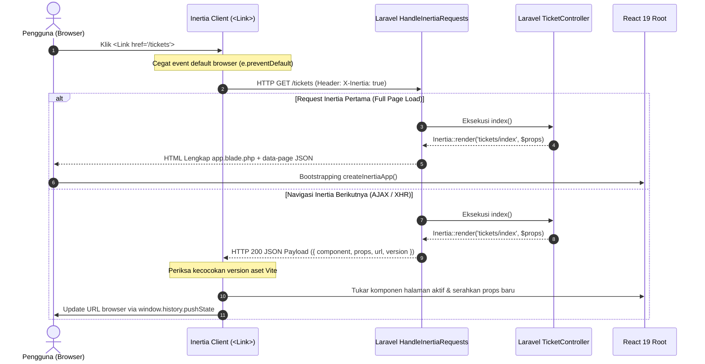

#### 2. Anatomi Payload JSON Inertia
Saat navigasi XHR terjadi, server Laravel tidak mengirimkan kode HTML. Server mengembalikan payload JSON terstruktur seperti berikut:

```json
{
  "component": "tickets/index",
  "props": {
    "auth": {
      "user": { "id": 1, "name": "Dr. Siti Aminah", "role": "medis" }
    },
    "tickets": {
      "data": [
        { "id": 101, "title": "Permintaan Kalibrasi Tensi Digital", "status": "open" }
      ],
      "current_page": 1,
      "total": 1
    },
    "filters": { "search": "", "status": "open" },
    "flash": { "success": null, "error": null }
  },
  "url": "/tickets",
  "version": "4f5b8a9c2d1e0f3a"
}
```

Client Inertia membaca field `component`, memuat file `resources/js/pages/tickets/index.tsx`, lalu merender komponen tersebut dengan menyuntikkan isi `props`.

#### 3. Partial Reloads via Opsi `only: [...]`

Pada halaman dengan data yang besar (misalnya tabel tiket dengan 50 baris beserta metadata statistik di sidebar), melakukan reload seluruh data server hanya karena user mengganti filter kategori akan membuang bandwidth dan siklus CPU database.

Inertia menyediakan fitur **Partial Reload**:

```tsx
import { router } from '@inertiajs/react';

function refreshDaftarTiketSaja() {
    router.reload({
        only: ['tickets'], // Hanya minta prop 'tickets', abaikan statistik & user props
    });
}
```

Saat perintah ini dijalankan, browser mengirimkan dua header HTTP tambahan:
* `X-Inertia-Partial-Data: tickets`
* `X-Inertia-Partial-Component: tickets/index`

Di backend Laravel, jika Anda membungkus query menggunakan closure atau `Inertia::lazy()`, query statistik lain yang berat **tidak akan dieksekusi sama sekali oleh database**:

```php
// Backend TicketController.php
return Inertia::render('tickets/index', [
    // Dieksekusi hanya jika diminta pada partial reload
    'tickets' => Ticket::filter($request)->paginate(15),
    
    // TIDAK dieksekusi jika request menyertakan only: ['tickets']
    'statistikBerat' => fn () => LaporanStatistikService::hitungTahunan(),
]);
```

#### 4. Sinkronisasi History Browser: `pushState` vs `replaceState`

Inertia memanfaatkan HTML5 History API untuk memperbarui address bar browser tanpa memicu refresh halaman:
* **`pushState` (Default):** Menambahkan entri baru ke riwayat browser. Digunakan saat user berpindah halaman atau membuka form baru (`/tickets` $\rightarrow$ `/tickets/create`). Tombol *Back* di browser akan membawa user kembali ke `/tickets`.
* **`replaceState` (`replace: true`):** Menimpa entri URL saat ini di riwayat browser tanpa menambah tumpukan riwayat baru. Sangat krusial digunakan pada **Live Search / Filter**:
  ```tsx
  router.get('/tickets', { search: query }, {
      preserveState: true,
      replace: true, // Tidak mengotori tombol 'Back' browser
  });
  ```
  Dengan opsi `replace: true`, user tidak perlu menekan tombol *Back* sebanyak 20 kali hanya untuk membatalkan 20 karakter yang mereka ketikkan di kotak pencarian.

---

## Bab 2: Bedah Kasus Nyata Modul Tiket ITIL (Tahap 1: Analisis)

Modul Tiket ITIL (*Information Technology Infrastructure Library*) di Portal Sifast merupakan salah satu modul operasional paling aktif dan kompleks di RS Aisyiyah Siti Fatimah Tulangan. Modul ini melayani pencatatan insiden perangkat keras medis, gangguan jaringan intranet antar-instalasi, perbaikan printer kasir/farmasi, hingga permohonan pengembangan modul baru SIMRS oleh para kepala unit rumah sakit.

Pada bab ini, kita akan membedah arsitektur produksi nyata dari modul tiket ini: mulai dari bagaimana controller Laravel mengalirkan data ke komponen React tanpa endpoint REST terpisah, bagaimana fitur live search dan filter multi-kriteria berjalan instan tanpa reload, bagaimana form kompleks dengan 17 state field dan upload file dikelola dengan `useForm`, hingga bagaimana Laravel Wayfinder memberikan routing yang aman (*type-safe*).

---

### 2.1 Peta Alur Data Controller ke React (End-to-End Data Flow)

Dalam arsitektur monolitik Blade klasik, controller menyiapkan data lalu merendernya ke view HTML via `view('tickets.index', compact('tickets', ...))`. Di Inertia.js v2, pola tersebut dipertahankan hampir 100% identik dari sisi mental model controller, namun alih-alih merender file HTML di server, method `Inertia::render()` mengubah payload PHP menjadi respons JSON terstruktur yang diserahkan ke komponen React.

#### 1. Titik Tolak Backend: [`TicketController.php`](../../app/Http/Controllers/TicketController.php#L83-L94)

Perhatikan method `index()` pada controller utama modul tiket di Portal Sifast:

```php
// Cuplikan nyata dari app/Http/Controllers/TicketController.php:83-94
return Inertia::render('tickets/index', [
    'tickets' => $tickets,
    'statuses' => TicketStatus::active()->ordered()->get(),
    'priorities' => TicketPriority::active()->ordered()->get(),
    'tags' => TicketTag::where('is_active', true)->orderBy('name')->get(['id', 'name', 'slug']),
    'filters' => $request->only(['status', 'priority', 'department', 'assignee', 'search', 'tag', 'category', 'subcategory', 'project', 'created_from', 'created_to', 'closed_from', 'closed_to', 'resolved_only', 'include_closed', 'draft']),
    'categories' => $this->getCategoriesForTicketList($user),
    'projects' => Project::query()->orderBy('name')->get(['id', 'name']),
    'canExport' => $user->isAdmin() || $user->isStaff(),
    'canDelete' => $tickets->getCollection()->contains(fn (Ticket $ticket) => $ticket->can_delete),
]);
```

Mari kita bedah peranan dan transformasi setiap kunci array yang dikirimkan oleh backend:

| Kunci Array Backend | Tipe Data PHP / Laravel | Peranan & Transformasi di Frontend React |
| :--- | :--- | :--- |
| `'tickets'` | `LengthAwarePaginator` | Menyuplai objek paginasi utama tabel tiket (`data: Ticket[]`, `current_page`, `last_page`, `links`, `total`). Koleksi telah di-enrich dengan nama departemen pemohon dan flag otorisasi `can_delete`. |
| `'statuses'` | `Collection<TicketStatus>` | Daftar master status tiket (Open, In Progress, Pending, Resolved, Closed) yang aktif dan berurutan untuk mengisi opsi dropdown filter status. |
| `'priorities'` | `Collection<TicketPriority>` | Daftar tingkat prioritas (Low, Medium, High, Urgent) dengan metadata warna hex/badge untuk menandai tingkat kegentingan gangguan rumah sakit. |
| `'tags'` | `Collection<TicketTag>` | Daftar tag label ringan (`['id', 'name', 'slug']`) untuk memfilter insiden spesifik seperti *#printer*, *#jaringan*, *#bpjs*, atau *#farmasi*. |
| `'filters'` | `array` | Nilai parameter query string saat ini dari HTTP request. Memastikan input pencarian dan dropdown filter di UI tetap sinkron (*persisted*) dengan URL address bar. |
| `'categories'` | `Collection<TicketCategory>` | Daftar kategori beserta relasi `subcategories`, telah disaring sesuai batasan departemen staf yang sedang login (`dep_id`). |
| `'projects'` | `Collection<Project>` | Daftar inisiatif strategis rumah sakit untuk mengelompokkan tiket penugasan proyek TI. |
| `'canExport'` | `bool` | Flag otorisasi UI: hanya user dengan role Admin atau Staff IT/IPS yang diperbolehkan melihat tombol *Export CSV*. |
| `'canDelete'` | `bool` | Flag boolean dinamis: bernilai `true` jika koleksi tiket yang sedang ditampilkan di halaman aktif mengandung setidaknya satu tiket yang boleh dihapus oleh user saat ini. |

#### 2. Titik Temu Frontend: [`resources/js/pages/tickets/index.tsx`](../../resources/js/pages/tickets/index.tsx#L100-L110)

Di sisi frontend React, perhatikan bagaimana komponen `TicketsIndex` menerima data dari Laravel melalui mekanisme **Parameter Destructuring**:

```tsx
// Cuplikan dari resources/js/pages/tickets/index.tsx:46-56 (Definisi Props)
type Props = {
    tickets: PaginatedTickets;
    statuses: TicketStatus[];
    priorities: TicketPriority[];
    tags: TicketTag[];
    categories: TicketCategory[];
    filters: TicketFilters;
    projects?: ProjectOption[];
    canExport?: boolean;
    canDelete?: boolean;
};

// Cuplikan dari resources/js/pages/tickets/index.tsx:100-110 (Komponen Utama)
export default function TicketsIndex({
    tickets,
    statuses,
    priorities,
    tags = [],
    categories = [],
    filters,
    projects = [],
    canExport = false,
    canDelete = false,
}: Props) {
    // Komponen langsung siap merender tabel, dropdown, dan toolbar!
    // ...
}
```

> [!NOTE]
> **Mengapa Ini Merupakan "Game Changer" bagi Laravel Developer?**
> Perhatikan bahwa di React kita **TIDAK PERLU**:
> 1. Menulis `useEffect` manual untuk melakukan `axios.get('/api/tickets')`.
> 2. Mengelola state loading awal (`const [isLoading, setIsLoading] = useState(true)`).
> 3. Mengkhawatirkan token autentikasi Bearer API yang kadaluarsa atau CORS error.
> 
> Seluruh data yang disiapkan oleh method `index()` di `TicketController.php` disuntikkan secara instan ke props komponen `TicketsIndex`. Hubungan ini bersifat **1-to-1, deterministik, dan type-safe**.

#### 3. Diagram Alur Data End-to-End

Diagram urutan berikut menggambarkan alur siklus penuh data dari aksi pengguna hingga pembaruan layar:

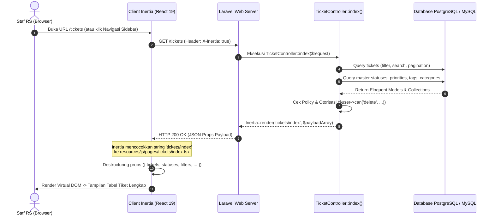

---

### 2.2 Live Search & Filter Tanpa Reload (`preserveState: true`)

Salah satu kendala terbesar antarmuka tabel data berbasis server-side filtering di Blade konvensional adalah **pengalaman pengguna (UX) yang patah-patah**:
* Saat form filter di-submit, browser melakukan refresh penuh (*white-flash*).
* Posisi scrollbar melompat kembali ke puncak halaman.
* Kursor input pencarian terlepas (*blur*), sehingga user harus mengklik ulang kotak input setiap kali ingin memperpanjang kata kunci.
* Riwayat browser (*back button*) dipenuhi puluhan entri URL yang tidak diinginkan.

Inertia.js memecahkan kendala ini secara elegan melalui method `router.get()` yang dipadukan dengan opsi `preserveState: true` dan `replace: true`.

#### 1. Analisis Mendalam Fungsi `applyFilters` di [`resources/js/pages/tickets/index.tsx`](../../resources/js/pages/tickets/index.tsx#L130-L139)

Mari kita bedah fungsi filter aktual pada baris 130-139:

```tsx
// Cuplikan dari resources/js/pages/tickets/index.tsx:130-139
const applyFilters = useCallback(
    (newFilters: Partial<TicketFilters>) => {
        router.get(
            '/tickets',
            { ...filters, ...newFilters },
            { preserveState: true, replace: true }
        );
    },
    [filters]
);
```

Fungsi di atas kemudian dipanggil oleh berbagai kontrol antarmuka:
* **Pencarian Kata Kunci (Search Input):**
  ```tsx
  // Baris 141-144
  const handleSearch = (e: React.FormEvent) => {
      e.preventDefault();
      applyFilters({ search });
  };
  ```
* **Dropdown Filter Status / Prioritas / Kategori:**
  ```tsx
  // Mengubah filter status langsung memicu request parsial ke server
  <Select 
      value={filters.status || 'all'} 
      onValueChange={(val) => applyFilters({ status: val === 'all' ? undefined : val })}
  >
      <SelectTrigger className="w-36">
          <SelectValue placeholder="Semua Status" />
      </SelectTrigger>
      {/* ... */}
  </Select>
  ```
* **Pembersihan Filter (Clear Filters):**
  ```tsx
  // Baris 146-149
  const clearFilters = () => {
      setSearch('');
      router.get('/tickets', {}, { preserveState: true, replace: true });
  };
  ```

#### 2. Mengapa Opsi `preserveState: true` Sangat Krusial?

Secara default, saat Inertia menerima respons baru dari server, Inertia menganggap halaman telah diganti dengan instance baru dan **mereset seluruh state lokal komponen**.

Dengan menyertakan `{ preserveState: true }`:
1. **Mempertahankan State Komponen Lokal:** State lokal seperti teks yang sedang diketik pada input pencarian (`const [search, setSearch] = useState(filters.search || '')`), status buka-tutup accordion filter (`showFilters`), atau tab aktif tetap bertahan utuh.
2. **Mencegah Hilangnya Fokus Kursor:** Kursor pengguna tetap berada di dalam input pencarian tanpa interupsi, sehingga staf rumah sakit dapat mengetik dengan mulus.
3. **Mencegah Lompatan Scroll (Scroll Jump):** Halaman tidak akan bergulir (*jump*) ke atas, menjaga orientasi pandangan mata pengguna saat memeriksa baris tabel di bagian bawah.

#### 3. Mengapa Opsi `replace: true` Wajib Digunakan pada Filter?

Secara default, navigasi browser menambahkan entri baru ke riwayat peramban (`window.history.pushState`). Jika opsi `replace: true` tidak disertakan:
* Jika staf mengetik kata kunci "p-r-i-n-t-e-r" atau mengganti filter status 5 kali berturut-turut, riwayat browser akan mencatat 5 entri baru.
* Ketika staf menekan tombol **Back** di peramban, mereka terpaksa mengklik tombol tersebut 5 kali berturut-turut hanya untuk keluar dari halaman daftar tiket!
* Dengan `{ replace: true }`, Inertia mengeksekusi `window.history.replaceState`. Alamat URL di address bar browser tetap terbarui (sehingga URL dapat disalin atau di-bookmark dengan filter yang presisi), namun riwayat navigasi browser tetap bersih dan bersahabat.

---

### 2.3 Bedah Form Kompleks ([`resources/js/pages/tickets/create.tsx`](../../resources/js/pages/tickets/create.tsx))

Halaman pembuatan tiket insiden (`/tickets/create`) di Portal Sifast adalah contoh formulir transaksional berskala besar. Formulir ini tidak hanya mengumpulkan teks biasa, melainkan juga mengelola relasi hierarkis dinamis, lampiran multi-berkas (*multi-file attachments*), dan integrasi inventaris sarana rumah sakit.

#### 1. Manajemen 17 State Field dengan Hook `useForm`

Perhatikan inisialisasi state pada baris 76-97 di [`resources/js/pages/tickets/create.tsx`](../../resources/js/pages/tickets/create.tsx#L76-L97):

```tsx
// Cuplikan dari resources/js/pages/tickets/create.tsx:76-97
const { data, setData, post, processing, errors, transform } = useForm({
    ticket_type_id: '',
    dep_id: '' as '' | 'IT' | 'IPS',
    ticket_category_id: '',
    ticket_subcategory_id: '',
    ticket_priority_id: '',
    title: '',
    description: '',
    related_ticket_id: '',
    asset_id: initialAssetId as number | null,
    asset_no_inventaris: initialAssetNoInventaris,
    tag_ids: [] as number[],
    requester_id: null as number | null,
    created_at: '' as string,
    project_id: (initialProjectId ?? '') as string | number,
    is_draft: false,
    plan_ideas: '',
    plan_tools: '',
    budget_estimate: '',
    budget_notes: '',
    attachments: [] as File[],
});
```

> [!TIP]
> **Pelajaran TypeScript Penting untuk Developer Laravel:**
> Perhatikan penggunaan *type assertion* pada nilai awal:
> * `attachments: [] as File[]` secara eksplisit menegaskan kepada TypeScript bahwa array ini khusus menampung objek berkas binary `File`, bukan array tanpa tipe `never[]`.
> * `dep_id: '' as '' | 'IT' | 'IPS'` membatasi nilai departemen penanggung jawab insiden hanya pada dua unit layanan sarana rumah sakit: IT (Teknologi Informasi) atau IPS (Instalasi Pemeliharaan Sarana).

#### 2. Kategori & Subkategori Dinamis via `useEffect`

Di Blade + jQuery, ketergantungan antar dropdown (misal: memilih kategori "Jaringan Medis" memicu pemuatan subkategori "Kabel LAN", "Access Point Ruang Operasi", "Switch Farmasi") biasanya ditangani dengan memanggil AJAX endpoint terpisah saat event `$('#category_id').on('change', ...)` dipicu.

Di React dan Inertia, seluruh hierarki kategori dan subkategori telah disertakan oleh controller di prop `categories`. Keterkaitan antar dropdown dikelola secara deklaratif menggunakan `useEffect` ([`resources/js/pages/tickets/create.tsx:220-239`](../../resources/js/pages/tickets/create.tsx#L220-L239)):

```tsx
// Cuplikan dari resources/js/pages/tickets/create.tsx:220-239
useEffect(() => {
    if (data.ticket_category_id) {
        // Cari objek kategori yang dipilih dari array master categories
        const category = categories.find((c) => c.id === parseInt(data.ticket_category_id));
        setSelectedCategory(category || null);

        // Validasi protektif: Jika user mengubah kategori induk,
        // periksa apakah subkategori yang sebelumnya dipilih masih terdaftar di bawah kategori baru
        if (category && data.ticket_subcategory_id) {
            const hasSubcategory = category.subcategories?.some(
                (s) => s.id === parseInt(data.ticket_subcategory_id)
            );
            // Jika subkategori lama tidak cocok dengan kategori baru, otomatis reset ke string kosong!
            if (!hasSubcategory) {
                setData('ticket_subcategory_id', '');
            }
        }
    } else {
        setSelectedCategory(null);
        setData('ticket_subcategory_id', '');
    }
}, [data.ticket_category_id, categories]);
```

Manfaat dari pendekatan deklaratif ini:
* **Nol Latensi Jaringan:** Pergantian subkategori berlangsung instan tanpa menunggu request HTTP tambahan ke server.
* **Integritas Data Terjamin:** Mencegah anomali data di database (misalnya tersimpan tiket berkategori "Perangkat Keras" namun bersubkategori "Kabel FO Terputus").

#### 3. Unggah Berkas & Transformasi Payload (`forceFormData`)

Ketika formulir menyertakan file binary (seperti foto kerusakan fisik komputer atau hasil scan memo permohonan), payload HTTP tidak boleh dikirim sebagai format JSON biasa.

Perhatikan bagaimana method `handleSubmit` pada baris 241-279 mengorkestrasi pengiriman data:

```tsx
// Cuplikan dari resources/js/pages/tickets/create.tsx:241-279
const handleSubmit = (e: React.FormEvent) => {
    e.preventDefault();
    const hasAttachments = data.attachments.length > 0;

    // Transformasi payload sebelum diserahkan ke Laravel FormRequest
    transform((formData) => {
        const payload: Record<string, unknown> = {
            ...formData,
            ticket_subcategory_id: formData.ticket_subcategory_id === '_none' ? '' : formData.ticket_subcategory_id,
        };
        
        // Sanitasi nilai numerik & relasi
        payload.asset_id = formData.asset_id || null;
        payload.budget_estimate = String(formData.budget_estimate).trim() !== '' 
            ? parseInt(String(formData.budget_estimate), 10) 
            : null;

        // Sertakan berkas lampiran hanya jika staf memilih file
        if (hasAttachments) {
            payload.attachments = formData.attachments;
        } else {
            delete payload.attachments;
        }

        return payload;
    });

    post('/tickets', {
        preserveScroll: true,
        forceFormData: hasAttachments, // Otomatis beralih ke multipart/form-data jika ada berkas
    });
};
```

Opsi `forceFormData: hasAttachments` memastikan bahwa bila terdapat berkas pada state `attachments`, Inertia secara otomatis mengonversi seluruh payload ke objek browser `FormData` standar sehingga Laravel dapat memprosesnya menggunakan method `$request->file('attachments')`.

#### 4. Penanganan Pesan Error Server dengan Komponen `<InputError />`

Saat validasi di Laravel `TicketStoreRequest` gagal, Laravel mengembalikan HTTP 422 Unprocessable Entity beserta objek JSON berisi daftar error per field. Hook `useForm` menangkap pesan error ini secara otomatis dan memetakannya ke objek `errors`.

Di antarmuka form, kita menampilkan error menggunakan komponen reusable [`InputError`](../../resources/js/components/input-error.tsx):

```tsx
// Penggunaan di resources/js/pages/tickets/create.tsx
<div>
    <Label htmlFor="title">Judul Tiket Gangguan *</Label>
    <Input
        id="title"
        value={data.title}
        onChange={(e) => setData('title', e.target.value)}
        placeholder="Contoh: Printer cetak label di Farmasi Rawat Jalan macet"
    />
    {/* Tampilkan pesan validasi otomatis dari Laravel FormRequest */}
    <InputError message={errors.title} className="mt-1" />
</div>
```

Mari kita bedah implementasi komponen [`resources/js/components/input-error.tsx`](../../resources/js/components/input-error.tsx):

```tsx
// Cuplikan lengkap dari resources/js/components/input-error.tsx
import type { HTMLAttributes } from 'react';
import { cn } from '@/lib/utils';

function normalizeMessage(message?: string | string[]): string | undefined {
    if (message == null) return undefined;
    if (Array.isArray(message)) return message[0];
    return message;
}

export default function InputError({
    message,
    className = '',
    ...props
}: HTMLAttributes<HTMLParagraphElement> & { message?: string | string[] }) {
    const text = normalizeMessage(message);
    return text ? (
        <p
            {...props}
            className={cn('text-sm text-red-600 dark:text-red-400', className)}
        >
            {text}
        </p>
    ) : null;
}
```

Komponen ini menormalisasi tipe pesan: baik Laravel mengirimkan string tunggal (`"Judul tiket wajib diisi."`) maupun array string pesan error (`["Format berkas tidak valid.", "Ukuran maksimal 5MB."]`), komponen akan mengekstrak pesan pertama dan merendernya dengan warna merah yang harmonis pada tema terang maupun gelap (*dark mode*). Pola ini sepenuhnya menggantikan direktif Blade `@error('title') ... @enderror`.

---

### 2.4 Wayfinder Routing Aktual pada Modul Tiket

Dalam pengembangan aplikasi Laravel konvensional maupun arsitektur SPA lama, developer sering dihadapkan pada dua pilihan pengelolaan URL di frontend:
1. **Hardcoded String URL:**
   ```tsx
   // ❌ RAPUH: Rentan salah ketik dan tidak terdeteksi saat compile
   router.get('/tickets/' + ticket.id);
   <Link href={`/tickets/${ticket.id}/edit`}>Ubah Tiket</Link>
   ```
   Jika suatu saat tim backend mengubah pola URL di `routes/web.php` (misalnya menjadi `/itil/tickets/{id}`), tidak ada peringatan dari compiler TypeScript. Bug link putus (*broken link 404*) baru akan meledak di produksi saat diklik oleh pengguna.
2. **Ziggy Global Helper (`route(...)`):**
   ```tsx
   // ⚠️ KURANG OPTIMAL: Masih berbasis string dinamis dan memuat seluruh rute aplikasi
   <Link href={route('tickets.show', ticket.id)}>Detail</Link>
   ```
   Meskipun lebih baik daripada string mentah, Ziggy mengharuskan seluruh definisi rute aplikasi diserialisasi ke dalam payload JSON global yang besar di browser. Selain itu, parameter rute tidak memiliki autocompletion tipe data yang ketat.

#### 1. Solusi Modern di Portal Sifast: Laravel Wayfinder

Portal Sifast menggunakan **Laravel Wayfinder**, toolchain modern yang menganalisis file rute Laravel secara berkala dan menghasilkan modul fungsi helper TypeScript murni di direktori `resources/js/routes/`.

Untuk modul tiket ITIL, fungsi rute diimpor langsung dari modul Wayfinder ([`resources/js/routes/tickets/index.ts`](../../resources/js/routes/tickets/index.ts)):

```tsx
// Impor fungsi rute spesifik yang dibutuhkan saja (Tree-shakeable & Zero Overhead)
import { index, create, show } from '@/routes/tickets';
```

#### 2. Sintaks Pembuatan URL Dinamis yang Aman (Type-Safe)

Perhatikan fleksibilitas dan keamanan tipe yang ditawarkan oleh fungsi helper rute Wayfinder:

```tsx
// Contoh Penggunaan 1: Mengoper ID primitif secara langsung
const urlDetail1 = show(ticket.id).url;
// Output string: '/tickets/101'

// Contoh Penggunaan 2: Mengoper objek model Ticket secara langsung
// Wayfinder secara cerdas mendeteksi properti .id pada objek model!
const urlDetail2 = show(ticket).url;
// Output string: '/tickets/101'

// Contoh Penggunaan 3: Mengoper query parameters untuk filter
const urlFilter = index({ query: { status: 'open', priority: 2 } }).url;
// Output string: '/tickets?status=open&priority=2'

// Contoh Penggunaan 4: Pada elemen navigasi Inertia <Link>
<Link href={show(ticket).url} className="text-teal-600 hover:underline">
    #{ticket.ticket_number} - {ticket.title}
</Link>
```

#### 3. Komparasi Mendalam 3 Pendekatan Routing di Laravel

Tabel berikut membandingkan secara komprehensif keunggulan Wayfinder dibandingkan metode lawas:

| Parameter Evaluasi | 1. Hardcoded String (`'/tickets/' + id`) | 2. Ziggy (`route('tickets.show', id)`) | 3. Laravel Wayfinder di Sifast (`show(id).url`) |
| :--- | :--- | :--- | :--- |
| **Type Safety saat Compile** | ❌ Nol (String murni) | ❌ Lemah (Nama rute tetap string) | ✅ **Penuh (Fungsi TypeScript murni)** |
| **Pendeteksian Error Typo** | Muncul saat runtime di browser (404) | Muncul saat runtime di browser | **Muncul seketika di IDE (garis merah) & Build Vite gagal** |
| **IDE Autocompletion** | ❌ Tidak ada | ⚠️ Terbatas pada plugin tertentu | ✅ **Penuh (Parameter type, docs, dan return type)** |
| **Navigasi Kode (Go-to-Definition)** | ❌ Tidak bisa | ❌ Tidak bisa | ✅ **Bisa (Klik fungsi langsung membuka file rute & controller)** |
| **Beban Ukuran Bundle (Bundle Size)** | Nol | ⚠️ Besar (Membawa kamus seluruh rute aplikasi) | ✅ **Minimal (Hanya mengimpor fungsi yang dipakai / tree-shaken)** |
| **Integrasi JSDoc ke Backend** | ❌ Tidak ada | ❌ Tidak ada | ✅ **Menampilkan anotasi controller PHP dan baris kodenya** |

#### 4. Fitur JSDoc Cerdas & Lompatan Kode ke Controller PHP

Salah satu fitur paling produktif dari Wayfinder bagi pengembang adalah anotasi JSDoc yang disertakan pada setiap fungsi helper. Saat Anda mengarahkan kursor (*hover*) ke fungsi `show()` di IDE Anda (Cursor / VS Code):

```typescript
/**
* @see \App\Http\Controllers\TicketController::show
* @see app/Http/Controllers/TicketController.php:811
* @route '/tickets/{ticket}'
*/
```

Anda cukup menekan **Ctrl+Klik** (atau **Cmd+Klik** di macOS) pada referensi file di tooltip JSDoc tersebut untuk langsung membuka baris 811 pada `TicketController.php`. Jembatan ini menyatukan pengalaman pengembangan frontend dan backend menjadi satu ekosistem yang terintegrasi secara harmonis.

---

---

## Bab 3: Tutorial Hands-on CRUD Step-by-Step (Studi Kasus Modul Projects & Modernisasi ConfirmDialog)

Setelah memahami pergeseran mental model di [Bab 1](#bab-1-pergeseran-paradigma--kamus-padanan-bladejquery-vs-react-19inertia-v2) dan membedah modul tiket di [Bab 2](#bab-2-bedah-kasus-nyata-modul-tiket-itil-tahap-1-analisis), kini saatnya Anda mempraktikkan pembuatan fitur CRUD (*Create, Read, Update, Delete*) lengkap dari hulu ke hilir.

Studi kasus yang kita gunakan pada bab ini adalah **Modul Projects (Rencana Kerja)** di Portal Sifast:
* Di rumah sakit, inisiatif TI strategis (seperti *"Migrasi Server 2025"*, *"Implementasi Rekam Medis Elektronik (RME) Rawat Jalan"*, atau *"Integrasi Klaim BPJS Online"*) dikelompokkan ke dalam sebuah entitas proyek.
* Setiap proyek dapat memuat puluhan tiket pekerjaan, memiliki status pelaksanaan, tanggal tenggat (*deadline*), dan unit kerja pemilik.
* Fitur ini mencakup seluruh siklus operasional: menampilkan tabel daftar dengan pencarian dan filter status, validasi form input baru, pelepasan relasi tiket saat proyek dihapus (*graceful soft detach*), hingga penayangan notifikasi sukses (*flash message*).

Selain itu, bab ini menyajikan **studi kasus refactoring nyata**: mentransformasi konfirmasi hapus dari jendela dialog bawaan browser (`confirm()`) yang kaku dan memblokir thread, menuju komponen modal yang elegan, berstandar aksesibilitas (A11y), dan terintegrasi dengan tema rumah sakit ([`ConfirmDialog`](../../resources/js/components/confirm-dialog.tsx)).

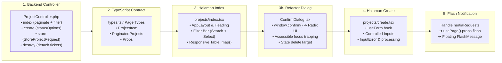

---

### 3.1 Langkah 1: Backend Controller ([`ProjectController.php`](../../app/Http/Controllers/ProjectController.php))

Dalam ekosistem Inertia.js v2, controller Laravel tetap bertindak sebagai pusat orkestrasi bisnis. Alih-alih merender template Blade melalui `view()`, controller mengembalikan method `Inertia::render()` dengan menyertakan nama komponen React dan array data props.

Mari kita bedah 4 method inti pada [`app/Http/Controllers/ProjectController.php`](../../app/Http/Controllers/ProjectController.php):

#### 1. Method `index`: Paginasi dan Preservasi Parameter Filter

```php
// Cuplikan dari app/Http/Controllers/ProjectController.php:15-44
public function index(Request $request): Response
{
    $this->authorize('viewAny', Project::class);

    $q = $request->string('q')->trim();
    $status = $request->string('status')->toString() ?: null;

    $query = Project::query()
        ->withCount('tickets')
        ->with('createdBy:id,name')
        ->orderBy('updated_at', 'desc');

    if ($q !== '') {
        $query->where(function ($qry) use ($q) {
            $qry->where('name', 'like', '%'.$q.'%')
                ->orWhere('description', 'like', '%'.$q.'%');
        });
    }

    if ($status) {
        $query->where('status', $status);
    }

    // ⚠️ KRUSIAL: withQueryString() menjaga query parameter saat klik nomor halaman
    $projects = $query->paginate(15)->withQueryString();

    return Inertia::render('projects/index', [
        'projects' => $projects,
        'filters' => ['q' => $q, 'status' => $status],
    ]);
}
```

> [!IMPORTANT]
> **Mengapa `withQueryString()` Sangat Krusial?**
> Jika Anda hanya menulis `$query->paginate(15);` tanpa `->withQueryString()`, Laravel hanya menyertakan parameter `?page=2` pada link pagination. Parameter pencarian `?q=server` dan filter `?status=in_progress` akan lenyap saat pengguna berpindah ke halaman berikutnya. Memanggil `->withQueryString()` memastikan seluruh parameter URL aktif saat ini diawetkan ke dalam properti `links` yang dikirim ke React.

Perhatikan juga eager aggregate `->withCount('tickets')`. Query ini secara efisien menghitung relasi tiket menggunakan subquery SQL tunggal (`select count(*) from tickets where ...`), menghindari masalah performa N+1 query.

#### 2. Method `create`: Menyediakan Opsi Master Data ke Form

```php
// Cuplikan dari app/Http/Controllers/ProjectController.php:46-53
public function create(): Response
{
    $this->authorize('create', Project::class);

    return Inertia::render('projects/create', [
        'statusOptions' => $this->statusOptions(),
    ]);
}
```

Helper `statusOptions()` mengembalikan daftar status terstandardisasi:

```php
// Cuplikan dari app/Http/Controllers/ProjectController.php:123-131
private function statusOptions(): array
{
    return [
        ['value' => Project::STATUS_PLANNING, 'label' => 'Perencanaan'],
        ['value' => Project::STATUS_IN_PROGRESS, 'label' => 'Sedang Berjalan'],
        ['value' => Project::STATUS_COMPLETED, 'label' => 'Selesai'],
        ['value' => Project::STATUS_ON_HOLD, 'label' => 'Ditunda'],
    ];
}
```

Mengirimkan opsi nilai dan label dari backend menjamin konsistensi antara nilai enum yang valid di database dan label bahasa Indonesia yang tampil pada dropdown antarmuka pengguna.

#### 3. Method `store`: Validasi FormRequest & Redirect Berisi Flash

```php
// Cuplikan dari app/Http/Controllers/ProjectController.php:55-68
public function store(StoreProjectRequest $request): RedirectResponse
{
    $this->authorize('create', Project::class);

    $validated = $request->validated();
    $validated['created_by'] = $request->user()->id;
    $validated['status'] = $validated['status'] ?? Project::STATUS_PLANNING;

    $project = Project::create($validated);

    return redirect()
        ->route('projects.show', $project)
        ->with('success', 'Rencana/proyek berhasil dibuat.');
}
```

Validasi input dipisahkan secara rapi ke dalam kelas [`app/Http/Requests/StoreProjectRequest.php`](../../app/Http/Requests/StoreProjectRequest.php):

```php
public function rules(): array
{
    return [
        'name' => ['required', 'string', 'max:255'],
        'description' => ['nullable', 'string', 'max:10000'],
        'status' => ['nullable', 'string', 'in:planning,in_progress,completed,on_hold'],
        'start_date' => ['nullable', 'date'],
        'end_date' => ['nullable', 'date', 'after_or_equal:start_date'],
        'dep_id' => ['nullable', 'string', 'max:50'],
    ];
}
```

Bila validasi gagal, Laravel secara otomatis mengembalikan HTTP 422 dengan pesan error yang langsung dipetakan oleh Inertia ke objek `errors` pada React. Bila sukses, sistem mengalihkan user ke halaman detail proyek disertai pesan sesi `with('success', ...)`.

#### 4. Method `destroy`: Pelepasan Relasi Tiket Sebelum Penghapusan

```php
// Cuplikan dari app/Http/Controllers/ProjectController.php:108-118
public function destroy(Project $project): RedirectResponse
{
    $this->authorize('delete', $project);

    // Integritas Data Medis & ITIL: Lepas relasi, jangan hapus tiket!
    $project->tickets()->update(['project_id' => null]);
    $project->delete();

    return redirect()
        ->route('projects.index')
        ->with('success', 'Rencana/proyek berhasil dihapus.');
}
```

> [!NOTE]
> **Keputusan Arsitektur Domain Rumah Sakit:**
> Tiket pekerjaan ITIL mencakup pencatatan insiden medis, perbaikan alat radiologi, atau kendala billing kasir. Tiket-tiket tersebut memiliki nilai audit operasional dan hukum yang tinggi. Karena itu, menghapus suatu proyek tidak boleh menghapus tiket-tiket di dalamnya secara *cascade*. Controller secara eksplisit mengeksekusi `$project->tickets()->update(['project_id' => null])` untuk memisahkan tiket sebelum entitas proyek dihapus.

---

### 3.2 Langkah 2: Definisi TypeScript Terstruktur (Type Contracts)

Salah satu keunggulan terbesar kombinasi React 19, TypeScript, dan Inertia v2 adalah **Type Safety** antara backend dan frontend. Sebelum merakit komponen visual, definisikan *type contracts* yang mencerminkan struktur data dari backend.

Tambahkan definisi tipe data berikut pada berkas halaman proyek:

```tsx
// Definisi tipe data entitas proyek individual
export type ProjectItem = {
    id: number;
    name: string;
    description: string | null;
    status: 'planning' | 'in_progress' | 'completed' | 'on_hold';
    tickets_count: number;
    created_by?: { id: number; name: string };
    created_at: string;
    updated_at: string;
};

// Definisi envelope paginasi standar dari LengthAwarePaginator Laravel
export type PaginatedProjects = {
    data: ProjectItem[];
    current_page: number;
    last_page: number;
    total: number;
    links: { url: string | null; label: string; active: boolean }[];
};

// Definisi Props yang diterima oleh komponen halaman index dari Inertia
type Props = {
    projects: PaginatedProjects;
    filters: { q: string; status: string | null };
};
```

#### Mengapa Struktur Kontrak Ini Efektif?
1. **Union Literal Type pada Status:** Menentukan `status: 'planning' | 'in_progress' | 'completed' | 'on_hold'` mencegah developer salah mengetik nama status (misalnya `'in-progress'` dengan tanda minus alih-alih garis bawah). IDE akan langsung memberi garis bawah merah jika terjadi *typo*.
2. **Nullable Explicit Typing:** Properti seperti `description: string | null` mengingatkan kita bahwa field tersebut bisa bernilai `null` dari database, sehingga kita wajib menangani fallback tampilan (misalnya `item.description ?? '–'`) agar browser tidak menghasilkan error *undefined*.
3. **Paginasi Self-Documenting:** Memisahkan array data `ProjectItem[]` dengan metadata navigasi `links` memudahkan pembacaan dan pemeliharaan jangka panjang.

---

### 3.3 Langkah 3: Membangun Halaman Index ([`resources/js/pages/projects/index.tsx`](../../resources/js/pages/projects/index.tsx))

Halaman index bertugas menyajikan daftar proyek secara responsif, menyediakan kotak pencarian kata kunci, dropdown filter status, dan navigasi paginasi.

Berikut bedah implementasi praktis pada [`resources/js/pages/projects/index.tsx`](../../resources/js/pages/projects/index.tsx):

#### 1. Setup Shell Layout, Breadcrumbs & State Filter

```tsx
import { Head, Link, router } from '@inertiajs/react';
import { Search, Plus, Eye, Pencil, Trash2 } from 'lucide-react';
import { useState } from 'react';
import { EmptyState } from '@/components/empty-state';
import Heading from '@/components/heading';
import { Button } from '@/components/ui/button';
import { Input } from '@/components/ui/input';
import {
    Select,
    SelectContent,
    SelectItem,
    SelectTrigger,
    SelectValue,
} from '@/components/ui/select';
import AppLayout from '@/layouts/app-layout';
import { dashboard } from '@/routes';
import type { BreadcrumbItem } from '@/types';

const breadcrumbs: BreadcrumbItem[] = [
    { title: 'Dashboard', href: dashboard().url },
    { title: 'Rencana', href: '/projects' },
];

const STATUS_LABELS: Record<string, string> = {
    planning: 'Perencanaan',
    in_progress: 'Sedang Berjalan',
    completed: 'Selesai',
    on_hold: 'Ditunda',
};

export default function ProjectsIndex({ projects, filters }: Props) {
    // Sinkronkan state input lokal dengan parameter filters dari URL server
    const [search, setSearch] = useState(filters.q ?? '');
    const [status, setStatus] = useState(filters.status ?? '__all__');

    // Handler form pencarian
    const handleSearch = (e: React.FormEvent) => {
        e.preventDefault();
        router.get(
            '/projects',
            {
                q: search || undefined,
                status: status === '__all__' ? undefined : status,
            },
            { preserveState: true }
        );
    };

    const clearFilters = () => {
        setSearch('');
        setStatus('__all__');
        router.get('/projects', {}, { preserveState: true });
    };
    // ...
```

Opsi `{ preserveState: true }` pada `router.get` sangat penting: opsi ini menjaga state input dan posisi scroll pengguna di browser agar tidak reset saat hasil pencarian baru dimuat dari server.

#### 2. Render Form Filter & Tabel Data

```tsx
    return (
        <AppLayout breadcrumbs={breadcrumbs}>
            <Head title="Rencana / Proyek" />

            <div className="flex flex-col gap-4">
                {/* Header Judul & Tombol Tambah */}
                <div className="flex flex-col gap-4 sm:flex-row sm:items-center sm:justify-between">
                    <Heading
                        title="Rencana / Proyek"
                        description="Tracking pekerjaan per project; satu project bisa berisi banyak tiket"
                    />
                    <Button asChild>
                        <Link href="/projects/create">
                            <Plus className="mr-2 h-4 w-4" />
                            Tambah Rencana
                        </Link>
                    </Button>
                </div>

                {/* Baris Filter Pencarian & Status */}
                <form onSubmit={handleSearch} className="flex flex-wrap items-center gap-2">
                    <div className="relative flex-1 min-w-[200px]">
                        <Search className="absolute left-3 top-1/2 h-4 w-4 -translate-y-1/2 text-muted-foreground" />
                        <Input
                            value={search}
                            onChange={(e) => setSearch(e.target.value)}
                            placeholder="Cari nama atau deskripsi proyek..."
                            className="pl-9"
                        />
                    </div>

                    <Select value={status} onValueChange={setStatus}>
                        <SelectTrigger className="w-[180px]">
                            <SelectValue placeholder="Semua Status" />
                        </SelectTrigger>
                        <SelectContent>
                            <SelectItem value="__all__">Semua Status</SelectItem>
                            <SelectItem value="planning">Perencanaan</SelectItem>
                            <SelectItem value="in_progress">Sedang Berjalan</SelectItem>
                            <SelectItem value="completed">Selesai</SelectItem>
                            <SelectItem value="on_hold">Ditunda</SelectItem>
                        </SelectContent>
                    </Select>

                    <Button type="submit">Cari</Button>
                    {(filters.q || filters.status) && (
                        <Button type="button" variant="ghost" onClick={clearFilters}>
                            Reset
                        </Button>
                    )}
                </form>

                {/* Tabel Data Responsif */}
                <div className="rounded-xl border bg-card overflow-hidden">
                    <table className="w-full text-left text-sm">
                        <thead className="border-b bg-muted/50 text-muted-foreground font-medium">
                            <tr>
                                <th className="px-4 py-3">Nama Proyek</th>
                                <th className="px-4 py-3">Status</th>
                                <th className="px-4 py-3">Tiket Terkait</th>
                                <th className="px-4 py-3">Dibuat Oleh</th>
                                <th className="px-4 py-3 text-right">Aksi</th>
                            </tr>
                        </thead>
                        <tbody className="divide-y">
                            {projects.data.length === 0 ? (
                                <tr>
                                    <td colSpan={5} className="py-8">
                                        <EmptyState
                                            title="Tidak ada rencana proyek ditemukan"
                                            description="Coba ubah kata kunci pencarian atau tambahkan rencana baru."
                                        />
                                    </td>
                                </tr>
                            ) : (
                                projects.data.map((item) => (
                                    <tr key={item.id} className="hover:bg-muted/30 transition-colors">
                                        <td className="px-4 py-3">
                                            <div className="font-medium text-foreground">{item.name}</div>
                                            {item.description && (
                                                <div className="text-xs text-muted-foreground truncate max-w-md">
                                                    {item.description}
                                                </div>
                                            )}
                                        </td>
                                        <td className="px-4 py-3">
                                            <span className="inline-flex items-center px-2 py-0.5 rounded-full text-xs font-medium bg-slate-100 dark:bg-slate-800 text-slate-700 dark:text-slate-300">
                                                {STATUS_LABELS[item.status] ?? item.status}
                                            </span>
                                        </td>
                                        <td className="px-4 py-3 font-semibold text-teal-600">
                                            {item.tickets_count} Tiket
                                        </td>
                                        <td className="px-4 py-3 text-muted-foreground">
                                            {item.created_by?.name ?? '–'}
                                        </td>
                                        <td className="px-4 py-3 text-right">
                                            {/* Baris Tombol Aksi - Lihat Bagian 3.4 untuk Refactoring Konfirmasi Hapus */}
                                            <div className="flex items-center justify-end gap-1">
                                                <Button variant="ghost" size="icon" asChild>
                                                    <Link href={`/projects/${item.id}`}>
                                                        <Eye className="h-4 w-4" />
                                                    </Link>
                                                </Button>
                                                <Button variant="ghost" size="icon" asChild>
                                                    <Link href={`/projects/${item.id}/edit`}>
                                                        <Pencil className="h-4 w-4" />
                                                    </Link>
                                                </Button>
                                                {/* Tombol Hapus */}
                                            </div>
                                        </td>
                                    </tr>
                                ))
                            )}
                        </tbody>
                    </table>
                </div>

                {/* Navigasi Paginasi */}
                {projects.last_page > 1 && (
                    <div className="flex flex-wrap items-center justify-center gap-2 border-t px-4 py-3">
                        {projects.links.map((link, i) => (
                            <span key={i}>
                                {link.url ? (
                                    <Button
                                        size="sm"
                                        variant={link.active ? 'default' : 'outline'}
                                        asChild
                                    >
                                        <Link href={link.url} preserveState>
                                            <span dangerouslySetInnerHTML={{ __html: link.label }} />
                                        </Link>
                                    </Button>
                                ) : (
                                    <Button size="sm" variant="ghost" disabled>
                                        <span dangerouslySetInnerHTML={{ __html: link.label }} />
                                    </Button>
                                )}
                            </span>
                        ))}
                    </div>
                )}
            </div>
        </AppLayout>
    );
}
```

---

### 3.4 Langkah 3b: Studi Kasus Refactoring Modernisasi Konfirmasi Hapus

Setiap operasi penghapusan data krusial di sistem rumah sakit memerlukan konfirmasi pengguna untuk mencegah ketidaksengajaan. Namun, bagaimana cara kita menampilkannya di antarmuka web?

Mari kita pelajari evolusi kode dari cara lama menuju standar modern di Portal Sifast:

#### 1. Cara Lama: `confirm()` Bawaan Browser (Kurang Elegan & Bermasalah)

Perhatikan kode aksi hapus yang awalnya tertulis pada [`resources/js/pages/projects/index.tsx:201`](../../resources/js/pages/projects/index.tsx#L201-L203):

```tsx
// ❌ CARA LAMA (Kurang Elegan - Dialog Browser Bawaan):
onClick={() => {
    if (confirm('Hapus rencana ini? Tiket yang terhubung tidak dihapus, hanya dilepas dari project.')) {
        router.delete(`/projects/${item.id}`);
    }
}}
```

#### Mengapa `window.confirm()` Ditinggalkan di Aplikasi Modern?
1. **Thread-Blocking:** Pemanggilan `confirm()` membekukan *main thread* JavaScript secara sinkron. Seluruh animasi CSS, rendering halaman, dan koneksi WebSocket terhenti seketika sampai pengguna menekan tombol OK atau Cancel.
2. **Tampilan Kaku & Tidak Konsisten:** Tampilan kotak dialog sepenuhnya ditentukan oleh sistem operasi browser. Di Windows dialog terlihat bernuansa Win32/Edge, di macOS terlihat gaya Aqua, di Android berbentuk bottom sheet bawaan. Tidak ada identitas visual rumah sakit.
3. **Tanpa Dukungan Dark Mode:** Saat staf bekerja di shift malam dengan tema *Dark Mode*, dialog browser tetap muncul dengan warna putih menyilaukan yang merusak kenyamanan visual.
4. **Masalah Aksesibilitas (A11y):** Pembaca layar (*screen reader*) tunanetra kesulitan mengidentifikasi konteks bahaya, dan keyboard navigasi tidak dapat dikustomisasi.
5. **Jebakan "Prevent Additional Dialogs":** Beberapa browser modern menampilkan checkbox *"Jangan izinkan situs ini menampilkan dialog lagi"*. Jika staf tidak sengaja mencentang opsi tersebut, tombol hapus di seluruh portal akan berhenti bekerja tanpa pesan error sama sekali.

#### 2. Cara Modern: Accessible Modal dengan Radix UI [`ConfirmDialog`](../../resources/js/components/confirm-dialog.tsx)

Portal Sifast menyediakan komponen terpadu [`resources/js/components/confirm-dialog.tsx`](../../resources/js/components/confirm-dialog.tsx) yang dibangun di atas fondasi `@radix-ui/react-dialog`.

Mari kita lakukan refactoring pada halaman index:

```tsx
// ✅ CARA MODERN (Accessible Radix UI Dialog):
import { useState } from 'react';
import { ConfirmDialog } from '@/components/confirm-dialog';

export default function ProjectsIndex({ projects, filters }: Props) {
    // 1. Definisikan state penampung item yang akan dihapus
    const [deleteTarget, setDeleteTarget] = useState<ProjectItem | null>(null);

    return (
        <AppLayout breadcrumbs={breadcrumbs}>
            {/* ... render tabel ... */}

            {/* 2. Di dalam baris tabel: panggil setDeleteTarget(item) saat ikon sampah diklik */}
            <Button
                variant="ghost"
                size="icon"
                onClick={() => setDeleteTarget(item)}
                title="Hapus Proyek"
            >
                <Trash2 className="h-4 w-4 text-destructive" />
            </Button>

            {/* 3. Letakkan komponen ConfirmDialog di akhir JSX sebelum penutup AppLayout */}
            <ConfirmDialog
                open={!!deleteTarget}
                onOpenChange={(open) => !open && setDeleteTarget(null)}
                title="Hapus Rencana Kerja?"
                description={`Apakah Anda yakin ingin menghapus "${deleteTarget?.name}"? Tiket terkait tidak akan dihapus, melainkan dilepas dari proyek ini.`}
                confirmLabel="Ya, Hapus"
                cancelLabel="Batal"
                variant="destructive"
                onConfirm={() => {
                    if (deleteTarget) {
                        router.delete(`/projects/${deleteTarget.id}`);
                    }
                }}
            />
        </AppLayout>
    );
}
```

#### 3. Bedah Arsitektur Komponen [`ConfirmDialog`](../../resources/js/components/confirm-dialog.tsx)

Mari kita bedah implementasi internal komponen [`resources/js/components/confirm-dialog.tsx`](../../resources/js/components/confirm-dialog.tsx):

```tsx
// Cuplikan lengkap resources/js/components/confirm-dialog.tsx
import { Button } from '@/components/ui/button';
import {
    Dialog,
    DialogContent,
    DialogDescription,
    DialogFooter,
    DialogHeader,
    DialogTitle,
} from '@/components/ui/dialog';

type Props = {
    open: boolean;
    onOpenChange: (open: boolean) => void;
    title: string;
    description?: string;
    confirmLabel?: string;
    cancelLabel?: string;
    variant?: 'default' | 'destructive';
    onConfirm: () => void;
    loading?: boolean;
};

export function ConfirmDialog({
    open,
    onOpenChange,
    title,
    description = 'Tindakan ini tidak bisa dibatalkan.',
    confirmLabel = 'Hapus',
    cancelLabel = 'Batal',
    variant = 'destructive',
    onConfirm,
    loading = false,
}: Props) {
    const handleConfirm = () => {
        onConfirm();
        onOpenChange(false);
    };

    return (
        <Dialog open={open} onOpenChange={onOpenChange}>
            <DialogContent>
                <DialogHeader>
                    <DialogTitle>{title}</DialogTitle>
                    <DialogDescription>{description}</DialogDescription>
                </DialogHeader>
                <DialogFooter>
                    <Button
                        type="button"
                        variant="outline"
                        onClick={() => onOpenChange(false)}
                        disabled={loading}
                    >
                        {cancelLabel}
                    </Button>
                    <Button
                        type="button"
                        variant={variant}
                        onClick={handleConfirm}
                        disabled={loading}
                    >
                        {loading ? 'Memproses…' : confirmLabel}
                    </Button>
                </DialogFooter>
            </DialogContent>
        </Dialog>
    );
}
```

#### Keunggulan Arsitektural `ConfirmDialog`:
* **Focus Trapping Otomatis:** Saat modal terbuka, fokus tombol keyboard terkurung rapi di dalam modal (sesuai standar WAI-ARIA WCAG 2.1 AA). Pengguna tidak bisa menekan `Tab` dan tidak sengaja mengklik tombol di latar belakang halaman.
* **Keyboard Escape Listener:** Menekan tombol `Esc` pada keyboard otomatis menutup modal dan membatalkan aksi.
* **Dukungan Asinkron & Loading State:** Prop `loading={true}` menonaktifkan kedua tombol dan menampilkan teks `"Memproses…"`, mencegah double-click saat koneksi internet rumah sakit sedang lambat.
* **Desain Harmonis Tailwind v4:** Varian `variant="destructive"` mewarnai tombol konfirmasi dengan warna merah tegas yang konsisten di tema terang maupun gelap.

---

### 3.5 Langkah 4: Halaman Form Create ([`resources/js/pages/projects/create.tsx`](../../resources/js/pages/projects/create.tsx))

Kini kita melangkah ke proses pembuatan data baru (*Create*) menggunakan formulir terkontrol (*Controlled Component*) berbasis hook `useForm` dari `@inertiajs/react`.

Mari kita telaah berkas [`resources/js/pages/projects/create.tsx`](../../resources/js/pages/projects/create.tsx):

```tsx
// Cuplikan dari resources/js/pages/projects/create.tsx
import { Head, Link, useForm } from '@inertiajs/react';
import { ArrowLeft } from 'lucide-react';
import Heading from '@/components/heading';
import InputError from '@/components/input-error';
import { Button } from '@/components/ui/button';
import { Input } from '@/components/ui/input';
import { Label } from '@/components/ui/label';
import {
    Select,
    SelectContent,
    SelectItem,
    SelectTrigger,
    SelectValue,
} from '@/components/ui/select';
import AppLayout from '@/layouts/app-layout';
import { dashboard } from '@/routes';
import type { BreadcrumbItem } from '@/types';

const breadcrumbs: BreadcrumbItem[] = [
    { title: 'Dashboard', href: dashboard().url },
    { title: 'Rencana', href: '/projects' },
    { title: 'Tambah Rencana', href: '/projects/create' },
];

type StatusOption = { value: string; label: string };

type Props = {
    statusOptions: StatusOption[];
};

export default function ProjectsCreate({ statusOptions }: Props) {
    // 1. Inisialisasi useForm dengan state nilai awal
    const { data, setData, post, processing, errors } = useForm({
        name: '',
        description: '',
        status: 'planning',
        start_date: '',
        end_date: '',
        dep_id: '',
    });

    // 2. Submit handler yang mengirimkan HTTP POST via Inertia
    const handleSubmit = (e: React.FormEvent) => {
        e.preventDefault();
        post('/projects', {
            name: data.name,
            description: data.description || null,
            status: data.status || null,
            start_date: data.start_date || null,
            end_date: data.end_date || null,
            dep_id: data.dep_id || null,
        });
    };

    return (
        <AppLayout breadcrumbs={breadcrumbs}>
            <Head title="Tambah Rencana / Proyek" />

            <div className="flex flex-col gap-4">
                {/* Header dengan Tombol Kembali */}
                <div className="flex items-start gap-3">
                    <Button variant="ghost" size="icon" asChild>
                        <Link href="/projects">
                            <ArrowLeft className="h-4 w-4" />
                        </Link>
                    </Button>
                    <Heading
                        title="Tambah Rencana / Proyek"
                        description="Satu project bisa berisi banyak tiket penugasan"
                        variant="small"
                    />
                </div>

                {/* Form Input Data */}
                <form
                    onSubmit={handleSubmit}
                    className="max-w-xl space-y-6 rounded-xl border bg-card p-6"
                >
                    {/* Input Nama Proyek */}
                    <div className="grid gap-2">
                        <Label htmlFor="name">
                            Nama Rencana / Proyek <span className="text-destructive">*</span>
                        </Label>
                        <Input
                            id="name"
                            value={data.name}
                            onChange={(e) => setData('name', e.target.value)}
                            placeholder="Contoh: Migrasi Server SIMRS 2025"
                            maxLength={255}
                            required
                        />
                        {/* Menampilkan validasi error dari StoreProjectRequest */}
                        <InputError message={errors.name} />
                    </div>

                    {/* Textarea Deskripsi */}
                    <div className="grid gap-2">
                        <Label htmlFor="description">Deskripsi</Label>
                        <textarea
                            id="description"
                            value={data.description}
                            onChange={(e) => setData('description', e.target.value)}
                            placeholder="Deskripsi singkat target dan ruang lingkup rencana/proyek"
                            rows={3}
                            className="flex min-h-[80px] w-full rounded-md border border-input bg-background px-3 py-2 text-sm ring-offset-background placeholder:text-muted-foreground focus-visible:outline-none focus-visible:ring-2 focus-visible:ring-ring focus-visible:ring-offset-2 disabled:cursor-not-allowed disabled:opacity-50"
                        />
                        <InputError message={errors.description} />
                    </div>

                    {/* Select Status */}
                    <div className="grid gap-2">
                        <Label htmlFor="status">Status Awal</Label>
                        <Select
                            value={data.status}
                            onValueChange={(value) => setData('status', value)}
                        >
                            <SelectTrigger id="status">
                                <SelectValue placeholder="Pilih status" />
                            </SelectTrigger>
                            <SelectContent>
                                {statusOptions.map((opt) => (
                                    <SelectItem key={opt.value} value={opt.value}>
                                        {opt.label}
                                    </SelectItem>
                                ))}
                            </SelectContent>
                        </Select>
                        <InputError message={errors.status} />
                    </div>

                    {/* Tombol Simpan dengan Proteksi Double-Submit */}
                    <div className="flex items-center justify-end gap-3 pt-4 border-t">
                        <Button variant="outline" asChild>
                            <Link href="/projects">Batal</Link>
                        </Button>
                        <Button type="submit" disabled={processing}>
                            {processing ? 'Menyimpan ke Server…' : 'Simpan Rencana'}
                        </Button>
                    </div>
                </form>
            </div>
        </AppLayout>
    );
}
```

#### 4 Poin Penting Penggunaan `useForm` pada Formulir:
1. **Helper `setData` yang Fleksibel:** Anda dapat memperbarui satu field dengan `setData('name', val)` atau memperbarui seluruh objek dengan `setData({ ...data, key: val })`.
2. **Koneksi Otomatis ke Komponen `<InputError message={errors.name} />`:** Saat Laravel mendeteksi kegagalan validasi di [`StoreProjectRequest.php`](../../app/Http/Requests/StoreProjectRequest.php), Inertia otomatis menyuntikkan pesan error ke objek `errors`. Komponen `<InputError>` otomatis merender teks merah tanpa perlu `if-else` manual.
3. **Pencegahan Double-Submit via `disabled={processing}`:** Nilai boolean `processing` bernilai `true` selama request HTTP POST berlangsung. Mengaitkan atribut `disabled={processing}` pada tombol submit memastikan pengguna tidak dapat mengklik tombol dua kali secara cepat yang berisiko membuat data ganda di database.
4. **Otomatisasi Header CSRF:** Tidak diperlukan tag `<input type="hidden" name="_token">`. Inertia secara transparan membaca cookie `XSRF-TOKEN` dan mengirimkannya di header permintaan.

---

### 3.6 Langkah 5: Menangkap Flash Notification di Frontend

Ketika `ProjectController::store()` atau `ProjectController::destroy()` selesai mengeksekusi aksi database, controller melakukan redirect dengan menyematkan flash session:

```php
return redirect()
    ->route('projects.show', $project)
    ->with('success', 'Rencana/proyek berhasil dibuat.');
```

Bagaimana flash session tersebut sampai ke browser dan ditampilkan sebagai toast notifikasi tanpa memerlukan library pihak ketiga yang rumit?

#### 1. Rantai Distribusi Flash Data di Sifast

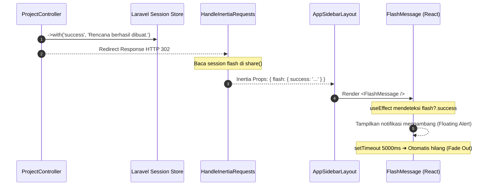

#### 2. Backend Bridge: [`HandleInertiaRequests.php`](../../app/Http/Middleware/HandleInertiaRequests.php)

Middleware Inertia di [`app/Http/Middleware/HandleInertiaRequests.php`](../../app/Http/Middleware/HandleInertiaRequests.php) secara otomatis membagikan session flash ke seluruh respon Inertia:

```php
// Cuplikan dari app/Http/Middleware/HandleInertiaRequests.php:69-74
'flash' => [
    'syncSuccess' => $request->session()->get('syncSuccess'),
    'success' => $request->session()->get('success'),
    'error' => $request->session()->get('error'),
    'sinkron_preview' => $request->session()->get('sinkron_preview'),
],
```

#### 3. Client Toast Global: [`FlashMessage`](../../resources/js/components/flash-message.tsx)

Portal Sifast memasang komponen [`resources/js/components/flash-message.tsx`](../../resources/js/components/flash-message.tsx) di dalam [`resources/js/layouts/app/app-sidebar-layout.tsx`](../../resources/js/layouts/app/app-sidebar-layout.tsx). Komponen ini secara reaktif mendengarkan `usePage().props.flash`:

```tsx
// Cuplikan dari resources/js/components/flash-message.tsx
import { usePage } from '@inertiajs/react';
import { CheckCircle, XCircle } from 'lucide-react';
import { useEffect, useState } from 'react';
import { Alert, AlertDescription } from '@/components/ui/alert';

const AUTO_DISMISS_MS = 5000;

export function FlashMessage() {
    // 1. Tangkap properti flash dari Inertia Shared Props
    const { flash } = usePage<{
        flash?: { success?: string; error?: string; syncSuccess?: boolean };
    }>().props;

    const [visible, setVisible] = useState(false);
    const [message, setMessage] = useState<{ type: 'success' | 'error'; text: string } | null>(null);

    // 2. Reaktif terhadap perubahan flash success atau error dari server
    useEffect(() => {
        const err = flash?.error;
        const success = flash?.success;
        if (err) {
            setMessage({ type: 'error', text: err });
            setVisible(true);
        } else if (success) {
            setMessage({ type: 'success', text: success });
            setVisible(true);
        } else {
            setVisible(false);
            setMessage(null);
        }
    }, [flash?.error, flash?.success]);

    // 3. Timer otomatis auto-dismiss 5 detik dengan cleanup function
    useEffect(() => {
        if (!visible || !message) return;
        const t = setTimeout(() => {
            setVisible(false);
            setMessage(null);
        }, AUTO_DISMISS_MS);

        return () => clearTimeout(t); // Mencegah memory leak
    }, [visible, message]);

    if (!visible || !message) return null;

    return (
        <div className="fixed top-4 left-4 right-4 z-[100] animate-in fade-in slide-in-from-top-2 duration-300 sm:left-auto sm:max-w-sm">
            <Alert
                variant={message.type === 'error' ? 'destructive' : 'default'}
                className={
                    message.type === 'success'
                        ? 'border-green-200 bg-green-50 dark:border-green-800 dark:bg-green-950 [&>svg]:text-green-600 dark:[&>svg]:text-green-400'
                        : ''
                }
            >
                {message.type === 'success' ? (
                    <CheckCircle className="size-4 shrink-0 translate-y-0.5" />
                ) : (
                    <XCircle className="size-4 shrink-0 translate-y-0.5" />
                )}
                <AlertDescription
                    className={message.type === 'success' ? 'text-green-800 dark:text-green-200' : ''}
                >
                    {message.text}
                </AlertDescription>
            </Alert>
        </div>
    );
}
```

#### 4. Menangkap Flash Langsung di Halaman Spesifik

Selain mengandalkan notifikasi global di layout, Anda juga dapat membaca `usePage().props.flash` secara langsung di halaman tertentu (seperti pada modul presensi atau payroll) untuk menampilkan banner kontekstual:

```tsx
import { usePage } from '@inertiajs/react';
import { Alert, AlertDescription } from '@/components/ui/alert';

export function HalamanKhusus() {
    // Membaca langsung flash dari usePage()
    const { flash } = usePage<{ flash?: { success?: string; error?: string } }>().props;

    return (
        <div>
            {flash?.success && (
                <Alert className="mb-4 bg-emerald-50 border-emerald-200 text-emerald-800">
                    <AlertDescription>{flash.success}</AlertDescription>
                </Alert>
            )}
            {/* Konten Halaman */}
        </div>
    );
}
```

Pola ini sepenuhnya menggantikan penggunaan `@if(session('success'))` pada Blade tradisional dengan kode React yang reaktif dan type-safe.

---

### 3.7 Ringkasan Siklus CRUD Lengkap & Checklist Developer

Sebagai panduan praktis harian saat Anda membangun modul CRUD baru di Portal Sifast (misalnya modul rawat inap, logistik medis, atau manajemen vendor), ikuti checklist 5 langkah berikut:

| Tahap | Aktivitas Utama | Berkas Acuan di Sifast |
| :--- | :--- | :--- |
| **1. Backend Route & Controller** | Buat Resource Controller, gunakan `paginate()->withQueryString()`, otorisasi Policy (`$this->authorize`), dan pisahkan validasi ke `FormRequest`. | [`app/Http/Controllers/ProjectController.php`](../../app/Http/Controllers/ProjectController.php)<br/>[`app/Http/Requests/StoreProjectRequest.php`](../../app/Http/Requests/StoreProjectRequest.php) |
| **2. Type Contract TypeScript** | Definisikan interface entitas data tunggal (`ProjectItem`), paginasi (`PaginatedProjects`), dan tipe `Props` komponen. | `resources/js/pages/projects/index.tsx` |
| **3. Halaman Index & Filter** | Bungkus dengan `<AppLayout>`, sinkronkan state filter lokal dengan `filters`, gunakan `router.get(..., { preserveState: true })`, dan tangani `<EmptyState>`. | [`resources/js/pages/projects/index.tsx`](../../resources/js/pages/projects/index.tsx) |
| **4. Konfirmasi Hapus Modern** | Hindari `confirm()`. Gunakan komponen `<ConfirmDialog>` dengan state `deleteTarget` dan Radix UI accessible modal. | [`resources/js/components/confirm-dialog.tsx`](../../resources/js/components/confirm-dialog.tsx) |
| **5. Formulir & Notifikasi** | Gunakan `useForm({ ... })`, tampilkan `<InputError message={errors.field} />`, pasang `disabled={processing}`, dan andalkan `<FlashMessage />` untuk toast sukses. | [`resources/js/pages/projects/create.tsx`](../../resources/js/pages/projects/create.tsx)<br/>[`resources/js/components/flash-message.tsx`](../../resources/js/components/flash-message.tsx) |

## Bab 4: Arsitektur Styling & Desain Antarmuka (Tailwind CSS v4, Radix UI Primitives & Helper `cn`)

Bagi developer Laravel yang terbiasa menggunakan Bootstrap 5 (dengan class `.btn .btn-primary`), Tailwind v3 (dengan file konfigurasi JavaScript `tailwind.config.js`), atau styling CSS global monolitik, arsitektur antarmuka di Portal Sifast menghadirkan lompatan paradigma modern.

Portal Sifast mengadopsi standar **Tailwind CSS v4** berbasis arsitektur *CSS-first*, komponen *headless accessible* dari **Radix UI Primitives**, serta utilitas penggabungan kelas **`cn()`** (`clsx` + `tailwind-merge`). Kombinasi ini memberikan kebebasan desain 100% tanpa batas, kinerja kompilasi kilat, konsistensi token identitas visual rumah sakit, dan aksesibilitas berstandar internasional (*WCAG 2.1 AA*) secara otomatis.

---

### 4.1 TL;DR Matrix: Paradigma Styling Lama vs Modern di Sifast

Tabel berikut merangkum perbedaan mendasar antara pendekatan styling tradisional dengan standar modern yang berlaku di Portal Sifast:

| Dimensi / Aspek | Pendekatan Tradisional (Bootstrap / Tailwind v3) | Standar Modern Portal Sifast (Tailwind CSS v4 & Radix) | Rationale & Dampak bagi Developer |
| :--- | :--- | :--- | :--- |
| **Pusat Konfigurasi Tema** | Berkas JavaScript terpisah: `tailwind.config.js` atau variabel SASS `_variables.scss`. | **CSS-First Murni:** Directif `@theme` langsung di dalam [`resources/css/app.css`](../../resources/css/app.css). | Zero JS config. Lebih cepat diparsing oleh Lightning CSS di Vite, auto-complete CSS variable native. |
| **Definisi Token Tipografi** | Properti `theme.extend.fontSize` di file JS. | Token CSS native di `@theme`: `--font-sans`, `--text-h1` s.d `--text-h6`, `--text-display-*`. | Menghasilkan utilitas seperti `text-h1`, `text-display-md`, dan `font-sans` tanpa overhead JavaScript. |
| **Varian Dark Mode** | Konfigurasi JS: `darkMode: 'class'` atau selector manual `:global(.dark)`. | Directif kustom CSS: `@custom-variant dark (&:is(.dark *));`. | Mendukung selector CSS modern `:is()` untuk kompilasi lebih ringkas dan spesifisitas stabil. |
| **Pencegahan Kedipan Layar (FOUC)** | Skrip manual di blade atau sering terlewat sehingga layar berkedip putih saat reload. | **Triple-Guard FOUC:** Blade `@class` + inline blocking `<script>` + inline `<style>` background di [`resources/views/app.blade.php`](../../resources/views/app.blade.php). | Layar tidak pernah berkedip putih saat staf membuka portal di malam hari atau ruangan redup. |
| **Komponen UI Interaktif** | jQuery plugins (`$('#modal').modal()`) atau library kaku ber-CSS bawaan (Bootstrap/MUI). | **Headless Radix UI Primitives** di [`resources/js/components/ui/`](../../resources/js/components/ui/). | Logika state interaktif & ARIA accessibility terpisah penuh dari styling Tailwind visual. |
| **Penggabungan Class Dinamis** | Template literals biasa: `className={`btn ${isActive ? 'active' : ''}`}`. | Helper pintar **`cn()`** (`clsx` + `twMerge`) di [`resources/js/lib/utils.ts`](../../resources/js/lib/utils.ts). | Mencegah konflik spesifisitas CSS Tailwind (misal: `p-4` ditimpa `p-6` secara deterministik). |
| **Pewarnaan Status Rumah Sakit** | Hardcoded color classes acak (`bg-red-500`, `bg-yellow-400`, `bg-green-600`). | Semantic Status Tokens: `bg-urgent`, `bg-warning`, `bg-normal`, `bg-info`, `bg-follow-up` di `@theme`. | Otomatis berganti saturasi antara Light Mode dan Dark Mode tanpa penulisan duplikat. |

---

### 4.2 Tailwind CSS v4: Arsitektur CSS-First (Misteri Hilangnya `tailwind.config.js`)

Banyak pengembang yang baru bergabung dengan repositori Sifast mencari berkas `tailwind.config.js` di root project dan terkejut mendapati file tersebut **sama sekali tidak ada**.

#### 1. Mengapa `tailwind.config.js` Ditiadakan?
Pada versi Tailwind CSS v4, tim pengembang Tailwind memperkenalkan **CSS-First Architecture**. Seluruh konfigurasi proyek, pemetaan token, kustomisasi breakpoint, hingga penambahan varian tidak lagi menggunakan file konfigurasi JavaScript (`tailwind.config.js`), melainkan dideklarasikan langsung di dalam file CSS utama menggunakan sintaks CSS standar modern.

Keuntungan arsitektur *CSS-First*:
1. **Performa Build 10x Lebih Cepat:** Vite memanfaatkan compiler berbasis Rust (Lightning CSS) yang memproses CSS secara native tanpa overhead parsing JavaScript/Node.js VM.
2. **Kesesuaian Standar Web Modern:** Memanfaatkan fitur native CSS seperti `@theme`, `@import`, dan CSS Custom Properties (`var(--...)`).
3. **Single Source of Truth:** Seluruh aturan visual berada di satu tempat: [`resources/css/app.css`](../../resources/css/app.css).

```
┌─────────────────────────────────────────────────────────────┐
│             Struktur Berkas Styling Portal Sifast           │
│                                                             │
│   resources/css/app.css ─── CSS-First Configuration         │
│     ├── @import 'tailwindcss'                               │
│     ├── @import 'tw-animate-css'                            │
│     ├── @source directives                                  │
│     ├── @custom-variant dark                                │
│     ├── @theme { --font-sans, --text-h1, --color-* }        │
│     ├── :root (Light Theme CSS Variables)                   │
│     ├── .dark (Dark Theme CSS Variables)                    │
│     └── @layer base & Hospital Custom Components            │
└─────────────────────────────────────────────────────────────┘
```

#### 2. Bedah Anatomi Berkas [`resources/css/app.css`](../../resources/css/app.css)

Mari kita bedah baris demi baris arsitektur yang terdapat di [`resources/css/app.css`](../../resources/css/app.css):

##### a. Impor Inti & Ekstensi Animasi
```css
/* Baris 1-9 di resources/css/app.css */
@import 'tailwindcss';
@import 'tw-animate-css';

/* AOS — Animate On Scroll untuk landing & dashboard */
@import 'aos/dist/aos.css';

/* Leaflet CSS untuk Modul Emergency Map / Tracking Ambulans */
@import 'leaflet/dist/leaflet.css';
```
* `@import 'tailwindcss';`: Menggantikan direktif `@tailwind base; @tailwind components; @tailwind utilities;` dari Tailwind v3.
* `@import 'tw-animate-css';`: Menyediakan utilitas animasi modern seperti `animate-in`, `fade-in`, `zoom-in-95`, dan `slide-in-from-*` yang digunakan oleh dialog modal, dropdown, dan alert toast.
* `@import 'leaflet/dist/leaflet.css';`: Mendukung komponen peta kegawatdaruratan dan ambulans ([`emergency-map.tsx`](../../resources/js/components/ui/emergency-map.tsx)).

##### b. Direktif Pelacakan Template (`@source`)
```css
/* Baris 11-12 di resources/css/app.css */
@source '../views';
@source '../../vendor/laravel/framework/src/Illuminate/Pagination/resources/views/*.blade.php';
```
Tailwind v4 secara otomatis memindai file proyek yang berada di dekat file CSS. Namun untuk file Blade di luar direktori CSS atau pagination bawaan Laravel Framework di folder `vendor/`, direktif `@source` secara eksplisit mendaftarkannya agar class Tailwind yang digunakan di view Blade tidak tereliminasi (*purged*) saat proses build.

---

#### 3. Peta Token Tema di Dalam Blok `@theme`

Di Tailwind v4, seluruh variabel desain kustom didefinisikan di dalam blok `@theme`. Token yang dideklarasikan di sini otomatis dikonversi oleh Tailwind menjadi class utilitas Tailwind yang dapat langsung digunakan di JSX:

```css
/* Cuplikan dari resources/css/app.css:16-140 */
@theme {
    /* Inter — primary typeface */
    --font-sans:
        Inter, ui-sans-serif, system-ui, -apple-system, BlinkMacSystemFont, 'Segoe UI', Roboto,
        Helvetica, Arial, sans-serif;
    --font-mono: ui-monospace, 'Cascadia Code', 'SF Mono', Menlo, Consolas, monospace;

    /* Font weights */
    --font-weight-thin: 100;
    --font-weight-extralight: 200;
    --font-weight-light: 300;
    --font-weight-normal: 400;
    --font-weight-medium: 500;
    --font-weight-semibold: 600;
    --font-weight-bold: 700;
    --font-weight-extrabold: 800;

    /* Display Typography Scale */
    --text-display-2xl: 4.5rem;
    --text-display-2xl--line-height: 5rem;
    --text-display-xl: 3.75rem;
    --text-display-xl--line-height: 4.25rem;
    --text-display-lg: 3rem;
    --text-display-lg--line-height: 3.5rem;
    --text-display-md: 2.25rem;
    --text-display-md--line-height: 2.75rem;
    --text-display-sm: 1.875rem;
    --text-display-sm--line-height: 2.375rem;

    /* Heading Typography Scale */
    --text-h1: 3rem;
    --text-h1--line-height: 3.5rem;
    --text-h2: 2.5rem;
    --text-h2--line-height: 3rem;
    --text-h3: 2rem;
    --text-h3--line-height: 2.5rem;
    --text-h4: 1.75rem;
    --text-h4--line-height: 2.25rem;
    --text-h5: 1.5rem;
    --text-h5--line-height: 2rem;
    --text-h6: 1.25rem;
    --text-h6--line-height: 1.75rem;

    /* Body Text Overrides */
    --text-lg: 1.125rem;
    --text-lg--line-height: 1.75rem;
    --text-base: 1rem;
    --text-base--line-height: 1.5rem;
    --text-sm: 0.875rem;
    --text-sm--line-height: 1.25rem;
    --text-xs: 0.75rem;
    --text-xs--line-height: 1.125rem;

    /* Radius Tokens */
    --radius-lg: var(--radius);
    --radius-md: calc(var(--radius) - 2px);
    --radius-sm: calc(var(--radius) - 4px);

    /* Semantic Color Tokens (terikat ke CSS variables dinamis) */
    --color-background: var(--background);
    --color-foreground: var(--foreground);
    --color-card: var(--card);
    --color-card-foreground: var(--card-foreground);
    --color-popover: var(--popover);
    --color-popover-foreground: var(--popover-foreground);
    --color-primary: var(--primary);
    --color-primary-foreground: var(--primary-foreground);
    --color-secondary: var(--secondary);
    --color-secondary-foreground: var(--secondary-foreground);
    --color-muted: var(--muted);
    --color-muted-foreground: var(--muted-foreground);
    --color-accent: var(--accent);
    --color-accent-foreground: var(--accent-foreground);
    --color-destructive: var(--destructive);
    --color-destructive-foreground: var(--destructive-foreground);
    --color-border: var(--border);
    --color-input: var(--input);
    --color-ring: var(--ring);

    /* Sidebar Brand Colors */
    --color-sidebar: var(--sidebar);
    --color-sidebar-foreground: var(--sidebar-foreground);
    --color-sidebar-primary: var(--sidebar-primary);
    --color-sidebar-primary-foreground: var(--sidebar-primary-foreground);
    --color-sidebar-accent: var(--sidebar-accent);
    --color-sidebar-accent-foreground: var(--sidebar-accent-foreground);
    --color-sidebar-border: var(--sidebar-border);

    /* Design Palette Sifast (Clean White + Fresh Blue) */
    --color-ink: #0F172A;
    --color-ink-muted: #64748B;
    --color-ink-subtle: #94A3B8;
    --color-canvas: #FFFFFF;
    --color-surface-1: #F8FAFC;
    --color-surface-2: #F1F5F9;
    --color-border-strong: #CBD5E1;
    --color-primary-light: #DBEAFE;
    --color-primary-hover: #1D4ED8;

    /* Semantic Status Colors Rumah Sakit */
    --color-urgent: var(--urgent);
    --color-urgent-bg: var(--urgent-bg);
    --color-warning: var(--warning);
    --color-warning-bg: var(--warning-bg);
    --color-normal: var(--normal);
    --color-normal-bg: var(--normal-bg);
    --color-follow-up: var(--follow-up);
    --color-follow-up-bg: var(--follow-up-bg);
    --color-info: var(--info);
    --color-info-bg: var(--info-bg);
}
```

##### Bagaimana Token `@theme` Menjadi Class di JSX?
Definisi token di atas secara otomatis menghasilkan class utilitas Tailwind:
* `--font-sans` $\rightarrow$ Class `font-sans`
* `--text-h1` $\rightarrow$ Class `text-h1` (dengan ukuran 3rem dan line-height 3.5rem terikat otomatis)
* `--text-display-md` $\rightarrow$ Class `text-display-md`
* `--color-urgent` $\rightarrow$ Class `bg-urgent`, `text-urgent`, `border-urgent`
* `--color-urgent-bg` $\rightarrow$ Class `bg-urgent-bg`
* `--color-surface-1` $\rightarrow$ Class `bg-surface-1`

```tsx
// Contoh penggunaan di React:
<div className="bg-surface-1 p-6 rounded-lg border border-border">
    <h1 className="text-h2 font-bold text-ink">Dashboard Manajemen Rumah Sakit</h1>
    <span className="bg-urgent-bg text-urgent px-2.5 py-1 rounded-full text-xs font-semibold">
        Insiden Darurat
    </span>
</div>
```

---

#### 4. Palet Warna Dinamis: Light Theme vs Dark Theme

Portal Sifast tidak menggunakan teknik *color inversion* sembarangan (yang seringkali membuat teks menjadi silau atau kontras abu-abu yang buruk). Sistem tema Sifast menggunakan **Paired Slate & Blue Palette**:

| Kategori Token | Light Theme (`:root`) | Dark Theme (`.dark`) | Peranan & Contoh Penggunaan di Sifast |
| :--- | :--- | :--- | :--- |
| **`--background`** | `#F8FAFC` (Slate 50) | `#0F172A` (Slate 900) | Latar belakang kanvas aplikasi utama. |
| **`--foreground`** | `#0F172A` (Slate 900) | `#F8FAFC` (Slate 50) | Warna teks tulisan standar (body text). |
| **`--card`** | `#FFFFFF` (Murni Putih) | `#1E293B` (Slate 800) | Latar belakang kartu kontainer, form section, dan modal dialog. |
| **`--primary`** | `#2563EB` (Blue 600) | `#3B82F6` (Blue 500) | Warna identitas aksi utama (tombol simpan, link aktif, focus ring). |
| **`--sidebar`** | `#1D4ED8` (Solid Fresh Blue) | `#1E3A8A` (Deep Blue 900) | Warna latar bilah navigasi kiri (Sidebar Sifast). |
| **`--urgent` / `--urgent-bg`** | `#DC2626` / `#FEF2F2` (Red 600 / Red 50) | `#EF4444` / `#450A0A` (Red 500 / Red 950) | Status prioritas darurat / tiket critical / error validasi. |
| **`--warning` / `--warning-bg`** | `#D97706` / `#FFFBEB` (Amber 600 / Amber 50) | `#F59E0B` / `#422006` (Amber 500 / Amber 950) | Status pending tiket / peringatan masa garansi aset habis. |
| **`--normal` / `--normal-bg`** | `#16A34A` / `#F0FDF4` (Green 600 / Green 50) | `#22C55E` / `#052E16` (Green 500 / Green 950) | Status selesai / approval sukses / aset beroperasi baik. |
| **`--follow-up` / `--follow-up-bg`**| `#7C3AED` / `#F5F3FF` (Purple 600 / Purple 50)| `#8B5CF6` / `#2E1065` (Purple 500 / Purple 950)| Status verifikasi tindak lanjut / penugasan vendor pihak ketiga. |
| **`--info` / `--info-bg`** | `#2563EB` / `#EFF6FF` (Blue 600 / Blue 50) | `#60A5FA` / `#1E3A8A` (Blue 400 / Blue 900) | Status informasi umum / broadcast pengumuman manajemen. |

---

#### 5. Utilitas Khusus & Desain "Soft Shell Data Table"

Di dalam [`resources/css/app.css:360-482`](../../resources/css/app.css), Portal Sifast menetapkan standar desain tabel data institusional bernama **Soft Shell Data Table** (`.data-table`):

```css
/* Cuplikan dari resources/css/app.css */
.data-table {
    @apply overflow-hidden rounded-2xl border border-primary/20 bg-white shadow-xs;
    box-shadow: 0 1px 2px rgba(37, 99, 235, 0.06), 0 0 0 1px rgba(37, 99, 235, 0.04);
}

.data-table thead tr {
    background-image: linear-gradient(90deg, #EFF6FF 0%, #DBEAFE 55%, #E0F2FE 100%) !important;
    @apply border-b border-primary/25;
}

.data-table tbody tr:nth-child(even) {
    @apply !bg-sky-50/60; /* Baris zebra halus agar tabel data medis mudah dibaca */
}

.dark .data-table thead tr {
    background-image: linear-gradient(90deg, #1E3A8A 0%, #1E40AF 55%, #1E3A8A 100%) !important;
    @apply border-primary/40;
}
```

Fitur-fitur utilitas kustom lainnya yang siap pakai di seluruh halaman:
* `.page-container`: Standarisasi wrapper halaman dalam dengan `flex flex-col gap-4 sm:gap-6`.
* `.form-section`: Kontainer formulir transaksi dengan rounded border halus dan shadow seragam.
* `.card-refined`: Kontainer kartu putih dengan hover shadow lembut 200ms.
* `.avatar-initials`: Badge lingkaran inisial nama dokter/staf dengan pewarnaan primary dinamis.
* `@keyframes fade-in` & `.animate-fade-in`: Efek transisi halus saat halaman berpindah.
* `@media (prefers-reduced-motion: reduce)`: Menghentikan animasi otomatis bagi pengguna yang sensitif terhadap gerakan.

---

### 4.3 Mekanisme Dark Mode & Pencegahan FOUC (Flash of Unstyled Content)

Salah satu masalah paling menjengkelkan dalam antarmuka mode gelap adalah **Flash of Unstyled Content (FOUC)**: layar browser berkedip putih terang selama beberapa milidetik saat halaman dimuat ulang di malam hari sebelum JavaScript React sempat membaca preferensi pengguna dari `localStorage`.

Portal Sifast memecahkan masalah ini secara tuntas melalui sinergi arsitektur 3 lapis antara CSS, Blade Shell, dan React Hook.

#### 1. Directif Varian Kustom: `@custom-variant dark (&:is(.dark *));`

Di baris 14 [`resources/css/app.css`](../../resources/css/app.css), terdapat directif:
```css
@custom-variant dark (&:is(.dark *));
```

**Mengapa ini penting?**
Pada Tailwind v3, mode gelap diaktifkan dengan konfigurasi JavaScript `darkMode: 'class'`, yang menghasilkan selector `.dark .elemen`. Di Tailwind CSS v4, kita menggunakan directif modern CSS `@custom-variant dark (&:is(.dark *));`. 
Directif ini memberitahu compiler Tailwind: *"Kapan pun ada elemen di dalam subtree yang memiliki class `.dark`, aktifkan utility `dark:*` pada elemen tersebut."*

Sintaks modern `:is(.dark *)` ini sangat efisien karena:
* Menjaga bobot spesifisitas CSS tetap seragam.
* Mendukung penataan komponen di dalam portal (seperti Dialog dan Popover Radix yang di-render di luar `#app` tepat di bawah elemen `<body>`).

---

#### 2. Rantai Pencegahan FOUC di [`resources/views/app.blade.php`](../../resources/views/app.blade.php)

Perhatikan bagaimana [`resources/views/app.blade.php`](../../resources/views/app.blade.php) mengeksekusi pencegahan kedipan putih secara sinkron sebelum DOM di-render:

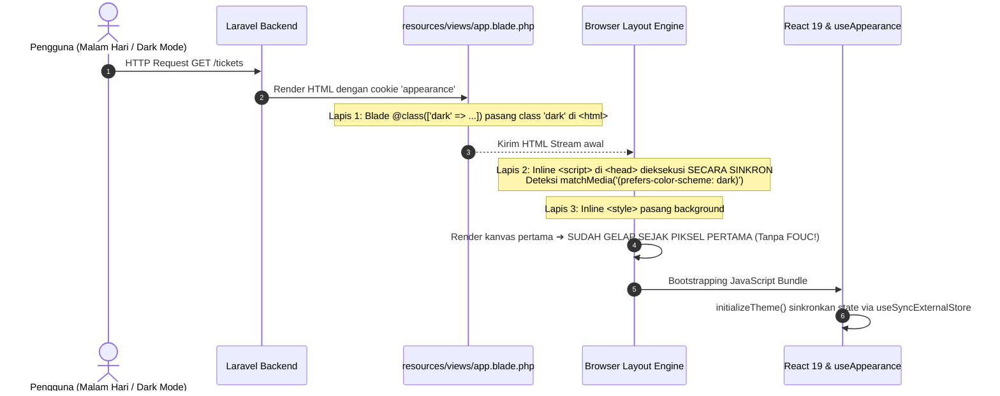

Mari kita periksa kode nyata di [`resources/views/app.blade.php:2-31`](../../resources/views/app.blade.php):

```blade
<!-- 1. Lapis Pertama: Server-Side Tag Attribute via Cookie Laravel -->
<html lang="{{ str_replace('_', '-', app()->getLocale()) }}" @class(['dark' => ($appearance ?? 'system') == 'dark'])>
    <head>
        <!-- 2. Lapis Kedua: Synchronous Inline Blocking Script -->
        <script>
            (function() {
                const appearance = '{{ $appearance ?? "system" }}';

                if (appearance === 'system') {
                    const prefersDark = window.matchMedia('(prefers-color-scheme: dark)').matches;

                    if (prefersDark) {
                        document.documentElement.classList.add('dark');
                    }
                }
            })();
        </script>

        <!-- 3. Lapis Ketiga: Inline Background Color Matcher -->
        <style>
            html {
                background: #F8FAFC;
            }

            html.dark {
                background: #0F172A;
            }
        </style>
        ...
```

* **Lapis 1 (Blade `@class`):** Jika cookie `appearance` bernilai `'dark'`, server Laravel langsung mengirim tag `<html class="dark">`. Browser tidak perlu menunggu JavaScript apa pun.
* **Lapis 2 (Inline `<script>` Sinkron):** Jika preferensi bernilai `'system'`, script mini tanpa dependensi ini langsung berjalan di `<head>` sebelum tag `<body>` diparsing. Script membaca preferensi OS pengguna via `window.matchMedia` dan langsung menambahkan class `.dark` jika diperlukan.
* **Lapis 3 (Inline `<style>` Background):** Sebelum file bundle CSS utama [`resources/css/app.css`](../../resources/css/app.css) selesai diunduh dari jaringan, browser telah mengecat background kanvas dengan warna `#0F172A`. Hasilnya: **Nol Kedipan Layar (*Zero FOUC*)**.

---

#### 3. Integrasi Reaktif di Client: Hook [`useAppearance`](../../resources/js/hooks/use-appearance.tsx)

Setelah browser memuat bundle React, pengelolaan tema diserahkan kepada hook reaktif [`resources/js/hooks/use-appearance.tsx`](../../resources/js/hooks/use-appearance.tsx):

```tsx
// Cuplikan dari resources/js/hooks/use-appearance.tsx
export function useAppearance(): UseAppearanceReturn {
    // Memanfaatkan useSyncExternalStore (React 18/19 native) untuk konsistensi state
    const appearance: Appearance = useSyncExternalStore(
        subscribe,
        () => currentAppearance,
        () => 'system',
    );

    const resolvedAppearance: ResolvedAppearance = useMemo(
        () => (isDarkMode(appearance) ? 'dark' : 'light'),
        [appearance],
    );

    const updateAppearance = useCallback((mode: Appearance): void => {
        currentAppearance = mode;
        localStorage.setItem('appearance', mode); // Simpan di client
        setCookie('appearance', mode);            // Simpan di cookie untuk respon Blade berikutnya
        applyTheme(mode);
        notify();
    }, []);

    return { appearance, resolvedAppearance, updateAppearance } as const;
}
```

Saat pengguna menukar tema di pengaturan profil (System, Light, atau Dark):
1. `updateAppearance` langsung menukar class `.dark` pada `<html>`.
2. Menyimpan preferensi ke `localStorage` untuk sesi browser saat ini.
3. Menyimpan preferensi ke `cookie` HTTP `appearance` agar navigasi atau reload berikutnya dapat langsung diproses oleh Blade Shell di Lapis 1.

---

### 4.4 Komponen Primitif UI (`resources/js/components/ui/`) & Filosofi Headless UI

Di folder [`resources/js/components/ui/`](../../resources/js/components/ui/), Anda akan menemukan 30 komponen antarmuka yang siap digunakan.

#### 1. Mengapa Memilih Filosofi "Headless UI" Berbasis Radix UI?

Bagi pengembang yang terbiasa dengan Bootstrap atau Material UI (MUI), pertanyaan umum yang muncul adalah: *Mengapa kita tidak memakai library komponen yang sudah lengkap dengan desainnya?*

> [!NOTE]
> **Filosofi Headless UI:**
> *Headless UI* adalah pustaka komponen yang menyediakan **100% fungsionalitas, logika interaksi, manajemen state internal, dan aksesibilitas (WAI-ARIA)** tanpa memaksakan **tampilan visual (HTML styling) apa pun**.
> 
> Radix UI Primitives tidak menyertakan file CSS bawaan. Tanggung jawab desain visual diserahkan sepenuhnya kepada kita melalui class utilitas **Tailwind CSS v4**.

```
┌─────────────────────────────────────────────────────────────┐
│                    Arsitektur Komponen UI                   │
│                                                             │
│   [Radix UI Primitive] ─── Logika ARIA, Keyboard, Trapping  │
│            │                                                │
│            ▼                                                │
│   [CVA (Class Variance Authority)] ── Variant & Size Matrix │
│            │                                                │
│            ▼                                                │
│   [Tailwind CSS v4 (@theme)] ── Token Visual Sifast         │
│            │                                                │
│            ▼                                                │
│   [Helper cn()] ── Smart Specificity Merge                  │
│            │                                                │
│            ▼                                                │
│   Komponen Siap Pakai: <Button>, <Dialog>, <Select>, dsb.   │
└─────────────────────────────────────────────────────────────┘
```

Keuntungan pendekatan ini di Portal Sifast:
1. **Bebas Pembengkakan CSS (*Zero CSS Bloat*):** Tidak ada CSS override berantai seperti `!important` yang biasa kita temukan saat mencoba mengkustomisasi Bootstrap atau Ant Design.
2. **Kepatuhan Aksesibilitas Internasional (A11y):** Radix UI dibangun memenuhi standar W3C WAI-ARIA. Pengguna tunanetra yang memakai *screen reader* atau staf medis yang bernavigasi murni dengan keyboard dapat mengoperasikan aplikasi rumah sakit tanpa kendala.

---

#### 2. Aspek Aksesibilitas (A11y) Out-of-the-Box

Saat Anda menggunakan komponen dari `resources/js/components/ui/`, Anda secara otomatis mendapatkan fitur-fitur aksesibilitas canggih berikut:

1. **Navigasi Keyboard Penuh:**
   * Menekan `Tab` dan `Shift + Tab` untuk berpindah antar elemen interaktif.
   * Menekan tombol `Panah Atas / Bawah` untuk memilih opsi di `<Select>` atau `<DropdownMenu>`.
   * Menekan tombol `Escape` untuk menutup jendela modal `<Dialog>` atau menu terbuka.
   * Menekan `Enter` atau `Space` untuk mengaktifkan item menu dan tombol.
2. **Focus Trapping & Focus Restoration:**
   * Saat `<Dialog>` dibuka, fokus keyboard terkunci (*trapped*) di dalam dialog sehingga pengguna tidak sengaja menekan elemen di balik overlay latar belakang.
   * Saat `<Dialog>` ditutup, fokus keyboard secara otomatis dikembalikan (*restored*) ke tombol yang memicu pembukaan dialog tersebut.
3. **Penyematan Atribut ARIA Otomatis:**
   * Atribut `role="dialog"`, `aria-modal="true"`, `aria-expanded="true/false"`, `aria-haspopup="menu"`, dan `aria-invalid` disuntikkan secara dinamis sesuai state interaksi komponen.

---

#### 3. Bedah 7 Komponen Esensial Sifast

Mari kita telaah implementasi dan cara pemakaian 7 komponen esensial yang paling sering digunakan dalam pengembangan modul di Portal Sifast:

##### a. `Button` ([`resources/js/components/ui/button.tsx`](../../resources/js/components/ui/button.tsx)): Slot Pattern & CVA
Komponen tombol memadukan library **Class Variance Authority (`cva`)** untuk variasi gaya visual dan **Radix `Slot` (`asChild`)** untuk polimorfisme elemen:

```tsx
// Cuplikan dari resources/js/components/ui/button.tsx
const buttonVariants = cva(
  "inline-flex items-center justify-center gap-2 whitespace-nowrap rounded-md text-sm font-medium transition-[color,box-shadow] disabled:pointer-events-none disabled:opacity-50 ...",
  {
    variants: {
      variant: {
        default: "bg-primary text-primary-foreground shadow-xs hover:bg-primary/90",
        destructive: "bg-destructive text-white shadow-xs hover:bg-destructive/90 ...",
        outline: "border border-input bg-background shadow-xs hover:bg-accent ...",
        secondary: "bg-secondary text-secondary-foreground shadow-xs hover:bg-secondary/80",
        ghost: "hover:bg-accent hover:text-accent-foreground",
        link: "text-primary underline-offset-4 hover:underline",
      },
      size: {
        default: "h-9 px-4 py-2 has-[>svg]:px-3",
        sm: "h-8 rounded-md px-3 has-[>svg]:px-2.5",
        lg: "h-10 rounded-md px-6 has-[>svg]:px-4",
        icon: "size-9",
      },
    },
    defaultVariants: {
      variant: "default",
      size: "default",
    },
  }
);
```

> [!TIP]
> **Pola Radix `asChild` (Polimorfisme Elemen JSX):**
> Seringkali kita ingin sebuah tautan Inertia `<Link href="/tickets">` berpenampilan persis seperti tombol primary, namun membuat `<button><Link>...</Link></button>` adalah pelanggaran standar HTML (elemen interaktif di dalam elemen interaktif).
> 
> Dengan properti `asChild`, Radix `Slot` menggabungkan props dan class tombol langsung ke komponen anak tanpa merender elemen `<button>` pembungkus:
> ```tsx
> import { Button } from '@/components/ui/button';
> import { Link } from '@inertiajs/react';
> 
> // ✅ Me-render tag <a> Inertia dengan seluruh class & behavior Button
> <Button variant="outline" asChild>
>     <Link href="/tickets">Kembali ke Daftar</Link>
> </Button>
> ```

##### b. `Input` ([`resources/js/components/ui/input.tsx`](../../resources/js/components/ui/input.tsx)): State Focus & Indikator Validasi
Komponen input teks yang terstandarisasi dengan ring focus dan penanganan visual error validasi server Laravel:

```tsx
// Cuplikan dari resources/js/components/ui/input.tsx
function Input({ className, type, ...props }: React.ComponentProps<"input">) {
  return (
    <input
      type={type}
      data-slot="input"
      className={cn(
        "border-input placeholder:text-muted-foreground flex h-9 w-full min-w-0 rounded-md border bg-transparent px-3 py-1 text-base shadow-xs outline-none transition-[color,box-shadow]",
        "focus-visible:border-ring focus-visible:ring-ring/50 focus-visible:ring-[3px]",
        "aria-invalid:ring-destructive/20 dark:aria-invalid:ring-destructive/40 aria-invalid:border-destructive",
        className
      )}
      {...props}
    />
  );
}
```
* Perhatikan aturan `aria-invalid:border-destructive`: Ketika Laravel mengembalikan error validasi dan Anda memasang `aria-invalid={!!errors.title}`, garis batas input secara otomatis berubah menjadi merah dengan ring peringatan halus tanpa perlu menulis class CSS kustom tambahan.

##### c. `Dialog` ([`resources/js/components/ui/dialog.tsx`](../../resources/js/components/ui/dialog.tsx)): Modal Dialog Accessible
Membungkus kumpulan primitif `@radix-ui/react-dialog` (`Dialog`, `DialogTrigger`, `DialogContent`, `DialogHeader`, `DialogTitle`, `DialogDescription`, `DialogFooter`, `DialogClose`):

```tsx
import {
    Dialog,
    DialogContent,
    DialogDescription,
    DialogFooter,
    DialogHeader,
    DialogTitle,
    DialogTrigger,
} from '@/components/ui/dialog';
import { Button } from '@/components/ui/button';

export function ModalPeringatan() {
    return (
        <Dialog>
            <DialogTrigger asChild>
                <Button variant="destructive">Hapus Rekam Medis</Button>
            </DialogTrigger>
            <DialogContent>
                <DialogHeader>
                    <DialogTitle>Konfirmasi Penghapusan</DialogTitle>
                    <DialogDescription>
                        Aksi ini tidak dapat dibatalkan. Berkas akan diarsipkan permanen.
                    </DialogDescription>
                </DialogHeader>
                <DialogFooter>
                    <Button variant="outline">Batal</Button>
                    <Button variant="destructive">Ya, Hapus</Button>
                </DialogFooter>
            </DialogContent>
        </Dialog>
    );
}
```
Komponen ini secara otomatis menangani render portal di luar pohon DOM utama, animasi masuk (*fade-in* dan *zoom-in-95*), penutupan via tombol Esc, serta penguncian scroll layar belakang.

##### d. `DropdownMenu` ([`resources/js/components/ui/dropdown-menu.tsx`](../../resources/js/components/ui/dropdown-menu.tsx)): Menu Aksi Baris & Navigasi Keyboard
Membungkus `@radix-ui/react-dropdown-menu` untuk menyajikan menu kontekstual (misalnya tombol aksi `...` pada setiap baris tabel):

```tsx
import {
    DropdownMenu,
    DropdownMenuContent,
    DropdownMenuItem,
    DropdownMenuLabel,
    DropdownMenuSeparator,
    DropdownMenuTrigger,
} from '@/components/ui/dropdown-menu';
import { Button } from '@/components/ui/button';
import { MoreHorizontal, Edit, Trash2 } from 'lucide-react';

export function ActionMenu({ onEdit, onDelete }: { onEdit: () => void; onDelete: () => void }) {
    return (
        <DropdownMenu>
            <DropdownMenuTrigger asChild>
                <Button variant="ghost" size="icon">
                    <MoreHorizontal className="size-4" />
                </Button>
            </DropdownMenuTrigger>
            <DropdownMenuContent align="end">
                <DropdownMenuLabel>Tindakan</DropdownMenuLabel>
                <DropdownMenuSeparator />
                <DropdownMenuItem onClick={onEdit}>
                    <Edit className="size-4 mr-2" /> Ubah Data
                </DropdownMenuItem>
                <DropdownMenuItem onClick={onDelete} variant="destructive">
                    <Trash2 className="size-4 mr-2" /> Hapus
                </DropdownMenuItem>
            </DropdownMenuContent>
        </DropdownMenu>
    );
}
```

##### e. `Badge` ([`resources/js/components/ui/badge.tsx`](../../resources/js/components/ui/badge.tsx)): Label Indikator Status Rumah Sakit
Komponen badge yang secara cerdas memetakan status operasional rumah sakit ke token warna `@theme` yang telah kita konfigurasikan:

```tsx
// Cuplikan varian dari resources/js/components/ui/badge.tsx
variants: {
  variant: {
    default: "border-transparent bg-primary text-primary-foreground",
    secondary: "border-transparent bg-secondary text-secondary-foreground",
    destructive: "border-transparent bg-destructive text-white",
    outline: "border-gray-200 bg-gray-50 text-gray-700",
    success: "border-transparent bg-normal-bg text-normal",
    warning: "border-transparent bg-warning-bg text-warning",
    info: "border-transparent bg-info-bg text-info",
    urgent: "border-transparent bg-urgent-bg text-urgent",
    "follow-up": "border-transparent bg-follow-up-bg text-follow-up",
    neutral: "border-transparent bg-gray-100 text-gray-700",
  },
}
```
Penggunaan di halaman tiket atau antrean poli:
```tsx
<Badge variant="urgent">Gawat Darurat</Badge>
<Badge variant="warning">Menunggu Konfirmasi Dokter</Badge>
<Badge variant="success">Resep Obat Selesai</Badge>
```

##### f. `Select` ([`resources/js/components/ui/select.tsx`](../../resources/js/components/ui/select.tsx)): Dropdown Pilihan Kustom Accessible
Membungkus `@radix-ui/react-select`. Menggantikan elemen `<select>` HTML bawaan browser yang kaku dan sulit diberi gaya visual:

```tsx
import {
    Select,
    SelectContent,
    SelectItem,
    SelectTrigger,
    SelectValue,
} from '@/components/ui/select';

export function PilihDepartemen({ value, onChange }: { value: string; onChange: (v: string) => void }) {
    return (
        <Select value={value} onValueChange={onChange}>
            <SelectTrigger className="w-[200px]">
                <SelectValue placeholder="Pilih Instalasi..." />
            </SelectTrigger>
            <SelectContent>
                <SelectItem value="igd">Instalasi Gawat Darurat</SelectItem>
                <SelectItem value="farmasi">Farmasi & Apotek</SelectItem>
                <SelectItem value="radiologi">Radiologi</SelectItem>
                <SelectItem value="it">Teknologi Informasi</SelectItem>
            </SelectContent>
        </Select>
    );
}
```

##### g. `Textarea` ([`resources/js/components/ui/textarea.tsx`](../../resources/js/components/ui/textarea.tsx)): Input Multiline dengan ForwardRef
Komponen area teks serbaguna untuk deskripsi keluhan pasien, laporan investigasi insiden, atau catatan resep dokter:

```tsx
// Cuplikan dari resources/js/components/ui/textarea.tsx
const Textarea = React.forwardRef<HTMLTextAreaElement, React.ComponentProps<"textarea">>(
    function Textarea({ className, ...props }, ref) {
        return (
            <textarea
                ref={ref}
                data-slot="textarea"
                className={cn(
                    "border-input placeholder:text-muted-foreground selection:bg-primary flex min-h-[80px] w-full rounded-md border bg-transparent px-3 py-2 text-base shadow-xs outline-none transition-[color,box-shadow]",
                    "focus-visible:border-ring focus-visible:ring-ring/50 focus-visible:ring-[3px]",
                    "aria-invalid:ring-destructive/20 dark:aria-invalid:ring-destructive/40 aria-invalid:border-destructive",
                    className
                )}
                {...props}
            />
        );
    }
);
Textarea.displayName = "Textarea";
```

---

### 4.5 Helper Utility `cn()` (`clsx` + `tailwind-merge`)

Di setiap komponen UI Portal Sifast, Anda akan selalu melihat pemanggilan fungsi `cn(...)`. Berkas ini berada di [`resources/js/lib/utils.ts`](../../resources/js/lib/utils.ts).

#### 1. Analisis Berkas [`resources/js/lib/utils.ts`](../../resources/js/lib/utils.ts)

```typescript
// Cuplikan nyata dari resources/js/lib/utils.ts:1-7
import { type ClassValue, clsx } from 'clsx';
import { twMerge } from 'tailwind-merge';

export function cn(...inputs: ClassValue[]) {
    return twMerge(clsx(inputs));
}
```

Fungsi ini sangat ringkas (hanya 3 baris), namun merupakan fondasi paling krusial dalam sistem styling komponen React di Sifast. Fungsi ini menggabungkan dua library:
1. **`clsx`**: Utility untuk menangani logika kondisional penulisan class JavaScript.
2. **`tailwind-merge` (`twMerge`)**: Mesin resolusi cerdas untuk menyelesaikan konflik benturan spesifisitas class Tailwind CSS.

---

#### 2. Mengapa Penggabungan String Biasa Menimbulkan Bug Spesifisitas CSS?

Bagi pengembang yang belum terbiasa dengan Tailwind, godaan terbesar adalah menggabungkan class menggunakan template literal string biasa:

```tsx
// ⚠️ CONTOH JEBAKAN PEMULA: Menggabungkan string biasa
function AlertBox({ className, children }: { className?: string; children: React.ReactNode }) {
    // Komponen menetapkan padding default p-4
    return <div className={`p-4 bg-blue-100 rounded ${className}`}>{children}</div>;
}

// Kemudian pemanggil ingin memperlebar padding menjadi p-8:
<AlertBox className="p-8">Halo Pasien</AlertBox>
```

**Apa yang terjadi di browser?**
Elemen HTML akan terender sebagai:
```html
<div class="p-4 bg-blue-100 rounded p-8">Halo Pasien</div>
```

> [!CAUTION]
> **Hukum Spesifisitas CSS yang Sering Disalahpahami:**
> Banyak developer mengira bahwa class `p-8` akan menang karena ditulis paling akhir di atribut `class="..."`. **Anggapan ini 100% keliru dalam spesifikasi CSS!**
> 
> Di CSS, prioritas aturan class ditentukan oleh **urutan pendeklarasian aturan di file stylesheet CSS (`app.css`) yang dikompilasi**, BUKAN urutan kata di atribut HTML.
> 
> Jika di dalam CSS hasil kompilasi aturan `.p-4` kebetulan dideklarasikan setelah `.p-8`, maka gaya `padding: 1rem` dari `.p-4` yang akan selalu aktif selamanya! Nilai `p-8` yang Anda oper dari luar akan diabaikan oleh browser.

---

#### 3. Sinergi Cerdas `clsx` dan `tailwind-merge` (`twMerge`)

Mari kita lihat bagaimana `cn()` memecahkan masalah ini dengan elegan:

1. **Tahap 1: `clsx` Mengevaluasi Logika Kondisional**
   `clsx` mengizinkan kita mengoper objek, array, atau kondisi boolean tanpa menghasilkan string kotor seperti `"undefined"` atau `"false"`:
   ```typescript
   clsx('p-4', isActive && 'text-blue-600', isError ? 'border-red-500' : null)
   // Menghasilkan: "p-4 text-blue-600 border-red-500"
   ```

2. **Tahap 2: `twMerge` Menyelesaikan Benturan Kelas Tailwind**
   `twMerge` memahami pohon semantik utilitas Tailwind. Ia mengenali bahwa `p-4` (padding) dan `p-8` (padding) menargetkan properti CSS yang identik (`padding`).
   ```typescript
   twMerge('p-4 p-8')
   // Menghasilkan: "p-8" (p-4 otomatis dihapus secara cerdas!)
   ```

##### Contoh Kasus Resolusi Konflik Lainnya:
* **Konflik Background:** `cn('bg-red-500', 'bg-blue-500')` $\rightarrow$ `'bg-blue-500'`
* **Konflik Spacing Parsial:** `cn('px-4 py-2', 'p-6')` $\rightarrow$ `'p-6'` (menimpa padding horizontal dan vertikal)
* **Konflik Ukuran Teks:** `cn('text-sm', 'text-lg')` $\rightarrow$ `'text-lg'`
* **Konflik Radius:** `cn('rounded-md', 'rounded-full')` $\rightarrow$ `'rounded-full'`

---

#### 4. Matriks Perbandingan: String Biasa vs `clsx` vs `cn()`

| Skenario Penggunaan | Template Literal Biasa (`` `...` ``) | Library `clsx` Saja | Utility `cn()` (`clsx` + `twMerge`) |
| :--- | :--- | :--- | :--- |
| **Kondisi Boolean `isActive && 'btn-active'`** | Berisiko menghasilkan teks literal `"false"` di DOM jika falsy. | Bersih: nilai falsy dibuang otomatis. | Bersih: nilai falsy dibuang otomatis. |
| **Nilai `undefined` atau `null`** | Berisiko menghasilkan teks `"undefined"` di atribut class. | Dieliminasi otomatis. | Dieliminasi otomatis. |
| **Override Class Padding (`p-4` ditimpa `p-6`)** | ❌ Gagal: Tergantung urutan kompilasi CSS. | ❌ Gagal: Keduanya dimasukkan ke DOM. | ✅ **Berhasil Sempurna:** `p-4` dibersihkan, `p-6` menang. |
| **Override Warna Tombol (`bg-blue` ditimpa `bg-red`)**| ❌ Gagal: Menghasilkan benturan warna tak terduga. | ❌ Gagal: Konflik di browser. | ✅ **Berhasil Sempurna:** `bg-red` menang secara deterministik. |

---

#### 5. Pola Standar Komponen Kustom dengan `cn()`

Di Portal Sifast, seluruh komponen kustom yang menerima properti `className` **wajib** menggunakan pola berikut:

```tsx
import { cn } from '@/lib/utils';
import React from 'react';

type PatientCardProps = {
    namaPasien: string;
    noRm: string;
    isEmergency?: boolean;
    className?: string; // Opsional: mengizinkan styling tambahan dari parent
};

export function PatientCard({ namaPasien, noRm, isEmergency, className }: PatientCardProps) {
    return (
        <div
            className={cn(
                // 1. Gaya Dasar (Default Styles)
                "p-4 rounded-xl border bg-card text-card-foreground shadow-xs transition-colors",
                // 2. Gaya Kondisional Berdasarkan State / Props
                isEmergency && "border-urgent bg-urgent-bg text-urgent",
                // 3. Gaya Override dari Luar (Parent ClassName) - Selalu di Posisi Terakhir!
                className
            )}
        >
            <div className="text-sm font-semibold">{namaPasien}</div>
            <div className="text-xs text-muted-foreground">No. RM: {noRm}</div>
        </div>
    );
}
```

Dengan pola di atas:
* Komponen memiliki tampilan default yang cantik dan stabil.
* Komponen merespon state lokal (`isEmergency`).
* Pengembang lain dapat menggunakan komponen ini dan melakukan *custom override* (misal `<PatientCard className="shadow-lg p-6" ... />`) tanpa khawatir styling default akan merusak tampilan.

---

### 4.6 Panduan Praktis: Membangun Komponen Baru Mengikuti Standar Sifast

Sebagai ringkasan implementasi arsitektur styling di Portal Sifast, mari kita lihat studi kasus penerapan langsung saat membuat komponen baru.

#### 1. Studi Kasus Pembuatan Komponen `IncidentPriorityBadge`

Bayangkan Anda diminta membuat komponen badge prioritas insiden SIMRS yang mendukung 4 level keparahan:

```tsx
import { cva, type VariantProps } from 'class-variance-authority';
import * as React from 'react';
import { cn } from '@/lib/utils';

// 1. Definisikan varian menggunakan CVA dan token tema @theme Sifast
const incidentBadgeVariants = cva(
    "inline-flex items-center gap-1.5 px-2.5 py-0.5 rounded-full text-xs font-semibold tracking-wide transition-colors",
    {
        variants: {
            priority: {
                low: "bg-surface-2 text-ink-muted border border-border",
                medium: "bg-info-bg text-info border border-info/20",
                high: "bg-warning-bg text-warning border border-warning/20",
                critical: "bg-urgent-bg text-urgent border border-urgent/30 animate-pulse",
            },
            size: {
                sm: "text-[11px] px-2 py-0.5",
                default: "text-xs px-2.5 py-0.5",
                lg: "text-sm px-3 py-1",
            },
        },
        defaultVariants: {
            priority: "medium",
            size: "default",
        },
    }
);

export interface IncidentBadgeProps
    extends React.HTMLAttributes<HTMLSpanElement>,
        VariantProps<typeof incidentBadgeVariants> {}

export function IncidentPriorityBadge({
    priority,
    size,
    className,
    children,
    ...props
}: IncidentBadgeProps) {
    return (
        <span
            className={cn(incidentBadgeVariants({ priority, size }), className)}
            {...props}
        >
            <span className="size-1.5 rounded-full bg-current shrink-0" />
            {children}
        </span>
    );
}
```

Komponen di atas langsung memenuhi seluruh kriteria arsitektur Sifast:
* Terintegrasi dengan token `@theme` (`bg-urgent-bg`, `text-urgent`, `bg-info-bg`, dsb.).
* Otomatis beradaptasi sempurna di Light Mode maupun Dark Mode tanpa penulisan duplikat class `dark:bg-...`.
* Aman dari konflik spesifisitas via `cn()`.
* Fully type-safe dengan auto-complete TypeScript untuk properti `priority` dan `size`.

---

#### 2. Checklist Desain UI & Styling bagi Developer Sifast

Sebelum menyerahkan pull request atau mengajukan fitur baru ke review tim, pastikan kode antarmuka Anda memenuhi 6 poin checklist berikut:

| No | Poin Pemeriksaan | Kriteria Sukses |
| :---: | :--- | :--- |
| 1 | **Tanpa `tailwind.config.js`** | Konfigurasi token tema baru ditulis di blok `@theme` pada [`resources/css/app.css`](../../resources/css/app.css). |
| 2 | **Wajib Memakai Helper `cn()`** | Seluruh penggabungan class string atau conditional class menggunakan `cn(...)` dari [`resources/js/lib/utils.ts`](../../resources/js/lib/utils.ts). |
| 3 | **Kompatibilitas Dark Mode** | Menggunakan semantic token (`bg-card`, `text-foreground`, `bg-urgent-bg`) sehingga elemen otomatis indah di mode terang dan gelap. |
| 4 | **Dukungan Polimorfisme `asChild`** | Gunakan `asChild` saat merender tombol yang bertindak sebagai link navigasi Inertia (`<Button asChild><Link ... /></Button>`). |
| 5 | **Aksesibilitas WAI-ARIA** | Komponen modal, dropdown, dan pilihan selalu memanfaatkan primitif Radix UI di [`resources/js/components/ui/`](../../resources/js/components/ui/) untuk navigasi keyboard otomatis. |
| 6 | **Validasi Indikator Visual** | Pasangkan atribut `aria-invalid={!!errors.field}` pada komponen `<Input>` atau `<Textarea>` agar border kesalahan berwarna merah secara otomatis. |

---

### 4.7 Arsitektur Shell & Tata Letak Navigasi (Layout Hierarchy & Single Source of Truth)

Dalam aplikasi web rumah sakit yang memiliki puluhan modul dan tingkat otorisasi yang ketat, arsitektur tata letak antarmuka (*application shell*) harus menjamin konsistensi navigasi, responsivitas multi-perangkat (desktop staf poliklinik vs tablet/smartphone perawat & satpam lapangan), serta evaluasi hak akses yang deterministik.

#### 1. Hierarki Rantai Tata Letak (*Layout Hierarchy*)

Setiap halaman modul di Portal Sifast (seperti [`resources/js/pages/projects/index.tsx`](../../resources/js/pages/projects/index.tsx)) dibungkus oleh komponen layout utama. Alur perenderan hierarkinya berjalan sebagai berikut:

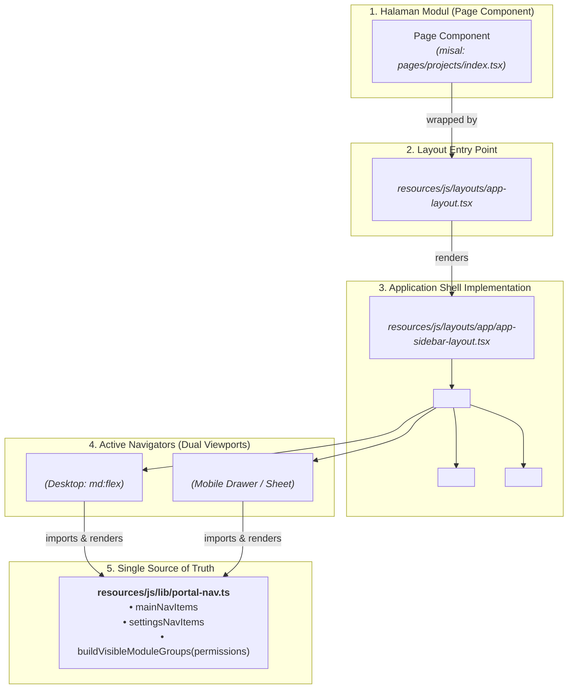

1. **`AppLayout` ([`resources/js/layouts/app-layout.tsx`](../../resources/js/layouts/app-layout.tsx)):**
   Titik masuk standar yang dipanggil oleh seluruh halaman React. Komponen ini meneruskan `breadcrumbs` dan `children` ke layout template aktif (`AppSidebarLayout`).
2. **`AppSidebarLayout` ([`resources/js/layouts/app/app-sidebar-layout.tsx`](../../resources/js/layouts/app/app-sidebar-layout.tsx)):**
   Implementasi shell aktif aplikasi SIMRS. Mengorkestrasi:
   - `<PresenceProvider>` untuk pelacakan staf online via WebSocket.
   - `<FlashMessage>` untuk penanganan notifikasi toast global.
   - `<TemplateSidebar>` untuk navigasi sidebar tetap di layar desktop (`md:ml-64`).
   - `<TemplateMobileNav>` untuk drawer navigasi responsif pada layar mobile/tablet.
   - `<TemplateHeader>` untuk topbar navigasi, breadcrumbs, dan toggle menu mobile.

> [!CAUTION]
> **PERINGATAN ARSITEKTUR: Komponen Mati `app-sidebar.tsx`**
> Berkas [`resources/js/components/app-sidebar.tsx`](../../resources/js/components/app-sidebar.tsx) adalah artefak bawaan starter-kit Laravel/Inertia awal yang **TIDAK PERNAH DIRENDER** di tata letak aplikasi SIMRS.
>
> ❌ **JANGAN PERNAH** menambahkan atau mengubah menu di `app-sidebar.tsx`.
>
> Jika Anda menambahkan menu ke `app-sidebar.tsx`, menu tersebut **tidak akan pernah muncul** di layar desktop maupun mobile staf SIMRS!

---

#### 2. Single Source of Truth: `resources/js/lib/portal-nav.ts`

Untuk mencegah duplikasi definisi menu antara tampilan desktop (`TemplateSidebar`) dan mobile (`TemplateMobileNav`), Portal Sifast memusatkan seluruh konfigurasi navigasi pada satu berkas: **[`resources/js/lib/portal-nav.ts`](../../resources/js/lib/portal-nav.ts)**.

Berkas ini mengekspor tiga entitas navigasi utama:
1. **`mainNavItems: PortalNavItem[]`**
   Daftar navigasi tingkat atas tunggal (*Dashboard*, *Portal Pelaporan*, *Chat*, *Daftar Pegawai*, *Daftar User*).
2. **`settingsNavItems: PortalNavItem[]`**
   Menu pengaturan di bagian bawah (*Profil*, *Master Tiket*).
3. **`moduleGroups: PortalNavGroup[]` & `buildVisibleModuleGroups(permissions)`**
   Grup modul aplikasi bertingkat (Ticketing, Emergency, Payroll, Patroli, Keuangan, Kamar Inap, Inventaris, SIMMUTU, Tatanaskah, Web Official, Portal Eksternal).

Setiap item navigasi didefinisikan menggunakan tipe `PortalNavItem`:

```typescript
export type PortalNavItem = {
    id: string;                          // ID unik item (contoh: 'portal-pelaporan')
    label: string;                       // Teks label yang tampil di antarmuka
    href: string;                        // URL tujuan (Wayfinder URL atau path relatif)
    icon: LucideIcon;                    // Komponen ikon dari Lucide React
    isActive: (path: string) => boolean; // Fungsi deterministik pendeteksi rute aktif
    fullPage?: boolean;                  // Flag jika membutuhkan full-page reload
};
```

---

#### 3. Evaluasi Izin Berbasis Inertia Shared Props

Navigasi di Portal Sifast menerapkan prinsip *least privilege*—menu yang tidak berhak diakses oleh staf tidak akan dirender ke dalam DOM.

Evaluasi hak akses dilakukan secara deklaratif di sisi klien menggunakan fungsi `buildVisibleModuleGroups(permissions)` yang menerima props perizinan global dari Inertia:

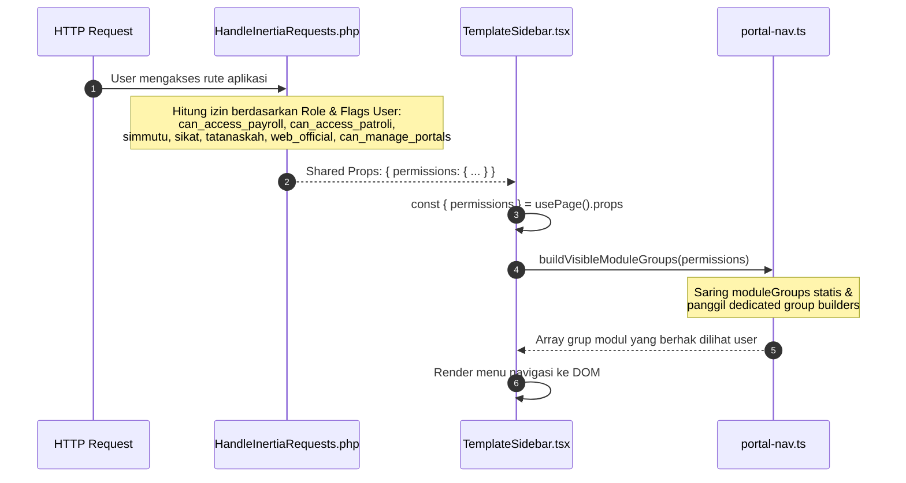

Contoh logika evaluasi di [`resources/js/lib/portal-nav.ts`](../../resources/js/lib/portal-nav.ts):

```typescript
export function buildVisibleModuleGroups(permissions?: PortalNavPermissions): PortalNavGroup[] {
    const canAccessPayroll = Boolean(permissions?.can_access_payroll);
    const canAccessPatroli = Boolean(permissions?.can_access_patroli);

    // 1. Saring grup statis berdasarkan hak akses granular
    const base = moduleGroups.filter((group) => {
        if (group.id === 'payroll') return canAccessPayroll;
        if (group.id === 'patroli') return canAccessPatroli;
        return true;
    });

    // 2. Tambahkan grup modular kondisional melalui dedicated builders
    const simmutuGroup = buildSimmutuNavGroup(permissions?.simmutu);
    if (simmutuGroup) base.push(simmutuGroup);

    const portalGroup = buildPortalNavGroup(permissions?.can_manage_portals);
    if (portalGroup) base.push(portalGroup);

    return base;
}
```

Dengan arsitektur ini:
- **Dekoupling Murni:** Komponen presentasi UI ([`TemplateSidebar`](../../resources/js/components/template-sidebar.tsx) dan [`TemplateMobileNav`](../../resources/js/components/template-mobile-nav.tsx)) murni bertindak sebagai renderer visual tanpa kode rute *hardcoded*.
- **Konsistensi Paritas 100%:** Menu desktop dan mobile selalu identik karena keduanya membaca `portal-nav.ts`.
- **Aman & Terverifikasi:** Arsitektur ini terproteksi oleh test regresi otomatis pada [`tests/Feature/PortalNavParityTest.php`](../../tests/Feature/PortalNavParityTest.php).

---

## Bab 5: Reaktivitas Real-Time & WebSockets (Laravel Reverb & Echo di React)

Dalam sistem informasi rumah sakit seperti Portal Sifast, kecepatan respons informasi dapat menentukan kelancaran penanganan medis dan respon operasional. Panggilan darurat (*code blue*, *code red*), pelaporan insiden darurat IGD, pembaruan lokasi ambulans, tiket gangguan perangkat vital (seperti printer resep obat di instalasi farmasi atau monitor hemodialisa), hingga pelacakan presensi dokter jaga memerlukan penyampaian data instan tanpa staf harus menekan tombol refresh (F5) secara manual di browser.

Laravel 11+ memperkenalkan **Laravel Reverb**, server WebSocket bawaan resmi (*first-party WebSocket server*) yang dibangun langsung di atas ekosistem PHP dan terintegrasi mulus dengan Laravel Echo di frontend React 19.

---

### 5.1 Arsitektur Integrasi Reverb & Echo di React (Event Broadcasting Lifecycle)

Sebelum menyelami detail kode, penting bagi pengembang untuk memahami bagaimana aliran data penyiaran (*event broadcasting*) mengalir dari backend Laravel hingga memicu pembaruan state reaktif di layar browser.

#### 1. Diagram Alur Siklus Hidup Event Broadcasting

Diagram Mermaid berikut menggambarkan siklus hidup lengkap penyiaran event real-time di Portal Sifast:

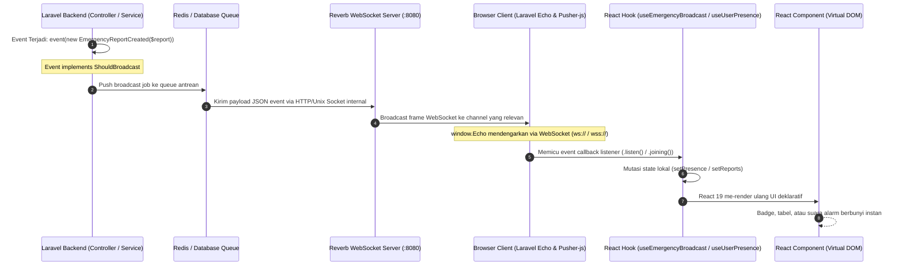

#### 2. Peran Masing-Masing Komponen Arsitektur

1. **Laravel Event (`ShouldBroadcast`):**
   Event di Laravel mengimplementasikan antarmuka `Illuminate\Contracts\Broadcasting\ShouldBroadcast`. Antarmuka ini menginstruksikan Laravel untuk tidak hanya menjalankan event listener lokal, melainkan juga men-serialize data publik event dan mengirimkannya ke driver broadcasting default (`reverb`).
2. **Reverb WebSocket Daemon (Port 8080):**
   Reverb berjalan sebagai background daemon process (biasanya dipantau via Supervisor atau Docker di port `8080`). Reverb bertindak sebagai message broker berperforma tinggi yang mengelola ribuan koneksi WebSocket persisten terbuka dari browser staf tanpa membebani PHP-FPM web server.
3. **Browser Client (`window.Echo` & `pusher-js`):**
   Di frontend, library `laravel-echo` berpasangan dengan `pusher-js` bertindak sebagai client WebSocket. Meskipun namanya `pusher-js`, library ini berkomunikasi langsung dengan server Reverb milik sendiri tanpa bergantung pada server pihak ketiga Pusher Cloud berbayar.
4. **React Hook State Update:**
   Listener event dihubungkan ke siklus hidup React melalui custom hook (seperti [`useEmergencyBroadcast`](../../resources/js/hooks/use-emergency-broadcast.ts) atau [`useUserPresence`](../../resources/js/hooks/use-user-presence.ts)). Ketika payload diterima, hook memanggil fungsi updater `useState`, memicu pembaruan Virtual DOM secara presisi tanpa sentuhan langsung ke elemen DOM browser.

---

### 5.2 Dual-Source Config Pattern Tangguh ([`resources/js/echo.js`](../../resources/js/echo.js))

Salah satu tantangan arsitektural terbesar dalam mengintegrasikan WebSocket pada aplikasi SPA modern adalah **konfigurasi koneksi jaringan yang rapuh antara lingkungan lokal (*development*), staging, dan produksi**.

#### 1. Mengapa Pola Konvensional (`import.meta.env` Saja) Sangat Rapuh?

Sebagian besar panduan standar menyarankan inisialisasi Echo hanya dengan membaca variabel lingkungan Vite:
```javascript
// ❌ POLA KONVENSIONAL YANG RAPUH (JANGAN DIGUNAKAN DI SIFAST)
new Echo({
    broadcaster: 'reverb',
    key: import.meta.env.VITE_REVERB_APP_KEY,
    wsHost: import.meta.env.VITE_REVERB_HOST,
    wsPort: import.meta.env.VITE_REVERB_PORT,
    forceTLS: (import.meta.env.VITE_REVERB_SCHEME ?? 'https') === 'https',
});
```

Pola konvensional di atas menyimpan 3 kelemahan fatal saat diaplikasikan pada infrastruktur rumah sakit nyata:

1. **Static Build-Time Baking vs Runtime Dynamics:**
   Variabel `import.meta.env.*` dibekukan (*baked-in*) ke dalam bundle JavaScript statis saat perintah `npm run build` dijalankan. Jika sistem di-deploy ke server staging dengan IP/domain yang berbeda dari server production, atau jika port reverse proxy diubah di file `.env` server, bundle JavaScript tidak akan mengetahuinya dan tetap mencoba menghubungi host lama yang sudah mati.
2. **Jebakan Bind Address `0.0.0.0`:**
   Pada server Linux produksi atau container Docker, daemon Reverb seringkali dikonfigurasi dengan `REVERB_SERVER_HOST=0.0.0.0` agar dapat mendengarkan paket dari seluruh network interface. Namun, **`0.0.0.0` adalah bind address server, bukan host yang dapat dihubungi oleh browser client!** Jika frontend mencoba membuka koneksi ke `ws://0.0.0.0:8080`, browser akan menolaknya dengan error `ERR_ADDRESS_INVALID`.
3. **Pelanggaran Keamanan Mixed Content (HTTP vs HTTPS):**
   Jika aplikasi rumah sakit diakses melalui protokol aman `https://portalsifast.rsasitifatimah.com`, browser modern (Chrome, Edge, Safari, Firefox) secara mutlak memblokir koneksi WebSocket tidak aman (`ws://`). Konfigurasi harus dapat mendeteksi protokol halaman secara real-time dan memaksa penggunaan WebSocket aman (`wss://`).

#### 2. Bedah Mekanisme Injeksi Blade Shell ([`resources/views/app.blade.php:49-79`](../../resources/views/app.blade.php#L49-L79))

Untuk mengatasi kerapuhan tersebut, Portal Sifast menerapkan **Dual-Source Config Pattern**: backend Laravel menyuntikkan konfigurasi jaringan runtime yang valid ke dalam variabel global `window.REVERB_CONFIG` di dalam shell HTML sebelum script JavaScript dieksekusi.

Perhatikan cuplikan implementasi di [`resources/views/app.blade.php`](../../resources/views/app.blade.php#L49-L79):

```blade
{{-- Reverb/WebSocket config from Laravel (avoids Vite env not expanding .env vars) --}}
@if(config('broadcasting.default') === 'reverb')
@php
    // Browser must connect to a host it can reach (same as page or REVERB_CLIENT_HOST).
    // 0.0.0.0 is server bind only, not valid for client. Strip port; wsPort is set separately.
    $reverbHost = config('broadcasting.connections.reverb.options.client_host')
        ?? request()->getHost();
    $reverbHost = str_contains($reverbHost, ':') ? explode(':', $reverbHost)[0] : $reverbHost;

    $reverbPort = config('broadcasting.connections.reverb.options.client_port')
        ?? (int) config('broadcasting.connections.reverb.options.port', 8080);

    $reverbScheme = config('broadcasting.connections.reverb.options.client_scheme')
        ?? (config('broadcasting.connections.reverb.options.scheme') ?? 'http');
    // Jika halaman diakses via HTTPS, browser wajib pakai wss (bukan ws)
    if (request()->secure()) {
        $reverbScheme = 'https';
    }

    $reverbConfig = [
        'key' => config('broadcasting.connections.reverb.key'),
        'host' => $reverbHost,
        'port' => (int) $reverbPort,
        'scheme' => $reverbScheme,
    ];
@endphp
<script>
    window.REVERB_CONFIG = @json($reverbConfig);
</script>
@else
<script>window.REVERB_CONFIG = null;</script>
@endif
```

**Penjelasan Kunci Logika Blade:**
* **Host Sanitization:** Mengambil host yang sedang diakses browser (`request()->getHost()`) atau override dari `client_host`, lalu memotong port jika ada (`explode(':', $reverbHost)[0]`) agar tidak terjadi duplikasi host seperti `example.com:8080:8080`.
* **Port Flexibility:** Mengutamakan port klien (`client_port` jika melalui Nginx reverse proxy port 443/80) atau fallback ke internal port (8080).
* **Mixed-Content Prevention:** Pengecekan `request()->secure()` memastikan jika staf mengakses via HTTPS, skema otomatis dinaikkan ke `'https'` (yang memicu TLS/WSS).
* **Safe Fallback:** Jika driver broadcasting bukan Reverb (misalnya mode `log` saat testing unit lokal), variabel `window.REVERB_CONFIG` di-set ke `null`.

#### 3. Bedah Inisialisasi Tangguh di [`resources/js/echo.js`](../../resources/js/echo.js)

File [`resources/js/echo.js`](../../resources/js/echo.js) mengonsumsi variabel global tersebut dan menyediakan fallback cerdas ke `import.meta.env` jika script berjalan di luar konteks Blade (misalnya dalam unit testing Vitest atau server-side utilities):

```javascript
import Echo from 'laravel-echo';
import Pusher from 'pusher-js';

window.Pusher = Pusher;

try {
    // 1. Prioritaskan config dari Laravel Blade shell (window.REVERB_CONFIG)
    const fromLaravel = typeof window !== 'undefined' && window.REVERB_CONFIG;
    let wsHost = fromLaravel
        ? window.REVERB_CONFIG.host
        : (import.meta.env.VITE_REVERB_APP_HOST ?? import.meta.env.VITE_REVERB_HOST ?? window.location.hostname);
    
    // Cegah bind address 0.0.0.0 bocor ke client browser
    if (typeof window !== 'undefined' && (wsHost === '0.0.0.0' || !wsHost)) {
        wsHost = window.location.hostname;
    }

    const wsPort = fromLaravel
        ? window.REVERB_CONFIG.port
        : (Number(import.meta.env.VITE_REVERB_APP_PORT ?? import.meta.env.VITE_REVERB_PORT) || 8080);
    
    const scheme = fromLaravel
        ? window.REVERB_CONFIG.scheme
        : (import.meta.env.VITE_REVERB_APP_SCHEME ?? import.meta.env.VITE_REVERB_SCHEME ?? 'http');
    
    const key = fromLaravel
        ? window.REVERB_CONFIG.key
        : (import.meta.env.VITE_REVERB_APP_KEY || 'production-key');

    const forceTLS = scheme === 'https';

    // Peringatan sanitasi karakter key
    if (typeof key === 'string' && key.includes('@')) {
        console.warn(
            'Echo/Reverb: REVERB_APP_KEY jangan pakai karakter @ (merusak URL WebSocket). Gunakan hanya huruf/angka.',
        );
    }

    // 2. Inisialisasi instance global Echo
    window.Echo = new Echo({
        broadcaster: 'reverb',
        key,
        wsHost,
        wsPort,
        wssPort: wsPort,
        forceTLS,
        enabledTransports: forceTLS ? ['wss'] : ['ws', 'wss'],
        disableStats: true,
        authEndpoint: '/broadcasting/auth',
    });

    console.log('Echo initialized:', {
        fromLaravel: !!fromLaravel,
        wsHost,
        wsPort,
        scheme,
        forceTLS,
    });

    // 3. Solusi Pusher Lazy Connection
    const pusher = window.Echo?.connector?.pusher;
    if (typeof pusher?.connect === 'function') {
        setTimeout(() => {
            pusher.connect();
            // Subscribe channel publik agar Pusher connection manager membuka socket
            try {
                window.Echo.channel('connection-check').subscribed(() => {
                    console.log('Echo: koneksi shared aktif (channel connection-check)');
                });
            } catch {
                // ignore
            }
        }, 0);
    }
} catch (error) {
    console.error('Failed to initialize Echo:', error);
}
```

> [!TIP]
> **Mengapa Perlu Trik "Pusher Lazy Connection"?**
> Pusher client JS secara bawaan mengadopsi mekanisme *lazy connection*—artinya Pusher tidak akan membuka koneksi WebSocket fisik ke server sebelum ada panggilan `Echo.channel()` atau `Echo.private()`. Di `echo.js`, kita secara sengaja memanggil `pusher.connect()` dan berlangganan ke channel publik ringan `connection-check`. Hal ini memastikan koneksi WebSocket terbuka sejak detik pertama staf membuka aplikasi, sehingga ketika user berpindah ke modul darurat atau presensi, soket sudah berada dalam status `connected`.

---

### 5.3 Tiga Jenis Channel & Konfigurasi Backend ([`routes/channels.php`](../../routes/channels.php))

Laravel Broadcasting membagi saluran transmisi data menjadi 3 jenis channel dengan tingkat keamanan dan kapabilitas yang berbeda:

| Jenis Channel | Karakteristik Autentikasi | Endpoint Otorisasi | Metode di Frontend (`window.Echo`) | Skenario Penggunaan di Sifast |
| :--- | :--- | :--- | :--- | :--- |
| **Public Channel** | Terbuka untuk umum, tanpa otentikasi atau otorisasi. | *Tidak ada* | `Echo.channel('nama-channel')` | Pengecekan status koneksi (`connection-check`), siaran darurat massal rumah sakit, pengumuman pemeliharaan server. |
| **Private Channel** | Wajib login. Memerlukan evaluasi callback otorisasi di backend. | `POST /broadcasting/auth` | `Echo.private('nama-channel')` | Notifikasi personal staf (`App.Models.User.{id}`), ruang percakapan tiket/chat (`conversation.{id}` atau `private-chat.{id}`), pemantauan darurat (`emergency.command-center`). |
| **Presence Channel** | Wajib login. Selain otorisasi, menyiarkan daftar anggota online secara real-time. | `POST /broadcasting/auth` | `Echo.join('nama-channel')` | Pelacakan staf aktif (`presence.users` / `presence-online-users`), indikator dokter jaga online, kolaborasi catatan medis bersama. |

#### 1. Bedah Konfigurasi Otorisasi di [`routes/channels.php`](../../routes/channels.php)

File [`routes/channels.php`](../../routes/channels.php) bertindak seperti file middleware routing khusus untuk koneksi WebSocket. Setiap kali frontend memanggil `Echo.private()` atau `Echo.join()`, client mengirimkan request HTTP POST ke endpoint `/broadcasting/auth`. Laravel menjalankan callback yang didefinisikan di `routes/channels.php` untuk menentukan apakah user berhak mendengarkan channel tersebut:

```php
<?php

use App\Broadcasting\Channels\UserPresenceChannel;
use App\Models\Conversation;
use Illuminate\Support\Facades\Broadcast;

// 1. Channel Notifikasi Personal User
Broadcast::channel('App.Models.User.{id}', function ($user, $id) {
    return (int) $user->id === (int) $id;
});

// 2. Presence Channel untuk Melacak Staf Online
Broadcast::channel('presence.users', UserPresenceChannel::class);

// 3. Private Channel Percakapan Chat (conversation.{conversationId} / private-chat.{id}):
// Hanya peserta percakapan yang diizinkan mendengarkan pesan
Broadcast::channel('conversation.{conversationId}', function ($user, $conversationId) {
    if ($user === null) {
        return false;
    }
    try {
        return Conversation::find($conversationId)?->participants()->where('user_id', $user->id)->exists() ?? false;
    } catch (\Throwable) {
        return false;
    }
});

// 4. Command Center Darurat: Terbuka untuk seluruh Admin dan Staff IT/Medis
Broadcast::channel('emergency.command-center', function ($user) {
    if ($user === null) {
        return false;
    }
    return $user->isAdmin() || $user->isStaff();
});

// 5. Channel Laporan Darurat Spesifik: Pelapor, Operator Tertugaskan, atau Admin/Staff
Broadcast::channel('emergency.report.{reportId}', function ($user, $reportId) {
    if ($user === null) {
        return false;
    }
    try {
        $report = \App\Models\EmergencyReport::where('report_id', $reportId)->first();
        if (!$report) {
            return false;
        }
        return $report->user_id === $user->id
            || $report->assigned_operator_id === $user->id
            || $user->isAdmin()
            || $user->isStaff();
    } catch (\Throwable) {
        return false;
    }
});
```

#### 2. Bedah Channel Class: [`app/Broadcasting/Channels/UserPresenceChannel.php`](../../app/Broadcasting/Channels/UserPresenceChannel.php)

Untuk presence channel (seperti `presence.users` atau konsep `presence-online-users`), alih-alih mengembalikan nilai boolean `true`/`false`, callback otorisasi harus mengembalikan **array metadata user** yang akan disiarkan ke pengguna lain di channel tersebut:

```php
namespace App\Broadcasting\Channels;

use App\Models\User;

class UserPresenceChannel
{
    /**
     * Authenticate the user's access to the channel.
     *
     * @return array<string, mixed>|false
     */
    public function join(?User $user): array|false
    {
        if ($user === null) {
            return false; // Tolak user unauthenticated
        }

        // Data yang dikembalikan di sini akan diterima oleh frontend di event .here() dan .joining()
        return [
            'id' => $user->id,
            'name' => $user->name,
            'email' => $user->email,
            'avatar' => $user->avatar_url ?? null,
            'last_seen' => now()->toISOString(),
        ];
    }
}
```

Jika method `join()` mengembalikan `false`, koneksi ditolak dengan status HTTP 403 Forbidden. Jika mengembalikan array data, pengguna resmi terdaftar di presence channel dan array tersebut disebarkan ke seluruh anggota lain di ruangan tersebut.

---

### 5.4 Bedah Custom Hooks Real-Time di Sifast

Di frontend React Portal Sifast, kita tidak memanggil `window.Echo` secara imperatif langsung di dalam komponen presentasional. Seluruh interaksi WebSocket dienkapsulasi ke dalam React Hooks terdedikasi untuk menjamin keterbacaan kode, kemudahan pengujian, dan manajemen siklus hidup koneksi yang disiplin.

#### 1. Hook Pelacakan Staf Online: `useUserPresence` ([`resources/js/hooks/use-user-presence.ts`](../../resources/js/hooks/use-user-presence.ts))

Hook ini bertugas mengelola kehadiran staf atau dokter yang sedang aktif secara real-time melalui presence channel (`presence.users` / `presence-online-users`):

```tsx
import { useState, useEffect } from 'react';

export interface OnlineUser {
  id: number;
  name: string;
  email: string;
  avatar?: string;
  last_seen: string;
}

export interface UserPresence {
  online: boolean;
  users: OnlineUser[];
  count: number;
}

export function useUserPresence() {
  const [presence, setPresence] = useState<UserPresence>({
    online: false,
    users: [],
    count: 0,
  });

  useEffect(() => {
    // 1. Validasi ketersediaan instance Echo
    if (!window.Echo) {
      console.warn('Echo is not available');
      return;
    }

    let channel: any = null;

    try {
      // 2. Bergabung ke presence channel (contoh: 'presence.users' / 'presence-online-users')
      channel = window.Echo.join('presence.users');

      if (channel && typeof channel.here === 'function') {
        // Event .here(): Diterima sekali saat pertama kali bergabung.
        // Berisi array seluruh pengguna yang SUDAH LEBIH DULU aktif di channel ini.
        channel.here((users: OnlineUser[]) => {
          setPresence(prev => ({
            ...prev,
            users: users || [],
            count: users?.length || 0,
            online: true,
          }));
        });

        // Event .joining(): Diterima ketika ada staf lain yang baru saja membuka aplikasi/login.
        channel.joining((user: OnlineUser) => {
          setPresence(prev => {
            // Idempotensi: Cegah duplikasi jika user membuka beberapa tab browser
            const existingUser = prev.users.find(u => u.id === user.id);
            if (existingUser) return prev;
            
            return {
              ...prev,
              users: [...prev.users, user],
              count: prev.count + 1,
            };
          });
        });

        // Event .leaving(): Diterima saat user menutup tab browser atau logout.
        channel.leaving((user: OnlineUser) => {
          setPresence(prev => ({
            ...prev,
            users: prev.users.filter(u => u.id !== user.id),
            count: Math.max(0, prev.count - 1),
          }));
        });

        // Event .subscribed(): Sukses berlangganan
        channel.subscribed(() => {
          setPresence(prev => ({ ...prev, online: true }));
        });

        // Event .error(): Gagal otorisasi / endpoint error
        channel.error((error: any) => {
          console.error('Presence channel error:', error);
          setPresence(prev => ({ ...prev, online: false }));
        });
      }
    } catch (error) {
      console.error('Error setting up presence channel:', error);
      setPresence(prev => ({ ...prev, online: false }));
    }

    // 3. Cleanup Function saat komponen unmount
    return () => {
      try {
        if (channel && typeof channel.leave === 'function') {
          channel.leave();
        }
      } catch (error) {
        console.error('Error leaving presence channel:', error);
      }
    };
  }, []);

  return presence;
}
```

**Contoh Penerapan di Komponen UI Header / Status Bar:**
```tsx
import { useUserPresence } from '@/hooks/use-user-presence';

export function ActiveStaffPresenceWidget() {
    const { online, users, count } = useUserPresence();

    return (
        <div className="flex items-center gap-3 px-3 py-1.5 bg-slate-50 dark:bg-slate-900 border rounded-lg">
            <div className="flex items-center gap-1.5">
                <span className={`size-2.5 rounded-full ${online ? 'bg-emerald-500 animate-pulse' : 'bg-slate-400'}`} />
                <span className="text-xs font-semibold text-slate-700 dark:text-slate-200">
                    {count} Staf Online
                </span>
            </div>
            
            <div className="flex -space-x-2 overflow-hidden">
                {users.slice(0, 4).map((user) => (
                    
                ))}
            </div>
        </div>
    );
}
```

#### 2. Hook Siaran Darurat IGD: `useEmergencyBroadcast` ([`resources/js/hooks/use-emergency-broadcast.ts`](../../resources/js/hooks/use-emergency-broadcast.ts))

Hook ini digunakan oleh Dashboard Command Center IGD untuk menangani peristiwa kritis rumah sakit:
* Mendengarkan event `EmergencyReportCreated` (laporan darurat baru dari staf atau masyarakat).
* Mendengarkan event `EmergencyReportStatusChanged` (pembaruan status penanganan oleh dokter/perawat).
* Mendengarkan event `OfficerLocationUpdated` (pemantauan koordinat GPS ambulans yang sedang menuju lokasi pasien).
* Mengelola koneksi private channel `emergency.command-center` lengkap dengan handling CSRF header `X-CSRF-Token` pada authorizer `/broadcasting/auth`.

#### 3. Hook Pemantau Status Koneksi: `useWebSocketStatus` ([`resources/js/hooks/use-websocket-status.ts`](../../resources/js/hooks/use-websocket-status.ts))

Memberikan indikator kesehatan koneksi kepada staf rumah sakit:
* Mengetahui apakah Reverb sedang berstatus `connecting`, `connected`, `disconnected`, atau `unavailable`.
* Menampilkan visual badge di status bar sistem (titik hijau berkedip saat tersambung, kuning saat rekoneksi, dan merah jika jaringan intranet terputus).

---

### 5.5 Pola Wajib: Pembersihan Listener & Pencegahan Memory Leak (`leaveChannel`)

Dalam pengembangan aplikasi berbasis Blade tradisional, setiap kali user mengklik tautan (`<a href="/tickets">`), browser membuang seluruh heap memori JavaScript lama dan memuat dokumen HTML baru dari nol. **Di aplikasi SPA berbasis Inertia.js v2, browser tidak pernah membuang memori secara otomatis saat berpindah halaman!**

```
┌────────────────────────────────────────────────────────────────────────┐
│                        BAHAYA ZOMBIE LISTENERS                         │
│                                                                        │
│  User Buka Tiket #101 ──> Echo.private('conversation.101').listen(...) │
│         │                                                              │
│  User Navigasi ke #102 ──> (Lupa panggil Echo.leaveChannel!)           │
│         │                                                              │
│  User Buka Tiket #102 ──> Echo.private('conversation.102').listen(...) │
│         │                                                              │
│  HASIL: Listener #101 masih hidup di background!                       │
│  Jika ada pesan baru di #101, browser mengeksekusi callback, memicu    │
│  notifikasi salah, dan menaikkan konsumsi RAM browser secara drastis!  │
└────────────────────────────────────────────────────────────────────────┘
```

#### 1. Perbedaan Metode Pembersihan: `leave` vs `leaveChannel` vs `stopListening`

Laravel Echo menyediakan metode pembersihan dengan kegunaan yang berbeda:

1. **`Echo.leaveChannel('nama-channel')` atau `Echo.leave('nama-channel')`:**
   Metode ini **membatalkan langganan (*unsubscribe*) sepenuhnya dari channel tersebut** di level WebSocket server Reverb dan membuang seluruh event listener yang terdaftar di channel tersebut. Gunakan saat komponen unmount.
2. **`channel.stopListening('.EventName')`:**
   Hanya menghentikan pendengaran pada event tertentu, namun koneksi channel ke Reverb tetap dipertahankan.
3. **`channel.leave()` (khusus Presence Channel):**
   Memerintahkan client untuk mengirim frame keluar ke Reverb sehingga user lain menerima event `.leaving()`, lalu menutup channel presence tersebut.

#### 2. Aturan Emas: Selalu Sertakan Cleanup di `useEffect`

Setiap kali Anda mendaftarkan listener WebSocket di dalam komponen React, Anda **wajib** mengembalikan fungsi pembersih (*cleanup function*) yang memanggil `Echo.leaveChannel(...)` atau `Echo.leave(...)`:

```tsx
// ❌ CONTOH ANTIPATTERN (MEMBOCORKAN MEMORI & MENDUPLIKASI NOTIFIKASI)
export function BadTicketChat({ ticketId }: { ticketId: number }) {
    useEffect(() => {
        // Listener dipasang, tetapi TIDAK PERNAH DILEPAS saat komponen ditutup!
        window.Echo.private(`conversation.${ticketId}`)
            .listen('MessageSent', (e: any) => {
                alert(`Pesan baru: ${e.message}`);
            });
    }, [ticketId]);

    return <div>Diskusi Tiket #{ticketId}</div>;
}

// ✅ CONTOH BENAR & SESUAI STANDAR SIFAST
export function GoodTicketChat({ ticketId }: { ticketId: number }) {
    useEffect(() => {
        const channelName = `conversation.${ticketId}`;
        const channel = window.Echo.private(channelName);

        channel.listen('MessageSent', (e: any) => {
            console.log('Pesan baru diterima:', e.message);
        });

        // Wajib: Kembalikan fungsi cleanup untuk membersihkan listener saat unmount
        return () => {
            console.log(`Meninggalkan channel: ${channelName}`);
            // Panggil leaveChannel untuk mencabut subscription dan menghapus seluruh listener
            window.Echo.leaveChannel(channelName);
            // Atau: window.Echo.leave(channelName);
        };
    }, [ticketId]);

    return <div>Diskusi Tiket #{ticketId}</div>;
}
```

> [!CAUTION]
> **Dampak Fatal Menghilangkan `leaveChannel` pada Modul Alarm IGD:**
> Pada modul IGD, event `EmergencyReportCreated` memicu suara sirene alarm (`new Audio('/sounds/alarm.mp3').play()`). Jika staf berpindah halaman antar-menu sebanyak 5 kali tanpa cleanup, maka ketika 1 insiden darurat dilaporkan, browser akan membunyikan file audio alarm sebanyak **5 kali bertumpuk dengan delay milidetik**, menghasilkan suara dengung keras dan membebani audio buffer sistem operasi. Selalu pastikan `leaveChannel` terpanggil pada cleanup return function.

---

### 5.6 Tutorial Hands-on: Menambahkan Fitur Broadcast Baru Step-by-Step

Mari kita pelajari alur kerja lengkap membangun fitur penyiaran real-time baru di Portal Sifast: kita akan membuat siaran notifikasi darurat penugasan tiket ITIL kepada teknisi yang sedang bertugas.

#### Langkah 1: Buat Event di Laravel dengan Interface `ShouldBroadcast`

Jalankan perintah Artisan di terminal:
```bash
php artisan make:event TicketAssigned
```

Edit file event yang dihasilkan di `app/Events/TicketAssigned.php`:
```php
namespace App\Events;

use App\Models\Ticket;
use Illuminate\Broadcasting\PrivateChannel;
use Illuminate\Contracts\Broadcasting\ShouldBroadcast;
use Illuminate\Foundation\Events\Dispatchable;
use Illuminate\Queue\SerializesModels;

class TicketAssigned implements ShouldBroadcast
{
    use Dispatchable, SerializesModels;

    public function __construct(
        public Ticket $ticket,
        public int $technicianId
    ) {}

    /**
     * Saluran broadcast yang dituju.
     */
    public function broadcastOn(): array
    {
        // Broadcast ke channel personal teknisi yang ditugaskan
        return [
            new PrivateChannel('App.Models.User.' . $this->technicianId),
        ];
    }

    /**
     * Nama event kustom yang didengar oleh Echo di frontend.
     */
    public function broadcastAs(): string
    {
        return 'TicketAssignedEvent';
    }

    /**
     * Payload data yang dikirimkan ke client WebSocket.
     */
    public function broadcastWith(): array
    {
        return [
            'ticket_id' => $this->ticket->id,
            'ticket_number' => $this->ticket->ticket_number,
            'title' => $this->ticket->title,
            'priority' => $this->ticket->priority?->name ?? 'Normal',
            'assigned_at' => now()->toIso8601String(),
        ];
    }
}
```

#### Langkah 2: Daftarkan Otorisasi Channel di [`routes/channels.php`](../../routes/channels.php)

Pastikan channel private tersebut telah memiliki aturan otorisasi:
```php
Broadcast::channel('App.Models.User.{id}', function ($user, $id) {
    return (int) $user->id === (int) $id;
});
```

#### Langkah 3: Picu Event di Controller Laravel

Di dalam `TicketController.php` pada method penugasan teknisi:
```php
use App\Events\TicketAssigned;

public function assign(Request $request, Ticket $ticket)
{
    $technicianId = (int) $request->input('technician_id');
    $ticket->update(['assigned_to' => $technicianId]);

    // Picu event broadcast ke Reverb
    broadcast(new TicketAssigned($ticket, $technicianId))->toOthers();

    return back()->with('success', 'Teknisi berhasil ditugaskan.');
}
```

#### Langkah 4: Tangkap Event di Komponen React dengan Custom Hook

Buat hook di `resources/js/hooks/use-ticket-notifications.ts`:
```tsx
import { useEffect, useState } from 'react';
import { usePage } from '@inertiajs/react';
import type { SharedData } from '@/types';

interface TicketAssignedPayload {
    ticket_id: number;
    ticket_number: string;
    title: string;
    priority: string;
    assigned_at: string;
}

export function useTicketNotifications() {
    const { auth } = usePage<SharedData>().props;
    const [latestNotification, setLatestNotification] = useState<TicketAssignedPayload | null>(null);

    useEffect(() => {
        if (!auth?.user?.id || !window.Echo) return;

        const channelName = `App.Models.User.${auth.user.id}`;
        const channel = window.Echo.private(channelName);

        // Perhatikan tanda titik (.) di awal jika menggunakan broadcastAs kustom di Laravel
        channel.listen('.TicketAssignedEvent', (data: TicketAssignedPayload) => {
            console.log('Tiket baru ditugaskan ke Anda:', data);
            setLatestNotification(data);
            
            // Tampilkan browser notification jika diizinkan
            if (Notification.permission === 'granted') {
                new Notification(`Tiket Baru: #${data.ticket_number}`, {
                    body: `${data.title} (${data.priority})`,
                    icon: '/favicon.ico',
                });
            }
        });

        // Wajib panggil leaveChannel saat unmount
        return () => {
            window.Echo.leaveChannel(channelName);
        };
    }, [auth?.user?.id]);

    return { latestNotification, clearNotification: () => setLatestNotification(null) };
}
```

#### Langkah 5: Pasang Notifikasi di UI Layout / Navbar

Gunakan hook di komponen layout atau navbar:
```tsx
import { useTicketNotifications } from '@/hooks/use-ticket-notifications';

export function TicketNotificationToast() {
    const { latestNotification, clearNotification } = useTicketNotifications();

    if (!latestNotification) return null;

    return (
        <div className="fixed bottom-4 right-4 z-50 bg-teal-900 text-white p-4 rounded-xl shadow-2xl flex items-start gap-3 border border-teal-700 animate-in fade-in slide-in-from-bottom-5">
            <div className="p-2 bg-teal-800 rounded-lg text-lg">
                🔔
            </div>
            <div>
                <p className="text-xs font-semibold text-teal-300">PENUGASAN TIKET BARU</p>
                <h4 className="font-bold text-sm">#{latestNotification.ticket_number} - {latestNotification.title}</h4>
                <p className="text-xs text-teal-200 mt-1">Prioritas: {latestNotification.priority}</p>
            </div>
            <button onClick={clearNotification} className="text-teal-400 hover:text-white text-sm ml-2">✕</button>
        </div>
    );
}
```

---

### 5.7 Katalog Gotchas & Solusi Troubleshooting Reverb / Echo

Berikut adalah rangkuman kendala paling umum saat mengintegrasikan WebSocket di Portal Sifast beserta solusinya:

#### 1. Error 403 Forbidden / 419 Authentication Error pada `/broadcasting/auth`
* **Gejala:** Channel private atau presence menolak koneksi dengan status HTTP 403 atau 419 di tab Network browser.
* **Penyebab:** Request otorisasi `/broadcasting/auth` tidak menyertakan token CSRF yang valid atau sesi cookie gagal disahkan (misalnya domain/subdomain mismatch).
* **Solusi:** Pastikan tag `<meta name="csrf-token" content="{{ csrf_token() }}">` tersedia di `<head>` shell Blade dan konfigurasikan `X-CSRF-Token` pada authorizer Echo. Di [`resources/js/echo.js`](../../resources/js/echo.js), Echo dikonfigurasi menggunakan endpoint bawaan `/broadcasting/auth` yang otomatis membaca cookie `XSRF-TOKEN` via Axios / fetch credentials.

#### 2. Mixed Content Warning: Browser Menolak `ws://` di Halaman HTTPS
* **Gejala:** Konsol browser mencetak pesan: `The page at 'https://...' was loaded over HTTPS, but attempted to connect to the insecure WebSocket endpoint 'ws://...'. This request has been blocked.`
* **Penyebab:** Halaman web diakses via HTTPS sedangkan konfigurasi Reverb masih memakai skema tidak aman `http` / `ws://`.
* **Solusi:** Pola Dual-Source di [`resources/views/app.blade.php`](../../resources/views/app.blade.php#L63-L65) otomatis menangani ini dengan mendeteksi `request()->secure()` dan memaksakan skema ke `https`, sehingga Echo secara otomatis beralih ke transport `wss`.

#### 3. Bind Host `0.0.0.0` vs Client Host
* **Gejala:** Echo di browser mencoba menghubungi `ws://0.0.0.0:8080` dan koneksi langsung gagal (`ERR_ADDRESS_INVALID`).
* **Penyebab:** Nilai `REVERB_SERVER_HOST=0.0.0.0` di server Linux terbawa tanpa disaring ke browser client.
* **Solusi:** Di [`resources/views/app.blade.php`](../../resources/views/app.blade.php#L53-L55) dan [`resources/js/echo.js`](../../resources/js/echo.js#L13-L15), nilai `0.0.0.0` secara otomatis dicegat dan diganti dengan `window.location.hostname` atau `request()->getHost()`.

#### 4. Peringatan Karakter `@` pada `REVERB_APP_KEY`
* **Gejala:** URL koneksi WebSocket korup atau parsing URI gagal di sisi Pusher-js.
* **Penyebab:** Karakter `@` dalam string key disalahartikan oleh parser URL browser sebagai pemisah kredensial autentikasi HTTP (`user:pass@host`).
* **Solusi:** Gunakan string alfanumerik murni (misalnya hasil `bin2hex(random_bytes(16))`) untuk nilai `REVERB_APP_KEY` di file `.env`.

#### 5. Pusher Lazy Connection (Koneksi Menggantung Tanpa Error)
* **Gejala:** Indikator koneksi WebSocket selalu berada di status `connecting` dan tidak kunjung `connected`.
* **Penyebab:** Pusher client tidak akan membuka soket fisik sebelum ada channel yang di-subscribe.
* **Solusi:** Trik auto-subscribe channel publik `connection-check` di [`resources/js/echo.js`](../../resources/js/echo.js#L54-L68) memastikan koneksi fisik segera dibuka saat aplikasi pertama kali dimuat.

---

### 5.8 Checklist Standar Real-Time bagi Pengembang Sifast

Sebelum mengajukan Pull Request yang menyertakan fitur WebSocket atau Reverb, pastikan kode Anda lulus 6 poin verifikasi berikut:

| No | Poin Pemeriksaan | Kriteria Keberhasilan |
| :---: | :--- | :--- |
| 1 | **Dual-Source Config Aktif** | Inisialisasi Echo di [`resources/js/echo.js`](../../resources/js/echo.js) mengutamakan `window.REVERB_CONFIG` dari Blade shell. |
| 2 | **Pembersihan Wajib (`leaveChannel`)** | Seluruh hook atau komponen yang memanggil `Echo.channel`, `Echo.private`, atau `Echo.join` memiliki fungsi cleanup pembersihan saat unmount. |
| 3 | **Otorisasi Channel Teruji** | Setiap channel private/presence terdaftar di [`routes/channels.php`](../../routes/channels.php) dengan validasi role/hak akses yang ketat. |
| 4 | **Dukungan TLS / HTTPS (`wss://`)** | Memastikan koneksi otomatis menggunakan `wss` saat diakses via HTTPS tanpa memicu mixed-content error. |
| 5 | **Serialisasi Payload Efisien** | Event Laravel menggunakan method `broadcastWith()` untuk mengirimkan data yang dibutuhkan saja tanpa membocorkan atribut sensitif model database. |
| 6 | **Pencegahan Zombie Listeners** | Memverifikasi di Network tab browser (filter WS) bahwa frame WebSocket tidak terduplikasi saat berpindah halaman via Inertia navigasi. |

---

## Bab 6: Anti-Patterns, Gotchas & Debugging Toolkit

Sebagai penutup dari modul panduan frontend ini, bab ini didedikasikan untuk menyelamatkan waktu Anda dari kesalahan-kesalahan yang paling sering menghabiskan waktu berjam-jam saat bermigrasi dari ekosistem Blade & jQuery ke React 19 dan Inertia.js v2.

Bab ini terbagi menjadi lima bagian esensial:
1. **Daftar Larangan Keras bagi Developer Transisi jQuery:** Tiga kebiasaan lama yang wajib ditinggalkan karena merusak siklus hidup Virtual DOM.
2. **Katalog Gotchas & Solusi Cepat (Penyelamat Developer Junior):** Daftar error paling umum (input form beku, invalid object as React child, White Screen of Death) beserta panduan langkah demi langkah mengatasinya.
3. **Catatan Performa untuk Developer Senior (React 19 Compiler Deep Dive):** Penjelasan bagaimana `babel-plugin-react-compiler` di Portal Sifast mengotomatisasi memoization tanpa manual `useMemo` dan `useCallback`.
4. **Toolkit & Trik Debugging Efisien:** Cara menginspeksi payload XHR Inertia, memanfaatkan React DevTools, dan menjalankan shortcut verifikasi tipe harian.
5. **Bagian Penutup & Navigasi Silang Dokumen:** Peta rujukan ke modul-modul dokumentasi sistem lainnya.

---

### 6.1 Daftar Larangan Keras bagi Developer Transisi jQuery (Strict Anti-Patterns)

Dalam paradigma lama Blade + jQuery, browser bertindak sebagai repositori state utama (*DOM-as-state*). Jika teks tombol berubah, Anda mencari elemen dan menimpa teksnya. Jika form disubmit, Anda membaca nilai elemen input satu per satu via selector.

Di React 19, antarmuka adalah **proyeksi murni dari state**: $\text{UI} = f(\text{state})$. Menyuntikkan manipulasi DOM secara manual di luar kendali React merusak sinkronisasi Virtual DOM dan memicu bug render ghaib (*ghost renders*).

Berikut adalah tiga larangan keras yang **diharamkan** di Portal Sifast:

```
┌────────────────────────────────────────────────────────────────────────┐
│               TIGA LARANGAN KERAS DI CODEBASE PORTAL SIFAST            │
│                                                                        │
│  ❌ 1. document.getElementById / jQuery $('#id')                       │
│     ➔ Hancurkan kebiasaan manipulasi DOM langsung! Gunakan State-Driven.│
│                                                                        │
│  ❌ 2. Mutasi State Langsung (data.title = 'baru')                     │
│     ➔ React tidak mendeteksi mutasi in-place! Wajib gunakan setData.  │
│                                                                        │
│  ❌ 3. Hardcoded URL String ('/tickets/' + id)                         │
│     ➔ Rawan typo & 404! Wajib gunakan fungsi Wayfinder.                │
└────────────────────────────────────────────────────────────────────────┘
```

#### Larangan 1: ❌ Dilarang Keras Memakai `document.getElementById` atau jQuery `$('#id')`

```tsx
// ❌ CONTOH ANTIPATTERN (GAYA JQUERY / IMPERATIVE DOM)
function BadTicketStatus({ ticket }: { ticket: Ticket }) {
    const handleCloseTicket = () => {
        // Manipulasi DOM langsung secara imperatif!
        const badge = document.getElementById('status-badge');
        if (badge) {
            badge.innerText = 'Closed';
            badge.className = 'badge bg-gray-500 text-white';
        }
        // Masalah: Saat React melakukan re-render komponen induk,
        // manipulasi DOM manual di atas akan DIHAPUS dan ditimpa kembali
        // oleh Virtual DOM, membingungkan pengguna!
    };

    return (
        <div>
            <span id="status-badge" className="badge bg-green-500">Open</span>
            <button onClick={handleCloseTicket}>Tutup Tiket</button>
        </div>
    );
}

// ✅ CONTOH BENAR & SESUAI STANDAR SIFAST (STATE-DRIVEN UI)
function GoodTicketStatus({ initialStatus }: { initialStatus: string }) {
    const [status, setStatus] = useState(initialStatus);

    const handleCloseTicket = () => {
        // Cukup ubah datanya! React yang mengurus pembaruan DOM secara presisi
        setStatus('Closed');
    };

    return (
        <div>
            <Badge variant={status === 'Closed' ? 'secondary' : 'default'}>
                {status}
            </Badge>
            <Button onClick={handleCloseTicket} variant="outline" size="sm">
                Tutup Tiket
            </Button>
        </div>
    );
}
```

> [!CAUTION]
> **Kapan `useRef` Boleh Digunakan sebagai Escape Hatch?**
> React menyediakan hook `useRef` untuk merujuk pada elemen DOM riil. Di Portal Sifast, penggunaan `useRef` hanya dibenarkan untuk **tindakan imperatif non-visual**:
> 1. Memberikan fokus kursor ke input form saat modal dibuka (`inputRef.current?.focus()`).
> 2. Mengukur dimensi fisik elemen (`ref.current?.getBoundingClientRect()`).
> 3. Mengintegrasikan pustaka canvas pihak ketiga non-React (seperti barcode scanner atau grafik audio WebRTC).
> 
> Dilarang keras menggunakan `useRef` untuk mengubah teks, menambahkan class CSS, atau menyembunyikan elemen!

---

#### Larangan 2: ❌ Dilarang Melakukan Mutasi State Langsung (*Direct State Mutation*)

React mendeteksi apakah suatu komponen perlu dirender ulang dengan membandingkan referensi objek lama dan baru menggunakan algoritma kesetaraan dangkal (*shallow comparison* / `Object.is`).

```tsx
// ❌ CONTOH ANTIPATTERN (MUTASI IN-PLACE LANGSUNG)
const { data, setData } = useForm({
    title: '',
    tags: [] as string[],
});

const handleTitleChange = (e: React.ChangeEvent<HTMLInputElement>) => {
    // FATAL: Memutasi properti objek state secara langsung!
    data.title = e.target.value;
    // HASIL: Referensi objek `data` tidak berubah di memori.
    // React menganggap data tidak berubah, sehingga input tidak merender karakter baru!
};

const handleAddTag = (newTag: string) => {
    // FATAL: Memutasi array menggunakan push!
    data.tags.push(newTag);
    // HASIL: Komponen daftar tag tidak akan ter-render ulang!
};

// ✅ CONTOH BENAR & SESUAI STANDAR SIFAST
const handleTitleChange = (e: React.ChangeEvent<HTMLInputElement>) => {
    // Gunakan fungsi helper setData dari useForm Inertia
    setData('title', e.target.value);
};

const handleAddTag = (newTag: string) => {
    // Hasilkan array baru yang immutable via operator spread (...)
    setData('tags', [...data.tags, newTag]);
};
```

| Operasi Data | ❌ Dilarang (Mutasi Langsung) | ✅ Wajib (Immutable Update) |
| :--- | :--- | :--- |
| **Mengubah Properti Objek** | `data.title = 'Baru'` | `setData('title', 'Baru')` atau `setUser(prev => ({ ...prev, name: 'Baru' }))` |
| **Menambah Elemen Array** | `tags.push(item)` | `setData('tags', [...data.tags, item])` |
| **Menghapus Elemen Array** | `tags.splice(index, 1)` | `setData('tags', data.tags.filter(t => t.id !== id))` |
| **Mengubah Elemen Array** | `items[0].qty = 5` | `setItems(items.map(i => i.id === id ? { ...i, qty: 5 } : i))` |

---

#### Larangan 3: ❌ Dilarang Hardcode URL String untuk Navigasi & Endpoint

Dalam proyek berskala besar seperti Portal Sifast, rute Laravel dapat mengalami refactoring, pengelompokan prefix (`/itil/...`), atau perubahan nama parameter.

```tsx
// ❌ CONTOH ANTIPATTERN (STRING URL KERAS / HARDCODED)
// 1. Pada router Inertia:
router.delete('/tickets/' + ticket.id);

// 2. Pada komponen tautan Link:
<Link href={`/projects/${project.id}/edit`}>Ubah Proyek</Link>

// 3. Pada pengiriman Form:
post('/tickets/' + ticket.id + '/comments');
```

**Mengapa ini berbahaya?**
* **Nol Validasi Compile-Time:** Jika rute di `routes/web.php` diubah menjadi `/helpdesk/tickets/{ticket}`, compiler TypeScript tidak akan memberi tahu Anda. Tautan rusak (*broken 404*) baru meledak saat staf rumah sakit mengkliknya di ruang tindakan medis.
* **Typo Fatal:** Penulisan manual rawan salah ketik parameter (misal `/tickets/` vs `/ticket/`).

```tsx
// ✅ CONTOH BENAR & SESUAI STANDAR SIFAST (LARAVEL WAYFINDER)
import { destroy, comments } from '@/routes/tickets';
import { edit } from '@/routes/projects';

// 1. Pada router Inertia: Type-safe & autocompletion parameter ID
router.delete(destroy(ticket).url);

// 2. Pada komponen tautan Link:
<Link href={edit(project).url}>Ubah Proyek</Link>

// 3. Pada pengiriman Form:
post(comments.store(ticket).url);
```

> [!TIP]
> **Keunggulan Wayfinder di Portal Sifast:**
> Fungsi helper Wayfinder secara cerdas dapat menerima baik ID primitif numerik (`destroy(101).url`) maupun seluruh instance objek model TypeScript (`destroy(ticket).url`). Wayfinder akan secara otomatis mengekstrak properti `.id` model tanpa Anda perlu mengetik `.id` secara manual!

---

### 6.2 Katalog Gotchas & Solusi Cepat (Penyelamat Developer Junior)

Bagian ini merangkum tiga jebakan mental paling populer yang kerap membingungkan programmer yang baru pertama kali menyentuh React:

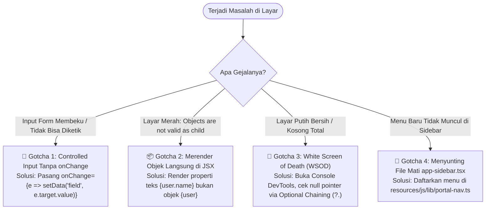

---

#### Gotcha 1: "Input Form Tidak Bisa Diketik / Membeku (*Frozen Input*)"

* **Gejala:** Anda membuka halaman form tambah tiket. Kotak input judul tiket tampak normal. Namun saat Anda mencoba mengetikkan tombol keyboard, kursor tidak bergerak dan tidak ada satu huruf pun yang muncul di layar.
* **Penyebab:** Anda membuat *Controlled Component* dengan menetapkan properti `value`, namun lupa memasang atribut event `onChange`.

```tsx
// ❌ KODE PENYEBAB MASALAH
export function BadFormInput() {
    const { data, setData } = useForm({ title: '' });

    return (
        <div>
            <Label>Judul Gangguan</Label>
            {/* React mengunci isi input ini pada nilai data.title ('').
                Tanpa onChange, setiap kali tuts keyboard ditekan,
                React langsung merender ulang input dengan nilai state lama! */}
            <Input value={data.title} />
        </div>
    );
}
```

* **Solusi Cepat:** Pasang selalu handler `onChange` yang memanggil `setData` untuk memperbarui nilai state:

```tsx
// ✅ KODE SOLUSI
export function GoodFormInput() {
    const { data, setData } = useForm({ title: '' });

    return (
        <div>
            <Label>Judul Gangguan</Label>
            <Input
                value={data.title}
                onChange={(e) => setData('title', e.target.value)}
                placeholder="Ketik judul insiden..."
            />
        </div>
    );
}
```

> [!NOTE]
> **Aturan Emas Input Controlled:**
> Di React, atribut `value` dan handler `onChange` adalah sepasang sahabat karib yang tidak boleh dipisahkan. Jika Anda menetapkan `value`, Anda **wajib** menyertakan `onChange`.

---

#### Gotcha 2: "Error *Objects are not valid as a React child*"

* **Gejala:** Halaman mendadak terhenti dan jendela dialog merah (*Red Error Overlay*) muncul di browser:
  ```
  Uncaught Error: Objects are not valid as a React child (found: object with keys {id, name, slug}).
  If you meant to render a collection of children, use an array instead.
  ```
* **Penyebab:** JSX hanya mengizinkan rendering nilai-nilai primitif (string, number, boolean) atau elemen React lainnya. Error ini muncul saat Anda tidak sengaja meletakkan objek JavaScript/Eloquent utuh di dalam tag JSX.

```tsx
// ❌ KODE PENYEBAB MASALAH
export function BadTicketDetail({ ticket }: { ticket: Ticket }) {
    return (
        <div className="card">
            <h3>{ticket.title}</h3>
            {/* FATAL: ticket.category adalah objek Eloquent { id: 1, name: 'Hardware', slug: 'hardware' }
                JSX tidak tahu cara merender objek JavaScript secara langsung ke teks! */}
            <p>Kategori: {ticket.category}</p>
        </div>
    );
}

// ✅ KODE SOLUSI
export function GoodTicketDetail({ ticket }: { ticket: Ticket }) {
    return (
        <div className="card">
            <h3>{ticket.title}</h3>
            {/* Benar: Akses properti string yang ingin ditampilkan */}
            <p>Kategori: {ticket.category?.name ?? 'Tanpa Kategori'}</p>
            
            {/* Jika ingin merender kumpulan array objek, lakukan iterasi .map(): */}
            <div className="flex gap-1">
                {ticket.tags.map((tag) => (
                    <Badge key={tag.id}>{tag.name}</Badge>
                ))}
            </div>
        </div>
    );
}
```

---

#### Gotcha 3: "Layar Putih Kosong (*White Screen of Death / WSOD*)"

* **Gejala:** Saat berpindah halaman atau me-refresh tab, tampilan layar menjadi putih bersih kosong tanpa elemen visual apa pun (*White Screen of Death*). Di tab Network browser, respons HTTP dari Laravel berstatus **200 OK**.
* **Penyebab:** Terjadi eksepsi JavaScript yang tidak tertangkap (*uncaught exception*) pada saat siklus rendering komponen React. Di Portal Sifast, 90% kasus ini dipicu oleh **Null Pointer Exception** saat mengakses relasi database yang bernilai `null`.

```tsx
// ❌ KODE PENYEBAB MASALAH
export function BadTicketRow({ ticket }: { ticket: Ticket }) {
    // Jika tiket baru dibuat dan belum ditugaskan ke staf IT mana pun,
    // maka properti ticket.assignee bernilai `null` atau `undefined`.
    // Mencoba mengakses .name dari null akan melempar TypeError:
    // "Cannot read properties of null (reading 'name')"
    return (
        <tr>
            <td>#{ticket.ticket_number}</td>
            <td>{ticket.title}</td>
            <td>{ticket.assignee.name}</td> {/* 💥 MELEDAK KETIKA ASSIGNEE NULL! */}
        </tr>
    );
}
```

* **Langkah Diagnosa Cepat:**
  1. Jangan panik! Tekan tombol **F12** (atau **Cmd + Option + I** pada macOS) untuk membuka Chrome/Firefox DevTools.
  2. Buka tab **Console**.
  3. Cari pesan error berwarna merah tebal: `TypeError: Cannot read properties of null (reading 'name')`.
  4. Periksa baris stack trace di sebelah kanan pesan error untuk mengetahui file dan nomor baris persis di mana error tersebut meledak.

```tsx
// ✅ KODE SOLUSI: DEFENSIVE PROGRAMMING DENGAN OPTIONAL CHAINING
export function GoodTicketRow({ ticket }: { ticket: Ticket }) {
    return (
        <tr>
            <td>#{ticket.ticket_number}</td>
            <td>{ticket.title}</td>
            {/* Gunakan Optional Chaining (?.) dan Nullish Coalescing (??) */}
            <td>{ticket.assignee?.name ?? <span className="text-muted-foreground italic">Belum Ditugaskan</span>}</td>
        </tr>
    );
}
```

> [!TIP]
> **Kiat Pro untuk Developer Laravel:**
> Ingatlah bahwa relasi Eloquent opsional (`belongsTo` nullable) selalu datang sebagai `null` di JavaScript jika belum terisi. Selalu gunakan operator `?.` (*optional chaining*) saat menelusuri relasi objek dari backend!

---

#### Gotcha 4: "Menu Navigasi Baru Tidak Muncul di Sidebar (*Editing Dead Component*)"

* **Gejala:** Anda telah selesai membuat modul baru, mendaftarkan controller, rute, dan halaman React. Anda kemudian mengedit file `resources/js/components/app-sidebar.tsx` untuk menambahkan menu navigasi. Namun ketika halaman di-refresh, menu baru tersebut **sama sekali tidak tampil** baik di layar desktop maupun mobile.
* **Penyebab:** Komponen `app-sidebar.tsx` adalah artefak starter kit bawaan yang **tidak pernah dirender** oleh layout aktif SIMRS ([`AppSidebarLayout`](../../resources/js/layouts/app/app-sidebar-layout.tsx)). Layout aktif menggunakan `<TemplateSidebar>` (desktop) dan `<TemplateMobileNav>` (mobile) yang membaca navigasi secara terpusat dari Single Source of Truth: **[`resources/js/lib/portal-nav.ts`](../../resources/js/lib/portal-nav.ts)**.

```tsx
// ❌ KESALAHAN: Menambahkan menu ke komponen mati app-sidebar.tsx
// File: resources/js/components/app-sidebar.tsx (TIDAK PERNAH DIRENDER!)
const mainNavItems: NavItem[] = [
    // ...
    { title: 'Fitur Baru', href: '/fitur-baru', icon: Sparkles },
];
```

```typescript
// ✅ KODE SOLUSI: Daftarkan ke Single Source of Truth
// File: resources/js/lib/portal-nav.ts
export const mainNavItems: PortalNavItem[] = [
    // ...
    {
        id: 'fitur-baru',
        label: 'Fitur Baru',
        href: '/fitur-baru',
        icon: Sparkles,
        isActive: (path) => path === '/fitur-baru' || path.startsWith('/fitur-baru/'),
    },
];
```

> [!WARNING]
> Jangan pernah mengedit `resources/js/components/app-sidebar.tsx`. Berkas tersebut telah ditandai `@deprecated`. Seluruh pendaftaran navigasi wajib dilakukan di [`resources/js/lib/portal-nav.ts`](../../resources/js/lib/portal-nav.ts).

---

### 6.3 Catatan Performa untuk Developer Senior: React 19 Compiler Deep Dive

Salah satu inovasi terbesar dalam stack Portal Sifast adalah adopsi **React 19 Compiler** (sebelumnya dikenal dalam tim riset React dengan nama sandi *React Forget*).

#### 1. Konfigurasi Produksi di Codebase Portal Sifast

Dukungan compiler diaktifkan secara native pada bundler Vite melalui plugin Babel di [`vite.config.ts`](../../vite.config.ts#L14-L18):

```typescript
// Cuplikan dari vite.config.ts:14-18
react({
    babel: {
        plugins: ['babel-plugin-react-compiler'],
    },
}),
```

Serta terdaftar sebagai dev dependency pada [`package.json`](../../package.json#L19):
```json
"babel-plugin-react-compiler": "^1.0.0",
```

#### 2. Bagaimana React 19 Compiler Bekerja Under-the-Hood?

Di era React 16 hingga 18, React mengadopsi model eksekusi yang naif: setiap kali state suatu komponen berubah, React akan mengeksekusi ulang seluruh fungsi komponen tersebut beserta seluruh anak-anaknya (*re-render cascade*).

Untuk mencegah perhitungan komputasi ulang yang boros atau render ulang anak komponen yang tidak perlu, developer terdahulu dipaksa menjadi "manajer memori manual" dengan menulis kode defensif:
* `useMemo`: Mencache hasil komputasi berat antar render.
* `useCallback`: Menjaga identitas referensi fungsi callback agar tidak memicu render ulang child component.
* `React.memo`: Membungkus komponen anak agar tidak di-render jika props tidak berubah.

```
┌────────────────────────────────────────────────────────────────────────┐
│                        ERA REACT 18 VS REACT 19                        │
│                                                                        │
│  [React 18: Manual Mental Burden]                                      │
│  Developer ➔ Tulis useMemo(...) ➔ Salah isi deps ➔ Bug Stale Closure!  │
│  Developer ➔ Tulis useCallback() ➔ Kode kembung berantakan!             │
│                                                                        │
│  [React 19 Compiler di Portal Sifast]                                  │
│  Developer ➔ Tulis kode JavaScript murni biasa yang bersih & ekspresif │
│  Vite Build ➔ Babel Compiler menganalisis AST & alur dependency        │
│  Hasil Akhir ➔ Bytecode ter-memoize otomatis pada level mikro!         │
└────────────────────────────────────────────────────────────────────────┘
```

React 19 Compiler bertindak sebagai compiler pengoptimal statis. Pada saat `vite build` atau HMR dev server berjalan, compiler:
1. Menganalisis *Abstract Syntax Tree* (AST) dari setiap komponen dan custom hook.
2. Memahami batas-batas mutabilitas dan dependensi variabel sesuai aturan resmi React (*Rules of React*).
3. Menyuntikkan blok instruksi caching memori atomik internal (*memoization slots*) secara otomatis di sekeliling ekspresi JSX, nilai terhitung, dan fungsi callback.

#### 3. Dampak Praktis bagi Developer Portal Sifast

Dengan adanya React 19 Compiler di Portal Sifast:
* **Tidak Perlu Lagi `useCallback` untuk Event Handlers Biasa:**
  ```tsx
  // Tidak perlu lagi membungkus fungsi onClick dengan useCallback!
  // Compiler menjamin referensi fungsi stabil di level build.
  const handleToggle = () => setIsOpen(!isOpen);
  ```
* **Tidak Perlu Lagi `useMemo` untuk Filter Array Standar:**
  ```tsx
  // Kode bersih tanpa wrapper useMemo yang melelahkan
  const activeTickets = tickets.filter(t => t.status === 'open');
  ```
* **Bebas dari Bug Klasik "Stale Closures":** Kesalahan paling sering di React 18 (lupa memasukkan variabel ke array dependency `[]`) dieliminasi total karena compiler menganalisis grafik dependensi kode secara deterministik.

#### 4. Kapan Manual `useMemo` / `useCallback` Masih Diperlukan? (The 5% Escape Hatch)

Meskipun 95% komponen di Portal Sifast tidak lagi memerlukan hooks memoization manual, manual `useMemo` tetap diperbolehkan untuk skenario *extreme escape hatch*:
1. **Komputasi Algoritmik Sangat Berat:** Pemrosesan ribuan baris log JSON mentah, parsing format citra medis DICOM di browser, atau transformasi matriks data statistik tahunan rumah sakit yang memakan waktu >16 milidetik pada CPU thread.
2. **Direktif `'use no memo'`:** Jika Anda mengintegrasikan komponen warisan pihak ketiga yang melanggar aturan mutabilitas React sehingga compiler gagal mengoptimalkannya, Anda dapat menyertakan string `'use no memo';` di baris pertama fungsi untuk menonaktifkan compiler khusus pada fungsi tersebut.

---

### 6.4 Toolkit & Trik Debugging Efisien

Ketika antarmuka tidak berjalan sesuai ekspektasi, jangan menebak-nebak (*guessing*). Gunakan tiga toolkit utama berikut untuk mendiagnosa akar masalah secara ilmiah:

#### 1. Inspeksi Payload JSON Inertia via Network Tab Browser

Sebagai arsitektur berbasis XHR, cara tercepat mengetahui mengapa sebuah data tidak muncul di layar adalah memeriksa apa yang sebenarnya dikirimkan oleh backend Laravel ke browser.

```
┌────────────────────────────────────────────────────────────────────────┐
│               ALUR INVESTIGASI BUG DATA: BACKEND ATAU FRONTEND?        │
│                                                                        │
│  Data di layar salah / kosong                                          │
│         │                                                              │
│         ▼                                                              │
│  Buka Browser DevTools ➔ Tab Network ➔ Filter: Fetch/XHR               │
│         │                                                              │
│         ▼                                                              │
│  Klik nama request (misal: "tickets") ➔ Tab Response / Preview         │
│         │                                                              │
│         ├─► Data TIDAK ADA di JSON ➔ Akar masalah di Controller PHP    │
│         │   (Cek query Eloquent, klausa where, atau policy Laravel)    │
│         │                                                              │
│         └─► Data ADA di JSON ➔ Akar masalah di Komponen React          │
│             (Cek nama props destructuring, typo interface, atau render)│
└────────────────────────────────────────────────────────────────────────┘
```

Langkah-langkah praktis:
1. Buka browser dan buka DevTools (**F12**).
2. Pilih tab **Network**, lalu aktifkan tombol filter **Fetch/XHR**.
3. Lakukan interaksi (misal klik filter prioritas atau navigasi halaman).
4. Klik entri request yang muncul pada daftar.
5. Buka tab **Preview** atau **Response**. Anda akan melihat objek JSON resmi Inertia:
   ```json
   {
     "component": "tickets/index",
     "props": {
       "tickets": {
         "data": [
           { "id": 101, "title": "Printer Farmasi Macet", "status": "open" }
         ],
         "total": 1
       },
       "filters": { "search": "farmasi" },
       "auth": { "user": { "id": 12, "name": "Adijaya", "role": "admin" } }
     },
     "url": "/tickets?search=farmasi",
     "version": "b47e2a9"
   }
   ```
6. **Periksa Properti `props`:** Bandingkan nama properti di JSON ini dengan nama variabel yang Anda destructuring di komponen React (`export default function TicketsIndex({ tickets, filters }: Props)`). Kesalahan huruf besar/kecil (*case-sensitivity*) atau typo langsung terungkap dalam hitungan detik!

---

#### 2. React Developer Tools Extension

Instal ekstensi resmi **React Developer Tools** pada browser pengembangan Anda (tersedia gratis di Chrome Web Store dan Firefox Add-ons).

Ekstensi ini menambahkan dua tab baru di DevTools:
* **Tab Components:**
  * Menampilkan pohon hierarki komponen React persis seperti struktur HTML di DOM inspector.
  * Anda dapat mengklik komponen apa pun (misal `<TicketsTable />`) untuk melihat state lokal yang sedang aktif, props yang diterima dari induknya, serta hook `useForm` yang sedang mengelola data.
  * Dilengkapi tombol pencarian komponen berdasarkan nama komponen atau hook.
* **Tab Profiler:**
  * Merekam aktivitas rendering komponen saat pengguna berinteraksi.
  * Menampilkan visual diagram batang (*flamegraph*) berwarna yang menunjukkan komponen mana yang memakan waktu render paling lama, memudahkan Anda menemukan komponen yang membutuhkan optimasi.

---

#### 3. Shortcut CLI Esensial untuk Verifikasi Kualitas Harian

Sebelum Anda membuat commit Git atau membuka Pull Request, biasakan menjalankan tiga perintah pemeriksa kualitas di terminal:

```bash
# 1. Pemeriksaan Keamanan Tipe TypeScript (Zero Overhead)
npm run types

# 2. Linter & Formatting Otomatis Sesuai Standar Kode Sifast
npm run lint

# 3. Uji Coba Kompilasi Produksi Penuh
npm run build
```

Mari kita bedah fungsi dan peranan masing-masing script:

| Perintah NPM | Target Eksekusi | Kapan Wajib Dijalankan? | Manfaat Bagi Developer |
| :--- | :--- | :--- | :--- |
| `npm run types` | `tsc --noEmit` | **Setiap kali selesai mengubah kode** (1-2 detik) | Memindai seluruh berkas `.ts` dan `.tsx` di proyek. Memastikan tidak ada properti bertipe salah, parameter fungsi hilang, atau akses objek null yang lolos tanpa build penuh. |
| `npm run lint` | `eslint . --fix` | **Sebelum staging Git (`git add`)** | Memeriksa kepatuhan aturan React hooks (*Rules of Hooks*), mengurutkan impor modul, dan membersihkan variabel tidak terpakai secara otomatis. |
| `npm run build` | `vite build` | **Sebelum melakukan `git push` ke repositori** | Memastikan React 19 Compiler, Tailwind CSS v4, dan plugin Wayfinder berhasil mengompilasi bundel produksi tanpa kegagalan sintaks. |

Serta dua perintah Artisan pendamping dari sisi backend:
```bash
# Mengecek seluruh rute yang terdaftar beserta nama controller-nya
php artisan route:list --path=tickets

# Memperbarui modul helper Wayfinder jika Anda baru menambah rute di routes/web.php
php artisan wayfinder:generate
```

---

### 6.5 Bagian Penutup & Navigasi Silang Dokumen

Selamat! Anda telah menyelesaikan seluruh rangkaian **Modul 02b: Panduan Frontend React 19 & Inertia.js v2 untuk Developer Laravel**.

Dengan menuntaskan 6 bab panduan ini, Anda kini memiliki fondasi yang kokoh mengenai:
1. Cara berpikir deklaratif berbasis state (*UI = f(state)*).
2. Alur data controller ke props React tanpa API terpisah.
3. Manajemen formulir berskala besar dengan `useForm` dan modal interaktif aksesibel Radix UI.
4. Tata kelola desain terpadu dengan Tailwind CSS v4 dan arsitektur tema rumah sakit.
5. Penyiaran peristiwa real-time via WebSocket Reverb dan proteksi memory leak.
6. Teknik debugging ilmiah dan pemanfaatan React 19 Compiler.

#### Peta Rujukan Silang Antar-Modul Onboarding

Lanjutkan perjalanan onboarding Anda dengan mempelajari modul-modul sistem pendukung lainnya:

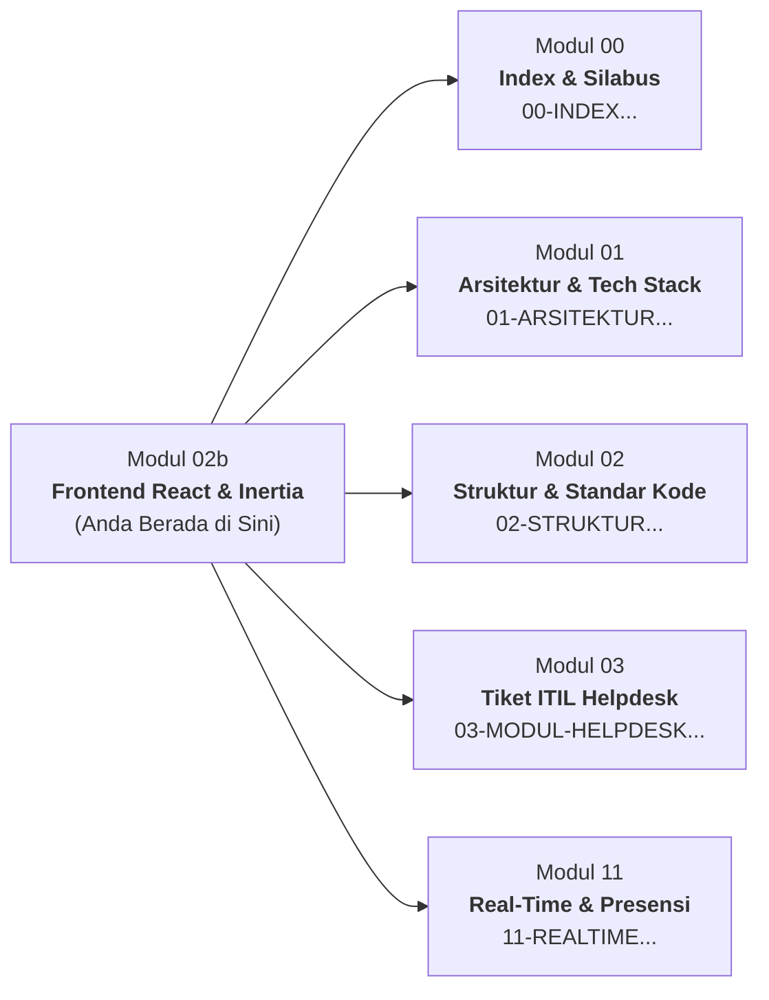

* 🧭 **[`00-INDEX-DAN-PANDUAN-MEMBACA.md`](./00-INDEX-DAN-PANDUAN-MEMBACA.md):** Peta silabus lengkap 12 modul orientasi developer dan panduan alur membaca sesuai tingkatan pengalaman Anda.
* 🏛️ **[`01-ARSITEKTUR-DAN-TECH-STACK.md`](./01-ARSITEKTUR-DAN-TECH-STACK.md):** Gambaran makro arsitektur sistem monolit modern Portal Sifast, konfigurasi Docker container, PostgreSQL, Redis, dan server Linux.
* 📐 **[`02-STRUKTUR-PROJECT-DAN-STANDAR-KODE.md`](./02-STRUKTUR-PROJECT-DAN-STANDAR-KODE.md):** Konvensi tata letak direktori, aturan penamaan berkas komponen, standar PHP PSR-12, dan integrasi Laravel Wayfinder.
* 🎫 **[`03-MODUL-HELPDESK-ITIL-TICKETING.md`](./03-MODUL-HELPDESK-ITIL-TICKETING.md):** Spesifikasi fungsional dan model bisnis modul tiket insiden TI/IPS rumah sakit (alur SLA, eskalasi, dan histori penanganan).
* ⚡ **[`11-REALTIME-WEBSOCKET-DAN-PRESENSI.md`](./11-REALTIME-WEBSOCKET-DAN-PRESENSI.md):** Arsitektur backend siaran Reverb, konfigurasi supervisor server produksi, serta integrasi tombol panik IGD (*Panic Button*).

#### Checklist Akhir Kesiapan Developer Baru di Portal Sifast

Sebagai pegangan praktis dalam pekerjaan sehari-hari Anda di RS Aisyiyah Siti Fatimah Tulangan, ingatlah **6 Prinsip Emas Frontend Sifast**:

1. **State-Driven, Never DOM-Driven:** Jangan pernah mencari atau mengubah elemen DOM secara langsung. Ubah state, biarkan React yang merender.
2. **Type-Safe Routing:** Selalu gunakan helper fungsi dari `@/routes/...` (Wayfinder), hindari penulisan string URL manual.
3. **Inertia Over REST API:** Jangan membuat controller API terpisah jika hanya untuk menyajikan data halaman. Gunakan `Inertia::render()`.
4. **Defensive Against Nulls:** Selalu gunakan optional chaining (`?.`) saat mengakses relasi data yang nullable.
5. **Always Clean Up Listeners:** Kembalikan fungsi pembersih `leaveChannel()` pada hook WebSocket untuk mencegah memory leak.
6. **Verify Before Commit:** Jalankan `npm run types` dan `npm run lint` sebelum setiap commit Git untuk menjaga basis kode tetap bersih dan handal.
