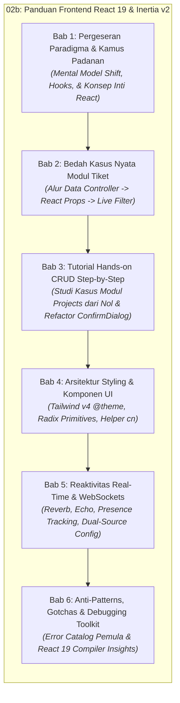
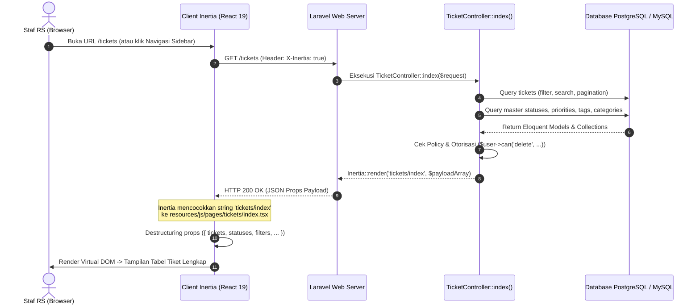
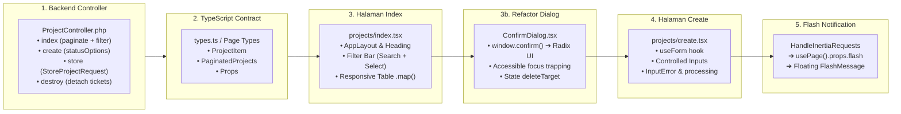
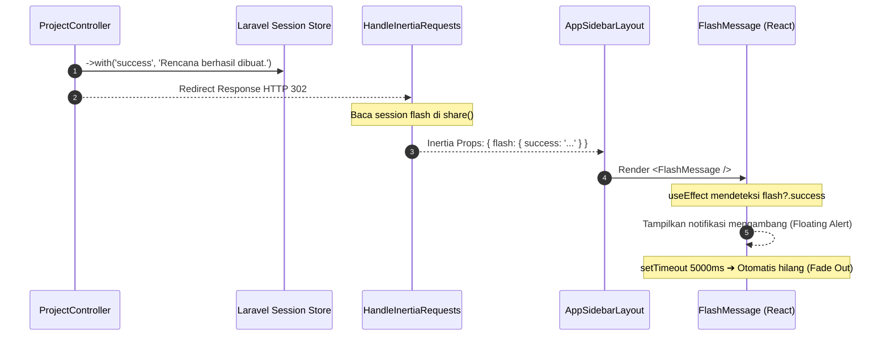

# ⚛️ Modul 02b: Panduan Frontend React 19 & Inertia.js v2 untuk Developer Laravel (Transisi dari Blade & jQuery)

Dokumen ini merupakan panduan komprehensif bagi developer Laravel di lingkungan RS Aisyiyah Siti Fatimah Tulangan (Sifast) untuk memahami dan menguasai arsitektur frontend modern berbasis **React 19**, **Inertia.js v2**, **TypeScript**, **Tailwind CSS v4**, **Radix UI Primitives**, dan **Laravel Wayfinder**.

Modul ini dirancang khusus untuk menjembatani pergeseran paradigma dari pola monolitik tradisional (Blade templates, jQuery `$('#id')`, manual AJAX, dan routing Ziggy `route()`) menuju arsitektur modern berbasis state reaktif yang cepat, terstruktur, dan type-safe.

---

## Metadata & Target Pembaca

| Entitas | Rincian |
| :--- | :--- |
| **Kode Dokumen** | `MOD-02B-FE-REACT-INERTIA` |
| **Versi Dokumen** | 1.2.0 (Tahap Fondasi, Bab 1, Bab 2, & Bab 3 Tutorial Hands-on CRUD Lengkap) |
| **Status Dokumen** | Produksi Aktif / Terverifikasi |
| **Tanggal Pembaruan** | 2026-09-03 |
| **Tech Stack Utama** | React 19, Inertia.js v2, TypeScript 5+, Tailwind CSS v4, Radix UI Primitives, Laravel Wayfinder |
| **Target Pembaca** | **Junior Developer** (memerlukan analogi intuitif, panduan langkah-demi-langkah, dan solusi gotchas)<br/>**Senior Developer** (memerlukan matriks padanan cepat, arsitektur under-the-hood, dan rationale desain) |
| **Kaitan Modul Terkait** | [`00-INDEX-DAN-PANDUAN-MEMBACA.md`](./00-INDEX-DAN-PANDUAN-MEMBACA.md)<br/>[`01-ARSITEKTUR-DAN-TECH-STACK.md`](./01-ARSITEKTUR-DAN-TECH-STACK.md)<br/>[`02-STRUKTUR-PROJECT-DAN-STANDAR-KODE.md`](./02-STRUKTUR-PROJECT-DAN-STANDAR-KODE.md)<br/>[`11-REALTIME-WEBSOCKET-DAN-PRESENSI.md`](./11-REALTIME-WEBSOCKET-DAN-PRESENSI.md) |

---

## 🧭 Filosofi Desain Dual-Audience ("Skim or Deep Dive")

Untuk melayani pengembang dengan latar belakang pengalaman yang beragam, seluruh modul ini mengadopsi prinsip **Dual-Layer Information Architecture**:


* **Bagi Developer Senior (Fast-Track / Skim-Friendly):**
  * Di setiap bab disediakan **TL;DR Matrix** berisi komparasi sintaks langsung. Anda dapat membaca tabel dalam 1-2 menit dan langsung mengetahui padanan fitur tanpa membaca narasi panjang.
  * Dilengkapi callout **"Under the Hood & Architectural Rationale"**: Mengapa Wayfinder menggantikan Ziggy, bagaimana protokol `X-Inertia` menangani partial reloads dan browser history, serta mengapa React 19 Compiler mengotomatisasi memoization tanpa manual `useMemo`.
* **Bagi Developer Junior (Guided / Intuitive-Friendly):**
  * Disertai **analogi dunia nyata** yang menjembatani kebiasaan lama di Blade dan jQuery.
  * **Diagram alur visual (Mermaid)** untuk memahami siklus request-response dan perpindahan state.
  * Anotasi kode yang jelas pada studi kasus nyata di repositori Sifast.
  * Bagian khusus **"Gotchas & Jebakan Pemula"** yang merinci pesan error umum (seperti *"Objects are not valid as a React child"*, input form membeku, atau layar putih kosong) beserta solusinya.

---

## 🗺️ Peta Alur Modul (Roadmap 6 Bab)

Modul ini tersusun ke dalam 6 bab bertahap yang membimbing Anda dari pemahaman mental model hingga debugging tingkat lanjut:



---

## Bab 1: Pergeseran Paradigma & Kamus Padanan (Blade/jQuery vs React 19/Inertia v2)

Perbedaan terbesar antara pengembangan Laravel Blade konvensional dan React/Inertia terletak pada **siapa yang bertanggung jawab merender HTML dan mengelola state**:
1. **Dunia Blade & jQuery:** Server membuat HTML secara lengkap pada setiap request. Jika ada perubahan dinamis di browser, jQuery mencari elemen DOM menggunakan selector (`$('#id')`), lalu memanipulasi teks, class, atau atribut secara imperatif (*Imperative DOM-Driven*).
2. **Dunia React & Inertia:** Server hanya mengirimkan data mentah (JSON props), sedangkan browser merender UI menggunakan komponen React. Tampilan antarmuka adalah representasi langsung dari data state saat ini (*Declarative State-Driven*):
   $$\text{UI} = f(\text{state})$$
   Anda tidak pernah menyentuh DOM secara langsung. Anda hanya mengubah state, dan React secara otomatis memperbarui bagian DOM yang terdampak.

---

### 1.1 TL;DR Matrix Padanan Cepat (Bagi Senior)

Tabel berikut merangkum padanan langsung fitur-fitur yang biasa Anda gunakan di Blade dan jQuery dengan padanannya di React 19 dan Inertia.js v2 di Portal Sifast:

| Fitur / Kebutuhan | Pola Lama (Blade & jQuery) | Pola Modern (React 19 & Inertia v2 di Sifast) | Keterangan & Prinsip Desain |
| :--- | :--- | :--- | :--- |
| **Kondisional Render** | `@if($isAdmin)`<br/>`  <span>Admin</span>`<br/>`@else`<br/>`  <span>Staff</span>`<br/>`@endif` | `{isAdmin ? (`<br/>`  <span>Admin</span>`<br/>`) : (`<br/>`  <span>Staff</span>`<br/>`)}`<br/><br/>*Atau jika tanpa else:*<br/>`{isAdmin && <span>Admin</span>}` | Ekspresi JavaScript murni di dalam kurung kurawal `{}` JSX. Hindari ternary bersarang yang terlalu dalam. |
| **Perulangan Daftar** | `@foreach($tickets as $item)`<br/>`  <div>{{ $item->title }}</div>`<br/>`@endforeach` | `{tickets.map((item) => (`<br/>`  <div key={item.id}>{item.title}</div>`<br/>`))}` | Wajib menyertakan atribut `key={item.id}` unik pada elemen terluar untuk efisiensi diffing Virtual DOM. |
| **Proteksi CSRF Form** | `<form method="POST">`<br/>`  @csrf`<br/>`  ...`<br/>`</form>` | *Otomatis (Zero Config)*<br/>Inertia & Axios membaca cookie `XSRF-TOKEN` dan menyertakannya di header HTTP `X-XSRF-TOKEN`. | Tidak perlu tag `<input type="hidden" name="_token">` manual di form React. |
| **Membaca Nilai Input** | `const val = $('#title').val();` | `const { data } = useForm({ title: '' });`<br/>`console.log(data.title);` | Komponen terkontrol (*Controlled Component*). Nilai input selalu dicerminkan oleh state. |
| **Mengubah Nilai Input** | `$('#title').val('Komputer Rusak');` | `setData('title', 'Komputer Rusak');` | Mengubah state memicu sinkronisasi otomatis ke atribut `value` input HTML. |
| **Memperbarui Konten DOM** | `$('#status-badge').html('`<span class="badge">Selesai</span>`');` | `const [status, setStatus] = useState('open');`<br/>`...`<br/>`<Badge>{status}</Badge>` | UI dideklarasikan sekali. Tampilan berubah reaktif saat `setStatus('closed')` dipanggil. |
| **Menampilkan Validasi Error** | `@error('title')`<br/>`  <span class="text-red-500">{{ $message }}</span>`<br/>`@enderror` | `<InputError message={errors.title} />`<br/>*(dari hook `useForm` Inertia)* | Validasi server dari `FormRequest` Laravel dipetakan langsung ke objek `errors`. |
| **URL Routing Helper** | `route('tickets.show', $ticket->id)` *(Ziggy global)* | `import { show } from '@/routes/tickets';`<br/>`<Link href={show(ticket.id).url}>Detail</Link>` | **Laravel Wayfinder**: Route helper modular, type-safe saat kompilasi TypeScript, dan tree-shakeable. |
| **Navigasi Antar Halaman** | `<a href="/tickets" class="btn">Daftar Tiket</a>` | `import { Link } from '@inertiajs/react';`<br/>`<Link href="/tickets" className="btn">Daftar Tiket</Link>` | `<Link>` mencegat klik browser untuk melakukan request XHR tanpa reload penuh (*Single Page Application*). |
| **Flash Session Message** | `@if(session('success'))`<br/>`  <div class="alert">{{ session('success') }}</div>`<br/>`@endif` | `const { flash } = usePage().props;`<br/>`{flash.success && <Alert>{flash.success}</Alert>}` | Shared props dari middleware `HandleInertiaRequests` dapat diakses di mana saja via `usePage()`. |
| **Autentikasi User** | `Auth::user()->name`<br/>`@auth ... @endauth` | `const { auth } = usePage().props;`<br/>`<span>{auth.user.name}</span>` | Data user login tersedia secara global di seluruh komponen halaman React. |

> [!TIP]
> **Mental Model Shift untuk Developer Senior:**
> Lupakan siklus *"Cari elemen di DOM lalu ubah propertinya"* ala jQuery. Dalam React, Anda tidak pernah memerintahkan browser untuk *"menambahkan class `hidden` ke tombol A"* atau *"mengganti teks elemen `#total`"*. Sebaliknya, tentukan kondisi data:
> ```tsx
> const [isLoading, setIsLoading] = useState(false);
> // Tampilan secara deklaratif merespon isLoading:
> <Button disabled={isLoading}>
>   {isLoading ? 'Menyimpan...' : 'Simpan Tiket'}
> </Button>
> ```
> Saat `setIsLoading(true)` dipanggil, React mengevaluasi ulang JSX dan memperbarui DOM secara presisi dan efisien.

---

### 1.2 Arsitektur Single Blade Shell (`resources/views/app.blade.php`)

Salah satu kejutan terbesar bagi pengembang Laravel yang baru berpindah ke Inertia adalah: **Mengapa folder `resources/views/` hampir kosong?**

Di Portal Sifast, seluruh antarmuka web dilayani oleh satu-satunya file Blade induk: [`resources/views/app.blade.php`](../../resources/views/app.blade.php).

#### 1. Bedah Anatomi `app.blade.php`

Berikut adalah struktur lengkap file shell induk di Portal Sifast:

```blade
<!DOCTYPE html>
<html lang="{{ str_replace('_', '-', app()->getLocale()) }}" @class(['dark' => ($appearance ?? 'system') == 'dark'])>
    <head>
        <meta charset="utf-8">
        <meta name="viewport" content="width=device-width, initial-scale=1">

        {{-- Deteksi preferensi dark mode sistem sebelum render utama agar tidak berkedip (FOUC) --}}
        <script>
            (function() {
                const appearance = '{{ $appearance ?? "system" }}';
                if (appearance === 'system') {
                    const prefersDark = window.matchMedia('(prefers-color-scheme: dark)').matches;
                    if (prefersDark) {
                        document.documentElement.classList.add('dark');
                    }
                }
            })();
        </script>

        {{-- Style inline untuk background dasar agar seirama dengan tema --}}
        <style>
            html { background: #F8FAFC; }
            html.dark { background: #0F172A; }
        </style>

        <title inertia>{{ config('app.name', 'Laravel') }}</title>

        <meta name="mobile-web-app-capable" content="yes">
        <meta name="apple-mobile-web-app-capable" content="yes">
        <meta name="apple-mobile-web-app-status-bar-style" content="default">

        <link rel="icon" href="/favicon.ico" sizes="any">
        <link rel="icon" href="/favicon.svg" type="image/svg+xml">
        <link rel="apple-touch-icon" href="/apple-touch-icon.png">

        {{-- Tipografi Inter Utama --}}
        <link rel="preconnect" href="https://fonts.googleapis.com">
        <link rel="preconnect" href="https://fonts.gstatic.com" crossorigin>
        <link href="https://fonts.googleapis.com/css2?family=Inter:wght@100;200;300;400;500;600;700;800&display=swap" rel="stylesheet">

        {{-- Konfigurasi Reverb/WebSocket dari Backend --}}
        @if(config('broadcasting.default') === 'reverb')
        @php
            $reverbHost = config('broadcasting.connections.reverb.options.client_host')
                ?? request()->getHost();
            $reverbHost = str_contains($reverbHost, ':') ? explode(':', $reverbHost)[0] : $reverbHost;

            $reverbPort = config('broadcasting.connections.reverb.options.client_port')
                ?? (int) config('broadcasting.connections.reverb.options.port', 8080);

            $reverbScheme = config('broadcasting.connections.reverb.options.client_scheme')
                ?? (config('broadcasting.connections.reverb.options.scheme') ?? 'http');

            if (request()->secure()) {
                $reverbScheme = 'https';
            }

            $reverbConfig = [
                'key' => config('broadcasting.connections.reverb.key'),
                'host' => $reverbHost,
                'port' => (int) $reverbPort,
                'scheme' => $reverbScheme,
            ];
        @endphp
        <script>
            window.REVERB_CONFIG = @json($reverbConfig);
        </script>
        @else
        <script>window.REVERB_CONFIG = null;</script>
        @endif

        @viteReactRefresh
        @vite(['resources/css/app.css', 'resources/js/app.tsx'])
        @inertiaHead
    </head>
    <body class="font-sans antialiased">
        @inertia
    </body>
</html>
```

#### 2. Peran Direktif `@inertiaHead` dan `@inertia`

* **`@inertiaHead`:** Direktif ini bertindak sebagai gerbang dinamis untuk elemen `<head>`. Ketika halaman React menentukan judul via komponen `<Head title="Daftar Tiket ITIL" />`, Inertia menyinkronkan tag `<title>` dan `<meta>` browser tanpa memerlukan full page reload.
* **`@inertia`:** Direktif ini merender sebuah elemen penampung root di dalam `<body>`:
  ```html
  <div id="app" data-page="{&quot;component&quot;:&quot;tickets/index&quot;,&quot;props&quot;:{...},&quot;url&quot;:&quot;/tickets&quot;,&quot;version&quot;:&quot;...&quot;}"></div>
  ```
  Elemen ini memuat seluruh payload JSON awal yang disiapkan oleh controller Laravel.

#### 3. Titik Temu di Client: [`resources/js/app.tsx`](../../resources/js/app.tsx)

Di sisi frontend, React 19 mengambil alih elemen `#app` melalui inisialisasi Inertia:

```tsx
// Cuplikan dari resources/js/app.tsx
createInertiaApp({
    title: (title) => (title ? `${title} - ${appName}` : appName),
    resolve: (name) =>
        resolvePageComponent(
            `./pages/${name}.tsx`,
            import.meta.glob('./pages/**/*.tsx'),
        ),
    setup({ el, App, props }) {
        const root = createRoot(el);

        root.render(
            <StrictMode>
                <App {...props} />
            </StrictMode>,
        );
    },
    progress: {
        color: '#0A9E8F', // Warna teal khas identitas RS Siti Fatimah
    },
});
```

`resolvePageComponent` secara dinamis mencocokkan string nama komponen yang dikirim dari controller Laravel (misal: `Inertia::render('tickets/index')`) dengan berkas fisik di `resources/js/pages/tickets/index.tsx`.

#### 4. Mengapa Portal Sifast Murni CSR dan Tanpa SSR?

Portal Sifast memilih arsitektur **Client-Side Rendered (CSR)** murni tanpa Server-Side Rendering (SSR) berbasis pertimbangan arsitektur dan operasional nyata rumah sakit:

1. **Latensi Intranet Rumah Sakit yang Sangat Rendah:** Seluruh unit kerja (IGD, Rawat Inap, Farmasi, Radiologi, IT) mengakses portal melalui jaringan intranet lokal (LAN/WLAN) atau VPN dedicated dengan latensi `< 5ms`.
2. **Tanpa Kebutuhan SEO Publik:** Portal Sifast adalah sistem internal rumah sakit yang berada di balik gerbang otentikasi (2FA Fortify & role permissions). Tidak ada mesin pencari publik (Googlebot) yang perlu mengindeks data operasional tiket, aset, atau rekam medis internal.
3. **Penyederhanaan Infrastruktur & Keandalan Operasional:** Mengaktifkan SSR mengharuskan tim IT mengelola daemon runtime Node.js tambahan di server produksi di samping PHP-FPM dan Nginx. Tanpa SSR, container deployment menjadi sangat ramping, deterministik, dan minim titik kegagalan (*single point of failure*).
4. **Efisiensi Caching Browser Karyawan:** Bundle JavaScript dan CSS dikompilasi oleh Vite dengan *content-hashing*. Setelah browser staf mengunduh bundle sekali di awal shift kerja, navigasi antar ratusan modul rumah sakit berlangsung instan karena hanya mentransfer payload JSON ringan.

---

### 1.3 Anatomi & Intuisi React Hooks (Bagi Junior)

Bagi pengembang yang terbiasa menulis kode PHP prosedural atau script jQuery linier, konsep *React Hooks* seringkali terasa membingungkan di awal.

> [!NOTE]
> **Analogi "Colokan Listrik":**
> Bayangkan komponen React Anda (`function TicketCard()`) adalah sebuah ruangan kosong tanpa listrik. Fungsi tersebut dieksekusi dari baris pertama hingga terakhir setiap kali komponen ditampilkan, lalu selesai.
> 
> **React Hooks (`use...`)** adalah colokan listrik (*plug & socket*) di dinding ruangan tersebut. Melalui kabel colokan ini, komponen Anda dapat terhubung ke fasilitas internal browser dan React engine:
> * Ingin punya memori ingatan yang tidak hilang saat ruangan dibersihkan? Tancapkan colokan `useState`.
> * Ingin menyalakan lampu saat staf memasuki ruangan dan mematikannya saat staf keluar? Tancapkan colokan `useEffect`.
> * Ingin mengirim formulir tiket tanpa reload halaman? Tancapkan colokan `useForm`.
> * Ingin mengetahui siapa staf yang sedang login saat ini? Tancapkan colokan `usePage`.

```
┌─────────────────────────────────────────────────────────────┐
│                    Komponen React (Fungsi)                  │
│                                                             │
│   useState ───🔌───> [Mesin State Reaktif React]            │
│   useEffect ──🔌───> [Siklus Hidup Browser & Cleanup]       │
│   useForm ────🔌───> [Manajemen Input & Validasi Inertia]   │
│   usePage ────🔌───> [Shared Props Global dari Laravel]     │
│                                                             │
│   Return: JSX Tampilan Deklaratif                           │
└─────────────────────────────────────────────────────────────┘
```

Berikut adalah hook-hook esensial yang digunakan setiap hari di Portal Sifast:

#### 1. `useState`: State Reaktif vs Variabel Biasa

Di jQuery, Anda menyimpan data sementara di atribut HTML (`<div data-id="10">`) atau variabel global `let counter = 0;`. Namun di React, mengubah variabel biasa **tidak akan memicu pembaruan layar**.

```tsx
import { useState } from 'react';

export function CounterTiket() {
    // ❌ SALAH: Mengubah variabel biasa tidak meng-update tampilan
    // let hitungan = 0;
    // const tambah = () => { hitungan++; };

    // ✅ BENAR: Gunakan useState
    // [nilai_saat_ini, fungsi_pengubah] = useState(nilai_awal);
    const [hitungan, setHitungan] = useState<number>(0);

    return (
        <div className="p-4 border rounded-lg">
            <p>Total Tiket Disetujui: <strong className="text-teal-600">{hitungan}</strong></p>
            <button 
                onClick={() => setHitungan(hitungan + 1)}
                className="px-3 py-1.5 bg-teal-600 text-white rounded hover:bg-teal-700"
            >
                Tambah Tiket
            </button>
        </div>
    );
}
```

Setiap kali `setHitungan` dipanggil dengan nilai baru, React secara otomatis memanggil ulang fungsi komponen dan memperbarui angka di layar secara instan.

#### 2. `useEffect`: Pengganti `$(document).ready()` dan Manajemen Siklus Hidup

Dalam jQuery, kita menulis:
```javascript
$(document).ready(function() {
    console.log('Halaman selesai dimuat!');
    const timer = setInterval(fetchUpdate, 5000);
});
```

Di React, operasi efek samping (*side effects*) seperti inisialisasi library pihak ketiga, timer interval, atau listener browser ditangani oleh `useEffect`:

```tsx
import { useEffect, useState } from 'react';

export function RealtimeClock() {
    const [waktu, setWaktu] = useState<string>(new Date().toLocaleTimeString());

    useEffect(() => {
        // 1. Eksekusi saat komponen pertama kali terpasang ke layar (Mount)
        console.log('Jam dinding dipasang ke layar');
        
        const timerId = setInterval(() => {
            setWaktu(new Date().toLocaleTimeString());
        }, 1000);

        // 2. Fungsi Pembersihan (Cleanup Function)
        // Wajib ada untuk mencegah memory leak saat user berpindah halaman!
        return () => {
            console.log('Komponen dilepas dari layar, menghentikan timer');
            clearInterval(timerId);
        };
    }, []); // <-- Dependency array kosong [] artinya hanya berjalan sekali saat mount

    return <span>Waktu Operasional: {waktu}</span>;
}
```

> [!WARNING]
> **Pentingnya Cleanup Function:**
> Jika Anda memasang event listener (`window.addEventListener`), timer (`setInterval`), atau koneksi WebSocket tanpa mengembalikan fungsi pembersih (`return () => ...`), proses tersebut akan terus berjalan di latar belakang meskipun user sudah berpindah halaman. Hal ini akan menyebabkan kebocoran memori (*memory leak*) yang memperlambat browser staf rumah sakit.

#### 3. `useForm` (Inertia.js): Manajemen Form Otomatis

Hook `useForm` dari `@inertiajs/react` adalah tulang punggung seluruh formulir transaksi di Portal Sifast (tiket ITIL, mutasi aset, penilaian mutu, dan presensi).

```tsx
import { useForm } from '@inertiajs/react';
import { FormEventHandler } from 'react';

export function FormBuatTiket() {
    // Inisialisasi useForm dengan field dan nilai awal
    const { data, setData, post, processing, errors, reset } = useForm({
        judul: '',
        deskripsi: '',
        prioritas: 'medium',
    });

    const handleSubmit: FormEventHandler = (e) => {
        e.preventDefault(); // Mencegah reload halaman standar browser
        
        post('/tickets', {
            onSuccess: () => {
                reset(); // Bersihkan form jika server memvalidasi sukses
                alert('Tiket berhasil dibuat!');
            },
        });
    };

    return (
        <form onSubmit={handleSubmit} className="space-y-4 max-w-md">
            <div>
                <label className="block text-sm font-medium">Judul Gangguan</label>
                <input
                    type="text"
                    value={data.judul}
                    onChange={(e) => setData('judul', e.target.value)}
                    className="w-full border p-2 rounded"
                    placeholder="Contoh: Printer IGD macet"
                />
                {/* Tampilkan error validasi Laravel secara otomatis */}
                {errors.judul && (
                    <p className="text-sm text-red-600 mt-1">{errors.judul}</p>
                )}
            </div>

            <button
                type="submit"
                disabled={processing} // Otomatis mencegah double-submit saat loading
                className="bg-teal-600 text-white px-4 py-2 rounded disabled:opacity-50"
            >
                {processing ? 'Menyimpan ke Server...' : 'Kirim Tiket'}
            </button>
        </form>
    );
}
```

Keunggulan utama `useForm`:
* Menangani state input ganda secara otomatis melalui helper `setData`.
* Melacak properti boolean `processing` untuk menonaktifkan tombol submit secara otomatis saat request sedang berjalan.
* Menerima payload error validasi HTTP 422 dari Laravel `FormRequest` dan memetakannya langsung ke objek `errors`.

#### 4. `usePage` (Inertia.js): Akses Global Shared Props

Di Blade, Anda dapat memanggil `Auth::user()` atau `session('status')` di sembarang view. Di React, data global tersebut disalurkan oleh backend via middleware `HandleInertiaRequests` dan dapat diakses dari komponen mana pun menggunakan `usePage()`:

```tsx
import { usePage } from '@inertiajs/react';

type SharedAuthProps = {
    auth: {
        user: {
            id: number;
            name: string;
            email: string;
            role: string;
        };
    };
    flash: {
        success?: string;
        error?: string;
    };
};

export function UserBadgeHeader() {
    // Akses langsung data auth dan flash tanpa perlu mengoper props dari parent
    const { auth, flash } = usePage<SharedAuthProps>().props;

    return (
        <header className="flex justify-between items-center p-4 bg-white border-b">
            <div>
                <h1 className="font-semibold text-gray-800">Portal RS Siti Fatimah</h1>
                {flash.success && (
                    <span className="text-xs bg-emerald-100 text-emerald-800 px-2 py-0.5 rounded">
                        {flash.success}
                    </span>
                )}
            </div>
            <div className="text-sm text-gray-600">
                Login sebagai: <strong className="text-gray-900">{auth.user.name}</strong> ({auth.user.role})
            </div>
        </header>
    );
}
```

#### 5. Custom Hooks Unggulan Portal Sifast

Selain hooks bawaan React dan Inertia, Portal Sifast menyediakan serangkaian custom hooks yang dapat langsung digunakan dalam pengembangan fitur:

1. **`useEcho` (via `@laravel/echo-react`):**
   Hook reaktif untuk berlangganan channel dan event WebSocket Reverb.
2. **`useUserPresence` ([`resources/js/hooks/use-user-presence.ts`](../../resources/js/hooks/use-user-presence.ts)):**
   Melacak daftar dokter dan staf rumah sakit yang sedang aktif secara online melalui presence channel `presence.users`.
3. **`useAppearance` ([`resources/js/hooks/use-appearance.tsx`](../../resources/js/hooks/use-appearance.tsx)):**
   Mengatur tema antarmuka (*System*, *Light*, *Dark*), menyinkronkan status cookie server, serta menambahkan class `.dark` pada tag `<html>`.
4. **`useWebSocketStatus` ([`resources/js/hooks/use-websocket-status.ts`](../../resources/js/hooks/use-websocket-status.ts)):**
   Menyediakan indikator status koneksi socket real-time (*connecting*, *connected*, *disconnected*, *unavailable*) untuk status bar sistem.

---

### 1.4 Konsep Inti React yang Wajib Dikuasai

Sebelum membangun halaman interaktif, pastikan Anda memahami 7 pilar fundamental React dan TypeScript berikut:

#### 1. Aturan Sintaks JSX / TSX
JSX adalah sintaks perluasan JavaScript yang menyerupai HTML namun berjalan sepenuhnya di bawah aturan JavaScript:
* **`className` alih-alih `class`:** Karena kata `class` adalah kata kunci bawaan JavaScript (*reserved keyword*).
* **`htmlFor` alih-alih `for`:** Digunakan pada elemen `<label htmlFor="nik">`.
* **Wajib Self-Closing:** Tag tanpa penutup wajib diakhiri dengan garis miring penutup (`<input />`, ``, `<hr />`, `<br />`). Lupa menambahkan `/` akan menyebabkan error kompilasi Vite.
* **Root Tunggal atau Fragment (`<> ... </>`):** Sebuah komponen harus mengembalikan satu elemen induk. Gunakan *React Fragment* `<> ... </>` jika Anda tidak ingin menambahkan tag pembungkus `<div>` yang tidak perlu ke DOM:
  ```tsx
  return (
      <>
          <Header />
          <MainContent />
          <Footer />
      </>
  );
  ```

#### 2. Komponen & Props (Sifat Read-Only / Immutability)
Props adalah argumen yang dikirim dari komponen induk ke komponen anak. **Props bersifat Read-Only (Immutable) dan dilarang keras dimutasi secara langsung.**

```tsx
type Props = {
    nomorTiket: string;
    status: 'open' | 'closed';
};

export function BadgeTiket({ nomorTiket, status }: Props) {
    // ❌ DILARANG KERAS: Mutasi props langsung
    // status = 'closed';

    return (
        <span className={status === 'open' ? 'text-amber-600' : 'text-emerald-600'}>
            #{nomorTiket} ({status.toUpperCase()})
        </span>
    );
}
```

React mengandalkan perbandingan referensi memori (*shallow comparison*) untuk mendeteksi perubahan data. Memodifikasi props secara langsung akan merusak algoritma deteksi render React.

#### 3. Controlled vs Uncontrolled Components (Misteri Input "Membeku")
Salah satu error paling sering dialami developer yang beralih dari Blade/jQuery adalah **input teks yang membeku (tidak bisa diketik sama sekali)**:

```tsx
// ⚠️ KASUS JEBAKAN: Input tidak bisa diketik
export function BrokenInput() {
    const [judul, setJudul] = useState('Printer Rusak');

    // Karena value dikunci ke variabel judul TANPA onChange handler,
    // browser menolak ketikan user baru karena React selalu merender ulang 'Printer Rusak'
    return <input type="text" value={judul} />;
}

// ✅ SOLUSI: Selalu pasangkan value dengan onChange
export function WorkingInput() {
    const [judul, setJudul] = useState('Printer Rusak');

    return (
        <input
            type="text"
            value={judul}
            onChange={(e) => setJudul(e.target.value)}
            className="border p-1 rounded"
        />
    );
}
```

Pada *Controlled Component*, elemen formulir HTML tidak menyimpan nilainya sendiri di dalam DOM internal, melainkan mendelegasikan nilai dan pembaruannya secara penuh kepada state React.

#### 4. Lifting State Up (Koordinasi Data Antar Komponen)
Jika dua komponen bersaudara membutuhkan data yang sama (misalnya komponen `PencarianTiket` dan komponen `TabelTiket`), pindahkan state ke komponen induk (*parent*), lalu oper nilai state ke bawah sebagai props dan oper fungsi pengubahnya sebagai callback:

```tsx
// Komponen Induk: Mengelola State Utama
export function ModulTiketParent() {
    const [kataKunci, setKataKunci] = useState('');

    return (
        <div className="space-y-4">
            <SearchBar value={kataKunci} onSearchChange={setKataKunci} />
            <TicketList keyword={kataKunci} />
        </div>
    );
}

// Komponen Anak 1: Input Pencarian
function SearchBar({ value, onSearchChange }: { value: string; onSearchChange: (v: string) => void }) {
    return (
        <input 
            type="text" 
            value={value} 
            onChange={(e) => onSearchChange(e.target.value)} 
            placeholder="Cari ID tiket..." 
            className="border p-2 rounded w-full"
        />
    );
}

// Komponen Anak 2: Tabel Daftar
function TicketList({ keyword }: { keyword: string }) {
    return <div>Menampilkan hasil pencarian untuk: <strong>{keyword || 'Semua'}</strong></div>;
}
```

#### 5. Atribut Wajib `key` pada `.map()` & Virtual DOM Diffing
Saat menampilkan array data menggunakan `.map()`, React mewajibkan setiap elemen memiliki atribut `key` unik:

```tsx
type ItemAset = { id: number; namaBarang: string };

export function DaftarAset({ items }: { items: ItemAset[] }) {
    return (
        <ul>
            {/* ✅ BENAR: Menggunakan ID unik database */}
            {items.map((aset) => (
                <li key={aset.id} className="py-1 border-b">
                    {aset.namaBarang}
                </li>
            ))}
        </ul>
    );
}
```

> [!CAUTION]
> **Jangan Gunakan Index Array sebagai Key (`key={index}`):**
> Jika urutan item berubah (misalnya akibat sorting atau penghapusan item di tengah tabel), React yang menggunakan `key={index}` akan keliru mengasosiasikan state komponen anak dengan posisi baris lama. Hal ini dapat menimbulkan bug fatal seperti teks input tertukar antar baris data. Selalu gunakan identifier unik persisten dari database seperti `item.id`.

#### 6. React Context sebagai Bus Data Global Ringan
React Context memungkinkan kita mendistribusikan data ke seluruh cabang komponen di bawahnya tanpa harus mengoper props secara manual di setiap tingkatan (*prop drilling*). Contoh konkret di Portal Sifast adalah `PresenceContext` yang mendistribusikan status real-time user ke navbar, sidebar, dan jendela chat.

#### 7. TypeScript Dasar untuk Komponen React
Di Portal Sifast, seluruh kode frontend ditulis menggunakan **TypeScript** untuk menjamin keamanan tipe (*type safety*) dan mencegah runtime error saat produksi.

```tsx
// 1. Definisikan antarmuka Props secara eksplisit
type StatusTiket = 'open' | 'in_progress' | 'resolved';

type TiketItemProps = {
    id: number;
    judul: string;
    prioritas: 'low' | 'medium' | 'high';
    status: StatusTiket;
    onUpdateStatus?: (id: number, statusBaru: StatusTiket) => void; // Optional callback
};

// 2. Pasangkan tipe pada parameter komponen
export function TiketRow({ id, judul, prioritas, status, onUpdateStatus }: TiketItemProps) {
    return (
        <div className="flex items-center justify-between p-3 border-b">
            <span>#{id} - {judul}</span>
            <span className="text-xs px-2 py-1 rounded bg-slate-100">{prioritas}</span>
        </div>
    );
}
```

Dengan TypeScript, IDE Anda (VS Code / Cursor / Windsurf) akan memberikan auto-completion cerdas dan segera menandai garis merah jika Anda salah mengetikkan nama field atau mengoper tipe data yang tidak sesuai.

---

### 1.5 Under the Hood: Protokol Navigasi Inertia (Bagi Senior)

Bagi pengembang berpengalaman, memahami mekanisme kerja protokol Inertia di balik layar (*under the hood*) sangat penting untuk mengoptimalkan performa dan memecahkan kendala perutean tingkat lanjut.

#### 1. Cara Kerja Navigasi Tanpa Reload

Inertia bukanlah framework SPA konvensional seperti Vue SPA atau React SPA murni yang membutuhkan API REST endpoints terpisah (`/api/v1/...`). Sebaliknya, Inertia adalah **protokol adaptor** yang menghubungkan routing Laravel yang sudah ada dengan antarmuka React.

Berikut diagram urutan navigasi request Inertia:

```mermaid
sequenceDiagram
    autonumber
    actor User as Pengguna (Browser)
    participant Link as Inertia Client (<Link>)
    participant Middleware as Laravel HandleInertiaRequests
    participant Controller as Laravel TicketController
    participant React as React 19 Root

    User->>Link: Klik <Link href="/tickets">
    Note over Link: Cegat event default browser (e.preventDefault)
    Link->>Middleware: HTTP GET /tickets (Header: X-Inertia: true)
    
    alt Request Inertia Pertama (Full Page Load)
        Middleware->>Controller: Eksekusi index()
        Controller-->>Middleware: Inertia::render('tickets/index', $props)
        Middleware-->>User: HTML Lengkap app.blade.php + data-page JSON
        User->>React: Bootstrapping createInertiaApp()
    else Navigasi Inertia Berikutnya (AJAX / XHR)
        Middleware->>Controller: Eksekusi index()
        Controller-->>Middleware: Inertia::render('tickets/index', $props)
        Middleware-->>Link: HTTP 200 JSON Payload ({ component, props, url, version })
        Note over Link: Periksa kecocokan version aset Vite
        Link->>React: Tukar komponen halaman aktif & serahkan props baru
        Link->>User: Update URL browser via window.history.pushState
    end
```

#### 2. Anatomi Payload JSON Inertia
Saat navigasi XHR terjadi, server Laravel tidak mengirimkan kode HTML. Server mengembalikan payload JSON terstruktur seperti berikut:

```json
{
  "component": "tickets/index",
  "props": {
    "auth": {
      "user": { "id": 1, "name": "Dr. Siti Aminah", "role": "medis" }
    },
    "tickets": {
      "data": [
        { "id": 101, "title": "Permintaan Kalibrasi Tensi Digital", "status": "open" }
      ],
      "current_page": 1,
      "total": 1
    },
    "filters": { "search": "", "status": "open" },
    "flash": { "success": null, "error": null }
  },
  "url": "/tickets",
  "version": "4f5b8a9c2d1e0f3a"
}
```

Client Inertia membaca field `component`, memuat file `resources/js/pages/tickets/index.tsx`, lalu merender komponen tersebut dengan menyuntikkan isi `props`.

#### 3. Partial Reloads via Opsi `only: [...]`

Pada halaman dengan data yang besar (misalnya tabel tiket dengan 50 baris beserta metadata statistik di sidebar), melakukan reload seluruh data server hanya karena user mengganti filter kategori akan membuang bandwidth dan siklus CPU database.

Inertia menyediakan fitur **Partial Reload**:

```tsx
import { router } from '@inertiajs/react';

function refreshDaftarTiketSaja() {
    router.reload({
        only: ['tickets'], // Hanya minta prop 'tickets', abaikan statistik & user props
    });
}
```

Saat perintah ini dijalankan, browser mengirimkan dua header HTTP tambahan:
* `X-Inertia-Partial-Data: tickets`
* `X-Inertia-Partial-Component: tickets/index`

Di backend Laravel, jika Anda membungkus query menggunakan closure atau `Inertia::lazy()`, query statistik lain yang berat **tidak akan dieksekusi sama sekali oleh database**:

```php
// Backend TicketController.php
return Inertia::render('tickets/index', [
    // Dieksekusi hanya jika diminta pada partial reload
    'tickets' => Ticket::filter($request)->paginate(15),
    
    // TIDAK dieksekusi jika request menyertakan only: ['tickets']
    'statistikBerat' => fn () => LaporanStatistikService::hitungTahunan(),
]);
```

#### 4. Sinkronisasi History Browser: `pushState` vs `replaceState`

Inertia memanfaatkan HTML5 History API untuk memperbarui address bar browser tanpa memicu refresh halaman:
* **`pushState` (Default):** Menambahkan entri baru ke riwayat browser. Digunakan saat user berpindah halaman atau membuka form baru (`/tickets` $\rightarrow$ `/tickets/create`). Tombol *Back* di browser akan membawa user kembali ke `/tickets`.
* **`replaceState` (`replace: true`):** Menimpa entri URL saat ini di riwayat browser tanpa menambah tumpukan riwayat baru. Sangat krusial digunakan pada **Live Search / Filter**:
  ```tsx
  router.get('/tickets', { search: query }, {
      preserveState: true,
      replace: true, // Tidak mengotori tombol 'Back' browser
  });
  ```
  Dengan opsi `replace: true`, user tidak perlu menekan tombol *Back* sebanyak 20 kali hanya untuk membatalkan 20 karakter yang mereka ketikkan di kotak pencarian.

---

## Bab 2: Bedah Kasus Nyata Modul Tiket ITIL (Tahap 1: Analisis)

Modul Tiket ITIL (*Information Technology Infrastructure Library*) di Portal Sifast merupakan salah satu modul operasional paling aktif dan kompleks di RS Aisyiyah Siti Fatimah Tulangan. Modul ini melayani pencatatan insiden perangkat keras medis, gangguan jaringan intranet antar-instalasi, perbaikan printer kasir/farmasi, hingga permohonan pengembangan modul baru SIMRS oleh para kepala unit rumah sakit.

Pada bab ini, kita akan membedah arsitektur produksi nyata dari modul tiket ini: mulai dari bagaimana controller Laravel mengalirkan data ke komponen React tanpa endpoint REST terpisah, bagaimana fitur live search dan filter multi-kriteria berjalan instan tanpa reload, bagaimana form kompleks dengan 17 state field dan upload file dikelola dengan `useForm`, hingga bagaimana Laravel Wayfinder memberikan routing yang aman (*type-safe*).

---

### 2.1 Peta Alur Data Controller ke React (End-to-End Data Flow)

Dalam arsitektur monolitik Blade klasik, controller menyiapkan data lalu merendernya ke view HTML via `view('tickets.index', compact('tickets', ...))`. Di Inertia.js v2, pola tersebut dipertahankan hampir 100% identik dari sisi mental model controller, namun alih-alih merender file HTML di server, method `Inertia::render()` mengubah payload PHP menjadi respons JSON terstruktur yang diserahkan ke komponen React.

#### 1. Titik Tolak Backend: [`TicketController.php`](../../app/Http/Controllers/TicketController.php#L83-L94)

Perhatikan method `index()` pada controller utama modul tiket di Portal Sifast:

```php
// Cuplikan nyata dari app/Http/Controllers/TicketController.php:83-94
return Inertia::render('tickets/index', [
    'tickets' => $tickets,
    'statuses' => TicketStatus::active()->ordered()->get(),
    'priorities' => TicketPriority::active()->ordered()->get(),
    'tags' => TicketTag::where('is_active', true)->orderBy('name')->get(['id', 'name', 'slug']),
    'filters' => $request->only(['status', 'priority', 'department', 'assignee', 'search', 'tag', 'category', 'subcategory', 'project', 'created_from', 'created_to', 'closed_from', 'closed_to', 'resolved_only', 'include_closed', 'draft']),
    'categories' => $this->getCategoriesForTicketList($user),
    'projects' => Project::query()->orderBy('name')->get(['id', 'name']),
    'canExport' => $user->isAdmin() || $user->isStaff(),
    'canDelete' => $tickets->getCollection()->contains(fn (Ticket $ticket) => $ticket->can_delete),
]);
```

Mari kita bedah peranan dan transformasi setiap kunci array yang dikirimkan oleh backend:

| Kunci Array Backend | Tipe Data PHP / Laravel | Peranan & Transformasi di Frontend React |
| :--- | :--- | :--- |
| `'tickets'` | `LengthAwarePaginator` | Menyuplai objek paginasi utama tabel tiket (`data: Ticket[]`, `current_page`, `last_page`, `links`, `total`). Koleksi telah di-enrich dengan nama departemen pemohon dan flag otorisasi `can_delete`. |
| `'statuses'` | `Collection<TicketStatus>` | Daftar master status tiket (Open, In Progress, Pending, Resolved, Closed) yang aktif dan berurutan untuk mengisi opsi dropdown filter status. |
| `'priorities'` | `Collection<TicketPriority>` | Daftar tingkat prioritas (Low, Medium, High, Urgent) dengan metadata warna hex/badge untuk menandai tingkat kegentingan gangguan rumah sakit. |
| `'tags'` | `Collection<TicketTag>` | Daftar tag label ringan (`['id', 'name', 'slug']`) untuk memfilter insiden spesifik seperti *#printer*, *#jaringan*, *#bpjs*, atau *#farmasi*. |
| `'filters'` | `array` | Nilai parameter query string saat ini dari HTTP request. Memastikan input pencarian dan dropdown filter di UI tetap sinkron (*persisted*) dengan URL address bar. |
| `'categories'` | `Collection<TicketCategory>` | Daftar kategori beserta relasi `subcategories`, telah disaring sesuai batasan departemen staf yang sedang login (`dep_id`). |
| `'projects'` | `Collection<Project>` | Daftar inisiatif strategis rumah sakit untuk mengelompokkan tiket penugasan proyek TI. |
| `'canExport'` | `bool` | Flag otorisasi UI: hanya user dengan role Admin atau Staff IT/IPS yang diperbolehkan melihat tombol *Export CSV*. |
| `'canDelete'` | `bool` | Flag boolean dinamis: bernilai `true` jika koleksi tiket yang sedang ditampilkan di halaman aktif mengandung setidaknya satu tiket yang boleh dihapus oleh user saat ini. |

#### 2. Titik Temu Frontend: [`resources/js/pages/tickets/index.tsx`](../../resources/js/pages/tickets/index.tsx#L100-L110)

Di sisi frontend React, perhatikan bagaimana komponen `TicketsIndex` menerima data dari Laravel melalui mekanisme **Parameter Destructuring**:

```tsx
// Cuplikan dari resources/js/pages/tickets/index.tsx:46-56 (Definisi Props)
type Props = {
    tickets: PaginatedTickets;
    statuses: TicketStatus[];
    priorities: TicketPriority[];
    tags: TicketTag[];
    categories: TicketCategory[];
    filters: TicketFilters;
    projects?: ProjectOption[];
    canExport?: boolean;
    canDelete?: boolean;
};

// Cuplikan dari resources/js/pages/tickets/index.tsx:100-110 (Komponen Utama)
export default function TicketsIndex({
    tickets,
    statuses,
    priorities,
    tags = [],
    categories = [],
    filters,
    projects = [],
    canExport = false,
    canDelete = false,
}: Props) {
    // Komponen langsung siap merender tabel, dropdown, dan toolbar!
    // ...
}
```

> [!NOTE]
> **Mengapa Ini Merupakan "Game Changer" bagi Laravel Developer?**
> Perhatikan bahwa di React kita **TIDAK PERLU**:
> 1. Menulis `useEffect` manual untuk melakukan `axios.get('/api/tickets')`.
> 2. Mengelola state loading awal (`const [isLoading, setIsLoading] = useState(true)`).
> 3. Mengkhawatirkan token autentikasi Bearer API yang kadaluarsa atau CORS error.
> 
> Seluruh data yang disiapkan oleh method `index()` di `TicketController.php` disuntikkan secara instan ke props komponen `TicketsIndex`. Hubungan ini bersifat **1-to-1, deterministik, dan type-safe**.

#### 3. Diagram Alur Data End-to-End

Diagram urutan berikut menggambarkan alur siklus penuh data dari aksi pengguna hingga pembaruan layar:



---

### 2.2 Live Search & Filter Tanpa Reload (`preserveState: true`)

Salah satu kendala terbesar antarmuka tabel data berbasis server-side filtering di Blade konvensional adalah **pengalaman pengguna (UX) yang patah-patah**:
* Saat form filter di-submit, browser melakukan refresh penuh (*white-flash*).
* Posisi scrollbar melompat kembali ke puncak halaman.
* Kursor input pencarian terlepas (*blur*), sehingga user harus mengklik ulang kotak input setiap kali ingin memperpanjang kata kunci.
* Riwayat browser (*back button*) dipenuhi puluhan entri URL yang tidak diinginkan.

Inertia.js memecahkan kendala ini secara elegan melalui method `router.get()` yang dipadukan dengan opsi `preserveState: true` dan `replace: true`.

#### 1. Analisis Mendalam Fungsi `applyFilters` di [`resources/js/pages/tickets/index.tsx`](../../resources/js/pages/tickets/index.tsx#L130-L139)

Mari kita bedah fungsi filter aktual pada baris 130-139:

```tsx
// Cuplikan dari resources/js/pages/tickets/index.tsx:130-139
const applyFilters = useCallback(
    (newFilters: Partial<TicketFilters>) => {
        router.get(
            '/tickets',
            { ...filters, ...newFilters },
            { preserveState: true, replace: true }
        );
    },
    [filters]
);
```

Fungsi di atas kemudian dipanggil oleh berbagai kontrol antarmuka:
* **Pencarian Kata Kunci (Search Input):**
  ```tsx
  // Baris 141-144
  const handleSearch = (e: React.FormEvent) => {
      e.preventDefault();
      applyFilters({ search });
  };
  ```
* **Dropdown Filter Status / Prioritas / Kategori:**
  ```tsx
  // Mengubah filter status langsung memicu request parsial ke server
  <Select 
      value={filters.status || 'all'} 
      onValueChange={(val) => applyFilters({ status: val === 'all' ? undefined : val })}
  >
      <SelectTrigger className="w-36">
          <SelectValue placeholder="Semua Status" />
      </SelectTrigger>
      {/* ... */}
  </Select>
  ```
* **Pembersihan Filter (Clear Filters):**
  ```tsx
  // Baris 146-149
  const clearFilters = () => {
      setSearch('');
      router.get('/tickets', {}, { preserveState: true, replace: true });
  };
  ```

#### 2. Mengapa Opsi `preserveState: true` Sangat Krusial?

Secara default, saat Inertia menerima respons baru dari server, Inertia menganggap halaman telah diganti dengan instance baru dan **mereset seluruh state lokal komponen**.

Dengan menyertakan `{ preserveState: true }`:
1. **Mempertahankan State Komponen Lokal:** State lokal seperti teks yang sedang diketik pada input pencarian (`const [search, setSearch] = useState(filters.search || '')`), status buka-tutup accordion filter (`showFilters`), atau tab aktif tetap bertahan utuh.
2. **Mencegah Hilangnya Fokus Kursor:** Kursor pengguna tetap berada di dalam input pencarian tanpa interupsi, sehingga staf rumah sakit dapat mengetik dengan mulus.
3. **Mencegah Lompatan Scroll (Scroll Jump):** Halaman tidak akan bergulir (*jump*) ke atas, menjaga orientasi pandangan mata pengguna saat memeriksa baris tabel di bagian bawah.

#### 3. Mengapa Opsi `replace: true` Wajib Digunakan pada Filter?

Secara default, navigasi browser menambahkan entri baru ke riwayat peramban (`window.history.pushState`). Jika opsi `replace: true` tidak disertakan:
* Jika staf mengetik kata kunci "p-r-i-n-t-e-r" atau mengganti filter status 5 kali berturut-turut, riwayat browser akan mencatat 5 entri baru.
* Ketika staf menekan tombol **Back** di peramban, mereka terpaksa mengklik tombol tersebut 5 kali berturut-turut hanya untuk keluar dari halaman daftar tiket!
* Dengan `{ replace: true }`, Inertia mengeksekusi `window.history.replaceState`. Alamat URL di address bar browser tetap terbarui (sehingga URL dapat disalin atau di-bookmark dengan filter yang presisi), namun riwayat navigasi browser tetap bersih dan bersahabat.

---

### 2.3 Bedah Form Kompleks ([`resources/js/pages/tickets/create.tsx`](../../resources/js/pages/tickets/create.tsx))

Halaman pembuatan tiket insiden (`/tickets/create`) di Portal Sifast adalah contoh formulir transaksional berskala besar. Formulir ini tidak hanya mengumpulkan teks biasa, melainkan juga mengelola relasi hierarkis dinamis, lampiran multi-berkas (*multi-file attachments*), dan integrasi inventaris sarana rumah sakit.

#### 1. Manajemen 17 State Field dengan Hook `useForm`

Perhatikan inisialisasi state pada baris 76-97 di [`resources/js/pages/tickets/create.tsx`](../../resources/js/pages/tickets/create.tsx#L76-L97):

```tsx
// Cuplikan dari resources/js/pages/tickets/create.tsx:76-97
const { data, setData, post, processing, errors, transform } = useForm({
    ticket_type_id: '',
    dep_id: '' as '' | 'IT' | 'IPS',
    ticket_category_id: '',
    ticket_subcategory_id: '',
    ticket_priority_id: '',
    title: '',
    description: '',
    related_ticket_id: '',
    asset_id: initialAssetId as number | null,
    asset_no_inventaris: initialAssetNoInventaris,
    tag_ids: [] as number[],
    requester_id: null as number | null,
    created_at: '' as string,
    project_id: (initialProjectId ?? '') as string | number,
    is_draft: false,
    plan_ideas: '',
    plan_tools: '',
    budget_estimate: '',
    budget_notes: '',
    attachments: [] as File[],
});
```

> [!TIP]
> **Pelajaran TypeScript Penting untuk Developer Laravel:**
> Perhatikan penggunaan *type assertion* pada nilai awal:
> * `attachments: [] as File[]` secara eksplisit menegaskan kepada TypeScript bahwa array ini khusus menampung objek berkas binary `File`, bukan array tanpa tipe `never[]`.
> * `dep_id: '' as '' | 'IT' | 'IPS'` membatasi nilai departemen penanggung jawab insiden hanya pada dua unit layanan sarana rumah sakit: IT (Teknologi Informasi) atau IPS (Instalasi Pemeliharaan Sarana).

#### 2. Kategori & Subkategori Dinamis via `useEffect`

Di Blade + jQuery, ketergantungan antar dropdown (misal: memilih kategori "Jaringan Medis" memicu pemuatan subkategori "Kabel LAN", "Access Point Ruang Operasi", "Switch Farmasi") biasanya ditangani dengan memanggil AJAX endpoint terpisah saat event `$('#category_id').on('change', ...)` dipicu.

Di React dan Inertia, seluruh hierarki kategori dan subkategori telah disertakan oleh controller di prop `categories`. Keterkaitan antar dropdown dikelola secara deklaratif menggunakan `useEffect` ([`resources/js/pages/tickets/create.tsx:220-239`](../../resources/js/pages/tickets/create.tsx#L220-L239)):

```tsx
// Cuplikan dari resources/js/pages/tickets/create.tsx:220-239
useEffect(() => {
    if (data.ticket_category_id) {
        // Cari objek kategori yang dipilih dari array master categories
        const category = categories.find((c) => c.id === parseInt(data.ticket_category_id));
        setSelectedCategory(category || null);

        // Validasi protektif: Jika user mengubah kategori induk,
        // periksa apakah subkategori yang sebelumnya dipilih masih terdaftar di bawah kategori baru
        if (category && data.ticket_subcategory_id) {
            const hasSubcategory = category.subcategories?.some(
                (s) => s.id === parseInt(data.ticket_subcategory_id)
            );
            // Jika subkategori lama tidak cocok dengan kategori baru, otomatis reset ke string kosong!
            if (!hasSubcategory) {
                setData('ticket_subcategory_id', '');
            }
        }
    } else {
        setSelectedCategory(null);
        setData('ticket_subcategory_id', '');
    }
}, [data.ticket_category_id, categories]);
```

Manfaat dari pendekatan deklaratif ini:
* **Nol Latensi Jaringan:** Pergantian subkategori berlangsung instan tanpa menunggu request HTTP tambahan ke server.
* **Integritas Data Terjamin:** Mencegah anomali data di database (misalnya tersimpan tiket berkategori "Perangkat Keras" namun bersubkategori "Kabel FO Terputus").

#### 3. Unggah Berkas & Transformasi Payload (`forceFormData`)

Ketika formulir menyertakan file binary (seperti foto kerusakan fisik komputer atau hasil scan memo permohonan), payload HTTP tidak boleh dikirim sebagai format JSON biasa.

Perhatikan bagaimana method `handleSubmit` pada baris 241-279 mengorkestrasi pengiriman data:

```tsx
// Cuplikan dari resources/js/pages/tickets/create.tsx:241-279
const handleSubmit = (e: React.FormEvent) => {
    e.preventDefault();
    const hasAttachments = data.attachments.length > 0;

    // Transformasi payload sebelum diserahkan ke Laravel FormRequest
    transform((formData) => {
        const payload: Record<string, unknown> = {
            ...formData,
            ticket_subcategory_id: formData.ticket_subcategory_id === '_none' ? '' : formData.ticket_subcategory_id,
        };
        
        // Sanitasi nilai numerik & relasi
        payload.asset_id = formData.asset_id || null;
        payload.budget_estimate = String(formData.budget_estimate).trim() !== '' 
            ? parseInt(String(formData.budget_estimate), 10) 
            : null;

        // Sertakan berkas lampiran hanya jika staf memilih file
        if (hasAttachments) {
            payload.attachments = formData.attachments;
        } else {
            delete payload.attachments;
        }

        return payload;
    });

    post('/tickets', {
        preserveScroll: true,
        forceFormData: hasAttachments, // Otomatis beralih ke multipart/form-data jika ada berkas
    });
};
```

Opsi `forceFormData: hasAttachments` memastikan bahwa bila terdapat berkas pada state `attachments`, Inertia secara otomatis mengonversi seluruh payload ke objek browser `FormData` standar sehingga Laravel dapat memprosesnya menggunakan method `$request->file('attachments')`.

#### 4. Penanganan Pesan Error Server dengan Komponen `<InputError />`

Saat validasi di Laravel `TicketStoreRequest` gagal, Laravel mengembalikan HTTP 422 Unprocessable Entity beserta objek JSON berisi daftar error per field. Hook `useForm` menangkap pesan error ini secara otomatis dan memetakannya ke objek `errors`.

Di antarmuka form, kita menampilkan error menggunakan komponen reusable [`InputError`](../../resources/js/components/input-error.tsx):

```tsx
// Penggunaan di resources/js/pages/tickets/create.tsx
<div>
    <Label htmlFor="title">Judul Tiket Gangguan *</Label>
    <Input
        id="title"
        value={data.title}
        onChange={(e) => setData('title', e.target.value)}
        placeholder="Contoh: Printer cetak label di Farmasi Rawat Jalan macet"
    />
    {/* Tampilkan pesan validasi otomatis dari Laravel FormRequest */}
    <InputError message={errors.title} className="mt-1" />
</div>
```

Mari kita bedah implementasi komponen [`resources/js/components/input-error.tsx`](../../resources/js/components/input-error.tsx):

```tsx
// Cuplikan lengkap dari resources/js/components/input-error.tsx
import type { HTMLAttributes } from 'react';
import { cn } from '@/lib/utils';

function normalizeMessage(message?: string | string[]): string | undefined {
    if (message == null) return undefined;
    if (Array.isArray(message)) return message[0];
    return message;
}

export default function InputError({
    message,
    className = '',
    ...props
}: HTMLAttributes<HTMLParagraphElement> & { message?: string | string[] }) {
    const text = normalizeMessage(message);
    return text ? (
        <p
            {...props}
            className={cn('text-sm text-red-600 dark:text-red-400', className)}
        >
            {text}
        </p>
    ) : null;
}
```

Komponen ini menormalisasi tipe pesan: baik Laravel mengirimkan string tunggal (`"Judul tiket wajib diisi."`) maupun array string pesan error (`["Format berkas tidak valid.", "Ukuran maksimal 5MB."]`), komponen akan mengekstrak pesan pertama dan merendernya dengan warna merah yang harmonis pada tema terang maupun gelap (*dark mode*). Pola ini sepenuhnya menggantikan direktif Blade `@error('title') ... @enderror`.

---

### 2.4 Wayfinder Routing Aktual pada Modul Tiket

Dalam pengembangan aplikasi Laravel konvensional maupun arsitektur SPA lama, developer sering dihadapkan pada dua pilihan pengelolaan URL di frontend:
1. **Hardcoded String URL:**
   ```tsx
   // ❌ RAPUH: Rentan salah ketik dan tidak terdeteksi saat compile
   router.get('/tickets/' + ticket.id);
   <Link href={`/tickets/${ticket.id}/edit`}>Ubah Tiket</Link>
   ```
   Jika suatu saat tim backend mengubah pola URL di `routes/web.php` (misalnya menjadi `/itil/tickets/{id}`), tidak ada peringatan dari compiler TypeScript. Bug link putus (*broken link 404*) baru akan meledak di produksi saat diklik oleh pengguna.
2. **Ziggy Global Helper (`route(...)`):**
   ```tsx
   // ⚠️ KURANG OPTIMAL: Masih berbasis string dinamis dan memuat seluruh rute aplikasi
   <Link href={route('tickets.show', ticket.id)}>Detail</Link>
   ```
   Meskipun lebih baik daripada string mentah, Ziggy mengharuskan seluruh definisi rute aplikasi diserialisasi ke dalam payload JSON global yang besar di browser. Selain itu, parameter rute tidak memiliki autocompletion tipe data yang ketat.

#### 1. Solusi Modern di Portal Sifast: Laravel Wayfinder

Portal Sifast menggunakan **Laravel Wayfinder**, toolchain modern yang menganalisis file rute Laravel secara berkala dan menghasilkan modul fungsi helper TypeScript murni di direktori `resources/js/routes/`.

Untuk modul tiket ITIL, fungsi rute diimpor langsung dari modul Wayfinder ([`resources/js/routes/tickets/index.ts`](../../resources/js/routes/tickets/index.ts)):

```tsx
// Impor fungsi rute spesifik yang dibutuhkan saja (Tree-shakeable & Zero Overhead)
import { index, create, show } from '@/routes/tickets';
```

#### 2. Sintaks Pembuatan URL Dinamis yang Aman (Type-Safe)

Perhatikan fleksibilitas dan keamanan tipe yang ditawarkan oleh fungsi helper rute Wayfinder:

```tsx
// Contoh Penggunaan 1: Mengoper ID primitif secara langsung
const urlDetail1 = show(ticket.id).url;
// Output string: '/tickets/101'

// Contoh Penggunaan 2: Mengoper objek model Ticket secara langsung
// Wayfinder secara cerdas mendeteksi properti .id pada objek model!
const urlDetail2 = show(ticket).url;
// Output string: '/tickets/101'

// Contoh Penggunaan 3: Mengoper query parameters untuk filter
const urlFilter = index({ query: { status: 'open', priority: 2 } }).url;
// Output string: '/tickets?status=open&priority=2'

// Contoh Penggunaan 4: Pada elemen navigasi Inertia <Link>
<Link href={show(ticket).url} className="text-teal-600 hover:underline">
    #{ticket.ticket_number} - {ticket.title}
</Link>
```

#### 3. Komparasi Mendalam 3 Pendekatan Routing di Laravel

Tabel berikut membandingkan secara komprehensif keunggulan Wayfinder dibandingkan metode lawas:

| Parameter Evaluasi | 1. Hardcoded String (`'/tickets/' + id`) | 2. Ziggy (`route('tickets.show', id)`) | 3. Laravel Wayfinder di Sifast (`show(id).url`) |
| :--- | :--- | :--- | :--- |
| **Type Safety saat Compile** | ❌ Nol (String murni) | ❌ Lemah (Nama rute tetap string) | ✅ **Penuh (Fungsi TypeScript murni)** |
| **Pendeteksian Error Typo** | Muncul saat runtime di browser (404) | Muncul saat runtime di browser | **Muncul seketika di IDE (garis merah) & Build Vite gagal** |
| **IDE Autocompletion** | ❌ Tidak ada | ⚠️ Terbatas pada plugin tertentu | ✅ **Penuh (Parameter type, docs, dan return type)** |
| **Navigasi Kode (Go-to-Definition)** | ❌ Tidak bisa | ❌ Tidak bisa | ✅ **Bisa (Klik fungsi langsung membuka file rute & controller)** |
| **Beban Ukuran Bundle (Bundle Size)** | Nol | ⚠️ Besar (Membawa kamus seluruh rute aplikasi) | ✅ **Minimal (Hanya mengimpor fungsi yang dipakai / tree-shaken)** |
| **Integrasi JSDoc ke Backend** | ❌ Tidak ada | ❌ Tidak ada | ✅ **Menampilkan anotasi controller PHP dan baris kodenya** |

#### 4. Fitur JSDoc Cerdas & Lompatan Kode ke Controller PHP

Salah satu fitur paling produktif dari Wayfinder bagi pengembang adalah anotasi JSDoc yang disertakan pada setiap fungsi helper. Saat Anda mengarahkan kursor (*hover*) ke fungsi `show()` di IDE Anda (Cursor / VS Code):

```typescript
/**
* @see \App\Http\Controllers\TicketController::show
* @see app/Http/Controllers/TicketController.php:811
* @route '/tickets/{ticket}'
*/
```

Anda cukup menekan **Ctrl+Klik** (atau **Cmd+Klik** di macOS) pada referensi file di tooltip JSDoc tersebut untuk langsung membuka baris 811 pada `TicketController.php`. Jembatan ini menyatukan pengalaman pengembangan frontend dan backend menjadi satu ekosistem yang terintegrasi secara harmonis.

---

---

## Bab 3: Tutorial Hands-on CRUD Step-by-Step (Studi Kasus Modul Projects & Modernisasi ConfirmDialog)

Setelah memahami pergeseran mental model di [Bab 1](#bab-1-pergeseran-paradigma--kamus-padanan-bladejquery-vs-react-19inertia-v2) dan membedah modul tiket di [Bab 2](#bab-2-bedah-kasus-nyata-modul-tiket-itil-tahap-1-analisis), kini saatnya Anda mempraktikkan pembuatan fitur CRUD (*Create, Read, Update, Delete*) lengkap dari hulu ke hilir.

Studi kasus yang kita gunakan pada bab ini adalah **Modul Projects (Rencana Kerja)** di Portal Sifast:
* Di rumah sakit, inisiatif TI strategis (seperti *"Migrasi Server 2025"*, *"Implementasi Rekam Medis Elektronik (RME) Rawat Jalan"*, atau *"Integrasi Klaim BPJS Online"*) dikelompokkan ke dalam sebuah entitas proyek.
* Setiap proyek dapat memuat puluhan tiket pekerjaan, memiliki status pelaksanaan, tanggal tenggat (*deadline*), dan unit kerja pemilik.
* Fitur ini mencakup seluruh siklus operasional: menampilkan tabel daftar dengan pencarian dan filter status, validasi form input baru, pelepasan relasi tiket saat proyek dihapus (*graceful soft detach*), hingga penayangan notifikasi sukses (*flash message*).

Selain itu, bab ini menyajikan **studi kasus refactoring nyata**: mentransformasi konfirmasi hapus dari jendela dialog bawaan browser (`confirm()`) yang kaku dan memblokir thread, menuju komponen modal yang elegan, berstandar aksesibilitas (A11y), dan terintegrasi dengan tema rumah sakit ([`ConfirmDialog`](../../resources/js/components/confirm-dialog.tsx)).



---

### 3.1 Langkah 1: Backend Controller ([`ProjectController.php`](../../app/Http/Controllers/ProjectController.php))

Dalam ekosistem Inertia.js v2, controller Laravel tetap bertindak sebagai pusat orkestrasi bisnis. Alih-alih merender template Blade melalui `view()`, controller mengembalikan method `Inertia::render()` dengan menyertakan nama komponen React dan array data props.

Mari kita bedah 4 method inti pada [`app/Http/Controllers/ProjectController.php`](../../app/Http/Controllers/ProjectController.php):

#### 1. Method `index`: Paginasi dan Preservasi Parameter Filter

```php
// Cuplikan dari app/Http/Controllers/ProjectController.php:15-44
public function index(Request $request): Response
{
    $this->authorize('viewAny', Project::class);

    $q = $request->string('q')->trim();
    $status = $request->string('status')->toString() ?: null;

    $query = Project::query()
        ->withCount('tickets')
        ->with('createdBy:id,name')
        ->orderBy('updated_at', 'desc');

    if ($q !== '') {
        $query->where(function ($qry) use ($q) {
            $qry->where('name', 'like', '%'.$q.'%')
                ->orWhere('description', 'like', '%'.$q.'%');
        });
    }

    if ($status) {
        $query->where('status', $status);
    }

    // ⚠️ KRUSIAL: withQueryString() menjaga query parameter saat klik nomor halaman
    $projects = $query->paginate(15)->withQueryString();

    return Inertia::render('projects/index', [
        'projects' => $projects,
        'filters' => ['q' => $q, 'status' => $status],
    ]);
}
```

> [!IMPORTANT]
> **Mengapa `withQueryString()` Sangat Krusial?**
> Jika Anda hanya menulis `$query->paginate(15);` tanpa `->withQueryString()`, Laravel hanya menyertakan parameter `?page=2` pada link pagination. Parameter pencarian `?q=server` dan filter `?status=in_progress` akan lenyap saat pengguna berpindah ke halaman berikutnya. Memanggil `->withQueryString()` memastikan seluruh parameter URL aktif saat ini diawetkan ke dalam properti `links` yang dikirim ke React.

Perhatikan juga eager aggregate `->withCount('tickets')`. Query ini secara efisien menghitung relasi tiket menggunakan subquery SQL tunggal (`select count(*) from tickets where ...`), menghindari masalah performa N+1 query.

#### 2. Method `create`: Menyediakan Opsi Master Data ke Form

```php
// Cuplikan dari app/Http/Controllers/ProjectController.php:46-53
public function create(): Response
{
    $this->authorize('create', Project::class);

    return Inertia::render('projects/create', [
        'statusOptions' => $this->statusOptions(),
    ]);
}
```

Helper `statusOptions()` mengembalikan daftar status terstandardisasi:

```php
// Cuplikan dari app/Http/Controllers/ProjectController.php:123-131
private function statusOptions(): array
{
    return [
        ['value' => Project::STATUS_PLANNING, 'label' => 'Perencanaan'],
        ['value' => Project::STATUS_IN_PROGRESS, 'label' => 'Sedang Berjalan'],
        ['value' => Project::STATUS_COMPLETED, 'label' => 'Selesai'],
        ['value' => Project::STATUS_ON_HOLD, 'label' => 'Ditunda'],
    ];
}
```

Mengirimkan opsi nilai dan label dari backend menjamin konsistensi antara nilai enum yang valid di database dan label bahasa Indonesia yang tampil pada dropdown antarmuka pengguna.

#### 3. Method `store`: Validasi FormRequest & Redirect Berisi Flash

```php
// Cuplikan dari app/Http/Controllers/ProjectController.php:55-68
public function store(StoreProjectRequest $request): RedirectResponse
{
    $this->authorize('create', Project::class);

    $validated = $request->validated();
    $validated['created_by'] = $request->user()->id;
    $validated['status'] = $validated['status'] ?? Project::STATUS_PLANNING;

    $project = Project::create($validated);

    return redirect()
        ->route('projects.show', $project)
        ->with('success', 'Rencana/proyek berhasil dibuat.');
}
```

Validasi input dipisahkan secara rapi ke dalam kelas [`app/Http/Requests/StoreProjectRequest.php`](../../app/Http/Requests/StoreProjectRequest.php):

```php
public function rules(): array
{
    return [
        'name' => ['required', 'string', 'max:255'],
        'description' => ['nullable', 'string', 'max:10000'],
        'status' => ['nullable', 'string', 'in:planning,in_progress,completed,on_hold'],
        'start_date' => ['nullable', 'date'],
        'end_date' => ['nullable', 'date', 'after_or_equal:start_date'],
        'dep_id' => ['nullable', 'string', 'max:50'],
    ];
}
```

Bila validasi gagal, Laravel secara otomatis mengembalikan HTTP 422 dengan pesan error yang langsung dipetakan oleh Inertia ke objek `errors` pada React. Bila sukses, sistem mengalihkan user ke halaman detail proyek disertai pesan sesi `with('success', ...)`.

#### 4. Method `destroy`: Pelepasan Relasi Tiket Sebelum Penghapusan

```php
// Cuplikan dari app/Http/Controllers/ProjectController.php:108-118
public function destroy(Project $project): RedirectResponse
{
    $this->authorize('delete', $project);

    // Integritas Data Medis & ITIL: Lepas relasi, jangan hapus tiket!
    $project->tickets()->update(['project_id' => null]);
    $project->delete();

    return redirect()
        ->route('projects.index')
        ->with('success', 'Rencana/proyek berhasil dihapus.');
}
```

> [!NOTE]
> **Keputusan Arsitektur Domain Rumah Sakit:**
> Tiket pekerjaan ITIL mencakup pencatatan insiden medis, perbaikan alat radiologi, atau kendala billing kasir. Tiket-tiket tersebut memiliki nilai audit operasional dan hukum yang tinggi. Karena itu, menghapus suatu proyek tidak boleh menghapus tiket-tiket di dalamnya secara *cascade*. Controller secara eksplisit mengeksekusi `$project->tickets()->update(['project_id' => null])` untuk memisahkan tiket sebelum entitas proyek dihapus.

---

### 3.2 Langkah 2: Definisi TypeScript Terstruktur (Type Contracts)

Salah satu keunggulan terbesar kombinasi React 19, TypeScript, dan Inertia v2 adalah **Type Safety** antara backend dan frontend. Sebelum merakit komponen visual, definisikan *type contracts* yang mencerminkan struktur data dari backend.

Tambahkan definisi tipe data berikut pada berkas halaman proyek:

```tsx
// Definisi tipe data entitas proyek individual
export type ProjectItem = {
    id: number;
    name: string;
    description: string | null;
    status: 'planning' | 'in_progress' | 'completed' | 'on_hold';
    tickets_count: number;
    created_by?: { id: number; name: string };
    created_at: string;
    updated_at: string;
};

// Definisi envelope paginasi standar dari LengthAwarePaginator Laravel
export type PaginatedProjects = {
    data: ProjectItem[];
    current_page: number;
    last_page: number;
    total: number;
    links: { url: string | null; label: string; active: boolean }[];
};

// Definisi Props yang diterima oleh komponen halaman index dari Inertia
type Props = {
    projects: PaginatedProjects;
    filters: { q: string; status: string | null };
};
```

#### Mengapa Struktur Kontrak Ini Efektif?
1. **Union Literal Type pada Status:** Menentukan `status: 'planning' | 'in_progress' | 'completed' | 'on_hold'` mencegah developer salah mengetik nama status (misalnya `'in-progress'` dengan tanda minus alih-alih garis bawah). IDE akan langsung memberi garis bawah merah jika terjadi *typo*.
2. **Nullable Explicit Typing:** Properti seperti `description: string | null` mengingatkan kita bahwa field tersebut bisa bernilai `null` dari database, sehingga kita wajib menangani fallback tampilan (misalnya `item.description ?? '–'`) agar browser tidak menghasilkan error *undefined*.
3. **Paginasi Self-Documenting:** Memisahkan array data `ProjectItem[]` dengan metadata navigasi `links` memudahkan pembacaan dan pemeliharaan jangka panjang.

---

### 3.3 Langkah 3: Membangun Halaman Index ([`resources/js/pages/projects/index.tsx`](../../resources/js/pages/projects/index.tsx))

Halaman index bertugas menyajikan daftar proyek secara responsif, menyediakan kotak pencarian kata kunci, dropdown filter status, dan navigasi paginasi.

Berikut bedah implementasi praktis pada [`resources/js/pages/projects/index.tsx`](../../resources/js/pages/projects/index.tsx):

#### 1. Setup Shell Layout, Breadcrumbs & State Filter

```tsx
import { Head, Link, router } from '@inertiajs/react';
import { Search, Plus, Eye, Pencil, Trash2 } from 'lucide-react';
import { useState } from 'react';
import { EmptyState } from '@/components/empty-state';
import Heading from '@/components/heading';
import { Button } from '@/components/ui/button';
import { Input } from '@/components/ui/input';
import {
    Select,
    SelectContent,
    SelectItem,
    SelectTrigger,
    SelectValue,
} from '@/components/ui/select';
import AppLayout from '@/layouts/app-layout';
import type { BreadcrumbItem } from '@/types';

const breadcrumbs: BreadcrumbItem[] = [
    { title: 'Dashboard', href: '/dashboard' },
    { title: 'Rencana', href: '/projects' },
];

const STATUS_LABELS: Record<string, string> = {
    planning: 'Perencanaan',
    in_progress: 'Sedang Berjalan',
    completed: 'Selesai',
    on_hold: 'Ditunda',
};

export default function ProjectsIndex({ projects, filters }: Props) {
    // Sinkronkan state input lokal dengan parameter filters dari URL server
    const [search, setSearch] = useState(filters.q ?? '');
    const [status, setStatus] = useState(filters.status ?? '__all__');

    // Handler form pencarian
    const handleSearch = (e: React.FormEvent) => {
        e.preventDefault();
        router.get(
            '/projects',
            {
                q: search || undefined,
                status: status === '__all__' ? undefined : status,
            },
            { preserveState: true }
        );
    };

    const clearFilters = () => {
        setSearch('');
        setStatus('__all__');
        router.get('/projects', {}, { preserveState: true });
    };
    // ...
```

Opsi `{ preserveState: true }` pada `router.get` sangat penting: opsi ini menjaga state input dan posisi scroll pengguna di browser agar tidak reset saat hasil pencarian baru dimuat dari server.

#### 2. Render Form Filter & Tabel Data

```tsx
    return (
        <AppLayout breadcrumbs={breadcrumbs}>
            <Head title="Rencana / Proyek" />

            <div className="flex flex-col gap-4">
                {/* Header Judul & Tombol Tambah */}
                <div className="flex flex-col gap-4 sm:flex-row sm:items-center sm:justify-between">
                    <Heading
                        title="Rencana / Proyek"
                        description="Tracking pekerjaan per project; satu project bisa berisi banyak tiket"
                    />
                    <Button asChild>
                        <Link href="/projects/create">
                            <Plus className="mr-2 h-4 w-4" />
                            Tambah Rencana
                        </Link>
                    </Button>
                </div>

                {/* Baris Filter Pencarian & Status */}
                <form onSubmit={handleSearch} className="flex flex-wrap items-center gap-2">
                    <div className="relative flex-1 min-w-[200px]">
                        <Search className="absolute left-3 top-1/2 h-4 w-4 -translate-y-1/2 text-muted-foreground" />
                        <Input
                            value={search}
                            onChange={(e) => setSearch(e.target.value)}
                            placeholder="Cari nama atau deskripsi proyek..."
                            className="pl-9"
                        />
                    </div>

                    <Select value={status} onValueChange={setStatus}>
                        <SelectTrigger className="w-[180px]">
                            <SelectValue placeholder="Semua Status" />
                        </SelectTrigger>
                        <SelectContent>
                            <SelectItem value="__all__">Semua Status</SelectItem>
                            <SelectItem value="planning">Perencanaan</SelectItem>
                            <SelectItem value="in_progress">Sedang Berjalan</SelectItem>
                            <SelectItem value="completed">Selesai</SelectItem>
                            <SelectItem value="on_hold">Ditunda</SelectItem>
                        </SelectContent>
                    </Select>

                    <Button type="submit">Cari</Button>
                    {(filters.q || filters.status) && (
                        <Button type="button" variant="ghost" onClick={clearFilters}>
                            Reset
                        </Button>
                    )}
                </form>

                {/* Tabel Data Responsif */}
                <div className="rounded-xl border bg-card overflow-hidden">
                    <table className="w-full text-left text-sm">
                        <thead className="border-b bg-muted/50 text-muted-foreground font-medium">
                            <tr>
                                <th className="px-4 py-3">Nama Proyek</th>
                                <th className="px-4 py-3">Status</th>
                                <th className="px-4 py-3">Tiket Terkait</th>
                                <th className="px-4 py-3">Dibuat Oleh</th>
                                <th className="px-4 py-3 text-right">Aksi</th>
                            </tr>
                        </thead>
                        <tbody className="divide-y">
                            {projects.data.length === 0 ? (
                                <tr>
                                    <td colSpan={5} className="py-8">
                                        <EmptyState
                                            title="Tidak ada rencana proyek ditemukan"
                                            description="Coba ubah kata kunci pencarian atau tambahkan rencana baru."
                                        />
                                    </td>
                                </tr>
                            ) : (
                                projects.data.map((item) => (
                                    <tr key={item.id} className="hover:bg-muted/30 transition-colors">
                                        <td className="px-4 py-3">
                                            <div className="font-medium text-foreground">{item.name}</div>
                                            {item.description && (
                                                <div className="text-xs text-muted-foreground truncate max-w-md">
                                                    {item.description}
                                                </div>
                                            )}
                                        </td>
                                        <td className="px-4 py-3">
                                            <span className="inline-flex items-center px-2 py-0.5 rounded-full text-xs font-medium bg-slate-100 dark:bg-slate-800 text-slate-700 dark:text-slate-300">
                                                {STATUS_LABELS[item.status] ?? item.status}
                                            </span>
                                        </td>
                                        <td className="px-4 py-3 font-semibold text-teal-600">
                                            {item.tickets_count} Tiket
                                        </td>
                                        <td className="px-4 py-3 text-muted-foreground">
                                            {item.created_by?.name ?? '–'}
                                        </td>
                                        <td className="px-4 py-3 text-right">
                                            {/* Baris Tombol Aksi - Lihat Bagian 3.4 untuk Refactoring Konfirmasi Hapus */}
                                            <div className="flex items-center justify-end gap-1">
                                                <Button variant="ghost" size="icon" asChild>
                                                    <Link href={`/projects/${item.id}`}>
                                                        <Eye className="h-4 w-4" />
                                                    </Link>
                                                </Button>
                                                <Button variant="ghost" size="icon" asChild>
                                                    <Link href={`/projects/${item.id}/edit`}>
                                                        <Pencil className="h-4 w-4" />
                                                    </Link>
                                                </Button>
                                                {/* Tombol Hapus */}
                                            </div>
                                        </td>
                                    </tr>
                                ))
                            )}
                        </tbody>
                    </table>
                </div>

                {/* Navigasi Paginasi */}
                {projects.last_page > 1 && (
                    <div className="flex flex-wrap items-center justify-center gap-2 border-t px-4 py-3">
                        {projects.links.map((link, i) => (
                            <span key={i}>
                                {link.url ? (
                                    <Button
                                        size="sm"
                                        variant={link.active ? 'default' : 'outline'}
                                        asChild
                                    >
                                        <Link href={link.url} preserveState>
                                            <span dangerouslySetInnerHTML={{ __html: link.label }} />
                                        </Link>
                                    </Button>
                                ) : (
                                    <Button size="sm" variant="ghost" disabled>
                                        <span dangerouslySetInnerHTML={{ __html: link.label }} />
                                    </Button>
                                )}
                            </span>
                        ))}
                    </div>
                )}
            </div>
        </AppLayout>
    );
}
```

---

### 3.4 Langkah 3b: Studi Kasus Refactoring Modernisasi Konfirmasi Hapus

Setiap operasi penghapusan data krusial di sistem rumah sakit memerlukan konfirmasi pengguna untuk mencegah ketidaksengajaan. Namun, bagaimana cara kita menampilkannya di antarmuka web?

Mari kita pelajari evolusi kode dari cara lama menuju standar modern di Portal Sifast:

#### 1. Cara Lama: `confirm()` Bawaan Browser (Kurang Elegan & Bermasalah)

Perhatikan kode aksi hapus yang awalnya tertulis pada [`resources/js/pages/projects/index.tsx:201`](../../resources/js/pages/projects/index.tsx#L201-L203):

```tsx
// ❌ CARA LAMA (Kurang Elegan - Dialog Browser Bawaan):
onClick={() => {
    if (confirm('Hapus rencana ini? Tiket yang terhubung tidak dihapus, hanya dilepas dari project.')) {
        router.delete(`/projects/${item.id}`);
    }
}}
```

#### Mengapa `window.confirm()` Ditinggalkan di Aplikasi Modern?
1. **Thread-Blocking:** Pemanggilan `confirm()` membekukan *main thread* JavaScript secara sinkron. Seluruh animasi CSS, rendering halaman, dan koneksi WebSocket terhenti seketika sampai pengguna menekan tombol OK atau Cancel.
2. **Tampilan Kaku & Tidak Konsisten:** Tampilan kotak dialog sepenuhnya ditentukan oleh sistem operasi browser. Di Windows dialog terlihat bernuansa Win32/Edge, di macOS terlihat gaya Aqua, di Android berbentuk bottom sheet bawaan. Tidak ada identitas visual rumah sakit.
3. **Tanpa Dukungan Dark Mode:** Saat staf bekerja di shift malam dengan tema *Dark Mode*, dialog browser tetap muncul dengan warna putih menyilaukan yang merusak kenyamanan visual.
4. **Masalah Aksesibilitas (A11y):** Pembaca layar (*screen reader*) tunanetra kesulitan mengidentifikasi konteks bahaya, dan keyboard navigasi tidak dapat dikustomisasi.
5. **Jebakan "Prevent Additional Dialogs":** Beberapa browser modern menampilkan checkbox *"Jangan izinkan situs ini menampilkan dialog lagi"*. Jika staf tidak sengaja mencentang opsi tersebut, tombol hapus di seluruh portal akan berhenti bekerja tanpa pesan error sama sekali.

#### 2. Cara Modern: Accessible Modal dengan Radix UI [`ConfirmDialog`](../../resources/js/components/confirm-dialog.tsx)

Portal Sifast menyediakan komponen terpadu [`resources/js/components/confirm-dialog.tsx`](../../resources/js/components/confirm-dialog.tsx) yang dibangun di atas fondasi `@radix-ui/react-dialog`.

Mari kita lakukan refactoring pada halaman index:

```tsx
// ✅ CARA MODERN (Accessible Radix UI Dialog):
import { useState } from 'react';
import { ConfirmDialog } from '@/components/confirm-dialog';

export default function ProjectsIndex({ projects, filters }: Props) {
    // 1. Definisikan state penampung item yang akan dihapus
    const [deleteTarget, setDeleteTarget] = useState<ProjectItem | null>(null);

    return (
        <AppLayout breadcrumbs={breadcrumbs}>
            {/* ... render tabel ... */}

            {/* 2. Di dalam baris tabel: panggil setDeleteTarget(item) saat ikon sampah diklik */}
            <Button
                variant="ghost"
                size="icon"
                onClick={() => setDeleteTarget(item)}
                title="Hapus Proyek"
            >
                <Trash2 className="h-4 w-4 text-destructive" />
            </Button>

            {/* 3. Letakkan komponen ConfirmDialog di akhir JSX sebelum penutup AppLayout */}
            <ConfirmDialog
                open={!!deleteTarget}
                onOpenChange={(open) => !open && setDeleteTarget(null)}
                title="Hapus Rencana Kerja?"
                description={`Apakah Anda yakin ingin menghapus "${deleteTarget?.name}"? Tiket terkait tidak akan dihapus, melainkan dilepas dari proyek ini.`}
                confirmLabel="Ya, Hapus"
                cancelLabel="Batal"
                variant="destructive"
                onConfirm={() => {
                    if (deleteTarget) {
                        router.delete(`/projects/${deleteTarget.id}`);
                    }
                }}
            />
        </AppLayout>
    );
}
```

#### 3. Bedah Arsitektur Komponen [`ConfirmDialog`](../../resources/js/components/confirm-dialog.tsx)

Mari kita bedah implementasi internal komponen [`resources/js/components/confirm-dialog.tsx`](../../resources/js/components/confirm-dialog.tsx):

```tsx
// Cuplikan lengkap resources/js/components/confirm-dialog.tsx
import { Button } from '@/components/ui/button';
import {
    Dialog,
    DialogContent,
    DialogDescription,
    DialogFooter,
    DialogHeader,
    DialogTitle,
} from '@/components/ui/dialog';

type Props = {
    open: boolean;
    onOpenChange: (open: boolean) => void;
    title: string;
    description?: string;
    confirmLabel?: string;
    cancelLabel?: string;
    variant?: 'default' | 'destructive';
    onConfirm: () => void;
    loading?: boolean;
};

export function ConfirmDialog({
    open,
    onOpenChange,
    title,
    description = 'Tindakan ini tidak bisa dibatalkan.',
    confirmLabel = 'Hapus',
    cancelLabel = 'Batal',
    variant = 'destructive',
    onConfirm,
    loading = false,
}: Props) {
    const handleConfirm = () => {
        onConfirm();
        onOpenChange(false);
    };

    return (
        <Dialog open={open} onOpenChange={onOpenChange}>
            <DialogContent>
                <DialogHeader>
                    <DialogTitle>{title}</DialogTitle>
                    <DialogDescription>{description}</DialogDescription>
                </DialogHeader>
                <DialogFooter>
                    <Button
                        type="button"
                        variant="outline"
                        onClick={() => onOpenChange(false)}
                        disabled={loading}
                    >
                        {cancelLabel}
                    </Button>
                    <Button
                        type="button"
                        variant={variant}
                        onClick={handleConfirm}
                        disabled={loading}
                    >
                        {loading ? 'Memproses…' : confirmLabel}
                    </Button>
                </DialogFooter>
            </DialogContent>
        </Dialog>
    );
}
```

#### Keunggulan Arsitektural `ConfirmDialog`:
* **Focus Trapping Otomatis:** Saat modal terbuka, fokus tombol keyboard terkurung rapi di dalam modal (sesuai standar WAI-ARIA WCAG 2.1 AA). Pengguna tidak bisa menekan `Tab` dan tidak sengaja mengklik tombol di latar belakang halaman.
* **Keyboard Escape Listener:** Menekan tombol `Esc` pada keyboard otomatis menutup modal dan membatalkan aksi.
* **Dukungan Asinkron & Loading State:** Prop `loading={true}` menonaktifkan kedua tombol dan menampilkan teks `"Memproses…"`, mencegah double-click saat koneksi internet rumah sakit sedang lambat.
* **Desain Harmonis Tailwind v4:** Varian `variant="destructive"` mewarnai tombol konfirmasi dengan warna merah tegas yang konsisten di tema terang maupun gelap.

---

### 3.5 Langkah 4: Halaman Form Create ([`resources/js/pages/projects/create.tsx`](../../resources/js/pages/projects/create.tsx))

Kini kita melangkah ke proses pembuatan data baru (*Create*) menggunakan formulir terkontrol (*Controlled Component*) berbasis hook `useForm` dari `@inertiajs/react`.

Mari kita telaah berkas [`resources/js/pages/projects/create.tsx`](../../resources/js/pages/projects/create.tsx):

```tsx
// Cuplikan dari resources/js/pages/projects/create.tsx
import { Head, Link, useForm } from '@inertiajs/react';
import { ArrowLeft } from 'lucide-react';
import Heading from '@/components/heading';
import InputError from '@/components/input-error';
import { Button } from '@/components/ui/button';
import { Input } from '@/components/ui/input';
import { Label } from '@/components/ui/label';
import {
    Select,
    SelectContent,
    SelectItem,
    SelectTrigger,
    SelectValue,
} from '@/components/ui/select';
import AppLayout from '@/layouts/app-layout';
import type { BreadcrumbItem } from '@/types';

const breadcrumbs: BreadcrumbItem[] = [
    { title: 'Dashboard', href: '/dashboard' },
    { title: 'Rencana', href: '/projects' },
    { title: 'Tambah Rencana', href: '/projects/create' },
];

type StatusOption = { value: string; label: string };

type Props = {
    statusOptions: StatusOption[];
};

export default function ProjectsCreate({ statusOptions }: Props) {
    // 1. Inisialisasi useForm dengan state nilai awal
    const { data, setData, post, processing, errors } = useForm({
        name: '',
        description: '',
        status: 'planning',
        start_date: '',
        end_date: '',
        dep_id: '',
    });

    // 2. Submit handler yang mengirimkan HTTP POST via Inertia
    const handleSubmit = (e: React.FormEvent) => {
        e.preventDefault();
        post('/projects', {
            name: data.name,
            description: data.description || null,
            status: data.status || null,
            start_date: data.start_date || null,
            end_date: data.end_date || null,
            dep_id: data.dep_id || null,
        });
    };

    return (
        <AppLayout breadcrumbs={breadcrumbs}>
            <Head title="Tambah Rencana / Proyek" />

            <div className="flex flex-col gap-4">
                {/* Header dengan Tombol Kembali */}
                <div className="flex items-start gap-3">
                    <Button variant="ghost" size="icon" asChild>
                        <Link href="/projects">
                            <ArrowLeft className="h-4 w-4" />
                        </Link>
                    </Button>
                    <Heading
                        title="Tambah Rencana / Proyek"
                        description="Satu project bisa berisi banyak tiket penugasan"
                        variant="small"
                    />
                </div>

                {/* Form Input Data */}
                <form
                    onSubmit={handleSubmit}
                    className="max-w-xl space-y-6 rounded-xl border bg-card p-6"
                >
                    {/* Input Nama Proyek */}
                    <div className="grid gap-2">
                        <Label htmlFor="name">
                            Nama Rencana / Proyek <span className="text-destructive">*</span>
                        </Label>
                        <Input
                            id="name"
                            value={data.name}
                            onChange={(e) => setData('name', e.target.value)}
                            placeholder="Contoh: Migrasi Server SIMRS 2025"
                            maxLength={255}
                            required
                        />
                        {/* Menampilkan validasi error dari StoreProjectRequest */}
                        <InputError message={errors.name} />
                    </div>

                    {/* Textarea Deskripsi */}
                    <div className="grid gap-2">
                        <Label htmlFor="description">Deskripsi</Label>
                        <textarea
                            id="description"
                            value={data.description}
                            onChange={(e) => setData('description', e.target.value)}
                            placeholder="Deskripsi singkat target dan ruang lingkup rencana/proyek"
                            rows={3}
                            className="flex min-h-[80px] w-full rounded-md border border-input bg-background px-3 py-2 text-sm ring-offset-background placeholder:text-muted-foreground focus-visible:outline-none focus-visible:ring-2 focus-visible:ring-ring focus-visible:ring-offset-2 disabled:cursor-not-allowed disabled:opacity-50"
                        />
                        <InputError message={errors.description} />
                    </div>

                    {/* Select Status */}
                    <div className="grid gap-2">
                        <Label htmlFor="status">Status Awal</Label>
                        <Select
                            value={data.status}
                            onValueChange={(value) => setData('status', value)}
                        >
                            <SelectTrigger id="status">
                                <SelectValue placeholder="Pilih status" />
                            </SelectTrigger>
                            <SelectContent>
                                {statusOptions.map((opt) => (
                                    <SelectItem key={opt.value} value={opt.value}>
                                        {opt.label}
                                    </SelectItem>
                                ))}
                            </SelectContent>
                        </Select>
                        <InputError message={errors.status} />
                    </div>

                    {/* Tombol Simpan dengan Proteksi Double-Submit */}
                    <div className="flex items-center justify-end gap-3 pt-4 border-t">
                        <Button variant="outline" asChild>
                            <Link href="/projects">Batal</Link>
                        </Button>
                        <Button type="submit" disabled={processing}>
                            {processing ? 'Menyimpan ke Server…' : 'Simpan Rencana'}
                        </Button>
                    </div>
                </form>
            </div>
        </AppLayout>
    );
}
```

#### 4 Poin Penting Penggunaan `useForm` pada Formulir:
1. **Helper `setData` yang Fleksibel:** Anda dapat memperbarui satu field dengan `setData('name', val)` atau memperbarui seluruh objek dengan `setData({ ...data, key: val })`.
2. **Koneksi Otomatis ke Komponen `<InputError message={errors.name} />`:** Saat Laravel mendeteksi kegagalan validasi di [`StoreProjectRequest.php`](../../app/Http/Requests/StoreProjectRequest.php), Inertia otomatis menyuntikkan pesan error ke objek `errors`. Komponen `<InputError>` otomatis merender teks merah tanpa perlu `if-else` manual.
3. **Pencegahan Double-Submit via `disabled={processing}`:** Nilai boolean `processing` bernilai `true` selama request HTTP POST berlangsung. Mengaitkan atribut `disabled={processing}` pada tombol submit memastikan pengguna tidak dapat mengklik tombol dua kali secara cepat yang berisiko membuat data ganda di database.
4. **Otomatisasi Header CSRF:** Tidak diperlukan tag `<input type="hidden" name="_token">`. Inertia secara transparan membaca cookie `XSRF-TOKEN` dan mengirimkannya di header permintaan.

---

### 3.6 Langkah 5: Menangkap Flash Notification di Frontend

Ketika `ProjectController::store()` atau `ProjectController::destroy()` selesai mengeksekusi aksi database, controller melakukan redirect dengan menyematkan flash session:

```php
return redirect()
    ->route('projects.show', $project)
    ->with('success', 'Rencana/proyek berhasil dibuat.');
```

Bagaimana flash session tersebut sampai ke browser dan ditampilkan sebagai toast notifikasi tanpa memerlukan library pihak ketiga yang rumit?

#### 1. Rantai Distribusi Flash Data di Sifast



#### 2. Backend Bridge: [`HandleInertiaRequests.php`](../../app/Http/Middleware/HandleInertiaRequests.php)

Middleware Inertia di [`app/Http/Middleware/HandleInertiaRequests.php`](../../app/Http/Middleware/HandleInertiaRequests.php) secara otomatis membagikan session flash ke seluruh respon Inertia:

```php
// Cuplikan dari app/Http/Middleware/HandleInertiaRequests.php:69-74
'flash' => [
    'syncSuccess' => $request->session()->get('syncSuccess'),
    'success' => $request->session()->get('success'),
    'error' => $request->session()->get('error'),
    'sinkron_preview' => $request->session()->get('sinkron_preview'),
],
```

#### 3. Client Toast Global: [`FlashMessage`](../../resources/js/components/flash-message.tsx)

Portal Sifast memasang komponen [`resources/js/components/flash-message.tsx`](../../resources/js/components/flash-message.tsx) di dalam [`resources/js/layouts/app/app-sidebar-layout.tsx`](../../resources/js/layouts/app/app-sidebar-layout.tsx). Komponen ini secara reaktif mendengarkan `usePage().props.flash`:

```tsx
// Cuplikan dari resources/js/components/flash-message.tsx
import { usePage } from '@inertiajs/react';
import { CheckCircle, XCircle } from 'lucide-react';
import { useEffect, useState } from 'react';
import { Alert, AlertDescription } from '@/components/ui/alert';

const AUTO_DISMISS_MS = 5000;

export function FlashMessage() {
    // 1. Tangkap properti flash dari Inertia Shared Props
    const { flash } = usePage<{
        flash?: { success?: string; error?: string; syncSuccess?: boolean };
    }>().props;

    const [visible, setVisible] = useState(false);
    const [message, setMessage] = useState<{ type: 'success' | 'error'; text: string } | null>(null);

    // 2. Reaktif terhadap perubahan flash success atau error dari server
    useEffect(() => {
        const err = flash?.error;
        const success = flash?.success;
        if (err) {
            setMessage({ type: 'error', text: err });
            setVisible(true);
        } else if (success) {
            setMessage({ type: 'success', text: success });
            setVisible(true);
        } else {
            setVisible(false);
            setMessage(null);
        }
    }, [flash?.error, flash?.success]);

    // 3. Timer otomatis auto-dismiss 5 detik dengan cleanup function
    useEffect(() => {
        if (!visible || !message) return;
        const t = setTimeout(() => {
            setVisible(false);
            setMessage(null);
        }, AUTO_DISMISS_MS);

        return () => clearTimeout(t); // Mencegah memory leak
    }, [visible, message]);

    if (!visible || !message) return null;

    return (
        <div className="fixed top-4 left-4 right-4 z-[100] animate-in fade-in slide-from-top-2 duration-300 sm:left-auto sm:max-w-sm">
            <Alert
                variant={message.type === 'error' ? 'destructive' : 'default'}
                className={
                    message.type === 'success'
                        ? 'border-green-200 bg-green-50 dark:border-green-800 dark:bg-green-950 [&>svg]:text-green-600 dark:[&>svg]:text-green-400'
                        : ''
                }
            >
                {message.type === 'success' ? (
                    <CheckCircle className="size-4 shrink-0 translate-y-0.5" />
                ) : (
                    <XCircle className="size-4 shrink-0 translate-y-0.5" />
                )}
                <AlertDescription
                    className={message.type === 'success' ? 'text-green-800 dark:text-green-200' : ''}
                >
                    {message.text}
                </AlertDescription>
            </Alert>
        </div>
    );
}
```

#### 4. Menangkap Flash Langsung di Halaman Spesifik

Selain mengandalkan notifikasi global di layout, Anda juga dapat membaca `usePage().props.flash` secara langsung di halaman tertentu (seperti pada modul presensi atau payroll) untuk menampilkan banner kontekstual:

```tsx
import { usePage } from '@inertiajs/react';
import { Alert, AlertDescription } from '@/components/ui/alert';

export function HalamanKhusus() {
    // Membaca langsung flash dari usePage()
    const { flash } = usePage<{ flash?: { success?: string; error?: string } }>().props;

    return (
        <div>
            {flash?.success && (
                <Alert className="mb-4 bg-emerald-50 border-emerald-200 text-emerald-800">
                    <AlertDescription>{flash.success}</AlertDescription>
                </Alert>
            )}
            {/* Konten Halaman */}
        </div>
    );
}
```

Pola ini sepenuhnya menggantikan penggunaan `@if(session('success'))` pada Blade tradisional dengan kode React yang reaktif dan type-safe.

---

### 3.7 Ringkasan Siklus CRUD Lengkap & Checklist Developer

Sebagai panduan praktis harian saat Anda membangun modul CRUD baru di Portal Sifast (misalnya modul rawat inap, logistik medis, atau manajemen vendor), ikuti checklist 5 langkah berikut:

| Tahap | Aktivitas Utama | Berkas Acuan di Sifast |
| :--- | :--- | :--- |
| **1. Backend Route & Controller** | Buat Resource Controller, gunakan `paginate()->withQueryString()`, otorisasi Policy (`$this->authorize`), dan pisahkan validasi ke `FormRequest`. | [`app/Http/Controllers/ProjectController.php`](../../app/Http/Controllers/ProjectController.php)<br/>[`app/Http/Requests/StoreProjectRequest.php`](../../app/Http/Requests/StoreProjectRequest.php) |
| **2. Type Contract TypeScript** | Definisikan interface entitas data tunggal (`ProjectItem`), paginasi (`PaginatedProjects`), dan tipe `Props` komponen. | `resources/js/pages/projects/index.tsx` |
| **3. Halaman Index & Filter** | Bungkus dengan `<AppLayout>`, sinkronkan state filter lokal dengan `filters`, gunakan `router.get(..., { preserveState: true })`, dan tangani `<EmptyState>`. | [`resources/js/pages/projects/index.tsx`](../../resources/js/pages/projects/index.tsx) |
| **4. Konfirmasi Hapus Modern** | Hindari `confirm()`. Gunakan komponen `<ConfirmDialog>` dengan state `deleteTarget` dan Radix UI accessible modal. | [`resources/js/components/confirm-dialog.tsx`](../../resources/js/components/confirm-dialog.tsx) |
| **5. Formulir & Notifikasi** | Gunakan `useForm({ ... })`, tampilkan `<InputError message={errors.field} />`, pasang `disabled={processing}`, dan andalkan `<FlashMessage />` untuk toast sukses. | [`resources/js/pages/projects/create.tsx`](../../resources/js/pages/projects/create.tsx)<br/>[`resources/js/components/flash-message.tsx`](../../resources/js/components/flash-message.tsx) |

---

*Lanjutkan membaca ke [Bab 4: Arsitektur Styling & Komponen UI](#bab-4-arsitektur-styling--komponen-ui-tailwind-v4-radix-ui-dan-cn-helper) (segera hadir di Task 6).*


