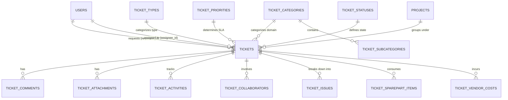
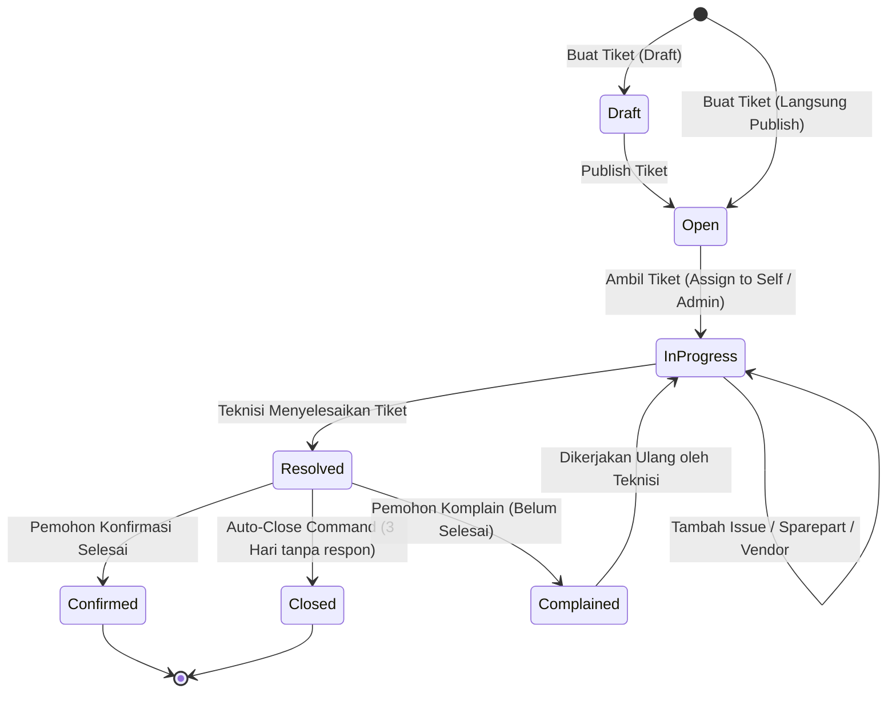

# 🎫 Modul 03: Helpdesk ITIL v4 Ticketing System

Modul Ticketing adalah salah satu modul paling komprehensif di Portal Sifast. Modul ini dirancang mengadopsi standar **ITIL v4 (Information Technology Infrastructure Library)** untuk mengelola insiden (*Incident Management*), permintaan layanan (*Service Request*), dan perbaikan sarana rumah sakit.

---

## 1. Diagram Relasi Entitas (ERD Ticketing)

---

## 2. Struktur Master Data & SLA Engine

### A. Master Entitas
1. **[`TicketType`](../../app/Models/TicketType.php):**
   * Membedakan jenis tiket (misal: *Incident*, *Service Request*, *Change Request*, *Preventive Maintenance*).
2. **[`TicketCategory`](../../app/Models/TicketCategory.php) & [`TicketSubcategory`](../../app/Models/TicketSubcategory.php):**
   * Dihubungkan ke kode departemen (`dep_id`) seperti `IT`, `IPSRS`, `ELEKTROMEDIS`.
   * Memiliki flag `is_development` untuk tiket kebutuhan pengembangan software.
3. **[`TicketPriority`](../../app/Models/TicketPriority.php):**
   * Menentukan `response_hours` (batas respon awal) dan `resolution_hours` (batas penyelesaian).
4. **[`TicketStatus`](../../app/Models/TicketStatus.php):**
   * Mengatur urutan display pada Kanban Board serta flag `is_closed`.

### B. Mekanisme SLA Calculation
Saat tiket dibuat, sistem menghitung tenggat waktu secara otomatis:
* `response_due_at` = `created_at` + `TicketPriority::response_hours`.
* `resolution_due_at` = `created_at` + `TicketPriority::resolution_hours`.
* Perhitungan memperhitungkan aturan khusus pada tabel `ticket_sla_rules` jika diterapkan.

---

## 3. Siklus Hidup dan State Transition Tiket

### Action Controller Terkait:
* `assignToSelf()` — Teknisi menugaskan tiket ke diri sendiri.
* `transferDepartment()` — Memindahkan penanganan tiket ke unit lain (misal dari IT ke IPSRS).
* `resolve()` — Teknisi menandai tiket selesai dan menulis ringkasan perbaikan.
* `confirm()` — Pemohon menyetujui hasil perbaikan.
* `complain()` — Pemohon menyampaikan komplain jika masalah belum tuntas.
* `publish()` — Mengubah tiket dari status Draft menjadi Open.

---

## 4. Fitur-Fitur Lanjutan (Advanced Features)

### A. Sub-Tasks & Breakdown Kendala (`TicketIssue`)
* Teknisi dapat memecah perbaikan kompleks menjadi checklist sub-masalah (`ticket_issues`).
* Setiap issue dapat di-resolve secara independen sebelum tiket utama ditutup.

### B. Pencatatan Biaya & Sparepart
* **`TicketSparepartItem`:** Mencatat komponen/sparepart yang digunakan dari inventaris internal (nama barang, jumlah, estimasi harga).
* **`TicketVendorCost`:** Mencatat invoice pihak ketiga jika perbaikan dialihkan ke vendor luar RS (nama vendor, nomor invoice, deskripsi biaya, total nominal).

### C. Bantuan AI & Dokumentasi Otomatis
* **[`AiRecommendationService`](../../app/Services/AiRecommendationService.php):** Menganalisis riwayat tiket masa lalu yang serupa dan memberikan saran perbaikan awal bagi teknisi.
* **[`TicketDocumentationService`](../../app/Services/TicketDocumentationService.php):** Secara otomatis mengompilasi kronologi, komentar resolusi, lampiran, dan suku cadang menjadi laporan berita acara formal format Markdown/PDF.

### D. Notifikasi & Bot Telegram
* **[`TicketTelegramGroupNotifier`](../../app/Services/TicketTelegramGroupNotifier.php):** Mengirim alert instan ke grup Telegram teknisi saat tiket baru berprioritas tinggi dibuat.
* **Artisan Commands Terjadwal:**
  * `php artisan tickets:work-nudge` — Mengirim pengingat harian ke teknisi mengenai tiket yang masih berstatus Open/InProgress.
  * `php artisan tickets:daily-it-report` — Mengirim rekapitulasi harian SLA tiket ke grup manajemen IT.
  * `php artisan tickets:auto-close` — Menutup tiket `resolved` secara otomatis jika pemohon tidak merespon dalam batas waktu.
