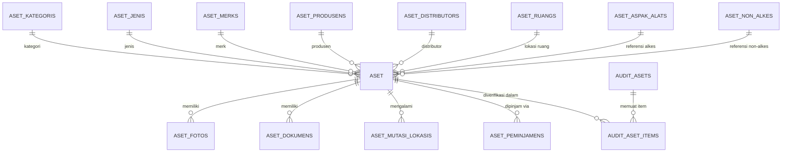

# 🏷️ Modul 04: Manajemen Aset dan Inventaris Rumah Sakit

Modul Aset dan Inventaris di Portal Sifast memiliki keunikan berupa **arsitektur transisi dua lapisan**: modul *Inventaris SIMRS Khanza (Legacy)* dan modul *Aset Portal Sifast (Modern & Lengkap)*.

---

## 1. Perbedaan Mendasar: Inventaris SIMRS vs Aset Portal

| Dimensi | Modul Inventaris (SIMRS) | Modul Aset (Portal Sifast) |
| :--- | :--- | :--- |
| **Lokasi Database** | Koneksi `dbsimrs` (MySQL Khanza) | Koneksi `mysql` (Database Utama Portal) |
| **Sifat Operasi** | **Read-Only** (hanya pencarian & cetak label) | **Full CRUD & Transaksional** |
| **Standarisasi Kemenkes**| Belum terintegrasi ASPAK | Terintegrasi Standar **ASPAK Kemenkes** (Alkes) & Non-Alkes |
| **Fitur Transaksi** | Tidak ada | Mutasi Lokasi, Peminjaman Aset, & Penyusutan Nilai |
| **Audit Fisik** | Tidak ada | Sesi Audit Fisik Berbasis Scan QR & Foto Lapangan |
| **Relasi Tiket IT** | Lookup nomor inventaris | Lookup nomor aset + riwayat perbaikan berkala |

---

## 2. Struktur Data Modul Aset Portal

### A. Klasifikasi Aset
1. **Aset Alkes (Alat Kesehatan / ASPAK):**
   * Mengacu pada tabel [`AsetAspakAlat`](file:///Users/adijaya/MyFiles/Projects/RSAisyiahSitiFatimahTulangan/PortalSifast/app/Models/AsetAspakAlat.php) yang sesuai dengan nomenklatur standar Kemenkes RI.
2. **Aset Non-Alkes:**
   * Mengacu pada tabel [`AsetNonAlkes`](file:///Users/adijaya/MyFiles/Projects/RSAisyiahSitiFatimahTulangan/PortalSifast/app/Models/AsetNonAlkes.php) untuk perangkat IT, furnitur, kelistrikan, dan kendaraan operasional.

---

## 3. Alur Operasional Aset

### A. Peminjaman Aset (`AsetPeminjaman`)
* Digunakan untuk mencatat perpindahan sementara peralatan (misal: proyektor, alat medis cadangan).
* Mencatat peminjam (pegawai SIMRS / user portal), penanggung jawab, tanggal pinjam, estimasi kembali, kondisi saat dipinjam, serta tombol aksi **Kembalikan Aset** yang memulihkan status ketersediaan aset menjadi *Tersedia*.

### B. Mutasi Lokasi Aset (`AsetMutasiLokasi`)
* Digunakan saat aset dipindahkan secara permanen dari satu ruangan ke ruangan lain.
* Mencatat riwayat ruangan asal, ruangan tujuan, user pengusul, dan berita acara mutasi yang dapat dicetak PDF/Kertas.

### C. Audit Fisik Aset (`AuditAset` & `AuditAsetItem`)
* **Siklus Audit:** Dibuat sesi audit berkala (misal: "Audit Tahunan Gedung Rawat Inap 2026").
* **Scanning Lapangan:** Petugas auditor menggunakan kamera smartphone untuk memindai label QR Code pada fisik aset.
* **Verifikasi:** Sistem mencocokkan ruangan aktual vs database, mencatat kondisi (Baik/Rusak Ringan/Rusak Berat), dan mewajibkan unggah foto bukti temuan lapangan.
* **Approval:** Koordinator Aset/IPSRS menyetujui hasil audit, yang otomatis memperbarui data master aset.

---

## 4. Scan QR Publik & Penampil Foto

### A. Endpoint QR Code Publik (`/q/{aset}`)
* Dikelola oleh [`AsetPublicController`](file:///Users/adijaya/MyFiles/Projects/RSAisyiahSitiFatimahTulangan/PortalSifast/app/Http/Controllers/AsetPublicController.php).
* Halaman ini dapat diakses oleh siapa saja yang memindai QR Code stiker aset tanpa perlu login.
* Menampilkan informasi ringkas: Nama Aset, Kode Aset, Lokasi Ruangan, Tahun Pengadaan, dan Riwayat Singkat Pemeliharaan.

### B. Sinkronisasi Data dari SIMRS Khanza
* Command CLI: `php artisan aset:sinkron-dari-simrs` atau melalui UI di `/aset/sinkron`.
* Mengambil data barang dan inventaris yang belum tercatat di portal untuk di-import menjadi entitas `Aset` modern.
