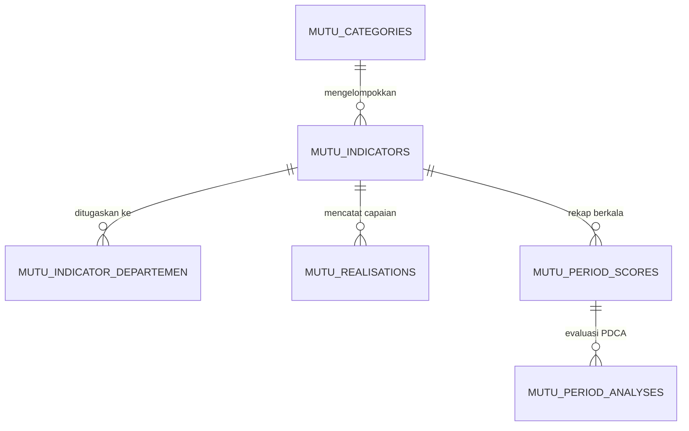

# 📊 Modul 05: SIMMUTU (Sistem Informasi Manajemen Mutu)

Modul **SIMMUTU** adalah modul penjaminan mutu pelayanan rumah sakit yang dirancang untuk mendukung pemenuhan standar **Akreditasi Rumah Sakit (Kemenkes / KARS / LAM-KPRS)**.

---

## 1. Konsep dan Domain Bisnis Mutu

Dalam operasional rumah sakit, seluruh unit kerja/departemen wajib mengumpulkan indikator mutu secara berkala. Indikator terbagi menjadi:
1. **INM (Indikator Nasional Mutu):** Kepatuhan kebersihan tangan, kepatuhan penggunaan APD, kepatuhan identifikasi pasien, waktu tanggap SC, waktu tunggu rawat jalan, kepatuhan penundaan operasi, kepatuhan visit dokter, kepatuhan penggunaan formularium nasional, dsb.
2. **IMP-RS (Indikator Mutu Prioritas Rumah Sakit):** Fokus mutu strategis direksi.
3. **IM-Unit (Indikator Mutu Unit Kerja):** Mutu operasional spesifik per unit (Farmasi, Laboratorium, Radiologi, Rekam Medis, Gizi, Keuangan, dsb).

---

## 2. Struktur Data dan Formula Pengukuran

### A. Model Entitas Utama
* **[`MutuCategory`](../../app/Models/MutuCategory.php):** Kategori mutu (INM, IMP-RS, IM-Unit).
* **[`MutuIndicator`](../../app/Models/MutuIndicator.php):**
  * `name`, `code`, `description`.
  * `target_operator` (`>=`, `<=`, `=`, `range`).
  * `target_value` (misal: `100.00` untuk 100%, atau `5.00` untuk toleransi kesalahan < 5%).
  * `numerator_label` (label pembilang, misal: *Jumlah pasien yang diidentifikasi dengan benar*).
  * `denominator_label` (label penyebut, misal: *Total seluruh pasien yang diobservasi*).
  * `frequency` (`daily`, `monthly`, `quarterly`).
* **[`MutuRealisation`](../../app/Models/MutuRealisation.php):**
  * `date`, `dep_id`, `n_value` (numerator), `d_value` (denominator).
  * `score` — Dihitung otomatis: $(N / D) \times 100\%$.
  * `is_achieved` — Boolean apakah skor memenuhi `target_operator` dan `target_value`.
  * `notes` & `analysis` — Catatan kendala jika target tidak tercapai.

---

## 3. Matriks Otorisasi Modul SIMMUTU

Akses modul SIMMUTU dikontrol secara ketat menggunakan kombinasi Gate dan Middleware:

| Aksi | Superadmin | Mutu Manager (`can_manage_mutu`) | Unit Inputter (`can_input_mutu`) | Viewer (`can_view_mutu_dashboard`) |
| :--- | :---: | :---: | :---: | :---: |
| **Lihat Dashboard & Grafik Mutu** | ✅ | ✅ | ✅ | ✅ |
| **Rekap Laporan per Unit Kerja** | ✅ | ✅ | ✅ | ✅ |
| **Input / Edit Realisasi Unit Sendiri** | ✅ | ✅ | ✅ (Sesuai `dep_id`) | ❌ |
| **Kelola Master Kategori & Indikator** | ✅ | ✅ | ❌ | ❌ |
| **Input Analisis PDCA Komite** | ✅ | ✅ | ❌ | ❌ |

---

## 4. REST API untuk Aplikasi Mobile & Eksternal

Prefix: `/api/sifast/simmutu` (Sanctum Auth + Middleware `can:access-simmutu-module`):
* `GET /indicators` — Daftar indikator aktif sesuai departemen pengguna.
* `GET /realisations` & `POST /realisations` — Pengambilan dan pencatatan capaian harian dari smartphone.
* `GET /realisations/stats` — Ringkasan persentase kepatuhan mutu per periode untuk widget mobile.
