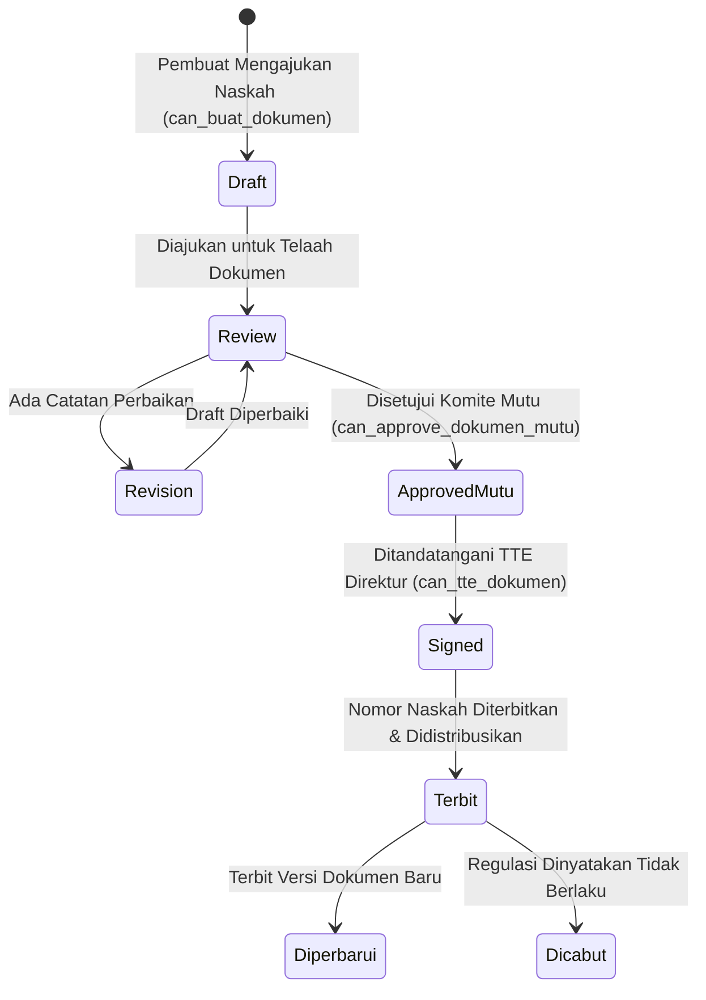
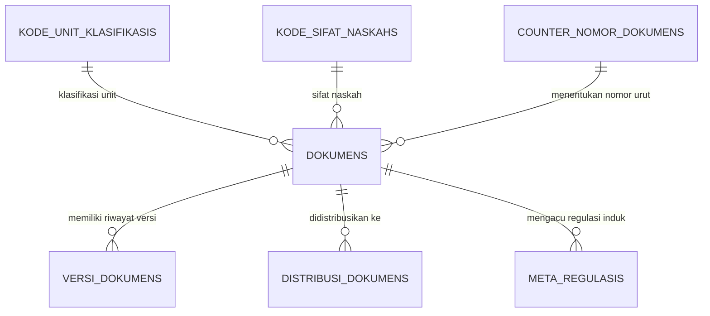
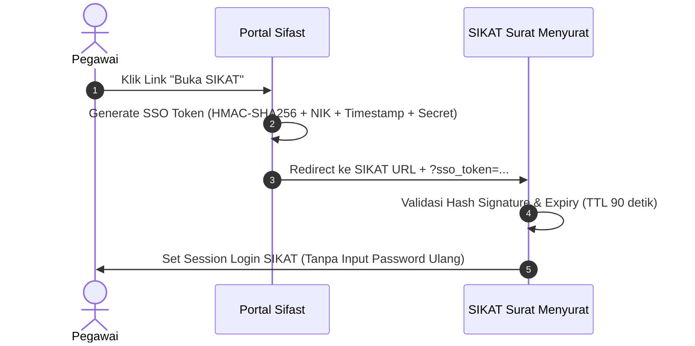

# 📜 Modul 06: Tata Naskah Dinas dan Regulasi Rumah Sakit

Modul Tata Naskah mengelola standarisasi pembuatan, verifikasi berjenjang, penomoran otomatis, penandatanganan, dan distribusi dokumen regulasi internal RS (Kebijakan, Pedoman, Panduan, SPO, dan Surat Keputusan).

---

## 1. Siklus Hidup dan State Transition Naskah Dinas

---

## 2. Struktur Data dan Versi Dokumen

### A. Fitur Multi-Versi (`VersiDokumen`)
* Setiap kali dokumen SPO atau Regulasi mengalami revisi berkala, sistem tidak menimpa dokumen lama.
* Sistem membuat entitas `VersiDokumen` baru (misal: Rev 00 -> Rev 01) lengkap dengan riwayat tanggal revisi dan catatan perubahan (*change log*).
* File PDF fisik tersimpan di disk aman (`storage/app/tatanaskah/`) dan hanya dapat diunduh melalui controller berautentikasi.

### B. Otomasi Penomoran Surat Dinamis
Format penomoran naskah dinas mengikuti standar tata naskah Muhammadiyah / RS:
$$\text{Nomor} = \text{[Urutan] / [Sifat] / [Unit Klasifikasi] / RS-ASF / [Bulan Romawi] / [Tahun]}$$
* Dihitung secara *atomic* menggunakan tabel [`CounterNomorDokumen`](../../app/Models/CounterNomorDokumen.php) untuk mencegah duplikasi nomor meskipun dibuat secara bersamaan (*race condition*).

---

## 3. Integrasi Single Sign-On (SSO) SIKAT

Portal Sifast terhubung erat dengan **SIKAT** (Sistem Informasi Kearsipan & Surat Menyurat Terpadu) melalui protokol SSO berbasis HMAC-SHA256:

### File Kunci Integrasi SSO:
* [`SikatSsoTokenService.php`](../../app/Services/SikatSsoTokenService.php) — Generator dan validator token.
* [`SikatInboundSsoController.php`](../../app/Http/Controllers/Integrations/SikatInboundSsoController.php) — Menerima login SSO masuk dari SIKAT ke Portal.
* [`SikatSsoRedirectController.php`](../../app/Http/Controllers/Integrations/SikatSsoRedirectController.php) — Mengarahkan pengguna dari Portal ke SIKAT.
