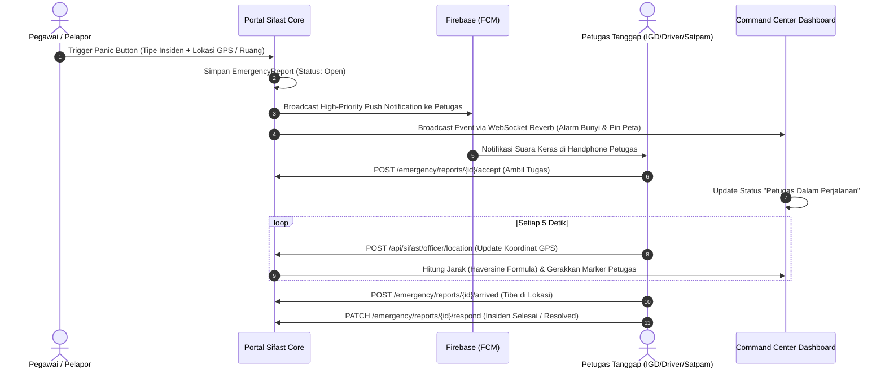
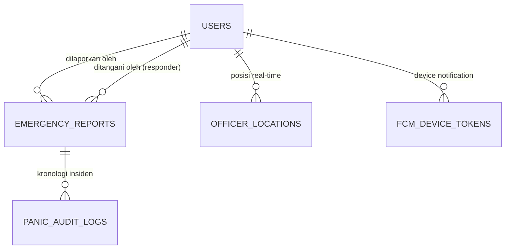

# 🚨 Modul 07: Sistem Tanggap Darurat dan Panic Button

Modul Tanggap Darurat (*Emergency Response & Panic Tracking*) adalah modul kritis di Portal Sifast yang digunakan untuk penanganan respon cepat insiden medis dan keselamatan (Code Blue, Code Red, Code Black, dsb).

---

## 1. Alur Kerja Tanggap Darurat End-to-End

---

## 2. Struktur Data dan Perhitungan Jarak (Haversine)

### A. Algoritma Haversine (`HaversineService.php`)
Sistem menghitung jarak garis lurus (*great-circle distance*) antara koordinat GPS petugas dan lokasi kejadian secara presisi di server:

$$d = 2r \arcsin \left( \sqrt{\sin^2\left(\frac{\Delta \phi}{2}\right) + \cos(\phi_1) \cos(\phi_2) \sin^2\left(\frac{\Delta \lambda}{2}\right)} \right)$$

Hasil kalkulasi jarak (dalam meter atau kilometer) dikirimkan ke frontend Command Center untuk memprediksi *Estimated Time of Arrival (ETA)*.

---

## 3. Komponen Kunci Backend

* **[`EmergencyFcmService.php`](file:///Users/adijaya/MyFiles/Projects/RSAisyiahSitiFatimahTulangan/PortalSifast/app/Services/EmergencyFcmService.php):**
  * Bertanggung jawab mengirim notifikasi multi-target ke perangkat yang terdaftar di tabel `fcm_device_tokens`.
  * Menggunakan channel *Emergency Alert* dengan volume penuh dan vibration pattern panjang.
* **[`CheckPendingPanicCommand.php`](file:///Users/adijaya/MyFiles/Projects/RSAisyiahSitiFatimahTulangan/PortalSifast/app/Console/Commands/CheckPendingPanicCommand.php):**
  * Dijalankan secara otomatis oleh scheduler.
  * Memeriksa apakah ada laporan darurat berstatus `open` yang belum direspon lebih dari 2 menit, lalu memicu notifikasi eskalasi ulang.
* **Throttle Khusus Officer:**
  * Endpoint `POST /api/sifast/officer/location` dilindungi middleware `throttle:20,1` (maksimal 20 request per menit per petugas) agar tracking lokasi setiap ~5 detik berjalan lancar tanpa terblokir rate limiter standar.
