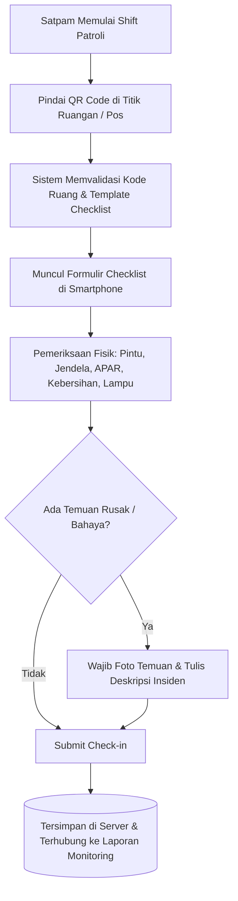
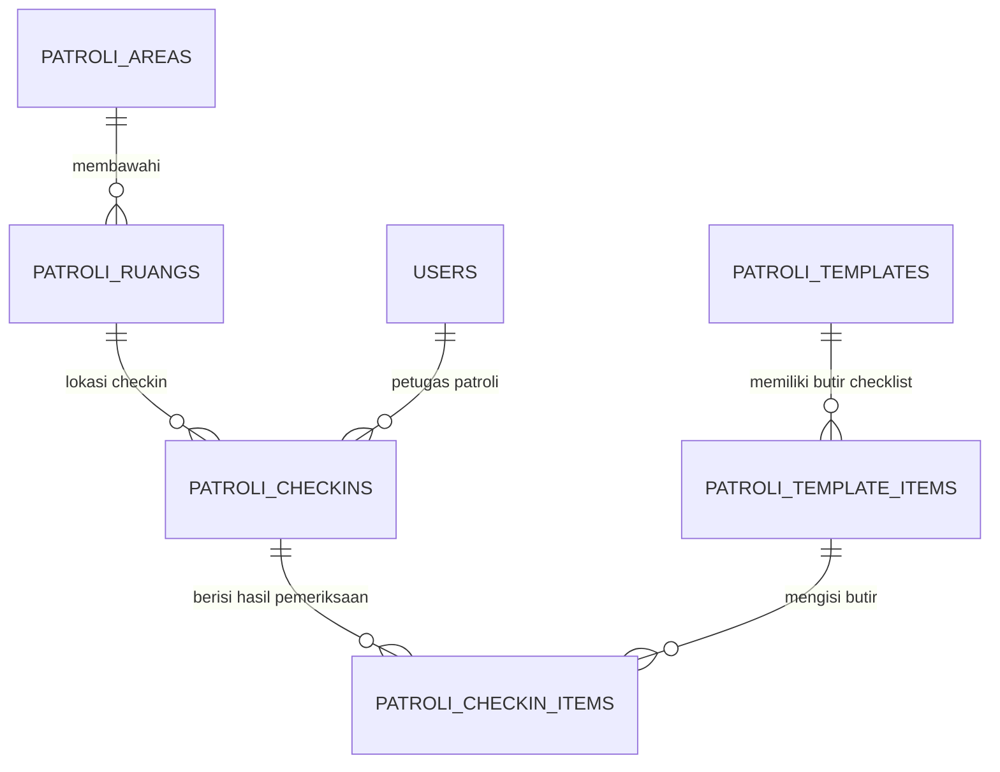

# 🛡️ Modul 08: Modul Patroli Keamanan Digital

Modul Patroli Keamanan mendigitalkan seluruh aktivitas ronda satpam dan petugas keamanan rumah sakit menggunakan sistem **Check-in Titik QR Code** dan **Formulir Checklist Dinamis**.

---

## 1. Alur Kerja Patroli Satpam

---

## 2. Struktur Data Modul Patroli

### Entitas Kunci:
1. **[`PatroliArea`](file:///Users/adijaya/MyFiles/Projects/RSAisyiahSitiFatimahTulangan/PortalSifast/app/Models/PatroliArea.php):** Pengelompokan zona gedung (Lantai 1, Rawat Inap, Basement & Parkir, Farmasi & Gudang).
2. **[`PatroliRuang`](file:///Users/adijaya/MyFiles/Projects/RSAisyiahSitiFatimahTulangan/PortalSifast/app/Models/PatroliRuang.php):** Titik fisik penempelan QR stiker. Memiliki fungsi cetak label otomatis dengan format SVG/PNG.
3. **[`PatroliTemplate`](file:///Users/adijaya/MyFiles/Projects/RSAisyiahSitiFatimahTulangan/PortalSifast/app/Models/PatroliTemplate.php):** Paket pertanyaan checklist yang fleksibel dan dapat disesuaikan tanpa perlu mengubah struktur tabel (*schema-free questionnaire*).
4. **[`PatroliCheckin`](file:///Users/adijaya/MyFiles/Projects/RSAisyiahSitiFatimahTulangan/PortalSifast/app/Models/PatroliCheckin.php):** Bukti kehadiran fisik petugas di lokasi tertentu lengkap dengan timestamp server.

---

## 3. Endpoint API Mobile Patroli

Prefix: `/api/sifast/patroli` (Sanctum Auth):
* `GET /me` — Informasi profil satpam & ringkasan shift hari ini.
* `GET /titik` — Daftar seluruh titik ruangan yang wajib dikunjungi.
* `POST /resolve-qr` — Menerjemahkan payload raw QR Code hasil kamera smartphone menjadi ID Ruang.
* `GET /scan/{ruang}` — Mengambil formulir checklist aktif untuk ruangan tersebut.
* `POST /checkin` — Menyimpan isian checklist, catatan, dan foto bukti pemeriksaan.
* `GET /laporan/export` — Ekspor rekapitulasi patroli bulanan ke format Excel/PDF untuk laporan Kepala Keamanan.
