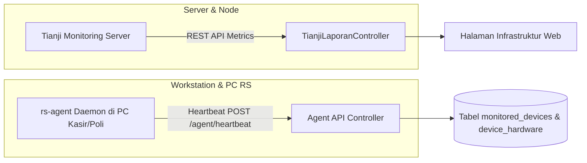

# 💰 Modul 09: Penggajian (Payroll) dan Monitoring Infrastruktur

Dokumen ini merangkum dua sub-sistem pendukung operasional rumah sakit: sistem distribusi dan audit **Payroll (Penggajian)** serta sistem **Monitoring Perangkat & Infrastruktur Server (Tianji + RS-Agent)**.

---

## 1. Sub-Modul Payroll (Penggajian Pegawai)

```mermaid
flowchart TD
    Excel[File CSV / Excel Rekap Gaji SDM] --> Upload[Upload via Menu Payroll Import]
    Upload --> Parse[EmployeeSalaryImportService Memvalidasi NIK & Nominal]
    Parse --> Preview{Cek Warning NIK / Selisih}
    Preview -- Ada Masalah --> Rollback[Reject / Batalkan Batch]
    Preview -- Valid --> StoreDraft[Simpan sebagai Batch Draft (PayrollImport)]
    StoreDraft --> Approval[Superadmin / Kabag SDM Menyetujui (Approve Batch)]
    Approval --> Publish[Gaji Berstatus Published]
    Publish --> MobileSlip[Pegawai Melihat Slip Gaji di Mobile App]
    Publish --> BulkEmail[Kirim Slip Gaji PDF Terenkripsi ke Email Pegawai]
```

### A. Rincian Komponen Gaji (`EmployeeSalary`)
Tabel [`EmployeeSalary`](file:///Users/adijaya/MyFiles/Projects/RSAisyiahSitiFatimahTulangan/PortalSifast/app/Models/EmployeeSalary.php) menyimpan detail komponen penghasilan dan potongan secara lengkap:
* **Komponen Penerimaan:** Gaji Pokok, Tunjangan Jabatan, Tunjangan Fungsional, Tunjangan Keluarga, Tunjangan Transport & Makan, Tunjangan Kehadiran, Insentif Kinerja, Lembur.
* **Komponen Potongan:** BPJS Kesehatan, BPJS Ketenagakerjaan, PPh 21, Potongan Keterlambatan, Potongan Ijin/Cuti, Potongan Koperasi, Potongan Lainnya.
* **Perhitungan Otomatis:** $\text{Take Home Pay} = \sum \text{Penerimaan} - \sum \text{Potongan}$.

### B. Keamanan dan Audit Trail (`PayrollAuditLog`)
* Seluruh rute payroll diproteksi oleh middleware `payroll.access`.
* Setiap perubahan nilai, aksi upload, persetujuan batch, rollback, atau pengunduhan slip gaji secara otomatis dicatat ke tabel `payroll_audit_logs` (mencatat user ID pelaksana, IP address, waktu, payload lama, dan payload baru).

---

## 2. Sub-Modul Monitoring Infrastruktur & RS-Agent

Portal Sifast memiliki dua lapisan pemantauan infrastruktur teknologi informasi:



### A. Integrasi Tianji Server Monitoring
* Mengambil status *uptime*, *latency*, insiden gangguan jaringan, dan performa server pusat dari instans **Tianji** melalui API token.
* Controller: [`TianjiLaporanController.php`](file:///Users/adijaya/MyFiles/Projects/RSAisyiahSitiFatimahTulangan/PortalSifast/app/Http/Controllers/TianjiLaporanController.php).

### B. Daemon Pemantau PC RS (`rs-agent`)
* Aplikasi daemon kecil (`rs-agent`) dipasang di komputer operasional rumah sakit (PC Pendaftaran, PC Poliklinik, PC Kasir).
* **Data yang Dikirimkan:**
  * **Spesifikasi Hardware:** Processor, Kapasitas RAM, Tipe Penyimpanan, Mac Address (`DeviceHardware`).
  * **Metrik Time-Series:** Pemakaian CPU & Memori per 30 detik (`DeviceMetricSample`).
  * **Snapshot Aplikasi:** Snapshot jendela aktif dan daftar proses berjalan untuk deteksi dini kendala komputer kasir/farmasi yang hang.
* **Remote Commands:** Admin IT dapat mengirimkan instruksi jarak jauh melalui tabel `agent_device_commands`.
* **Artisan Commands Terjadwal:**
  * `php artisan devices:mark-offline` — Menandai komputer berstatus *Offline* jika tidak mengirim heartbeat dalam 5 menit.
  * `php artisan devices:prune-metrics` — Menghapus data histori sampel metrik yang lebih lama dari 7 hari guna menjaga ukuran database tetap efisien.
