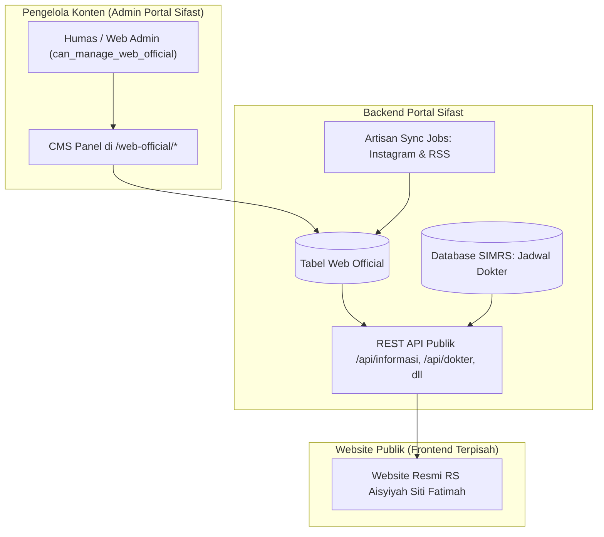

# 🌐 Modul 10: CMS Website Resmi dan Integrasi Feed Publik

Portal Sifast menyediakan modul **Headless CMS** bagi Humas dan Tim Komunikasi untuk mengelola konten website publik resmi rumah sakit ([`rsasitifatimah.com`](https://rsasitifatimah.com)).

---

## 1. Arsitektur Headless CMS & Integrasi

---

## 2. Fitur-Fitur Pengelolaan Konten

### A. Artikel & Berita Kesehatan (`WebOfficialArticle`)
* Mengelola artikel edukasi medis, tips kesehatan, dan berita kegiatan rumah sakit.
* Fitur: Rich text body editor, slug ramah SEO, upload gambar sampul otomatis dikompresi, kategori, tags, dan counter jumlah pembaca (*view counter*).

### B. Fasilitas Kamar Inap (`WebOfficialRoom`)
* Mengelola informasi kelas perawatan (VVIP, VIP, Kelas 1, Kelas 2, Kelas 3, ICU, NICU, Ruang Isolasi).
* Menampilkan tarif sewa per malam, rincian fasilitas ruangan (AC, TV, Sofa Bed, dsb), serta galeri foto kamar.

### C. Poliklinik & Jadwal Dokter Terintegrasi SIMRS
* Menggabungkan deskripsi poliklinik dari Portal Sifast dengan jadwal praktek dokter real-time yang dibaca langsung dari database **SIMRS Khanza** (`dbsimrs`).
* Pasien di website publik dapat melihat hari dan jam praktek spesialis secara akurat.

### D. Promosi & Banner Hero (`WebOfficialPromo`)
* Mengatur banner carousel halaman beranda, pengumuman paket Medical Check-Up (MCU), dan promo layanan hari raya / hari kesehatan.

### E. Rekanan Asuransi (`WebOfficialPartner`)
* Katalog logo dan informasi klaim asuransi kesehatan swasta, BPJS Kesehatan, dan BPJS Ketenagakerjaan.

### F. Kritik & Saran Publik (`WebOfficialFeedback`)
* Formulir penerimaan aspirasi pasien website.
* Dilindungi rate limiter khusus `RateLimiter::for('kritik-saran')` (maksimal 5 request per jam per alamat IP) untuk mencegah bot spam.

---

## 3. Integrasi Feed Otomatis Eksternal

1. **Instagram Graph API Feed:**
   * Menghubungkan akun Instagram resmi `@rsasitifatimah`.
   * Di-cache selama 60 menit dan di-refresh berkala melalui command `php artisan web-official:sync-instagram`.
2. **RSS Feed Berita Persyarikatan Muhammadiyah:**
   * Mengambil feed berita dari *Suara Muhammadiyah* dan *Muhammadiyah.or.id*.
   * Di-refresh melalui command `php artisan web-official:sync-rss`.
