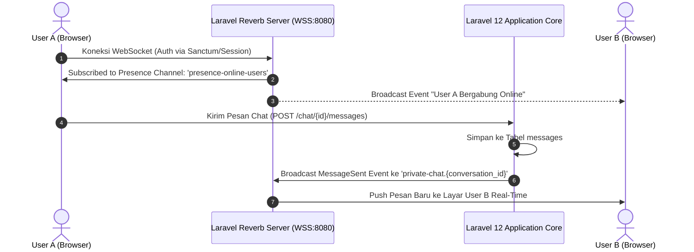

# ⚡ Modul 11: Real-Time WebSocket, User Presence, dan Chat Internal

Portal Sifast dilengkapi infrastruktur komunikasi real-time menggunakan **Laravel Reverb** sebagai server WebSocket bawaan berkecepatan tinggi dan **Laravel Echo** di sisi frontend React.

---

## 1. Arsitektur Komunikasi Real-Time



---

## 2. Saluran Siaran (Broadcast Channels)

Konfigurasi saluran didefinisikan pada [`routes/channels.php`](../../routes/channels.php):

1. **`presence-online-users` (Presence Channel):**
   * Mengembalikan data ringkas user (`id`, `name`, `email`, `role`, `dep_id`).
   * Frontend React mendengarkan channel ini menggunakan hook khusus untuk menampilkan avatar bulatan hijau/merah di daftar pengguna online.
2. **`private-chat.{conversationId}` (Private Channel):**
   * Diproteksi otorisasi: hanya user yang terdaftar sebagai anggota percakapan (`conversation_user`) yang diizinkan berlangganan.
3. **`private-emergency.{reportId}` & `emergency-alerts`:**
   * Digunakan untuk menyiarkan laporan Panic Button langsung ke dashboard Command Center.

---

## 3. Sistem Pelacakan Status Kehadiran (User Presence)

Untuk menjamin keandalan indikator status *Online*, Portal Sifast menerapkan strategi **Dual-Layer Presence Tracking**:
1. **Lapisan WebSocket (Reverb Presence):** Menangkap status instan ketika tab browser dibuka atau ditutup.
2. **Lapisan Event Listener Sesi:**
   * [`SetUserOnlineOnLogin.php`](../../app/Listeners/SetUserOnlineOnLogin.php) — Menandai user online saat sukses login.
   * [`SetUserOfflineOnLogout.php`](../../app/Listeners/SetUserOfflineOnLogout.php) — Membersihkan status saat logout.
3. **Lapisan Database Session Fallback ([`UserPresenceService.php`](../../app/Services/UserPresenceService.php)):**
   * Jika koneksi WebSocket klien mengalami gangguan jaringan, sistem tetap dapat mendeteksi keaktifan user berdasarkan `last_activity` pada tabel `sessions` dalam durasi toleransi 5 menit.

---

## 4. Konfigurasi Client (`resources/js/echo.js`)

Frontend menginisialisasi Echo dengan menerapkan arsitektur **Dual-Source Config Pattern**: Frontend memprioritaskan konfigurasi `window.REVERB_CONFIG` yang disuntikkan langsung oleh Blade shell ([`resources/views/app.blade.php`](../../resources/views/app.blade.php)). Pola ini diterapkan guna menghindari masalah environment variable Vite (`import.meta.env`) yang sering tidak sinkron antara server local (HTTP/WS) dan server production (HTTPS/WSS).

Cuplikan kode nyata dari inisialisasi [`resources/js/echo.js`](../../resources/js/echo.js):

```javascript
import Echo from 'laravel-echo';
import Pusher from 'pusher-js';

window.Pusher = Pusher;

try {
    // Utamakan konfigurasi dari Blade Laravel agar host/port selalu cocok dengan .env server
    const fromLaravel = typeof window !== 'undefined' && window.REVERB_CONFIG;
    let wsHost = fromLaravel
        ? window.REVERB_CONFIG.host
        : (import.meta.env.VITE_REVERB_APP_HOST ?? import.meta.env.VITE_REVERB_HOST ?? window.location.hostname);

    if (typeof window !== 'undefined' && (wsHost === '0.0.0.0' || !wsHost)) {
        wsHost = window.location.hostname;
    }

    const wsPort = fromLaravel
        ? window.REVERB_CONFIG.port
        : (Number(import.meta.env.VITE_REVERB_APP_PORT ?? import.meta.env.VITE_REVERB_PORT) || 8080);
    const scheme = fromLaravel
        ? window.REVERB_CONFIG.scheme
        : (import.meta.env.VITE_REVERB_APP_SCHEME ?? import.meta.env.VITE_REVERB_SCHEME ?? 'http');
    const key = fromLaravel
        ? window.REVERB_CONFIG.key
        : (import.meta.env.VITE_REVERB_APP_KEY || 'production-key');

    const forceTLS = scheme === 'https';

    window.Echo = new Echo({
        broadcaster: 'reverb',
        key,
        wsHost,
        wsPort,
        wssPort: wsPort,
        forceTLS,
        enabledTransports: forceTLS ? ['wss'] : ['ws', 'wss'],
        disableStats: true,
        authEndpoint: '/broadcasting/auth',
    });
} catch (error) {
    console.error('Failed to initialize Echo:', error);
}
```
