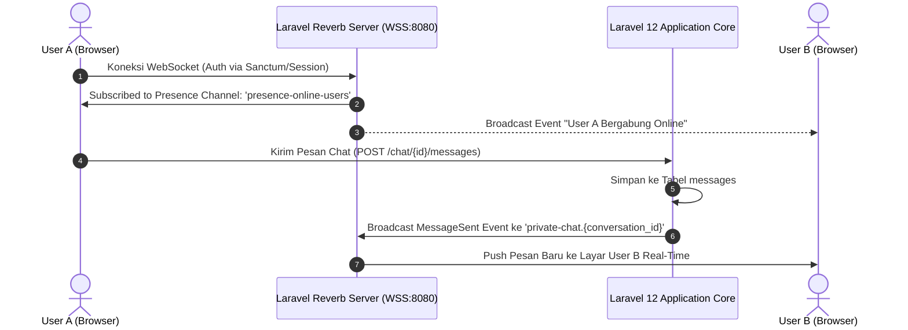

# ⚡ Modul 11: Real-Time WebSocket, User Presence, dan Chat Internal

Portal Sifast dilengkapi infrastruktur komunikasi real-time menggunakan **Laravel Reverb** sebagai server WebSocket bawaan berkecepatan tinggi dan **Laravel Echo** di sisi frontend React.

---

## 1. Arsitektur Komunikasi Real-Time



---

## 2. Saluran Siaran (Broadcast Channels)

Konfigurasi saluran didefinisikan pada [`routes/channels.php`](file:///Users/adijaya/MyFiles/Projects/RSAisyiahSitiFatimahTulangan/PortalSifast/routes/channels.php):

1. **`presence-online-users` (Presence Channel):**
   * Mengembalikan data ringkas user (`id`, `name`, `email`, `role`, `dep_id`).
   * Frontend React mendengarkan channel ini menggunakan hook khusus untuk menampilkan avatar bulatan hijau/merah di daftar pengguna online.
2. **`private-chat.{conversationId}` (Private Channel):**
   * Diproteksi otorisasi: hanya user yang terdaftar sebagai anggota percakapan (`conversation_user`) yang diizinkan berlangganan.
3. **`private-emergency.{reportId}` & `emergency-alerts`:**
   * Digunakan untuk menyiarkan laporan Panic Button langsung ke dashboard Command Center.

---

## 3. Sistem Pelacakan Status Kehadiran (User Presence)

Untuk menjamin keandalan indikator status *Online*, Portal Sifast menerapkan strategi **Dual-Layer Presence Tracking**:
1. **Lapisan WebSocket (Reverb Presence):** Menangkap status instan ketika tab browser dibuka atau ditutup.
2. **Lapisan Event Listener Sesi:**
   * [`SetUserOnlineOnLogin.php`](file:///Users/adijaya/MyFiles/Projects/RSAisyiahSitiFatimahTulangan/PortalSifast/app/Listeners/SetUserOnlineOnLogin.php) — Menandai user online saat sukses login.
   * [`SetUserOfflineOnLogout.php`](file:///Users/adijaya/MyFiles/Projects/RSAisyiahSitiFatimahTulangan/PortalSifast/app/Listeners/SetUserOfflineOnLogout.php) — Membersihkan status saat logout.
3. **Lapisan Database Session Fallback ([`UserPresenceService.php`](file:///Users/adijaya/MyFiles/Projects/RSAisyiahSitiFatimahTulangan/PortalSifast/app/Services/UserPresenceService.php)):**
   * Jika koneksi WebSocket klien mengalami gangguan jaringan, sistem tetap dapat mendeteksi keaktifan user berdasarkan `last_activity` pada tabel `sessions` dalam durasi toleransi 5 menit.

---

## 4. Konfigurasi Client (`resources/js/echo.js`)

Frontend menginisialisasi Echo dengan konfigurasi otomatis mendeteksi environment (HTTP vs HTTPS / WS vs WSS):

```javascript
import Echo from 'laravel-echo';
import Pusher from 'pusher-js';

window.Pusher = Pusher;

window.Echo = new Echo({
    broadcaster: 'reverb',
    key: import.meta.env.VITE_REVERB_APP_KEY,
    wsHost: import.meta.env.VITE_REVERB_HOST ?? window.location.hostname,
    wsPort: import.meta.env.VITE_REVERB_PORT ?? 80,
    wssPort: import.meta.env.VITE_REVERB_PORT ?? 443,
    forceTLS: (import.meta.env.VITE_REVERB_SCHEME ?? 'https') === 'https',
    enabledTransports: ['ws', 'wss'],
});
```
