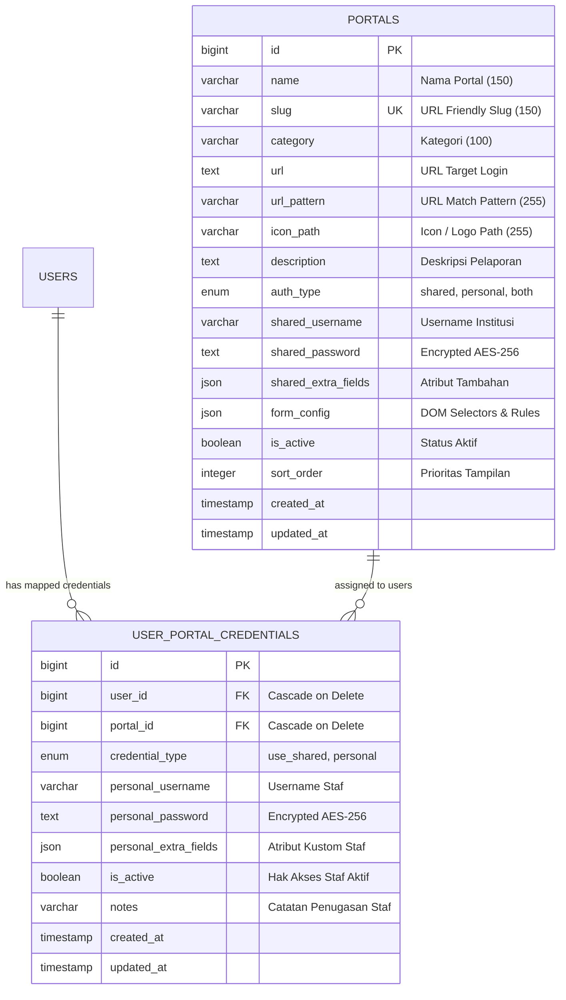

# 🌐 Modul 13: Portal Pelaporan Eksternal Pemerintah & Custom Browser Extension Autofill

Modul ini mendokumentasikan subsistem **Portal Pelaporan Eksternal & Custom Browser Extension Autofill** pada SIMRS Sifast (RS Aisyiyah Siti Fatimah Tulangan). Subsistem ini menghubungkan staf rumah sakit dengan berbagai portal pelaporan resmi kementerian dan lembaga negara (Kemenkes RI dan BKKBN) melalui arsitektur hibrida: integrasi backend Laravel 12, frontend React 19 / Inertia.js v2, dan ekstensi browser Chromium Manifest V3 dengan prinsip keamanan **Zero-Persistence**.

---

## 📋 Informasi Metadata Modul

| Atribut | Nilai |
| :--- | :--- |
| **Kode Modul** | `MODUL-13-PORTAL-EKSTERNAL` |
| **Tech Stack Backend** | Laravel 12, PHP 8.2+, Eloquent ORM, Symmetric AES-256-CBC Encryption, Pest PHP |
| **Tech Stack Frontend** | React 19, TypeScript, Inertia.js v2, Tailwind CSS v4, Lucide React, Shadcn UI |
| **Browser Extension** | Chromium Manifest V3, Pure Vanilla ES2022+, Zero-Persistence RAM Queue, Node.js 22 Test Runner |
| **Status Implementasi** | **Plan 1 (Backend Core & DB):** `SELESAI (PASS)`<br/>**Plan 2 (Admin Portal & Mapping):** `SELESAI (PASS)`<br/>**Plan 3 (Browser Extension MV3):** `SIAP DIIMPLEMENTASIKAN`<br/>**Plan 4 (Halaman Pengguna & ZIP):** `TERENCANA` |
| **Total Cakupan Pengujian** | 62 Pest Test Cases (354 Assertions) — Seluruhnya Lulus (`PASS`) |
| **Relasi Modul Onboarding** | [Modul 01: Arsitektur & Tech Stack](./01-ARSITEKTUR-DAN-TECH-STACK.md), [Modul 02b: Frontend React Inertia](./02b-PANDUAN-FRONTEND-REACT-INERTIA-UNTUK-LARAVEL-DEV.md) |

---

## 📑 Daftar Isi (9 Bab Definitif)

- [Bab 1: 📌 Ikhtisar Sistem & Filosofi Desain](#bab-1--ikhtisar-sistem--filosofi-desain)
  - [1.1 Konteks Bisnis & Latar Belakang Pelaporan](#11-konteks-bisnis--latar-belakang-pelaporan)
  - [1.2 3 Pilar Keamanan & Filosofi Arsitektur](#12-3-pilar-keamanan--filosofi-arsitektur)
  - [1.3 Diagram Arsitektur Interaksi End-to-End](#13-diagram-arsitektur-interaksi-end-to-end)
- [Bab 2: 📊 Matriks Status Implementasi & Roadmap Modul](#bab-2--matriks-status-implementasi--roadmap-modul)
  - [2.1 Matriks Status 4 Rencana Modular](#21-matriks-status-4-rencana-modular)
  - [2.2 Matriks Fitur, Rute, Otorisasi, & Ketersediaan](#22-matriks-fitur-rute-otorisasi--ketersediaan)
- [Bab 3: 🗄️ Model Data & Skema Database (Plan 1 - Selesai)](#bab-3-️-model-data--skema-database-plan-1---selesai)
  - [3.1 Skema Tabel `portals` (Master Portal Eksternal)](#31-skema-tabel-portals-master-portal-eksternal)
  - [3.2 Spesifikasi Format JSON `form_config`](#32-spesifikasi-format-json-form_config)
  - [3.3 Skema Tabel `user_portal_credentials` (Mapping Akses & Akun Personal)](#33-skema-tabel-user_portal_credentials-mapping-akses--akun-personal)
  - [3.4 Enkripsi Simetris Kredensial & Proteksi Model Eloquent](#34-enkripsi-simetris-kredensial--proteksi-model-eloquent)
  - [3.5 Ringkasan 8 Kelompok Portal Resmi Bawaan Seeder (`PortalSeeder.php`)](#35-ringkasan-8-kelompok-portal-resmi-bawaan-seeder-portalseederphp)
  - [3.6 Panduan Uji Coba Cepat (Hands-on Verification Bab 3)](#36-panduan-uji-coba-cepat-hands-on-verification-bab-3)
- [Bab 4: ⚙️ Backend Core & Arsitektur Service Layer (Plan 1 - Selesai)](#bab-4-️-backend-core--arsitektur-service-layer-plan-1---selesai)
- [Bab 5: 🖥️ Modul Admin SIMRS: Master Portal & Mapping Akses (Plan 2 - Selesai)](#bab-5-️-modul-admin-simrs-master-portal--mapping-akses-plan-2---selesai)
- [Bab 6: 🧩 Custom Browser Extension Manifest V3 (Plan 3 - Siap Diimplementasikan)](#bab-6--custom-browser-extension-manifest-v3-plan-3---siap-diimplementasikan)
- [Bab 7: 🚀 Modul Pengguna: Portal Agregator & Distribusi Ekstensi (Plan 4 - Terencana)](#bab-7--modul-pengguna-portal-agregator--distribusi-ekstensi-plan-4---terencana)
- [Bab 8: 🧪 Panduan Pengujian & Skenario Verifikasi (Master Testing Guide)](#bab-8--panduan-pengujian--skenario-verifikasi-master-testing-guide)
- [Bab 9: 🛠️ Runbook Operasional, Pemeliharaan & Troubleshooting](#bab-9-️-runbook-operasional-pemeliharaan--troubleshooting)

---

## Bab 1: 📌 Ikhtisar Sistem & Filosofi Desain

### 1.1 Konteks Bisnis & Latar Belakang Pelaporan

Sebagai institusi pelayanan kesehatan terakreditasi, Rumah Sakit Aisyiyah Siti Fatimah Tulangan memiliki kewajiban regulasi untuk menyampaikan data operasional, mutu, surveilans epidemiologi, dan demografi secara berkala kepada otoritas kesehatan Republik Indonesia. Platform eksternal pemerintah yang digunakan meliputi:

1. **Kementerian Kesehatan RI (Kemenkes):**
   - **SIRS Online:** Sistem Informasi Rumah Sakit Online Ditjen Yankes untuk pelaporan kapasitas tempat tidur, ketenagaan, dan morbiditas/mortalitas.
   - **SITB (Sistem Informasi Tuberkulosis):** Pencatatan dan pelaporan program penanggulangan tuberkulosis sensitif dan resisten obat tingkat Jawa Timur.
   - **SIHA 2.1 (Sistem Informasi HIV/AIDS dan IMS):** Surveilans dan pelaporan pengobatan HIV/AIDS, IMS, dan pencegahan penularan ibu ke anak (PPIA).
   - **MPDN (Maternal Perinatal Death Notification):** Pelaporan kematian maternal dan perinatal secara real-time guna audit maternal perinatal.
   - **SIGIZI Terpadu:** Sistem pemantauan status gizi balita, intervensi stunting, dan kesehatan keluarga.
   - **SATU SEHAT Platform:** Integrasi rekam medis elektronik nasional sesuai standar FHIR HL7.
   - **MutuFasyankes:** Pelaporan Indikator Nasional Mutu (INM), Insiden Keselamatan Pasien (IKP), Program Pengendalian Resistensi Antimikroba (PPRA), dan Sistem Informasi Manajemen Akreditasi RS (SIMAR).

2. **Badan Kependudukan dan Keluarga Berencana Nasional (BKKBN / Kemendukbangga):**
   - **SIRIKA:** Sistem Informasi Rekonsiliasi Intervensi Penurunan Stunting BKKBN.
   - **New SIGA:** Sistem Informasi Keluarga untuk pencatatan pelayanan kontrasepsi dan keluarga berencana.

#### Masalah Operasional Lapangan (*Pain Points*)
Sebelum subsistem ini dibangun, staf rumah sakit menghadapi kendala operasional yang berulang setiap hari:
* **Fragmentasi Akses & URL:** Terdapat puluhan URL login pemerintah yang terpisah. Staf mengandalkan bookmark browser acak di workstation masing-masing.
* **Risiko Kebocoran Akun:** Password sering dicatat di kertas tempel (*sticky notes*) di layar monitor atau lembar spreadsheet lokal yang tidak terenkripsi, memicu risiko pelanggaran kepatuhan keamanan informasi medis.
* **Rotasi Shift & Staf:** Pergantian jadwal dinas sering terhambat karena petugas jaga malam tidak memiliki kata sandi akun pelaporan terkini.
* **Inefisiensi Waktu:** Staf menghabiskan waktu signifikan untuk proses login berulang dan navigasi manual alih-alih fokus pada verifikasi validitas data medis yang dilaporkan.

#### Solusi Arsitektur Sifast
Subsistem Portal Pelaporan Eksternal menyelesaikan masalah ini secara menyeluruh melalui:
1. **Pusat Agregator SIMRS:** Satu dashboard internal terpadu di SIMRS yang hanya menampilkan portal-portal resmi sesuai penugasan dan hak akses masing-masing petugas.
2. **Penyimpanan Terenkripsi Terpusat:** Kredensial institusi dan personal disimpan di database SIMRS dengan enkripsi simetris standar industri (`AES-256-CBC`).
3. **Custom Chromium Extension Autofill:** Ekstensi browser ringan berstandar Google Manifest V3 yang menyuntikkan username dan password secara instan ke form web target tanpa pernah membocorkan password plaintext ke layar staf maupun ke hard disk browser.

---

### 1.2 3 Pilar Keamanan & Filosofi Arsitektur

Arsitektur modul ini dirancang dengan prinsip *Defense-in-Depth* berlandaskan 3 pilar utama:

```
+-----------------------------------------------------------------------------------+
|                            3 PILAR KEAMANAN MODUL 13                             |
+-----------------------------------------------------------------------------------+
|                                                                                   |
|  [Pilar 1: Zero-Persistence RAM]       [Pilar 2: Hybrid Credential]              |
|  * Tidak ada chrome.storage / cookies  * Shared institutional account (Admin IT)  |
|  * Volatile Map di Service Worker RAM  * Personal staff account (Self-service)    |
|  * TTL 30s auto-expire + auto-flush    * Granular access control & audit trail    |
|                                                                                   |
|                      [Pilar 3: Native Synthetic Dispatcher]                      |
|                      * Bypass setter prototype (setNativeValue)                   |
|                      * Support React, Vue, Angular, jQuery, SPA                   |
|                      * Full bubbling: input -> change -> blur                     |
+-----------------------------------------------------------------------------------+
```

#### 1. Zero-Persistence Security (Kerahasiaan Mutlak Tanpa Jejak Persisten)
Kelemahan fatal pada password manager komersial atau skrip autofill sederhana adalah penyimpanan kredensial pada media penyimpanan lokal browser (`chrome.storage.local`, `chrome.storage.sync`, `localStorage`, atau Web Cookies). Jika workstation rumah sakit diakses bersama atau terserang malware lokal, kredensial tersebut dapat diekstrak secara mudah.

Pada subsistem ini:
- Ekstensi browser **SAMA SEKALI TIDAK MENGGUNAKAN** media penyimpanan persisten apapun.
- Kredensial hanya diterima saat pengguna secara sadar mengklik kartu portal di SIMRS melalui panggilan API berotorisasi (`POST /portal-pelaporan/{portal}/dispatch-token`).
- Token dan kredensial dikirimkan ke Background Service Worker ekstensi (`background.js`) dan disimpan secara eksklusif di dalam memori **RAM** volatile menggunakan struktur data `Map<tabId, credentialPayload>`.
- Diberlakukan batas waktu kedaluwarsa ketat (**Time-To-Live / TTL = 30 detik**). Jika tab target tidak terbuka atau gagal di-autofill dalam 30 detik, entri di RAM dihapus secara otomatis (*auto-expire*).
- Segera setelah Content Engine di halaman target selesai melakukan pengisian form, content script mengirimkan sinyal konsumsi selesai dan Service Worker **langsung menghapus bersih** entri kredensial dari RAM (`pendingTabs.delete(tabId)` / *auto-flush*).
- Jika pengguna menutup tab sebelum halaman termuat, listener darurat `chrome.tabs.onRemoved` memastikan memori RAM dibersihkan seketika.

#### 2. Hybrid Credential Model (Model Kredensial Hibrida)
Kebutuhan pelaporan institusi kesehatan memiliki dualisme karakteristik akun:
- **Akun Bersama Lembaga (*Shared Institutional Account*):** Digunakan untuk portal yang hanya memberikan 1 akun resmi per rumah sakit (contoh: SIRS Online Yankes, SIRIKA BKKBN). Password akun ini adalah aset institusi yang sangat sensitif. Password dikelola dan di-input terpusat oleh Administrator IT RS. Staf pelapor dapat melakukan login otomatis melalui ekstensi tanpa pernah mengetahui string kata sandi aslinya.
- **Akun Mandiri Staf (*Personal Account*):** Digunakan untuk portal yang mewajibkan kredensial individual berdasarkan NIK, SIP, atau akun email pribadi petugas (contoh: SIHA 2.1, MPDN Kemenkes). Administrator RS mengendalikan izin akses (mengizinkan staf membuka portal terkait), sedangkan username dan password pribadi diisi serta diperbarui secara mandiri oleh masing-masing staf (*self-service credential management*).
- Master portal mendukung fleksibilitas konfigurasi `auth_type`:
  - `shared`: Portal hanya mengizinkan akun bersama institusi.
  - `personal`: Portal hanya mengizinkan akun personal mandiri staf.
  - `both`: Portal mendukung fleksibilitas akun bersama maupun akun personal, ditentukan secara granular per individu petugas pada tabel mapping.

#### 3. Native Synthetic Event Dispatcher (`setNativeValue` Prototype Setter Bypass)
Mayoritas portal modern pemerintah (seperti SATU SEHAT dan New SIGA) dibangun menggunakan framework reaktif modern berbasis JavaScript (React, Vue, Angular). Framework-framework ini melakukan pembungkusan (*overriding*) terhadap setter properti `value` pada antarmuka DOM `HTMLInputElement`.

Jika ekstensi browser hanya menjalankan penugasan standar seperti:
```javascript
// PENDEKATAN SALAH (Gagal pada React / Vue / Angular):
inputElement.value = "username_rahasia";
```
State internal framework tidak akan pernah terpicu. Ketika tombol login diklik atau divalidasi, form akan tetap menganggap bidang input kosong (*validation error*).

Ekstensi Sifast mengatasi kendala ini secara elegan dengan memanggil descriptor setter prototipe asli browser:
```javascript
// PENDEKATAN TEPAT (Universal Form Compatibility):
function setNativeValue(element, value) {
    const valueSetter = Object.getOwnPropertyDescriptor(element, 'value')?.set;
    const prototype = Object.getPrototypeOf(element);
    const prototypeValueSetter = Object.getOwnPropertyDescriptor(prototype, 'value')?.set;

    if (prototypeValueSetter && valueSetter !== prototypeValueSetter) {
        prototypeValueSetter.call(element, value);
    } else if (valueSetter) {
        valueSetter.call(element, value);
    } else {
        element.value = value;
    }

    // Picu rangkaian synthetic events lengkap dengan propagasi bubbling
    element.dispatchEvent(new Event('input', { bubbles: true }));
    element.dispatchEvent(new Event('change', { bubbles: true }));
    element.dispatchEvent(new Event('blur', { bubbles: true }));
}
```
Metode ini menjamin 100% kompatibilitas baik pada portal HTML murni, jQuery klasik, maupun Single Page Application (SPA) reaktif.

---

### 1.3 Diagram Arsitektur Interaksi End-to-End

Diagram berikut mengilustrasikan siklus hidup peluncuran portal dan aliran kredensial dari backend SIMRS Sifast, melalui ekstensi browser, hingga berhasil terinjeksi ke formulir login web target pemerintah:

```mermaid
flowchart TD
    subgraph SIF_BE["SIMRS Sifast (Laravel 12 Backend)"]
        DB[("Database PostgreSQL/MySQL<br/>Tabel portals & user_portal_credentials<br/>(Password Terenkripsi AES-256-CBC)")]
        PDS["PortalDispatchService<br/>(Resolusi Kredensial & Dekripsi On-The-Fly)"]
        DTOKEN["Endpoint POST /portal-pelaporan/{portal}/dispatch-token<br/>(Throttle: 30/min, Policy: dispatchToken)"]
        DB --> PDS
        PDS --> DTOKEN
    end

    subgraph SIF_FE["SIMRS Sifast (React 19 & Inertia v2 Frontend)"]
        UI["Halaman /portal-pelaporan<br/>(Grid Kartu Portal & Indikator Ekstensi)"]
        CLICK["User Mengklik Kartu Portal"]
        API_CALL["Axios Request POST dispatch-token"]
        C_EVENT["Emisi DOM CustomEvent:<br/>'SIFAST_PORTAL_LAUNCH'<br/>(Target URL & Kredensial)"]
        UI --> CLICK
        CLICK --> API_CALL
        API_CALL -.->|HTTPS POST Request| DTOKEN
        DTOKEN -.->|JSON Response One-Time Kredensial| API_CALL
        API_CALL --> C_EVENT
    end

    subgraph EXT_BRIDGE["Content Bridge Ekstensi (content-simrs.js)"]
        HANDSHAKE["DOM Dataset Handshake:<br/>html[data-sifast-extension-installed='true']"]
        EVT_LISTEN["Event Listener DOM 'SIFAST_PORTAL_LAUNCH'"]
        MSG_EXT["chrome.runtime.sendMessage:<br/>{ action: 'LAUNCH_PORTAL', payload }"]
        HANDSHAKE -.->|Inisialisasi Badge Aktif| UI
        C_EVENT --> EVT_LISTEN
        EVT_LISTEN --> MSG_EXT
    end

    subgraph EXT_BG["Background Service Worker (background.js)"]
        RAM_QUEUE[("Volatile RAM Map (Zero-Persistence)<br/>pendingTabs.set(targetTabId, payload)<br/>TTL: 30 Detik Auto-Expire")]
        NEW_TAB["Buka Tab Baru Browser Target<br/>chrome.tabs.create({ url: targetUrl })"]
        MSG_EXT --> NEW_TAB
        NEW_TAB --> RAM_QUEUE
    end

    subgraph EXT_AUTOFILL["Content Engine Target (content-autofill.js)"]
        REQ_CRED["Query Kredensial via chrome.runtime.sendMessage:<br/>{ action: 'GET_CREDENTIALS', tabId }"]
        FIND_DOM["Resolusi Selector DOM Form Target<br/>(form_config Priority Chain / Heuristic Scanner)"]
        SET_NATIVE["Bypass Setter Framework:<br/>setNativeValue(input, value)<br/>Dispatch Events: input, change, blur"]
        FLUSH_RAM["chrome.runtime.sendMessage:<br/>{ action: 'CREDENTIALS_CONSUMED' }"]
        FOCUS_CAPTCHA["Auto-Focus ke Input CAPTCHA<br/>(Jika Ditemukan / Submit Manual)"]
        
        REQ_CRED -.->|Ambil Payload Berbasis tabId| RAM_QUEUE
        RAM_QUEUE -.->|Kirim Payload Sekali Pakai| REQ_CRED
        REQ_CRED --> FIND_DOM
        FIND_DOM --> SET_NATIVE
        SET_NATIVE --> FLUSH_RAM
        FLUSH_RAM -.->|Hapus Bersih dari RAM: pendingTabs.delete(tabId)| RAM_QUEUE
        SET_NATIVE --> FOCUS_CAPTCHA
    end

    subgraph TARGET_WEB["Platform Pelaporan Resmi Pemerintah"]
        LOGIN_FORM["Halaman Login Portal Target<br/>(Kemenkes / BKKBN / dsb)"]
        SET_NATIVE -->|Injeksi Otomatis Nilai Input| LOGIN_FORM
    end
```

---

## Bab 2: 📊 Matriks Status Implementasi & Roadmap Modul

### 2.1 Matriks Status 4 Rencana Modular

Pengembangan subsistem Portal Pelaporan Eksternal dibagi menjadi 4 tahapan (*Implementation Plans*). Tabel di bawah ini merangkum status ketersediaan setiap rencana kerja:

| Plan | Nama Rencana Kerja | Ruang Lingkup Fungsional | Status Saat Ini | Hasil Verifikasi |
| :--- | :--- | :--- | :--- | :--- |
| **Plan 1** | **Fondasi Backend, Database, Service Layer, & Otorisasi** | Skema tabel `portals` & `user_portal_credentials`, Model Eloquent terenkripsi, `PortalDispatchService`, `PortalPersonalCredentialService`, `PortalPolicy`, Controller API, rute web, dan database seeder 8 kelompok portal. | **`TERIMPLEMENTASI (PASS)`** | 29 Pest Tests Lulus (100% PASS) |
| **Plan 2** | **Modul Admin SIMRS: Master Portal & Mapping Akses Dual-View** | `AdminPortalService`, `AdminPortalMappingService`, `AdminPortalController`, `AdminPortalMappingController`, Halaman React/Inertia (`Index.tsx`, `Form.tsx`, `Mapping.tsx`), visual `FormConfigEditor`, `SelectorTagInput`, instant auto-save row, bulk sync. | **`TERIMPLEMENTASI (PASS)`** | 33 Pest Tests Tambahan Lulus (Total 62 Tests PASS) |
| **Plan 3** | **Custom Browser Extension Chromium Manifest V3 (`rs-extension/`)** | Berkas manifes `manifest.json` (MV3), Background Service Worker (`background.js`) dengan RAM queue berbasis `tabId` (TTL 30s), Content Bridge SIMRS (`content-simrs.js`), Content Engine Target (`content-autofill.js`) dengan `setNativeValue` & fallback heuristic scanner, UI popup inspector (`popup/`), suite pengujian unit Node.js 22. | **`SIAP DIIMPLEMENTASIKAN`** | Spesifikasi lengkap & siap dieksekusi |
| **Plan 4** | **Halaman Pengguna: Portal Agregator & Distribusi Ekstensi** | Halaman `/portal-pelaporan` untuk seluruh staf rumah sakit, pencarian live & filter kategori, kartu interaktif dengan deteksi ekstensi (badge hijau status aktif / banner panduan unduh), modal self-service update password pribadi, endpoint download file ZIP ekstensi terkompresi. | **`TERENCANA`** | Desain UI dan spesifikasi teknis telah disetujui |

---

### 2.2 Matriks Fitur, Rute, Otorisasi, & Ketersediaan

Berikut adalah peta rute HTTP, controller penanggung jawab, middleware pengamanan, otorisasi Gate/Policy, dan status operasional sistem:

| Fitur & Kegunaan | HTTP Method & URL | Controller & Action | Middleware & Policy Gate | Status Modul |
| :--- | :--- | :--- | :--- | :--- |
| **Pengambilan Kredensial Sekali Pakai (One-Time Dispatch Token)** | `POST /portal-pelaporan/{portal}/dispatch-token` | [`PortalDispatchController@dispatch`](../../app/Http/Controllers/PortalDispatchController.php) | `auth`, `verified`, `throttle:30,1`, `can:dispatchToken,portal` | Selesai (Plan 1) |
| **Pembaruan Mandiri Password Personal Staf (Self-Service)** | `PUT /portal-pelaporan/{portal}/personal-credentials` | [`PortalPersonalCredentialController@update`](../../app/Http/Controllers/PortalPersonalCredentialController.php) | `auth`, `verified`, `throttle:30,1`, `can:updatePersonalCredential,portal` | Selesai (Plan 1) |
| **Daftar Master Portal (Admin)** | `GET /admin/portals` | [`AdminPortalController@index`](../../app/Http/Controllers/Admin/AdminPortalController.php) | `auth`, `verified`, `can:manage,App\Models\Portal` | Selesai (Plan 2) |
| **Form Tambah Master Portal** | `GET /admin/portals/create` | [`AdminPortalController@create`](../../app/Http/Controllers/Admin/AdminPortalController.php) | `auth`, `verified`, `can:manage,App\Models\Portal` | Selesai (Plan 2) |
| **Simpan Master Portal Baru** | `POST /admin/portals` | [`AdminPortalController@store`](../../app/Http/Controllers/Admin/AdminPortalController.php) | `auth`, `verified`, `can:manage,App\Models\Portal` | Selesai (Plan 2) |
| **Form Edit Master Portal** | `GET /admin/portals/{portal}/edit` | [`AdminPortalController@edit`](../../app/Http/Controllers/Admin/AdminPortalController.php) | `auth`, `verified`, `can:manage,App\Models\Portal` | Selesai (Plan 2) |
| **Update Data Master Portal** | `PUT /admin/portals/{portal}` | [`AdminPortalController@update`](../../app/Http/Controllers/Admin/AdminPortalController.php) | `auth`, `verified`, `can:manage,App\Models\Portal` | Selesai (Plan 2) |
| **Hapus Master Portal (Soft/Cascade)** | `DELETE /admin/portals/{portal}` | [`AdminPortalController@destroy`](../../app/Http/Controllers/Admin/AdminPortalController.php) | `auth`, `verified`, `can:manage,App\Models\Portal` | Selesai (Plan 2) |
| **Toggle Status Aktif/Nonaktif Portal** | `PATCH /admin/portals/{portal}/toggle-active` | [`AdminPortalController@toggleActive`](../../app/Http/Controllers/Admin/AdminPortalController.php) | `auth`, `verified`, `can:manage,App\Models\Portal` | Selesai (Plan 2) |
| **Matriks Mapping Akses Petugas (Dual-View)** | `GET /admin/portals/mapping` | [`AdminPortalMappingController@index`](../../app/Http/Controllers/Admin/AdminPortalMappingController.php) | `auth`, `verified`, `can:manage,App\Models\Portal` | Selesai (Plan 2) |
| **Simpan Baris Tunggal Instant Auto-Save** | `POST /admin/portals/mapping/save-row` | [`AdminPortalMappingController@saveRow`](../../app/Http/Controllers/Admin/AdminPortalMappingController.php) | `auth`, `verified`, `can:manage,App\Models\Portal` | Selesai (Plan 2) |
| **Sinkronisasi Massal Portal ke Banyak Petugas** | `POST /admin/portals/mapping/sync-portal` | [`AdminPortalMappingController@syncPortal`](../../app/Http/Controllers/Admin/AdminPortalMappingController.php) | `auth`, `verified`, `can:manage,App\Models\Portal` | Selesai (Plan 2) |
| **Sinkronisasi Massal Petugas ke Banyak Portal** | `POST /admin/portals/mapping/sync-user` | [`AdminPortalMappingController@syncUser`](../../app/Http/Controllers/Admin/AdminPortalMappingController.php) | `auth`, `verified`, `can:manage,App\Models\Portal` | Selesai (Plan 2) |
| **Update Kredensial Tunggal Mapping** | `PATCH /admin/portals/mapping/{credential}` | [`AdminPortalMappingController@updateCredential`](../../app/Http/Controllers/Admin/AdminPortalMappingController.php) | `auth`, `verified`, `can:manage,App\Models\Portal` | Selesai (Plan 2) |
| **Cabut Akses Kredensial Mapping** | `DELETE /admin/portals/mapping/{credential}` | [`AdminPortalMappingController@destroyCredential`](../../app/Http/Controllers/Admin/AdminPortalMappingController.php) | `auth`, `verified`, `can:manage,App\Models\Portal` | Selesai (Plan 2) |
| **Halaman Agregator Portal Pengguna** | `GET /portal-pelaporan` | `PortalPelaporanController@index` | `auth`, `verified`, `can:viewAny,App\Models\Portal` | Terencana (Plan 4) |
| **Unduh Berkas ZIP Paket Ekstensi** | `GET /portal-pelaporan/extension/download` | `PortalExtensionDownloadController@download` | `auth`, `verified` | Terencana (Plan 4) |

---

## Bab 3: 🗄️ Model Data & Skema Database (Plan 1 - Selesai)

Skema database dirancang dengan normalisasi relasional tinggi, integritas referensial penuh (*Foreign Key Cascadable*), dan proteksi enkripsi kolom otomatis pada lapisan Eloquent Model.



---

### 3.1 Skema Tabel `portals` (Master Portal Eksternal)

Migrasi database didefinisikan pada [`database/migrations/2026_09_09_100000_create_portals_table.php`](../../database/migrations/2026_09_09_100000_create_portals_table.php). Tabel ini menyimpan master informasi seluruh website pelaporan eksternal:

| Nama Kolom | Tipe Data & Modifier | Default | Deskripsi & Nilai Contoh |
| :--- | :--- | :--- | :--- |
| `id` | `BIGINT UNSIGNED AUTO_INCREMENT` | *None* | Primary Key unik portal. |
| `name` | `VARCHAR(150)` | *None* | Nama resmi portal pelaporan (contoh: `"SIRIKA (BKKBN)"`, `"SIHA 2.1 (Kemenkes)"`). |
| `slug` | `VARCHAR(150) UNIQUE` | *None* | Identifier ramah URL untuk route-model binding (contoh: `"sirika-bkkbn"`). Diisi otomatis via slug generator jika kosong. |
| `category` | `VARCHAR(100)` | *None* | Pengelompokan portal untuk tab filter di UI (contoh: `"Kemenkes"`, `"BKKBN"`, `"Mutu & Akreditasi"`). |
| `url` | `TEXT` | *None* | Alamat URL lengkap halaman login website target (contoh: `"https://siga-sirika.bkkbn.go.id/login"`). |
| `url_pattern` | `VARCHAR(255) NULLABLE` | `null` | Pola pencocokan URL untuk izin ekstensi browser (contoh: `"*://siga-sirika.bkkbn.go.id/*"`). |
| `icon_path` | `VARCHAR(255) NULLABLE` | `null` | Path lokasi berkas logo lokal atau nama identifier ikon Lucide React. |
| `description` | `TEXT NULLABLE` | `null` | Penjelasan fungsi pelaporan dan unit kerja yang bertanggung jawab. |
| `auth_type` | `ENUM('shared', 'personal', 'both')` | `'both'` | Tipe kredensial yang didukung: akun bersama, akun individu, atau keduanya. |
| `shared_username` | `VARCHAR(255) NULLABLE` | `null` | Username akun bersama institusi rumah sakit. |
| `shared_password` | `TEXT NULLABLE` | `null` | Kata sandi akun bersama terenkripsi simetris `AES-256-CBC` via Laravel `Crypt`. |
| `shared_extra_fields` | `JSON NULLABLE` | `null` | Pasangan data tambahan berbentuk JSON (misal kode registrasi RS, role selector, token instansi). |
| `form_config` | `JSON NULLABLE` | `null` | Spesifikasi DOM selector dan parameter autofill yang dikonsumsi oleh ekstensi browser. |
| `is_active` | `BOOLEAN` | `true` | Flag ketersediaan portal. Jika `false`, portal dinonaktifkan dari seluruh staf. |
| `sort_order` | `INTEGER` | `0` | Urutan tampilan prioritas kartu portal pada halaman agregator. |
| `created_at` | `TIMESTAMP NULLABLE` | `null` | Jejak audit waktu pembuatan entri. |
| `updated_at` | `TIMESTAMP NULLABLE` | `null` | Jejak audit waktu modifikasi terakhir. |

---

### 3.2 Spesifikasi Format JSON `form_config`

Kolom `form_config` pada tabel `portals` menyimpan aturan pencocokan elemen DOM formulir login website target. Format JSON ini dibaca oleh ekstensi browser Chromium untuk mengeksekusi autofill yang akurat:

```json
{
  "is_spa": false,
  "wait_timeout_ms": 10000,
  "username_field": {
    "selectors": [
      "#c",
      "input[name='email']",
      "input[name='username']",
      "input[type='email']",
      "input[type='text']"
    ]
  },
  "password_field": {
    "selectors": [
      "#password",
      "input[name='password']",
      "input[type='password']"
    ]
  },
  "extra_fields": [
    {
      "name": "hospital_code",
      "selectors": [
        "#fasyankes_id",
        "input[name='hospital_code']"
      ]
    }
  ],
  "auto_submit": false
}
```

#### Rincian Struktur Atribut `form_config`:
1. **`is_spa` (`boolean`):**
   - Menandai apakah portal target merupakan Single Page Application (SPA) berbasis routing client-side seperti React, Vue, atau Angular.
   - Jika bernilai `true`, Content Engine ekstensi akan menggunakan `MutationObserver` atau penundaan cerdas (*smart polling*) untuk menunggu elemen form siap dirender ke DOM sebelum mencoba melakukan injeksi.
2. **`wait_timeout_ms` (`integer`, standar: `10000` ms / 10 detik):**
   - Batas waktu toleransi maksimal bagi ekstensi untuk menunggu kemunculan elemen form di layar sebelum menghentikan pencarian dan mencatat status gagal.
3. **`username_field.selectors` (`array of string`):**
   - Rantai prioritas CSS selector (*fallback priority chain*). Ekstensi mengevaluasi selector dari indeks pertama (paling spesifik, misal `#id`) hingga selector umum. Elemen pertama yang ditemukan di DOM akan digunakan sebagai target injeksi username.
4. **`password_field.selectors` (`array of string`):**
   - Rantai prioritas CSS selector untuk bidang kata sandi (contoh: `["#password", "input[type='password']"]`).
5. **`extra_fields` (`array of objects`, opsional):**
   - Digunakan jika formulir login target membutuhkan input tambahan di luar username dan password biasa, seperti kode Fasyankes Kemenkes, identitas wilayah, atau opsi captcha statis.
6. **`auto_submit` (`boolean`, standar: `false`):**
   - Menentukan apakah form akan langsung di-submit secara otomatis setelah nilai terisi.
   - **Rekomendasi Keamanan:** Selalu disetel `false` jika website target memiliki tantangan verifikasi visual (Google reCAPTCHA, Cloudflare Turnstile, captcha angka acak) atau memerlukan konfirmasi pengguna sebelum masuk.

---

### 3.3 Skema Tabel `user_portal_credentials` (Mapping Akses & Akun Personal)

Migrasi database didefinisikan pada [`database/migrations/2026_09_09_100001_create_user_portal_credentials_table.php`](../../database/migrations/2026_09_09_100001_create_user_portal_credentials_table.php). Tabel ini berfungsi ganda: sebagai tabel relasi *many-to-many* pemberian hak akses staf ke portal, sekaligus sebagai media penyimpanan kredensial akun personal mandiri:

| Nama Kolom | Tipe Data & Modifier | Default | Deskripsi & Nilai Contoh |
| :--- | :--- | :--- | :--- |
| `id` | `BIGINT UNSIGNED AUTO_INCREMENT` | *None* | Primary Key baris relasi mapping. |
| `user_id` | `BIGINT UNSIGNED` | *None* | Foreign Key merujuk ke `users(id)` dengan relasi `cascadeOnDelete()`. |
| `portal_id` | `BIGINT UNSIGNED` | *None* | Foreign Key merujuk ke `portals(id)` dengan relasi `cascadeOnDelete()`. |
| `credential_type` | `ENUM('use_shared', 'personal')` | `'use_shared'` | Menentukan apakah user menggunakan akun bersama RS atau akun pribadinya. |
| `personal_username` | `VARCHAR(255) NULLABLE` | `null` | Username pribadi staf (hanya relevan jika `credential_type = 'personal'`). |
| `personal_password` | `TEXT NULLABLE` | `null` | Kata sandi pribadi staf terenkripsi simetris `AES-256-CBC` via Laravel `Crypt`. |
| `personal_extra_fields` | `JSON NULLABLE` | `null` | Konfigurasi tambahan khusus milik akun staf terkait. |
| `is_active` | `BOOLEAN` | `true` | Switch status hak akses staf ke portal terkait. Jika `false`, staf dilarang mengakses. |
| `notes` | `VARCHAR(255) NULLABLE` | `null` | Catatan administratif penugasan (contoh: `"PJ Pelaporan VK"`, `"Dinas Rawat Inap"`). |
| `created_at` | `TIMESTAMP NULLABLE` | `null` | Jejak audit waktu pemberian hak akses. |
| `updated_at` | `TIMESTAMP NULLABLE` | `null` | Jejak audit modifikasi terakhir hak akses / password personal. |

#### Batasan Integritas Data & Unik (*Database Constraints*):
- **Constraint Unik Pasangan:** `$table->unique(['user_id', 'portal_id']);`
  Menjamin integritas data: satu staf rumah sakit hanya memiliki tepat satu baris konfigurasi mapping per portal. Tidak mungkin terjadi duplikasi mapping pada satu portal untuk pengguna yang sama.
- **Cascade on Delete:** Jika suatu entri portal pada tabel `portals` dihapus, seluruh baris mapping terkait di tabel `user_portal_credentials` akan otomatis terhapus secara bersih oleh DBMS engine (*foreign key cascade*). Demikian pula jika akun user dihapus dari tabel `users`.

---

### 3.4 Enkripsi Simetris Kredensial & Proteksi Model Eloquent

Keamanan kata sandi adalah prioritas mutlak arsitektur subsistem ini. Karena ekstensi browser membutuhkan teks asli kata sandi untuk disuntikkan ke dalam form web target, kata sandi **TIDAK BISA DI-HASH** menggunakan algoritma satu arah seperti Bcrypt atau Argon2. Sebagai gantinya, diterapkan enkripsi simetris berkekuatan tinggi:

#### 1. Mekanisme Enkripsi Simetris Otomatis Laravel
Pada model [`App\Models\Portal`](../../app/Models/Portal.php) dan [`App\Models\UserPortalCredential`](../../app/Models/UserPortalCredential.php), atribut password dideklarasikan menggunakan casting `'encrypted'` pada method `casts()`:

```php
// app/Models/Portal.php
protected function casts(): array
{
    return [
        'shared_password' => 'encrypted',
        'shared_extra_fields' => 'array',
        'form_config' => 'array',
        'is_active' => 'boolean',
        'sort_order' => 'integer',
    ];
}

// app/Models/UserPortalCredential.php
protected function casts(): array
{
    return [
        'personal_password' => 'encrypted',
        'personal_extra_fields' => 'array',
        'is_active' => 'boolean',
    ];
}
```

* **Saat Menyimpan ke Database (`INSERT` / `UPDATE`):** Eloquent secara transparan mengenkripsi string kata sandi menggunakan `Illuminate\Support\Facades\Crypt::encryptString()` menggunakan algoritma **AES-256-CBC** yang diautentikasi dengan Message Authentication Code (**HMAC-SHA256**) berbasis `APP_KEY`. Nilai yang tersimpan di kolom fisik database adalah payload JSON yang di-encode Base64 (`{"iv":"...","value":"...","mac":"..."}`).
* **Saat Membaca dari Database:** Eloquent otomatis mendekripsi ciphertext menjadi string asli hanya ketika properti `$portal->shared_password` atau `$credential->personal_password` diakses langsung dalam kode PHP backend.

#### 2. Pencegahan Kebocoran Payload via Properti `$hidden`
Untuk mencegah kebocoran kredensial plaintext ke dalam serialisasi response (seperti response JSON Inertia `page.props`, response API collection, atau log debugging):
```php
protected $hidden = [
    'shared_password', // Pada Model Portal
];

protected $hidden = [
    'personal_password', // Pada Model UserPortalCredential
];
```
Dengan deklarasi ini, fungsi serialisasi seperti `toArray()` atau `json_encode()` pada model akan otomatis **menghilangkan kolom password** dari hasil output. Kata sandi hanya didekripsi secara khusus oleh [`PortalDispatchService`](../../app/Services/Portal/PortalDispatchService.php) ketika terjadi pemanggilan resmi ke rute `POST /portal-pelaporan/{portal}/dispatch-token`.

---

### 3.5 Ringkasan 8 Kelompok Portal Resmi Bawaan Seeder (`PortalSeeder.php`)

Database Seeder [`database/seeders/PortalSeeder.php`](../../database/seeders/PortalSeeder.php) menyediakan konfigurasi 8 kelompok portal pelaporan resmi pemerintah (mencakup 11 entri portal) yang telah dilengkapi dengan URL, pola URL, tipe otorisasi, dan CSS selector formulir login:

| No | Nama Portal Resmi | Slug | Kategori | Jenis Akun | Tipe Web (SPA?) | Karakteristik Selector Form Login |
| :---: | :--- | :--- | :--- | :---: | :---: | :--- |
| **1** | **SIRIKA (BKKBN)** | `sirika-bkkbn` | BKKBN | Shared | Non-SPA | Input username: `#c`, `input[name='email']`<br/>Password: `#password` |
| **2** | **New SIGA (Kemendukbangga)** | `siga-kemendukbangga` | BKKBN | Shared | **SPA** (Hash route) | URL: `.../#/login`<br/>Input: `#email`, `#password` |
| **3** | **SIHA 2.1 (Kemenkes)** | `siha-kemenkes` | Kemenkes | Both | Non-SPA | Input: `#username`, `input[name='user']`<br/>Password: `#password` |
| **4** | **MPDN (Kemenkes)** | `mpdn-kemenkes` | Kemenkes | Both | Non-SPA | Input: `#username`, `input[name='email']`<br/>Password: `#password` |
| **5** | **SITB Jatim (Kemenkes)** | `sitb-kemenkes` | Kemenkes | Both | Non-SPA | Input: `input[name='username']`, `#username`<br/>Password: `#password` |
| **6** | **SIGIZI Terpadu (Kemenkes)** | `sigizi-kemenkes` | Kemenkes | Both | Non-SPA | Input: `#username`, `input[name='username']`<br/>Password: `#password` |
| **7** | **SATU SEHAT Platform (Kemenkes)** | `satusehat-kemenkes` | Kemenkes | Both | **SPA** | Input: `#email`, `input[type='email']`<br/>Password: `#password` |
| **8** | **MutuFasyankes - IKP** | `mutufasyankes-ikp` | Mutu & Akreditasi | Both | Non-SPA | Input: `#user`, `input[name='user']`<br/>Password: `#pass` |
| **9** | **MutuFasyankes - PPRA** | `mutufasyankes-ppra` | Mutu & Akreditasi | Both | Non-SPA | Input: `input[name='username']`, `#username`<br/>Password: `input[name='password']` |
| **10** | **MutuFasyankes - SIMAR** | `mutufasyankes-simar` | Mutu & Akreditasi | Both | Non-SPA | Input: `#uname`, `input[name='uname']`<br/>Password: `#pwd` |
| **11** | **SIRS Online (Yankes)** | `sirs-online` | Kemenkes | Shared | **SPA** | Input: `input[type='email']`, `input[placeholder*='email' i]`<br/>Password: `input[type='password']` |

> [!NOTE]
> Seluruh password akun bersama bawaan diisi nilai placeholder aman `"GantiPasswordSegera!"`. Administrator IT wajib memperbarui password institusi melalui modul admin SIMRS (`/admin/portals/{portal}/edit`) sebelum modul digunakan di lingkungan produksi.

---

### 3.6 Panduan Uji Coba Cepat (Hands-on Verification Bab 3)

Developer dapat memverifikasi integritas skema database, foreign key cascade, dan mekanisme enkripsi model kapan saja menggunakan pengujian otomatis Pest PHP bawaan:

```bash
# Uji coba integritas skema tabel database portals dan user_portal_credentials
php artisan test tests/Feature/PortalPelaporan/PortalDatabaseSchemaTest.php

# Uji coba enkripsi otomatis, proteksi $hidden, dan relasi Eloquent Model
php artisan test tests/Feature/PortalPelaporan/PortalModelTest.php

# Uji coba idempotensi dan data bawaan database seeder
php artisan test tests/Feature/PortalPelaporan/PortalSeederTest.php
```

*Untuk panduan menyeluruh seluruh 62 skenario pengujian otomatis dan manual, lihat [Bab 8: 🧪 Panduan Pengujian & Skenario Verifikasi](#bab-8--panduan-pengujian--skenario-verifikasi-master-testing-guide).*

---
