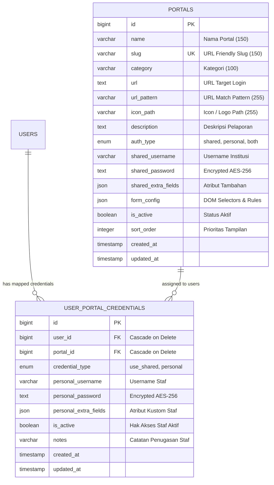

# 🌐 Modul 13: Portal Pelaporan Eksternal Pemerintah & Custom Browser Extension Autofill

Modul ini mendokumentasikan subsistem **Portal Pelaporan Eksternal & Custom Browser Extension Autofill** pada SIMRS Sifast (RS Aisyiyah Siti Fatimah Tulangan). Subsistem ini menghubungkan staf rumah sakit dengan berbagai portal pelaporan resmi kementerian dan lembaga negara (Kemenkes RI dan BKKBN) melalui arsitektur hibrida: integrasi backend Laravel 12, frontend React 19 / Inertia.js v2, dan ekstensi browser Chromium Manifest V3 dengan prinsip keamanan **Zero-Persistence**.

---

## 📋 Informasi Metadata Modul

| Atribut | Nilai |
| :--- | :--- |
| **Kode Modul** | `MODUL-13-PORTAL-EKSTERNAL` |
| **Tech Stack Backend** | Laravel 12, PHP 8.2+, Eloquent ORM, Symmetric AES-256-CBC Encryption, Pest PHP |
| **Tech Stack Frontend** | React 19, TypeScript, Inertia.js v2, Tailwind CSS v4, Lucide React, Shadcn UI |
| **Browser Extension** | Chromium Manifest V3, Pure Vanilla ES2022+, Zero-Persistence RAM Queue, Node.js 22 Test Runner |
| **Status Implementasi** | **Plan 1 (Backend Core & DB):** `SELESAI (PASS)`<br/>**Plan 2 (Admin Portal & Mapping):** `SELESAI (PASS)`<br/>**Plan 3 (Browser Extension MV3):** `SIAP DIIMPLEMENTASIKAN`<br/>**Plan 4 (Halaman Pengguna & ZIP):** `TERENCANA` |
| **Total Cakupan Pengujian** | 62 Pest Test Cases (354 Assertions) — Seluruhnya Lulus (`PASS`) |
| **Relasi Modul Onboarding** | [Modul 01: Arsitektur & Tech Stack](./01-ARSITEKTUR-DAN-TECH-STACK.md), [Modul 02b: Frontend React Inertia](./02b-PANDUAN-FRONTEND-REACT-INERTIA-UNTUK-LARAVEL-DEV.md) |

---

## 📑 Daftar Isi (9 Bab Definitif)

- [Bab 1: 📌 Ikhtisar Sistem & Filosofi Desain](#bab-1--ikhtisar-sistem--filosofi-desain)
  - [1.1 Konteks Bisnis & Latar Belakang Pelaporan](#11-konteks-bisnis--latar-belakang-pelaporan)
  - [1.2 3 Pilar Keamanan & Filosofi Arsitektur](#12-3-pilar-keamanan--filosofi-arsitektur)
  - [1.3 Diagram Arsitektur Interaksi End-to-End](#13-diagram-arsitektur-interaksi-end-to-end)
- [Bab 2: 📊 Matriks Status Implementasi & Roadmap Modul](#bab-2--matriks-status-implementasi--roadmap-modul)
  - [2.1 Matriks Status 4 Rencana Modular](#21-matriks-status-4-rencana-modular)
  - [2.2 Matriks Fitur, Rute, Otorisasi, & Ketersediaan](#22-matriks-fitur-rute-otorisasi--ketersediaan)
- [Bab 3: 🗄️ Model Data & Skema Database (Plan 1 - Selesai)](#bab-3-️-model-data--skema-database-plan-1---selesai)
  - [3.1 Skema Tabel `portals` (Master Portal Eksternal)](#31-skema-tabel-portals-master-portal-eksternal)
  - [3.2 Spesifikasi Format JSON `form_config`](#32-spesifikasi-format-json-form_config)
  - [3.3 Skema Tabel `user_portal_credentials` (Mapping Akses & Akun Personal)](#33-skema-tabel-user_portal_credentials-mapping-akses--akun-personal)
  - [3.4 Enkripsi Simetris Kredensial & Proteksi Model Eloquent](#34-enkripsi-simetris-kredensial--proteksi-model-eloquent)
  - [3.5 Ringkasan 8 Kelompok Portal Resmi Bawaan Seeder (`PortalSeeder.php`)](#35-ringkasan-8-kelompok-portal-resmi-bawaan-seeder-portalseederphp)
  - [3.6 Panduan Uji Coba Cepat (Hands-on Verification Bab 3)](#36-panduan-uji-coba-cepat-hands-on-verification-bab-3)
- [Bab 4: ⚙️ Backend Core & Arsitektur Service Layer (Plan 1 - Selesai)](#bab-4-️-backend-core--arsitektur-service-layer-plan-1---selesai)
  - [4.1 Arsitektur Service Class Layer (`App\Services\Portal\*`)](#41-arsitektur-service-class-layer-appservicesportal)
  - [4.2 Defense-in-Depth Authorization & Middleware Perimeter](#42-defense-in-depth-authorization--middleware-perimeter)
  - [4.3 Kontrak API Endpoint Dispatch Token](#43-kontrak-api-endpoint-dispatch-token)
  - [4.4 Peta Berkas & Panduan Code Review (Plan 1)](#44-peta-berkas--panduan-code-review-plan-1)
  - [4.5 Panduan Uji Coba Cepat (Hands-on Verification Bab 4)](#45-panduan-uji-coba-cepat-hands-on-verification-bab-4)
- [Bab 5: 🖥️ Modul Admin SIMRS: Master Portal & Mapping Akses (Plan 2 - Selesai)](#bab-5-️-modul-admin-simrs-master-portal--mapping-akses-plan-2---selesai)
  - [5.1 Manajemen Master Portal (`/admin/portals`)](#51-manajemen-master-portal-adminportals)
  - [5.2 Visual Form Configuration Editor](#52-visual-form-configuration-editor)
  - [5.3 Matriks Mapping Akses Dual-Mode (`/admin/portals/mapping`)](#53-matriks-mapping-akses-dual-mode-adminportalsmapping)
  - [5.4 Peta Berkas & Panduan Code Review (Plan 2)](#54-peta-berkas--panduan-code-review-plan-2)
  - [5.5 Panduan Uji Coba Langsung (Hands-on Verification Bab 5)](#55-panduan-uji-coba-langsung-hands-on-verification-bab-5)
- [Bab 6: 🧩 Custom Browser Extension Manifest V3 (Plan 3 - Siap Diimplementasikan)](#bab-6--custom-browser-extension-manifest-v3-plan-3---siap-diimplementasikan)
  - [6.1 Filosofi & Batasan Arsitektur Zero-Persistence](#61-filosofi--batasan-arsitektur-zero-persistence)
  - [6.2 Konfigurasi `manifest.json` (Chromium Manifest V3)](#62-konfigurasi-manifestjson-chromium-manifest-v3)
  - [6.3 Background Service Worker (`background.js`) & In-Memory Queue](#63-background-service-worker-backgroundjs--in-memory-queue)
  - [6.4 Content Bridge SIMRS (`content-simrs.js`) & Handshake Protocol](#64-content-bridge-simrs-content-simrsjs--handshake-protocol)
  - [6.5 Content Engine Target (`content-autofill.js`) & Heuristic Scanner](#65-content-engine-target-content-autofilljs--heuristic-scanner)
  - [6.6 Admin Popup Tool (`popup/`) & Form Inspector 1-Klik](#66-admin-popup-tool-popup--form-inspector-1-klik)
  - [6.7 Peta Berkas Target `rs-extension/` & Panduan Code Review (Plan 3)](#67-peta-berkas-target-rs-extension--panduan-code-review-plan-3)
  - [6.8 Panduan Uji Coba Cepat (Hands-on Extension Verification)](#68-panduan-uji-coba-cepat-hands-on-extension-verification)
- [Bab 7: 🚀 Modul Pengguna: Portal Agregator & Distribusi Ekstensi (Plan 4 - Terencana)](#bab-7--modul-pengguna-portal-agregator--distribusi-ekstensi-plan-4---terencana)
  - [7.1 Halaman Portal Pelaporan Pengguna (`/portal-pelaporan`)](#71-halaman-portal-pelaporan-pengguna-portal-pelaporan)
  - [7.2 Deteksi Handshake Ekstensi di UI React](#72-deteksi-handshake-ekstensi-di-ui-react)
  - [7.3 Modal Kredensial Pribadi Mandiri (*Self-Service Credential Modal*)](#73-modal-kredensial-pribadi-mandiri-self-service-credential-modal)
  - [7.4 Mekanisme Distribusi & Packaging File ZIP Ekstensi](#74-mekanisme-distribusi--packaging-file-zip-ekstensi)
  - [7.5 Peta Berkas Target & Panduan Code Review (Plan 4)](#75-peta-berkas-target--panduan-code-review-plan-4)
  - [7.6 Panduan Uji Coba Cepat (Hands-on Verification Bab 7)](#76-panduan-uji-coba-cepat-hands-on-verification-bab-7)
- [Bab 8: 🧪 Panduan Pengujian & Skenario Verifikasi (Master Testing Guide)](#bab-8--panduan-pengujian--skenario-verifikasi-master-testing-guide)
- [Bab 9: 🛠️ Runbook Operasional, Pemeliharaan & Troubleshooting](#bab-9-️-runbook-operasional-pemeliharaan--troubleshooting)

---

## Bab 1: 📌 Ikhtisar Sistem & Filosofi Desain

### 1.1 Konteks Bisnis & Latar Belakang Pelaporan

Sebagai institusi pelayanan kesehatan terakreditasi, Rumah Sakit Aisyiyah Siti Fatimah Tulangan memiliki kewajiban regulasi untuk menyampaikan data operasional, mutu, surveilans epidemiologi, dan demografi secara berkala kepada otoritas kesehatan Republik Indonesia. Platform eksternal pemerintah yang digunakan meliputi:

1. **Kementerian Kesehatan RI (Kemenkes):**
   - **SIRS Online:** Sistem Informasi Rumah Sakit Online Ditjen Yankes untuk pelaporan kapasitas tempat tidur, ketenagaan, dan morbiditas/mortalitas.
   - **SITB (Sistem Informasi Tuberkulosis):** Pencatatan dan pelaporan program penanggulangan tuberkulosis sensitif dan resisten obat tingkat Jawa Timur.
   - **SIHA 2.1 (Sistem Informasi HIV/AIDS dan IMS):** Surveilans dan pelaporan pengobatan HIV/AIDS, IMS, dan pencegahan penularan ibu ke anak (PPIA).
   - **MPDN (Maternal Perinatal Death Notification):** Pelaporan kematian maternal dan perinatal secara real-time guna audit maternal perinatal.
   - **SIGIZI Terpadu:** Sistem pemantauan status gizi balita, intervensi stunting, dan kesehatan keluarga.
   - **SATU SEHAT Platform:** Integrasi rekam medis elektronik nasional sesuai standar FHIR HL7.
   - **MutuFasyankes:** Pelaporan Indikator Nasional Mutu (INM), Insiden Keselamatan Pasien (IKP), Program Pengendalian Resistensi Antimikroba (PPRA), dan Sistem Informasi Manajemen Akreditasi RS (SIMAR).

2. **Badan Kependudukan dan Keluarga Berencana Nasional (BKKBN / Kemendukbangga):**
   - **SIRIKA:** Sistem Informasi Rekonsiliasi Intervensi Penurunan Stunting BKKBN.
   - **New SIGA:** Sistem Informasi Keluarga untuk pencatatan pelayanan kontrasepsi dan keluarga berencana.

#### Masalah Operasional Lapangan (*Pain Points*)
Sebelum subsistem ini dibangun, staf rumah sakit menghadapi kendala operasional yang berulang setiap hari:
* **Fragmentasi Akses & URL:** Terdapat puluhan URL login pemerintah yang terpisah. Staf mengandalkan bookmark browser acak di workstation masing-masing.
* **Risiko Kebocoran Akun:** Password sering dicatat di kertas tempel (*sticky notes*) di layar monitor atau lembar spreadsheet lokal yang tidak terenkripsi, memicu risiko pelanggaran kepatuhan keamanan informasi medis.
* **Rotasi Shift & Staf:** Pergantian jadwal dinas sering terhambat karena petugas jaga malam tidak memiliki kata sandi akun pelaporan terkini.
* **Inefisiensi Waktu:** Staf menghabiskan waktu signifikan untuk proses login berulang dan navigasi manual alih-alih fokus pada verifikasi validitas data medis yang dilaporkan.

#### Solusi Arsitektur Sifast
Subsistem Portal Pelaporan Eksternal menyelesaikan masalah ini secara menyeluruh melalui:
1. **Pusat Agregator SIMRS:** Satu dashboard internal terpadu di SIMRS yang hanya menampilkan portal-portal resmi sesuai penugasan dan hak akses masing-masing petugas.
2. **Penyimpanan Terenkripsi Terpusat:** Kredensial institusi dan personal disimpan di database SIMRS dengan enkripsi simetris standar industri (`AES-256-CBC`).
3. **Custom Chromium Extension Autofill:** Ekstensi browser ringan berstandar Google Manifest V3 yang menyuntikkan username dan password secara instan ke form web target tanpa pernah membocorkan password plaintext ke layar staf maupun ke hard disk browser.

---

### 1.2 3 Pilar Keamanan & Filosofi Arsitektur

Arsitektur modul ini dirancang dengan prinsip *Defense-in-Depth* berlandaskan 3 pilar utama:

```
+-----------------------------------------------------------------------------------+
|                            3 PILAR KEAMANAN MODUL 13                             |
+-----------------------------------------------------------------------------------+
|                                                                                   |
|  [Pilar 1: Zero-Persistence RAM]       [Pilar 2: Hybrid Credential]              |
|  * Tidak ada chrome.storage / cookies  * Shared institutional account (Admin IT)  |
|  * Volatile Map di Service Worker RAM  * Personal staff account (Self-service)    |
|  * TTL 30s auto-expire + auto-flush    * Granular access control & audit trail    |
|                                                                                   |
|                      [Pilar 3: Native Synthetic Dispatcher]                      |
|                      * Bypass setter prototype (setNativeValue)                   |
|                      * Support React, Vue, Angular, jQuery, SPA                   |
|                      * Full bubbling: input -> change -> blur                     |
+-----------------------------------------------------------------------------------+
```

#### 1. Zero-Persistence Security (Kerahasiaan Mutlak Tanpa Jejak Persisten)
Kelemahan fatal pada password manager komersial atau skrip autofill sederhana adalah penyimpanan kredensial pada media penyimpanan lokal browser (`chrome.storage.local`, `chrome.storage.sync`, `localStorage`, atau Web Cookies). Jika workstation rumah sakit diakses bersama atau terserang malware lokal, kredensial tersebut dapat diekstrak secara mudah.

Pada subsistem ini:
- Ekstensi browser **SAMA SEKALI TIDAK MENGGUNAKAN** media penyimpanan persisten apapun.
- Kredensial hanya diterima saat pengguna secara sadar mengklik kartu portal di SIMRS melalui panggilan API berotorisasi (`POST /portal-pelaporan/{portal}/dispatch-token`).
- Token dan kredensial dikirimkan ke Background Service Worker ekstensi (`background.js`) dan disimpan secara eksklusif di dalam memori **RAM** volatile menggunakan struktur data `Map<tabId, credentialPayload>`.
- Diberlakukan batas waktu kedaluwarsa ketat (**Time-To-Live / TTL = 30 detik**). Jika tab target tidak terbuka atau gagal di-autofill dalam 30 detik, entri di RAM dihapus secara otomatis (*auto-expire*).
- Segera setelah Content Engine di halaman target selesai melakukan pengisian form, content script mengirimkan sinyal konsumsi selesai dan Service Worker **langsung menghapus bersih** entri kredensial dari RAM (`pendingTabs.delete(tabId)` / *auto-flush*).
- Jika pengguna menutup tab sebelum halaman termuat, listener darurat `chrome.tabs.onRemoved` memastikan memori RAM dibersihkan seketika.

#### 2. Hybrid Credential Model (Model Kredensial Hibrida)
Kebutuhan pelaporan institusi kesehatan memiliki dualisme karakteristik akun:
- **Akun Bersama Lembaga (*Shared Institutional Account*):** Digunakan untuk portal yang hanya memberikan 1 akun resmi per rumah sakit (contoh: SIRS Online Yankes, SIRIKA BKKBN). Password akun ini adalah aset institusi yang sangat sensitif. Password dikelola dan di-input terpusat oleh Administrator IT RS. Staf pelapor dapat melakukan login otomatis melalui ekstensi tanpa pernah mengetahui string kata sandi aslinya.
- **Akun Mandiri Staf (*Personal Account*):** Digunakan untuk portal yang mewajibkan kredensial individual berdasarkan NIK, SIP, atau akun email pribadi petugas (contoh: SIHA 2.1, MPDN Kemenkes). Administrator RS mengendalikan izin akses (mengizinkan staf membuka portal terkait), sedangkan username dan password pribadi diisi serta diperbarui secara mandiri oleh masing-masing staf (*self-service credential management*).
- Master portal mendukung fleksibilitas konfigurasi `auth_type`:
  - `shared`: Portal hanya mengizinkan akun bersama institusi.
  - `personal`: Portal hanya mengizinkan akun personal mandiri staf.
  - `both`: Portal mendukung fleksibilitas akun bersama maupun akun personal, ditentukan secara granular per individu petugas pada tabel mapping.

#### 3. Native Synthetic Event Dispatcher (`setNativeValue` Prototype Setter Bypass)
Mayoritas portal modern pemerintah (seperti SATU SEHAT dan New SIGA) dibangun menggunakan framework reaktif modern berbasis JavaScript (React, Vue, Angular). Framework-framework ini melakukan pembungkusan (*overriding*) terhadap setter properti `value` pada antarmuka DOM `HTMLInputElement`.

Jika ekstensi browser hanya menjalankan penugasan standar seperti:
```javascript
// PENDEKATAN SALAH (Gagal pada React / Vue / Angular):
inputElement.value = "username_rahasia";
```
State internal framework tidak akan pernah terpicu. Ketika tombol login diklik atau divalidasi, form akan tetap menganggap bidang input kosong (*validation error*).

Ekstensi Sifast mengatasi kendala ini secara elegan dengan memanggil descriptor setter prototipe asli browser:
```javascript
// PENDEKATAN TEPAT (Universal Form Compatibility):
function setNativeValue(element, value) {
    const valueSetter = Object.getOwnPropertyDescriptor(element, 'value')?.set;
    const prototype = Object.getPrototypeOf(element);
    const prototypeValueSetter = Object.getOwnPropertyDescriptor(prototype, 'value')?.set;

    if (prototypeValueSetter && valueSetter !== prototypeValueSetter) {
        prototypeValueSetter.call(element, value);
    } else if (valueSetter) {
        valueSetter.call(element, value);
    } else {
        element.value = value;
    }

    // Picu rangkaian synthetic events lengkap dengan propagasi bubbling
    element.dispatchEvent(new Event('input', { bubbles: true }));
    element.dispatchEvent(new Event('change', { bubbles: true }));
    element.dispatchEvent(new Event('blur', { bubbles: true }));
}
```
Metode ini menjamin 100% kompatibilitas baik pada portal HTML murni, jQuery klasik, maupun Single Page Application (SPA) reaktif.

---

### 1.3 Diagram Arsitektur Interaksi End-to-End

Diagram berikut mengilustrasikan siklus hidup peluncuran portal dan aliran kredensial dari backend SIMRS Sifast, melalui ekstensi browser, hingga berhasil terinjeksi ke formulir login web target pemerintah:

```mermaid
flowchart TD
    subgraph SIF_BE["SIMRS Sifast (Laravel 12 Backend)"]
        DB[("Database PostgreSQL/MySQL<br/>Tabel portals & user_portal_credentials<br/>(Password Terenkripsi AES-256-CBC)")]
        PDS["PortalDispatchService<br/>(Resolusi Kredensial & Dekripsi On-The-Fly)"]
        DTOKEN["Endpoint POST /portal-pelaporan/{portal}/dispatch-token<br/>(Throttle: 30/min, Policy: dispatchToken)"]
        DB --> PDS
        PDS --> DTOKEN
    end

    subgraph SIF_FE["SIMRS Sifast (React 19 & Inertia v2 Frontend)"]
        UI["Halaman /portal-pelaporan<br/>(Grid Kartu Portal & Indikator Ekstensi)"]
        CLICK["User Mengklik Kartu Portal"]
        API_CALL["Axios Request POST dispatch-token"]
        C_EVENT["Emisi DOM CustomEvent:<br/>'SIFAST_PORTAL_LAUNCH'<br/>(Target URL & Kredensial)"]
        UI --> CLICK
        CLICK --> API_CALL
        API_CALL -.->|HTTPS POST Request| DTOKEN
        DTOKEN -.->|JSON Response One-Time Kredensial| API_CALL
        API_CALL --> C_EVENT
    end

    subgraph EXT_BRIDGE["Content Bridge Ekstensi (content-simrs.js)"]
        HANDSHAKE["DOM Dataset Handshake:<br/>html[data-sifast-extension-installed='true']"]
        EVT_LISTEN["Event Listener DOM 'SIFAST_PORTAL_LAUNCH'"]
        MSG_EXT["chrome.runtime.sendMessage:<br/>{ action: 'LAUNCH_PORTAL', payload }"]
        HANDSHAKE -.->|Inisialisasi Badge Aktif| UI
        C_EVENT --> EVT_LISTEN
        EVT_LISTEN --> MSG_EXT
    end

    subgraph EXT_BG["Background Service Worker (background.js)"]
        RAM_QUEUE[("Volatile RAM Map (Zero-Persistence)<br/>pendingTabs.set(targetTabId, payload)<br/>TTL: 30 Detik Auto-Expire")]
        NEW_TAB["Buka Tab Baru Browser Target<br/>chrome.tabs.create({ url: targetUrl })"]
        MSG_EXT --> NEW_TAB
        NEW_TAB --> RAM_QUEUE
    end

    subgraph EXT_AUTOFILL["Content Engine Target (content-autofill.js)"]
        REQ_CRED["Query Kredensial via chrome.runtime.sendMessage:<br/>{ action: 'GET_CREDENTIALS', tabId }"]
        FIND_DOM["Resolusi Selector DOM Form Target<br/>(form_config Priority Chain / Heuristic Scanner)"]
        SET_NATIVE["Bypass Setter Framework:<br/>setNativeValue(input, value)<br/>Dispatch Events: input, change, blur"]
        FLUSH_RAM["chrome.runtime.sendMessage:<br/>{ action: 'CREDENTIALS_CONSUMED' }"]
        FOCUS_CAPTCHA["Auto-Focus ke Input CAPTCHA<br/>(Jika Ditemukan / Submit Manual)"]
        
        REQ_CRED -.->|Ambil Payload Berbasis tabId| RAM_QUEUE
        RAM_QUEUE -.->|Kirim Payload Sekali Pakai| REQ_CRED
        REQ_CRED --> FIND_DOM
        FIND_DOM --> SET_NATIVE
        SET_NATIVE --> FLUSH_RAM
        FLUSH_RAM -.->|Hapus Bersih dari RAM: pendingTabs.delete(tabId)| RAM_QUEUE
        SET_NATIVE --> FOCUS_CAPTCHA
    end

    subgraph TARGET_WEB["Platform Pelaporan Resmi Pemerintah"]
        LOGIN_FORM["Halaman Login Portal Target<br/>(Kemenkes / BKKBN / dsb)"]
        SET_NATIVE -->|Injeksi Otomatis Nilai Input| LOGIN_FORM
    end
```

---

## Bab 2: 📊 Matriks Status Implementasi & Roadmap Modul

### 2.1 Matriks Status 4 Rencana Modular

Pengembangan subsistem Portal Pelaporan Eksternal dibagi menjadi 4 tahapan (*Implementation Plans*). Tabel di bawah ini merangkum status ketersediaan setiap rencana kerja:

| Plan | Nama Rencana Kerja | Ruang Lingkup Fungsional | Status Saat Ini | Hasil Verifikasi |
| :--- | :--- | :--- | :--- | :--- |
| **Plan 1** | **Fondasi Backend, Database, Service Layer, & Otorisasi** | Skema tabel `portals` & `user_portal_credentials`, Model Eloquent terenkripsi, `PortalDispatchService`, `PortalPersonalCredentialService`, `PortalPolicy`, Controller API, rute web, dan database seeder 8 kelompok portal. | **`TERIMPLEMENTASI (PASS)`** | 29 Pest Tests Lulus (100% PASS) |
| **Plan 2** | **Modul Admin SIMRS: Master Portal & Mapping Akses Dual-View** | `AdminPortalService`, `AdminPortalMappingService`, `AdminPortalController`, `AdminPortalMappingController`, Halaman React/Inertia (`Index.tsx`, `Form.tsx`, `Mapping.tsx`), visual `FormConfigEditor`, `SelectorTagInput`, instant auto-save row, bulk sync. | **`TERIMPLEMENTASI (PASS)`** | 33 Pest Tests Tambahan Lulus (Total 62 Tests PASS) |
| **Plan 3** | **Custom Browser Extension Chromium Manifest V3 (`rs-extension/`)** | Berkas manifes `manifest.json` (MV3), Background Service Worker (`background.js`) dengan RAM queue berbasis `tabId` (TTL 30s), Content Bridge SIMRS (`content-simrs.js`), Content Engine Target (`content-autofill.js`) dengan `setNativeValue` & fallback heuristic scanner, UI popup inspector (`popup/`), suite pengujian unit Node.js 22. | **`SIAP DIIMPLEMENTASIKAN`** | Spesifikasi lengkap & siap dieksekusi |
| **Plan 4** | **Halaman Pengguna: Portal Agregator & Distribusi Ekstensi** | Halaman `/portal-pelaporan` untuk seluruh staf rumah sakit, pencarian live & filter kategori, kartu interaktif dengan deteksi ekstensi (badge hijau status aktif / banner panduan unduh), modal self-service update password pribadi, endpoint download file ZIP ekstensi terkompresi. | **`TERENCANA`** | Desain UI dan spesifikasi teknis telah disetujui |

---

### 2.2 Matriks Fitur, Rute, Otorisasi, & Ketersediaan

Berikut adalah peta rute HTTP, controller penanggung jawab, middleware pengamanan, otorisasi Gate/Policy, dan status operasional sistem:

| Fitur & Kegunaan | HTTP Method & URL | Controller & Action | Middleware & Policy Gate | Status Modul |
| :--- | :--- | :--- | :--- | :--- |
| **Pengambilan Kredensial Sekali Pakai (One-Time Dispatch Token)** | `POST /portal-pelaporan/{portal}/dispatch-token` | [`PortalDispatchController@dispatch`](../../app/Http/Controllers/PortalDispatchController.php) | `auth`, `verified`, `throttle:30,1`, `can:dispatchToken,portal` | Selesai (Plan 1) |
| **Pembaruan Mandiri Password Personal Staf (Self-Service)** | `PUT /portal-pelaporan/{portal}/personal-credentials` | [`PortalPersonalCredentialController@update`](../../app/Http/Controllers/PortalPersonalCredentialController.php) | `auth`, `verified`, `throttle:30,1`, `can:updatePersonalCredential,portal` | Selesai (Plan 1) |
| **Daftar Master Portal (Admin)** | `GET /admin/portals` | [`AdminPortalController@index`](../../app/Http/Controllers/Admin/AdminPortalController.php) | `auth`, `verified`, `can:manage,App\Models\Portal` | Selesai (Plan 2) |
| **Form Tambah Master Portal** | `GET /admin/portals/create` | [`AdminPortalController@create`](../../app/Http/Controllers/Admin/AdminPortalController.php) | `auth`, `verified`, `can:manage,App\Models\Portal` | Selesai (Plan 2) |
| **Simpan Master Portal Baru** | `POST /admin/portals` | [`AdminPortalController@store`](../../app/Http/Controllers/Admin/AdminPortalController.php) | `auth`, `verified`, `can:manage,App\Models\Portal` | Selesai (Plan 2) |
| **Form Edit Master Portal** | `GET /admin/portals/{portal}/edit` | [`AdminPortalController@edit`](../../app/Http/Controllers/Admin/AdminPortalController.php) | `auth`, `verified`, `can:manage,App\Models\Portal` | Selesai (Plan 2) |
| **Update Data Master Portal** | `PUT /admin/portals/{portal}` | [`AdminPortalController@update`](../../app/Http/Controllers/Admin/AdminPortalController.php) | `auth`, `verified`, `can:manage,App\Models\Portal` | Selesai (Plan 2) |
| **Hapus Master Portal (Soft/Cascade)** | `DELETE /admin/portals/{portal}` | [`AdminPortalController@destroy`](../../app/Http/Controllers/Admin/AdminPortalController.php) | `auth`, `verified`, `can:manage,App\Models\Portal` | Selesai (Plan 2) |
| **Toggle Status Aktif/Nonaktif Portal** | `PATCH /admin/portals/{portal}/toggle-active` | [`AdminPortalController@toggleActive`](../../app/Http/Controllers/Admin/AdminPortalController.php) | `auth`, `verified`, `can:manage,App\Models\Portal` | Selesai (Plan 2) |
| **Matriks Mapping Akses Petugas (Dual-View)** | `GET /admin/portals/mapping` | [`AdminPortalMappingController@index`](../../app/Http/Controllers/Admin/AdminPortalMappingController.php) | `auth`, `verified`, `can:manage,App\Models\Portal` | Selesai (Plan 2) |
| **Simpan Baris Tunggal Instant Auto-Save** | `POST /admin/portals/mapping/save-row` | [`AdminPortalMappingController@saveRow`](../../app/Http/Controllers/Admin/AdminPortalMappingController.php) | `auth`, `verified`, `can:manage,App\Models\Portal` | Selesai (Plan 2) |
| **Sinkronisasi Massal Portal ke Banyak Petugas** | `POST /admin/portals/mapping/sync-portal` | [`AdminPortalMappingController@syncPortal`](../../app/Http/Controllers/Admin/AdminPortalMappingController.php) | `auth`, `verified`, `can:manage,App\Models\Portal` | Selesai (Plan 2) |
| **Sinkronisasi Massal Petugas ke Banyak Portal** | `POST /admin/portals/mapping/sync-user` | [`AdminPortalMappingController@syncUser`](../../app/Http/Controllers/Admin/AdminPortalMappingController.php) | `auth`, `verified`, `can:manage,App\Models\Portal` | Selesai (Plan 2) |
| **Update Kredensial Tunggal Mapping** | `PATCH /admin/portals/mapping/{credential}` | [`AdminPortalMappingController@updateCredential`](../../app/Http/Controllers/Admin/AdminPortalMappingController.php) | `auth`, `verified`, `can:manage,App\Models\Portal` | Selesai (Plan 2) |
| **Cabut Akses Kredensial Mapping** | `DELETE /admin/portals/mapping/{credential}` | [`AdminPortalMappingController@destroyCredential`](../../app/Http/Controllers/Admin/AdminPortalMappingController.php) | `auth`, `verified`, `can:manage,App\Models\Portal` | Selesai (Plan 2) |
| **Halaman Agregator Portal Pengguna** | `GET /portal-pelaporan` | `PortalPelaporanController@index` | `auth`, `verified`, `can:viewAny,App\Models\Portal` | Terencana (Plan 4) |
| **Unduh Berkas ZIP Paket Ekstensi** | `GET /portal-pelaporan/extension/download` | `PortalExtensionDownloadController@download` | `auth`, `verified` | Terencana (Plan 4) |

---

## Bab 3: 🗄️ Model Data & Skema Database (Plan 1 - Selesai)

Skema database dirancang dengan normalisasi relasional tinggi, integritas referensial penuh (*Foreign Key Cascadable*), dan proteksi enkripsi kolom otomatis pada lapisan Eloquent Model.



---

### 3.1 Skema Tabel `portals` (Master Portal Eksternal)

Migrasi database didefinisikan pada [`database/migrations/2026_09_09_100000_create_portals_table.php`](../../database/migrations/2026_09_09_100000_create_portals_table.php). Tabel ini menyimpan master informasi seluruh website pelaporan eksternal:

| Nama Kolom | Tipe Data & Modifier | Default | Deskripsi & Nilai Contoh |
| :--- | :--- | :--- | :--- |
| `id` | `BIGINT UNSIGNED AUTO_INCREMENT` | *None* | Primary Key unik portal. |
| `name` | `VARCHAR(150)` | *None* | Nama resmi portal pelaporan (contoh: `"SIRIKA (BKKBN)"`, `"SIHA 2.1 (Kemenkes)"`). |
| `slug` | `VARCHAR(150) UNIQUE` | *None* | Identifier ramah URL untuk route-model binding (contoh: `"sirika-bkkbn"`). Diisi otomatis via slug generator jika kosong. |
| `category` | `VARCHAR(100)` | *None* | Pengelompokan portal untuk tab filter di UI (contoh: `"Kemenkes"`, `"BKKBN"`, `"Mutu & Akreditasi"`). |
| `url` | `TEXT` | *None* | Alamat URL lengkap halaman login website target (contoh: `"https://siga-sirika.bkkbn.go.id/login"`). |
| `url_pattern` | `VARCHAR(255) NULLABLE` | `null` | Pola pencocokan URL untuk izin ekstensi browser (contoh: `"*://siga-sirika.bkkbn.go.id/*"`). |
| `icon_path` | `VARCHAR(255) NULLABLE` | `null` | Path lokasi berkas logo lokal atau nama identifier ikon Lucide React. |
| `description` | `TEXT NULLABLE` | `null` | Penjelasan fungsi pelaporan dan unit kerja yang bertanggung jawab. |
| `auth_type` | `ENUM('shared', 'personal', 'both')` | `'both'` | Tipe kredensial yang didukung: akun bersama, akun individu, atau keduanya. |
| `shared_username` | `VARCHAR(255) NULLABLE` | `null` | Username akun bersama institusi rumah sakit. |
| `shared_password` | `TEXT NULLABLE` | `null` | Kata sandi akun bersama terenkripsi simetris `AES-256-CBC` via Laravel `Crypt`. |
| `shared_extra_fields` | `JSON NULLABLE` | `null` | Pasangan data tambahan berbentuk JSON (misal kode registrasi RS, role selector, token instansi). |
| `form_config` | `JSON NULLABLE` | `null` | Spesifikasi DOM selector dan parameter autofill yang dikonsumsi oleh ekstensi browser. |
| `is_active` | `BOOLEAN` | `true` | Flag ketersediaan portal. Jika `false`, portal dinonaktifkan dari seluruh staf. |
| `sort_order` | `INTEGER` | `0` | Urutan tampilan prioritas kartu portal pada halaman agregator. |
| `created_at` | `TIMESTAMP NULLABLE` | `null` | Jejak audit waktu pembuatan entri. |
| `updated_at` | `TIMESTAMP NULLABLE` | `null` | Jejak audit waktu modifikasi terakhir. |

---

### 3.2 Spesifikasi Format JSON `form_config`

Kolom `form_config` pada tabel `portals` menyimpan aturan pencocokan elemen DOM formulir login website target. Format JSON ini dibaca oleh ekstensi browser Chromium untuk mengeksekusi autofill yang akurat:

```json
{
  "is_spa": false,
  "wait_timeout_ms": 10000,
  "username_field": {
    "selectors": [
      "#c",
      "input[name='email']",
      "input[name='username']",
      "input[type='email']",
      "input[type='text']"
    ]
  },
  "password_field": {
    "selectors": [
      "#password",
      "input[name='password']",
      "input[type='password']"
    ]
  },
  "extra_fields": [
    {
      "name": "hospital_code",
      "selectors": [
        "#fasyankes_id",
        "input[name='hospital_code']"
      ]
    }
  ],
  "auto_submit": false
}
```

#### Rincian Struktur Atribut `form_config`:
1. **`is_spa` (`boolean`):**
   - Menandai apakah portal target merupakan Single Page Application (SPA) berbasis routing client-side seperti React, Vue, atau Angular.
   - Jika bernilai `true`, Content Engine ekstensi akan menggunakan `MutationObserver` atau penundaan cerdas (*smart polling*) untuk menunggu elemen form siap dirender ke DOM sebelum mencoba melakukan injeksi.
2. **`wait_timeout_ms` (`integer`, standar: `10000` ms / 10 detik):**
   - Batas waktu toleransi maksimal bagi ekstensi untuk menunggu kemunculan elemen form di layar sebelum menghentikan pencarian dan mencatat status gagal.
3. **`username_field.selectors` (`array of string`):**
   - Rantai prioritas CSS selector (*fallback priority chain*). Ekstensi mengevaluasi selector dari indeks pertama (paling spesifik, misal `#id`) hingga selector umum. Elemen pertama yang ditemukan di DOM akan digunakan sebagai target injeksi username.
4. **`password_field.selectors` (`array of string`):**
   - Rantai prioritas CSS selector untuk bidang kata sandi (contoh: `["#password", "input[type='password']"]`).
5. **`extra_fields` (`array of objects`, opsional):**
   - Digunakan jika formulir login target membutuhkan input tambahan di luar username dan password biasa, seperti kode Fasyankes Kemenkes, identitas wilayah, atau opsi captcha statis.
6. **`auto_submit` (`boolean`, standar: `false`):**
   - Menentukan apakah form akan langsung di-submit secara otomatis setelah nilai terisi.
   - **Rekomendasi Keamanan:** Selalu disetel `false` jika website target memiliki tantangan verifikasi visual (Google reCAPTCHA, Cloudflare Turnstile, captcha angka acak) atau memerlukan konfirmasi pengguna sebelum masuk.

---

### 3.3 Skema Tabel `user_portal_credentials` (Mapping Akses & Akun Personal)

Migrasi database didefinisikan pada [`database/migrations/2026_09_09_100001_create_user_portal_credentials_table.php`](../../database/migrations/2026_09_09_100001_create_user_portal_credentials_table.php). Tabel ini berfungsi ganda: sebagai tabel relasi *many-to-many* pemberian hak akses staf ke portal, sekaligus sebagai media penyimpanan kredensial akun personal mandiri:

| Nama Kolom | Tipe Data & Modifier | Default | Deskripsi & Nilai Contoh |
| :--- | :--- | :--- | :--- |
| `id` | `BIGINT UNSIGNED AUTO_INCREMENT` | *None* | Primary Key baris relasi mapping. |
| `user_id` | `BIGINT UNSIGNED` | *None* | Foreign Key merujuk ke `users(id)` dengan relasi `cascadeOnDelete()`. |
| `portal_id` | `BIGINT UNSIGNED` | *None* | Foreign Key merujuk ke `portals(id)` dengan relasi `cascadeOnDelete()`. |
| `credential_type` | `ENUM('use_shared', 'personal')` | `'use_shared'` | Menentukan apakah user menggunakan akun bersama RS atau akun pribadinya. |
| `personal_username` | `VARCHAR(255) NULLABLE` | `null` | Username pribadi staf (hanya relevan jika `credential_type = 'personal'`). |
| `personal_password` | `TEXT NULLABLE` | `null` | Kata sandi pribadi staf terenkripsi simetris `AES-256-CBC` via Laravel `Crypt`. |
| `personal_extra_fields` | `JSON NULLABLE` | `null` | Konfigurasi tambahan khusus milik akun staf terkait. |
| `is_active` | `BOOLEAN` | `true` | Switch status hak akses staf ke portal terkait. Jika `false`, staf dilarang mengakses. |
| `notes` | `VARCHAR(255) NULLABLE` | `null` | Catatan administratif penugasan (contoh: `"PJ Pelaporan VK"`, `"Dinas Rawat Inap"`). |
| `created_at` | `TIMESTAMP NULLABLE` | `null` | Jejak audit waktu pemberian hak akses. |
| `updated_at` | `TIMESTAMP NULLABLE` | `null` | Jejak audit modifikasi terakhir hak akses / password personal. |

#### Batasan Integritas Data & Unik (*Database Constraints*):
- **Constraint Unik Pasangan:** `$table->unique(['user_id', 'portal_id']);`
  Menjamin integritas data: satu staf rumah sakit hanya memiliki tepat satu baris konfigurasi mapping per portal. Tidak mungkin terjadi duplikasi mapping pada satu portal untuk pengguna yang sama.
- **Cascade on Delete:** Jika suatu entri portal pada tabel `portals` dihapus, seluruh baris mapping terkait di tabel `user_portal_credentials` akan otomatis terhapus secara bersih oleh DBMS engine (*foreign key cascade*). Demikian pula jika akun user dihapus dari tabel `users`.

---

### 3.4 Enkripsi Simetris Kredensial & Proteksi Model Eloquent

Keamanan kata sandi adalah prioritas mutlak arsitektur subsistem ini. Karena ekstensi browser membutuhkan teks asli kata sandi untuk disuntikkan ke dalam form web target, kata sandi **TIDAK BISA DI-HASH** menggunakan algoritma satu arah seperti Bcrypt atau Argon2. Sebagai gantinya, diterapkan enkripsi simetris berkekuatan tinggi:

#### 1. Mekanisme Enkripsi Simetris Otomatis Laravel
Pada model [`App\Models\Portal`](../../app/Models/Portal.php) dan [`App\Models\UserPortalCredential`](../../app/Models/UserPortalCredential.php), atribut password dideklarasikan menggunakan casting `'encrypted'` pada method `casts()`:

```php
// app/Models/Portal.php
protected function casts(): array
{
    return [
        'shared_password' => 'encrypted',
        'shared_extra_fields' => 'array',
        'form_config' => 'array',
        'is_active' => 'boolean',
        'sort_order' => 'integer',
    ];
}

// app/Models/UserPortalCredential.php
protected function casts(): array
{
    return [
        'personal_password' => 'encrypted',
        'personal_extra_fields' => 'array',
        'is_active' => 'boolean',
    ];
}
```

* **Saat Menyimpan ke Database (`INSERT` / `UPDATE`):** Eloquent secara transparan mengenkripsi string kata sandi menggunakan `Illuminate\Support\Facades\Crypt::encryptString()` menggunakan algoritma **AES-256-CBC** yang diautentikasi dengan Message Authentication Code (**HMAC-SHA256**) berbasis `APP_KEY`. Nilai yang tersimpan di kolom fisik database adalah payload JSON yang di-encode Base64 (`{"iv":"...","value":"...","mac":"..."}`).
* **Saat Membaca dari Database:** Eloquent otomatis mendekripsi ciphertext menjadi string asli hanya ketika properti `$portal->shared_password` atau `$credential->personal_password` diakses langsung dalam kode PHP backend.

#### 2. Pencegahan Kebocoran Payload via Properti `$hidden`
Untuk mencegah kebocoran kredensial plaintext ke dalam serialisasi response (seperti response JSON Inertia `page.props`, response API collection, atau log debugging):
```php
protected $hidden = [
    'shared_password', // Pada Model Portal
];

protected $hidden = [
    'personal_password', // Pada Model UserPortalCredential
];
```
Dengan deklarasi ini, fungsi serialisasi seperti `toArray()` atau `json_encode()` pada model akan otomatis **menghilangkan kolom password** dari hasil output. Kata sandi hanya didekripsi secara khusus oleh [`PortalDispatchService`](../../app/Services/Portal/PortalDispatchService.php) ketika terjadi pemanggilan resmi ke rute `POST /portal-pelaporan/{portal}/dispatch-token`.

---

### 3.5 Ringkasan 8 Kelompok Portal Resmi Bawaan Seeder (`PortalSeeder.php`)

Database Seeder [`database/seeders/PortalSeeder.php`](../../database/seeders/PortalSeeder.php) menyediakan konfigurasi 8 kelompok portal pelaporan resmi pemerintah (mencakup 11 entri portal) yang telah dilengkapi dengan URL, pola URL, tipe otorisasi, dan CSS selector formulir login:

| No | Nama Portal Resmi | Slug | Kategori | Jenis Akun | Tipe Web (SPA?) | Karakteristik Selector Form Login |
| :---: | :--- | :--- | :--- | :---: | :---: | :--- |
| **1** | **SIRIKA (BKKBN)** | `sirika-bkkbn` | BKKBN | Shared | Non-SPA | Input username: `#c`, `input[name='email']`<br/>Password: `#password` |
| **2** | **New SIGA (Kemendukbangga)** | `siga-kemendukbangga` | BKKBN | Shared | **SPA** (Hash route) | URL: `.../#/login`<br/>Input: `#email`, `#password` |
| **3** | **SIHA 2.1 (Kemenkes)** | `siha-kemenkes` | Kemenkes | Both | Non-SPA | Input: `#username`, `input[name='user']`<br/>Password: `#password` |
| **4** | **MPDN (Kemenkes)** | `mpdn-kemenkes` | Kemenkes | Both | Non-SPA | Input: `#username`, `input[name='email']`<br/>Password: `#password` |
| **5** | **SITB Jatim (Kemenkes)** | `sitb-kemenkes` | Kemenkes | Both | Non-SPA | Input: `input[name='username']`, `#username`<br/>Password: `#password` |
| **6** | **SIGIZI Terpadu (Kemenkes)** | `sigizi-kemenkes` | Kemenkes | Both | Non-SPA | Input: `#username`, `input[name='username']`<br/>Password: `#password` |
| **7** | **SATU SEHAT Platform (Kemenkes)** | `satusehat-kemenkes` | Kemenkes | Both | **SPA** | Input: `#email`, `input[type='email']`<br/>Password: `#password` |
| **8** | **MutuFasyankes - IKP** | `mutufasyankes-ikp` | Mutu & Akreditasi | Both | Non-SPA | Input: `#user`, `input[name='user']`<br/>Password: `#pass` |
| **9** | **MutuFasyankes - PPRA** | `mutufasyankes-ppra` | Mutu & Akreditasi | Both | Non-SPA | Input: `input[name='username']`, `#username`<br/>Password: `input[name='password']` |
| **10** | **MutuFasyankes - SIMAR** | `mutufasyankes-simar` | Mutu & Akreditasi | Both | Non-SPA | Input: `#uname`, `input[name='uname']`<br/>Password: `#pwd` |
| **11** | **SIRS Online (Yankes)** | `sirs-online` | Kemenkes | Shared | **SPA** | Input: `input[type='email']`, `input[placeholder*='email' i]`<br/>Password: `input[type='password']` |

> [!NOTE]
> Seluruh password akun bersama bawaan diisi nilai placeholder aman `"GantiPasswordSegera!"`. Administrator IT wajib memperbarui password institusi melalui modul admin SIMRS (`/admin/portals/{portal}/edit`) sebelum modul digunakan di lingkungan produksi.

---

### 3.6 Panduan Uji Coba Cepat (Hands-on Verification Bab 3)

Developer dapat memverifikasi integritas skema database, foreign key cascade, dan mekanisme enkripsi model kapan saja menggunakan pengujian otomatis Pest PHP bawaan:

```bash
# Uji coba integritas skema tabel database portals dan user_portal_credentials
php artisan test tests/Feature/PortalPelaporan/PortalDatabaseSchemaTest.php

# Uji coba enkripsi otomatis, proteksi $hidden, dan relasi Eloquent Model
php artisan test tests/Feature/PortalPelaporan/PortalModelTest.php

# Uji coba idempotensi dan data bawaan database seeder
php artisan test tests/Feature/PortalPelaporan/PortalSeederTest.php
```

*Untuk panduan menyeluruh seluruh 62 skenario pengujian otomatis dan manual, lihat [Bab 8: 🧪 Panduan Pengujian & Skenario Verifikasi](#bab-8--panduan-pengujian--skenario-verifikasi-master-testing-guide).*

---

## Bab 4: ⚙️ Backend Core & Arsitektur Service Layer (Plan 1 - Selesai)

**Status Implementasi:** `[STATUS: SELESAI (Plan 1 - PASS)]`

Bab ini membahas arsitektur backend inti (*backend core*) subsistem Portal Pelaporan Eksternal SIMRS Sifast. Arsitektur ini dibangun dengan memisahkan secara tegas antara lapisan transport HTTP (*Controllers & Requests*), logika bisnis aplikasi (*Concrete Service Layer*), dan kebijakan keamanan akses data (*Policies & Middleware Perimeter*).

```
+----------------------------------------------------------------------------------------------------+
|                         ARSITEKTUR BACKEND CORE PORTAL PELAPORAN EKSTERNAL                         |
+----------------------------------------------------------------------------------------------------+
|                                                                                                    |
|  [HTTP Request]                                                                                    |
|        │                                                                                           |
|        ▼                                                                                           |
|  [Route Middleware Perimeter] ───► can:manage,App\Models\Portal (routes/web.php)                   |
|        │                                                                                           |
|        ▼                                                                                           |
|  [Form Request Validation]   ───► PortalRequest / SaveMappingRowRequest / etc.                     |
|        │                                                                                           |
|        ▼                                                                                           |
|  [Thin Controllers]          ───► AdminPortalController / AdminPortalMappingController /           |
|        │                          PortalDispatchController / PortalPersonalCredentialController    |
|        │                          (Otorisasi: Gate::authorize('manage' / 'dispatchToken', ...))    |
|        ▼                                                                                           |
|  [Service Class Layer]       ───► App\Services\Portal\*                                            |
|        ├── AdminPortalService              ──► CRUD Master, Auto-Slug, Password Preservation       |
|        ├── AdminPortalMappingService       ──► Dual-View Matrix, DB::transaction(), Note Preservation |
|        ├── PortalDispatchService           ──► Decrypt-on-the-fly, Hybrid Credential Resolution    |
|        └── PortalPersonalCredentialService ──► Self-Service Staff Credential Updates               |
|        │                                                                                           |
|        ▼                                                                                           |
|  [Eloquent Models]           ──► Portal / UserPortalCredential / User                              |
|                                   (Casts: 'encrypted' AES-256-CBC, $hidden password)               |
+----------------------------------------------------------------------------------------------------+
```

---

### 4.1 Arsitektur Service Class Layer (`App\Services\Portal\*`)

Untuk mempertahankan standar kode yang bersih, mudah diuji (*testable*), dan mudah dipelihara, SIMRS Sifast menerapkan prinsip **Thin Controllers, Rich Services**. Seluruh kontroler pada modul portal dilarang memuat kueri database yang kompleks, transaksi multi-tabel, maupun logika enkripsi langsung. Tugas kontroler murni terbatas pada menerima *Form Request*, memicu otorisasi *Gate*, memanggil metode pada *Service Class*, dan mengembalikan respon (*Inertia View*, *JSON*, atau *HTTP Redirect*).

Semua service class diinjeksikan ke dalam kontroler menggunakan **Constructor Property Promotion** (PHP 8.2+):
```php
public function __construct(
    private AdminPortalService $portalService,
) {}
```

Subsistem ini digerakkan oleh 4 *concrete service class* yang terspesialisasi di direktori [`app/Services/Portal/`](../../app/Services/Portal/):

---

#### 1. `AdminPortalService` ([`app/Services/Portal/AdminPortalService.php`](../../app/Services/Portal/AdminPortalService.php))
Service ini mengelola siklus hidup (*lifecycle*) data master portal eksternal pada tabel `portals`:

* **`paginatePortals(array $filters = []): array`**
  - Mengambil data portal dengan relasi agregat `withCount('userCredentials')` untuk menampilkan jumlah petugas yang memiliki akses.
  - **Pencarian Multi-Kolom Aman:** Menerapkan filter pencarian teks pada kolom `name`, `category`, dan `url`. Karakter wildcard SQL seperti `%` dan `_` disanitasi menggunakan `addcslashes($search, '%_\\')` untuk mencegah manipulasi query:
    ```php
    $escaped = addcslashes($search, '%_\\');
    $query->where(function ($q) use ($escaped) {
        $q->where('name', 'like', "%{$escaped}%")
            ->orWhere('category', 'like', "%{$escaped}%")
            ->orWhere('url', 'like', "%{$escaped}%");
    });
    ```
  - **Filter Kategori & Status:** Mendukung pemfilteran kategori spesifik (mengabaikan opsi default `_all`) dan status ketersediaan portal (`active` / `inactive`).
  - **Paginasi & Transformasi Koleksi:** Mengurutkan data via scope model `ordered()` (`sort_order ASC`, `name ASC`) dan membatasi 15 item per halaman (`paginate(15)->withQueryString()`). Menggunakan method `through()` untuk membentuk array aman bagi frontend React tanpa membocorkan kata sandi:
    ```php
    'has_shared_password' => filled($portal->shared_password),
    ```
  - Mengembalikan array berisi objek paginator `portals`, koleksi unik `categories` (`Portal::distinct()->pluck('category')`), dan array `filters` aktif.

* **`getFormData(): array`**
  - Menyediakan nilai default konfigurasi DOM selector `default_form_config` saat admin membuka form penambahan portal baru:
    ```php
    $defaultFormConfig = [
        'is_spa' => false,
        'wait_timeout_ms' => 10000,
        'username_field' => [
            'selectors' => ["input[name='username']", "input[name='email']", '#username', '#email'],
        ],
        'password_field' => [
            'selectors' => ["input[name='password']", '#password'],
        ],
        'extra_fields' => [],
        'auto_submit' => false,
    ];
    ```
  - Mengambil daftar kategori unik aktif dari database untuk opsi auto-complete / dropdown pada form.

* **`storePortal(array $data): Portal`**
  - **Auto-Generation Slug:** Jika field `slug` dikosongkan oleh pengguna, service otomatis menghasilkan slug ramah URL berbasis nama portal: `Str::slug((string) $data['name'])`.
  - **Auto Sort Order:** Jika `sort_order` tidak disetel, service menghitung urutan baru dengan rumus: `(Portal::max('sort_order') ?? 0) + 10`.
  - **Fallback Form Config:** Memastikan atribut `form_config` terisi dengan konfigurasi dasar yang valid jika request tidak menyertakannya.
  - Menyimpan entri baru via `Portal::create($data)`.

* **`formatPortalForEdit(Portal $portal): array`**
  - Mempersiapkan atribut portal untuk dioper ke form builder edit Inertia React.
  - Menjaga prinsip **Zero-Leakage**: Nilai `shared_password` tidak dikirim ke form frontend, melainkan digantikan dengan indikator boolean `has_shared_password => filled($portal->shared_password)`.

* **`updatePortal(Portal $portal, array $data): Portal`**
  - **Proteksi Password Kosong Saat Update (*Password Preservation*):**
    ```php
    if (! filled($data['shared_password'] ?? null)) {
        unset($data['shared_password']);
    }

    $portal->update($data);
    ```
    Jika administrator tidak memasukkan teks baru pada input kata sandi bersama (dibiarkan kosong), kunci `shared_password` otomatis dihapus dari array sebelum operasi update dieksekusi. Dengan logika ini, ciphertext kata sandi lama yang telah tersimpan di database **tidak akan pernah tertimpa atau terhapus secara tidak sengaja**.

* **`toggleActive(Portal $portal): bool`**
  - Membalik status keaktifan portal (`$portal->update(['is_active' => ! $portal->is_active])`) dan mengembalikan status boolean baru.

* **`destroyPortal(Portal $portal): bool`**
  - Menghapus rekaman portal dari tabel `portals`. Berkat constraint database `onDelete('cascade')`, seluruh rekaman hak akses staf terkait pada tabel `user_portal_credentials` akan terhapus secara otomatis oleh engine DBMS.

---

#### 2. `AdminPortalMappingService` ([`app/Services/Portal/AdminPortalMappingService.php`](../../app/Services/Portal/AdminPortalMappingService.php))
Service ini mengelola matriks otorisasi penugasan staf dan hak akses portal eksternal:

* **`getMappingData(?int $selectedPortalId, ?int $selectedUserId, string $viewMode = 'portal', array $filters = []): array`**
  - Mendukung dua mode visualisasi data:
    1. **Mode Portal-Centric (`viewMode = 'portal'`):** Memilih 1 portal target, lalu menampilkan daftar seluruh staf RS dengan status akses masing-masing terhadap portal tersebut.
    2. **Mode User-Centric (`viewMode = 'user'`):** Memilih 1 staf RS target, lalu menampilkan daftar seluruh portal eksternal dengan status akses staf tersebut ke masing-masing portal.
  - **Filter Staf Fleksibel:** Menyaring pengguna berdasarkan pencarian nama, email, atau NIK SIMRS (`simrs_nik`), filter departemen/unit kerja (`dep_id`), dan role.
  - **Paginasi & Optimasi Query:** Menghasilkan koleksi staf terpaginasi 50 user per halaman untuk tampilan tabel utama, serta koleksi `all_users` unpaginated (hanya kolom ID, nama, email, NIK, role, dan dep_id) untuk pencarian cepat pada dropdown selector.
  - **Indexing Akses O(1):** Mengambil mapping hak akses aktif dan mengindeksnya dengan `keyBy('user_id')` (pada mode portal) atau `keyBy('portal_id')` (pada mode user) sehingga komponen frontend dapat memeriksa status akses secara instan tanpa iterasi linier.

* **`syncPortalUsers(Portal $portal, array $assignments): void` & `syncUserPortals(User $user, array $assignments): void`**
  - **Integritas Transaksi DB Massal (`DB::transaction()`):**
    Operasi penyimpanan massal dibungkus secara utuh dalam transaksi basis data untuk menjamin kepatuhan ACID (*Atomicity, Consistency, Isolation, Durability*):
    ```php
    DB::transaction(function () use ($portal, $assignments): void {
        foreach ($assignments as $item) {
            $userId = (int) $item['user_id'];
            $hasAccess = (bool) $item['has_access'];

            if ($hasAccess) {
                UserPortalCredential::updateOrCreate(
                    [
                        'portal_id' => $portal->id,
                        'user_id' => $userId,
                    ],
                    [
                        'credential_type' => $item['credential_type'] ?? 'use_shared',
                        'is_active' => true,
                        'notes' => $item['notes'] ?? null,
                    ]
                );
            } else {
                UserPortalCredential::where('portal_id', $portal->id)
                    ->where('user_id', $userId)
                    ->delete();
            }
        }
    });
    ```
    Jika terjadi kegagalan jaringan atau galat database di tengah iterasi ratusan pengguna, sistem otomatis me-rollback seluruh operasi tanpa meninggalkan data mapping yang menggantung atau inkonsisten.

* **`saveSingleAssignment(int $portalId, int $userId, bool $hasAccess, string $credentialType = 'use_shared', ?string $notes = null, ?bool $updateNotes = null): ?UserPortalCredential`**
  - Digunakan oleh endpoint *instant auto-save* baris tunggal (`POST /admin/portals/mapping/save-row`).
  - **Mekanisme Kritis Penanganan Parameter `$updateNotes`:**
    Di antarmuka admin, setiap baris tabel memiliki tiga elemen interaktif: switch toggle akses, dropdown tipe kredensial, dan input teks catatan tugas.
    
    ```php
    $shouldUpdateNotes = $updateNotes !== null ? $updateNotes : ($notes !== null);
    if ($shouldUpdateNotes) {
        $attributes['notes'] = ($notes !== null && trim($notes) !== '') ? trim($notes) : null;
    }
    ```

    Pada controller [`AdminPortalMappingController::saveRow()`](../../app/Http/Controllers/Admin/AdminPortalMappingController.php), method ini dipanggil dengan menyematkan `$request->has('notes')` sebagai argumen `$updateNotes`:

    ```php
    $credential = $this->mappingService->saveSingleAssignment(
        (int) $request->validated('portal_id'),
        (int) $request->validated('user_id'),
        (bool) $request->validated('has_access'),
        (string) ($request->validated('credential_type') ?? 'use_shared'),
        $request->validated('notes'),
        $request->has('notes') // <--- Evaluasi kehadiran key 'notes'
    );
    ```

    | Skenario Pengguna di Frontend | Request Payload Dikirim | Nilai `$request->has('notes')` | Evaluasi `$shouldUpdateNotes` | Dampak pada Kolom `notes` di DB |
    | :--- | :--- | :---: | :---: | :--- |
    | **Admin mengklik toggle switch akses atau mengubah tipe akun** | `{ portal_id, user_id, has_access, credential_type }` *(key `notes` tidak ada)* | `false` | `false` | **Preserved:** Nilai catatan staf lama di database **TIDAK TERSENTUH**. Mencegah hilangnya catatan staf yang sudah ada secara tidak sengaja. |
    | **Admin mengubah teks catatan lalu blur input** | `{ portal_id, user_id, has_access, notes: "PJ Stunting" }` | `true` | `true` | **Updated:** Nilai catatan diperbarui menjadi `"PJ Stunting"`. |
    | **Admin menghapus seluruh isi catatan lalu blur input** | `{ portal_id, user_id, has_access, notes: "" }` atau `{ notes: null }` | `true` | `true` | **Cleared:** Nilai catatan di database secara sadar dikosongkan menjadi `null`. |

* **`updateCredential(UserPortalCredential $credential, array $data): UserPortalCredential` & `destroyCredential(UserPortalCredential $credential): bool`**
  - Layanan atomik untuk mengubah atribut baris mapping atau mencabut izin akses staf dari portal terkait.

---

#### 3. `PortalDispatchService` ([`app/Services/Portal/PortalDispatchService.php`](../../app/Services/Portal/PortalDispatchService.php))
Service ini adalah gerbang keamanan utama (*security gateway*) yang bertanggung jawab atas resolusi hak akses dan penyusunan payload kredensial untuk ekstensi browser:

* **`dispatch(User $user, Portal $portal): array`**
  Alur logika evaluasi otorisasi dan resolusi kredensial:
  
  ```
  [User menekan tombol "Buka Portal"]
                  │
                  ▼
         [Portal aktif?] ───(TIDAK)───► Throw 403: "Portal pelaporan ini sedang nonaktif."
                  │ (YA)
                  ▼
    [Ambil UserPortalCredential aktif]
                  │
          ┌───────┴───────┐
       (Ada)           (Tidak Ada)
          │               │
          │               ▼
          │         [User Admin / SuperAdmin?]
          │               │ (YA)                  (TIDAK)
          │               ├── Portal supportsShared? ──► Throw 403: "Izin akses tidak aktif."
          │               │      │ (YA)         (TIDAK)
          │               │      │                 └──► Throw 403: "Portal bertipe personal."
          │               │      ▼
          │               │  [Dispatch Shared Credentials RS]
          │               ▼
          ▼
  [Tipe Kredensial User?]
          ├─► 'personal' & Portal supportsPersonal?
          │         │ (YA)
          │         └──► [Dispatch Personal Credentials Staf] (Decrypt personal_password)
          │
          └─► 'use_shared'
                    │
                    ├── Portal supportsShared?
                    │         │ (YA)
                    │         └──► [Dispatch Shared Credentials RS] (Decrypt shared_password)
                    │
                    └── (TIDAK) ──► Throw 403: "Portal ini bertipe personal."
  ```

  1. **Validasi Status Portal:** Memastikan `$portal->is_active === true`. Jika nonaktif, seketika menghentikan eksekusi dengan melempar `Symfony\Component\HttpKernel\Exception\AccessDeniedHttpException`.
  2. **Lookup Hak Akses Aktif:** Memeriksa keberadaan baris mapping aktif pada tabel `user_portal_credentials`:
     ```php
     $credential = $portal->userCredentials()
         ->where('user_id', $user->id)
         ->where('is_active', true)
         ->first();
     ```
  3. **Bypass Hak Akses Administrator:**
     Jika user belum memiliki mapping individual namun memiliki hak akses level Administrator (`$user->isAdmin() || $user->isSuperAdmin()`):
     - Jika portal mendukung akun bersama (`$portal->supportsShared()`), sistem secara otomatis mengizinkan admin menggunakan akun institusi rumah sakit via `buildSharedPayload($portal)`.
     - Jika portal bertipe `personal` murni, melempar exception karena kredensial personal wajib dikonfigurasi terlebih dahulu.
  4. **Penolakan Staf Tanpa Hak Akses:** Jika staf biasa tidak memiliki mapping aktif, sistem menolak request dengan `AccessDeniedHttpException('Anda tidak memiliki izin akses aktif ke portal ini.')`.
  5. **Resolusi Kredensial Hibrida:**
     - **Akun Personal:** Jika `$credential->isPersonal()` dan portal mendukung personal, menyusun kredensial dari `$credential->personal_username` dan password terdekripsi transparan `$credential->personal_password`.
     - **Akun Bersama:** Jika mapping bertipe `use_shared`, menyusun kredensial dari `$portal->shared_username` dan password terdekripsi transparan `$portal->shared_password`.
  6. **Dekripsi Simetris On-The-Fly:** Eloquent cast `'encrypted'` mendekripsi ciphertext langsung saat atribut diakses di memori PHP worker. Kredensial tidak pernah ditulis ke disk atau cache.
  7. **Stempel Waktu:** Menyematkan atribut `'dispatched_at' => now()->toIso8601String()`.

* **`buildSharedPayload(Portal $portal): array` & `formatPortalMeta(Portal $portal): array`**
  - Menyusun struktur payload standar berisi metadata portal (`id`, `name`, `slug`, `category`, `url`, `url_pattern`, dan JSON `form_config`) serta objek kredensial.

---

#### 4. `PortalPersonalCredentialService` ([`app/Services/Portal/PortalPersonalCredentialService.php`](../../app/Services/Portal/PortalPersonalCredentialService.php))
Service ini memfasilitasi fitur mandiri (*self-service*) bagi staf rumah sakit untuk mengelola akun pribadi mereka:

* **`updatePersonalCredential(User $user, Portal $portal, array $data): UserPortalCredential`**
  - Mengambil rekaman mapping yang sah milik pengguna pada portal target:
    ```php
    $credential = UserPortalCredential::where('user_id', $user->id)
        ->where('portal_id', $portal->id)
        ->firstOrFail();
    ```
  - Menyetel `credential_type = 'personal'` dan memperbarui `personal_username`.
  - **Preservasi Password Saat Dikosongkan:**
    ```php
    if (filled($data['password'] ?? null)) {
        $updateData['personal_password'] = $data['password'];
    }
    ```
    Jika staf hanya memperbarui username tanpa mengubah kata sandi, kata sandi personal yang telah terenkripsi sebelumnya tetap dipertahankan.
  - Menyimpan konfigurasi bidang tambahan `personal_extra_fields` jika disediakan.

---

### 4.2 Defense-in-Depth Authorization & Middleware Perimeter

Keamanan akses portal pelaporan eksternal dirancang bertingkat (*Defense-in-Depth*) melalui 4 lapis perlindungan:

```
[Request Masuk]
      │
      ▼
[Lapisan 1: Route Middleware Perimeter] ──► middleware('can:manage,App\Models\Portal')
      │                                      (routes/web.php)
      ▼
[Lapisan 2: Form Request Authorization] ──► PortalRequest::authorize()
      │                                      (Cek izin sebelum validasi input dijalankan)
      ▼
[Lapisan 3: Controller Policy Gate]     ──► Gate::authorize('manage' / 'dispatchToken', $portal)
      │                                      (app/Policies/PortalPolicy.php)
      ▼
[Lapisan 4: Service Level Assertion]    ──► AccessDeniedHttpException
                                             (Validasi status aktif portal & tipe kredensial)
```

#### 1. Lapisan 1: Middleware Perimeter Rute (`routes/web.php`)
Seluruh rute manajemen admin dikelompokkan dalam satu grup rute dengan middleware perimeter:

```php
// routes/web.php
Route::prefix('admin/portals')
    ->name('admin.portals.')
    ->middleware('can:manage,App\Models\Portal')
    ->group(function () {
        Route::get('/', [AdminPortalController::class, 'index'])->name('index');
        Route::get('/create', [AdminPortalController::class, 'create'])->name('create');
        Route::post('/', [AdminPortalController::class, 'store'])->name('store');
        Route::get('/{portal}/edit', [AdminPortalController::class, 'edit'])->name('edit');
        Route::put('/{portal}', [AdminPortalController::class, 'update'])->name('update');
        Route::delete('/{portal}', [AdminPortalController::class, 'destroy'])->name('destroy');
        Route::patch('/{portal}/toggle-active', [AdminPortalController::class, 'toggleActive'])->name('toggle-active');

        Route::get('/mapping', [AdminPortalMappingController::class, 'index'])->name('mapping.index');
        Route::post('/mapping/save-row', [AdminPortalMappingController::class, 'saveRow'])->name('mapping.save-row');
        Route::post('/mapping/sync-portal', [AdminPortalMappingController::class, 'syncPortal'])->name('mapping.sync-portal');
        Route::post('/mapping/sync-user', [AdminPortalMappingController::class, 'syncUser'])->name('mapping.sync-user');
        Route::patch('/mapping/{credential}', [AdminPortalMappingController::class, 'updateCredential'])->name('mapping.update-credential');
        Route::delete('/mapping/{credential}', [AdminPortalMappingController::class, 'destroyCredential'])->name('mapping.destroy-credential');
    });
```
Jika staf non-admin mencoba memanggil salah satu rute ini secara langsung, middleware perimeter Laravel langsung menolak request dengan status **HTTP 403 Forbidden** sebelum kode kontroler dieksekusi.

#### 2. Lapisan 2: Gate & Kebijakan Otorisasi (`PortalPolicy`)
Kebijakan otorisasi didefinisikan secara deklaratif pada [`App\Policies\PortalPolicy`](../../app/Policies/PortalPolicy.php):

| Method Policy | Signature | Aturan Evaluasi | Tujuan Penggunaan |
| :--- | :--- | :--- | :--- |
| `manage` | `User $user` | `$user->isAdmin() \|\| $user->isSuperAdmin()` | Mengendalikan seluruh akses fitur CRUD master portal dan mapping staf. |
| `viewAny` | `User $user` | `true` | Mengizinkan seluruh pengguna terautentikasi membuka katalog agregator portal. |
| `viewAnyAdmin` | `User $user` | `manage($user)` | Menentukan apakah user berhak melihat daftar master portal admin. |
| `view` | `User $user, Portal $portal` | Admin **ATAU** portal aktif & user memiliki baris mapping aktif (`is_active = true`). | Mengizinkan staf membuka rincian kartu portal tertentu. |
| `create`, `update`, `delete` | `User $user, [Portal $portal]` | `manage($user)` | Perlindungan mutasi entitas portal di level controller. |
| `dispatchToken` | `User $user, Portal $portal` | Portal wajib aktif (`$portal->is_active`), serta user adalah Admin **ATAU** user memiliki mapping aktif. | Mengamankan endpoint transfer kredensial ke ekstensi. |
| `updatePersonalCredential` | `User $user, Portal $portal` | Portal wajib aktif, portal mendukung akun personal (`supportsPersonal()`), serta user memiliki mapping aktif. | Mengamankan pengeditan akun pribadi oleh staf. |

Penerapan pada kontroler dilakukan melalui fasad Gate:
```php
// app/Http/Controllers/PortalDispatchController.php
public function dispatch(Request $request, Portal $portal): JsonResponse
{
    Gate::authorize('dispatchToken', $portal);

    $payload = $this->dispatchService->dispatch($request->user(), $portal);

    return response()->json($payload);
}
```

#### 3. Lapisan 3: Otorisasi Form Request
Seluruh *Form Request* kelas admin (`PortalRequest`, `SaveMappingRowRequest`, `SyncPortalUsersRequest`, `SyncUserPortalsRequest`, `UpdateMappingCredentialRequest`) mengimplementasikan validasi otorisasi mandiri:
```php
public function authorize(): bool
{
    return $this->user()?->can('manage', Portal::class) ?? false;
}
```

#### 4. Lapisan 4: Shared Inertia Props (`HandleInertiaRequests.php`)
Untuk menghindari hardcoding logika role di sisi frontend React, middleware [`App\Http\Middleware\HandleInertiaRequests`](../../app/Http/Middleware/HandleInertiaRequests.php) membagikan atribut otorisasi secara global:

```php
'permissions' => [
    'can_manage_portals' => $request->user()?->can('manage', \App\Models\Portal::class) ?? false,
    // ...
]
```
Komponen antarmuka seperti Sidebar Navigasi ([`app-sidebar.tsx`](../../resources/js/components/app-sidebar.tsx)) dapat mengevaluasi prop `can_manage_portals` untuk menampilkan atau menyembunyikan menu manajemen secara deklaratif.

---

### 4.3 Kontrak API Endpoint Dispatch Token

Endpoint Dispatch Token adalah satu-satunya kanal komunikasi resmi yang menyediakan kredensial login kepada ekstensi browser Chromium.

#### 1. Spesifikasi Teknis Endpoint
* **HTTP Method:** `POST`
* **URI:** `/portal-pelaporan/{portal}/dispatch-token`
* **Route Name:** `portal-pelaporan.dispatch-token`
* **Controller:** [`App\Http\Controllers\PortalDispatchController::dispatch`](../../app/Http/Controllers/PortalDispatchController.php)
* **Model Binding:** Menggunakan *Implicit Route Model Binding* Laravel. Parameter `{portal}` menerima ID integer (contoh: `/portal-pelaporan/1/dispatch-token`) atau slug string unik (contoh: `/portal-pelaporan/sirika-bkkbn/dispatch-token`).
* **Header Wajib:**
  - `Accept: application/json`
  - `Content-Type: application/json`
  - `X-CSRF-TOKEN: <csrf_token_session>`
* **Autentikasi:** Web Session Cookie Laravel (hanya dapat dipanggil dalam konteks browser yang sedang aktif masuk ke akun SIMRS Sifast).
* **Otorisasi:** `Gate::authorize('dispatchToken', $portal)`.

#### 2. Format Request Payload
Endpoint ini tidak memerlukan request body (`{}`). Seluruh konteks user diidentifikasi melalui sesi autentikasi (`$request->user()`), dan konteks portal diidentifikasi melalui parameter URL `{portal}`.

#### 3. Format Response Payload Berhasil (`200 OK`)
Struktur JSON yang dikembalikan mencakup metadata navigasi web target, rantai selector CSS, dan kredensial plaintext hasil dekripsi simetris on-the-fly:

```json
{
  "success": true,
  "portal": {
    "id": 1,
    "name": "SIRIKA (BKKBN)",
    "slug": "sirika-bkkbn",
    "category": "BKKBN",
    "url": "https://sirika.bkkbn.go.id/login",
    "url_pattern": "https://sirika.bkkbn.go.id/*",
    "form_config": {
      "is_spa": false,
      "wait_timeout_ms": 10000,
      "username_field": {
        "selectors": [
          "#c",
          "input[name='email']",
          "input[type='text']"
        ]
      },
      "password_field": {
        "selectors": [
          "#password",
          "input[name='password']"
        ]
      },
      "extra_fields": [],
      "auto_submit": false
    }
  },
  "credentials": {
    "type": "shared",
    "username": "rs_siti_fatimah",
    "password": "PasswordPlaintextHasilDekripsi",
    "extra_fields": []
  },
  "dispatched_at": "2026-09-14T09:45:00+07:00"
}
```

#### 4. Format Response Galat (*Error Responses*)
* **401 Unauthorized (Belum Login / Sesi Kedaluwarsa):**
  ```json
  {
    "message": "Unauthenticated."
  }
  ```
* **403 Forbidden (Tidak Memiliki Izin Akses atau Portal Nonaktif):**
  ```json
  {
    "message": "Anda tidak memiliki izin akses aktif ke portal ini."
  }
  ```
  *(Atau: `"Portal pelaporan ini sedang nonaktif."` jika portal dinonaktifkan oleh admin).*
* **404 Not Found (Portal Tidak Terdaftar):**
  ```json
  {
    "message": "No query results for model [App\\Models\\Portal] 999"
  }
  ```

#### 5. Pembahasan Aspek Zero-Leakage
Endpoint dispatch token dirancang khusus untuk memenuhi standar keamanan ketat:
1. **On-Demand Dispatch:** Token kredensial hanya dipanggil ketika staf rumah sakit secara sadar mengklik tombol **"Buka Portal"** pada UI SIMRS. Kredensial tidak pernah di-load di awal (*pre-fetched*) saat halaman katalog dibuka.
2. **Ephemerality (Sifat Sementara):** Payload JSON dikonsumsi langsung oleh *Content Bridge* ekstensi dan disimpan di memori volatile RAM Service Worker dengan waktu hidup maksimal 30 detik (lihat Bab 6).
3. **No In-Page Exposure:** Kata sandi yang didekripsi tidak pernah disematkan ke dalam tag HTML DOM, objek JavaScript global `window`, maupun Inertia Page Props.

---

### 4.4 Peta Berkas & Panduan Code Review (Plan 1)

Tabel berikut adalah panduan komprehensif bagi developer dan reviewer untuk mengaudit berkas-berkas implementasi Plan 1 (Backend Core, Model, Database, & Service Layer):

| No | Berkas / Komponen | Status | Deskripsi Fungsi | Rationale Arsitektural | Poin Kritis Code Review |
| :---: | :--- | :---: | :--- | :--- | :--- |
| **1** | [`app/Models/Portal.php`](../../app/Models/Portal.php) | `[BARU]` | Model Eloquent master portal eksternal. | Menyediakan representasi entitas portal, relasi `userCredentials`, helper `supportsShared()` / `supportsPersonal()`, dan scope query. | Verifikasi cast `'shared_password' => 'encrypted'`, properti `$hidden = ['shared_password']`, dan penanganan array casts JSON. |
| **2** | [`app/Models/UserPortalCredential.php`](../../app/Models/UserPortalCredential.php) | `[BARU]` | Model pivot relasi penugasan staf dan kredensial akun personal. | Mengisolasi kredensial personal per staf, status aktif hak akses, dan relasi ke `users` serta `portals`. | Pastikan cast `'personal_password' => 'encrypted'` dan `$hidden = ['personal_password']` aktif agar kata sandi tidak bocor saat serialisasi. |
| **3** | [`app/Models/User.php`](../../app/Models/User.php) | `[MODIFIKASI]` | Model entitas pengguna SIMRS Sifast. | Menambahkan relasi `portalCredentials()` (`hasMany`) dan `portals()` (`belongsToMany`) untuk mendukung navigasi relasi dua arah. | Pastikan foreign key merujuk tepat ke `user_portal_credentials.user_id` tanpa mengganggu relasi modul lain (Aset, Simmutu, Patroli). |
| **4** | [`database/migrations/2026_09_09_100000_create_portals_table.php`](../../database/migrations/2026_09_09_100000_create_portals_table.php) | `[BARU]` | DDL skema database tabel `portals`. | Mendefinisikan struktur penyimpanan master portal, indeks slug unik, kolom kredensial shared, dan JSON form config. | Pastikan `slug` memiliki constraint `unique()`, kolom `shared_password` bertipe `text` (menampung ciphertext Base64), dan indeks `is_active`. |
| **5** | [`database/migrations/2026_09_09_100001_create_user_portal_credentials_table.php`](../../database/migrations/2026_09_09_100001_create_user_portal_credentials_table.php) | `[BARU]` | DDL skema database tabel `user_portal_credentials`. | Menyimpan mapping otorisasi penugasan staf dan akun personal dengan integritas referensial. | Periksa keberadaan constraint unik komposit `$table->unique(['user_id', 'portal_id'])` dan `cascadeOnDelete()` pada kedua foreign key. |
| **6** | [`database/seeders/PortalSeeder.php`](../../database/seeders/PortalSeeder.php) | `[BARU]` | Seeder data awal 8 kelompok portal resmi kementerian/lembaga. | Menyediakan konfigurasi portal siap pakai (URL, selector DOM form login, pola URL) untuk lingkungan pengujian dan produksi awal. | Pastikan metode penyemaian bersifat idempoten menggunakan `updateOrCreate(['slug' => ...])` dan password bawaan berformat placeholder aman. |
| **7** | [`database/seeders/DatabaseSeeder.php`](../../database/seeders/DatabaseSeeder.php) | `[MODIFIKASI]` | Master database seeder aplikasi. | Mendaftarkan `PortalSeeder::class` ke dalam alur seeding utama SIMRS. | Pastikan seeder dieksekusi setelah seeder tabel `users` selesai agar relasi referensial terpenuhi. |
| **8** | [`app/Services/Portal/AdminPortalService.php`](../../app/Services/Portal/AdminPortalService.php) | `[BARU]` | Concrete service untuk manajemen master portal. | Mengabstraksi logika kueri pencarian multi-kolom, sanitasi wildcard, auto-slug, paginasi, dan preservasi password. | Audit method `updatePortal`: pastikan `unset($data['shared_password'])` berjalan saat field password kosong agar ciphertext lama tidak hilang. |
| **9** | [`app/Services/Portal/AdminPortalMappingService.php`](../../app/Services/Portal/AdminPortalMappingService.php) | `[BARU]` | Concrete service untuk matriks hak akses staf. | Mengelola data dual-view, transaksi database massal (`DB::transaction()`), dan logika preservasi catatan penugasan staf. | **Poin Kritis:** Cek parameter `$updateNotes` pada `saveSingleAssignment()` agar catatan staf lama tidak terhapus saat toggle switch akses di-klik. |
| **10** | [`app/Services/Portal/PortalDispatchService.php`](../../app/Services/Portal/PortalDispatchService.php) | `[BARU]` | Concrete service untuk resolusi dan transfer kredensial. | Memvalidasi keaktifan portal, memverifikasi mapping staf, menangani bypass admin, dan mendekripsi password secara transparan. | Pastikan melempar `AccessDeniedHttpException` jika portal nonaktif atau hak akses tidak sah. Audit struktur payload JSON. |
| **11** | [`app/Services/Portal/PortalPersonalCredentialService.php`](../../app/Services/Portal/PortalPersonalCredentialService.php) | `[BARU]` | Concrete service untuk self-service kredensial personal staf. | Mengizinkan staf memperbarui username dan password akun personal mereka sendiri secara mandiri. | Pastikan verifikasi kepemilikan record (`where('user_id', $user->id)`) dan preservasi password lama jika field password dikosongkan. |
| **12** | [`app/Http/Controllers/Admin/AdminPortalController.php`](../../app/Http/Controllers/Admin/AdminPortalController.php) | `[BARU]` | Kontroler admin untuk master portal. | Menyediakan endpoint HTTP RESTful untuk CRUD master portal dan integrasi tampilan Inertia React. | Pastikan semua aksi kontroler dilindungi `Gate::authorize('manage', Portal::class)` dan murni memanggil `AdminPortalService`. |
| **13** | [`app/Http/Controllers/Admin/AdminPortalMappingController.php`](../../app/Http/Controllers/Admin/AdminPortalMappingController.php) | `[BARU]` | Kontroler admin untuk matriks mapping akses. | Menangani render matriks mapping dual-mode, auto-save baris tunggal, dan sinkronisasi massal transaksional. | Periksa method `saveRow()`: pastikan argumen keenam mengirimkan `$request->has('notes')` ke service layer. |
| **14** | [`app/Http/Controllers/PortalDispatchController.php`](../../app/Http/Controllers/PortalDispatchController.php) | `[BARU]` | Kontroler endpoint dispatch token. | Menghubungkan browser extension dengan `PortalDispatchService` via HTTP POST berformat JSON. | Verifikasi evaluasi `Gate::authorize('dispatchToken', $portal)` sebelum eksekusi service. |
| **15** | [`app/Http/Controllers/PortalPersonalCredentialController.php`](../../app/Http/Controllers/PortalPersonalCredentialController.php) | `[BARU]` | Kontroler pembaruan kredensial personal staf. | Memproses pembaruan akun pribadi mandiri melalui request HTTP PUT berformat JSON. | Verifikasi evaluasi `Gate::authorize('updatePersonalCredential', $portal)`. |
| **16** | [`app/Http/Requests/Admin/PortalRequest.php`](../../app/Http/Requests/Admin/PortalRequest.php) | `[BARU]` | Form Request validasi master portal. | Memvalidasi nama, URL, slug unik (ignore ID saat update), auth type, dan JSON form config. | Periksa method `prepareForValidation()` untuk auto-slug dan aturan validasi `auth_type` (`shared,personal,both`). |
| **17** | [`app/Http/Requests/Admin/SaveMappingRowRequest.php`](../../app/Http/Requests/Admin/SaveMappingRowRequest.php) | `[BARU]` | Form Request auto-save mapping baris tunggal. | Memvalidasi parameter `portal_id`, `user_id`, `has_access`, `credential_type`, dan `notes`. | Pastikan otorisasi `can('manage', Portal::class)` aktif dan validasi foreign key `exists` berjalan semestinya. |
| **18** | [`app/Http/Requests/Admin/SyncPortalUsersRequest.php`](../../app/Http/Requests/Admin/SyncPortalUsersRequest.php) | `[BARU]` | Form Request sinkronisasi massal portal-centric. | Memvalidasi array `assignments` per portal mencakup `user_id`, `has_access`, dan `credential_type`. | Pastikan validasi nested array `assignments.*.user_id` memiliki aturan ketat `exists:users,id`. |
| **19** | [`app/Http/Requests/Admin/SyncUserPortalsRequest.php`](../../app/Http/Requests/Admin/SyncUserPortalsRequest.php) | `[BARU]` | Form Request sinkronisasi massal user-centric. | Memvalidasi array `assignments` per user mencakup `portal_id`, `has_access`, dan `credential_type`. | Pastikan validasi nested array `assignments.*.portal_id` memiliki aturan ketat `exists:portals,id`. |
| **20** | [`app/Http/Requests/Admin/UpdateMappingCredentialRequest.php`](../../app/Http/Requests/Admin/UpdateMappingCredentialRequest.php) | `[BARU]` | Form Request update satu baris mapping. | Memvalidasi perubahan `credential_type`, status `is_active`, dan `notes`. | Pastikan aturan enum `in:use_shared,personal` dan boolean status tervalidasi. |
| **21** | [`app/Http/Requests/UpdatePersonalCredentialRequest.php`](../../app/Http/Requests/UpdatePersonalCredentialRequest.php) | `[BARU]` | Form Request update akun personal staf. | Memvalidasi `username` (wajib), `password` (nullable, minimal 4 karakter), dan `extra_fields`. | Pastikan password bersifat opsional (`nullable`) agar staf tidak dipaksa mengisi ulang password saat hanya mengedit username. |
| **22** | [`app/Policies/PortalPolicy.php`](../../app/Policies/PortalPolicy.php) | `[BARU]` | Policy otorisasi subsistem portal. | Mengatur otorisasi terpusat berbasis peran dan hak akses individual staf ke portal eksternal. | Pastikan `dispatchToken` memverifikasi `$portal->is_active` dan relasi aktif user sebelum memberikan izin. |
| **23** | [`app/Http/Middleware/HandleInertiaRequests.php`](../../app/Http/Middleware/HandleInertiaRequests.php) | `[MODIFIKASI]` | Middleware pembagian shared props Inertia. | Membagikan permission flag `can_manage_portals` ke seluruh komponen frontend React. | Pastikan evaluasi permission menggunakan null-safe operator `$request->user()?->can('manage', Portal::class) ?? false`. |
| **24** | [`routes/web.php`](../../routes/web.php) | `[MODIFIKASI]` | Definisi rute web dan API internal SIMRS. | Mendaftarkan perimeter rute admin portal (`admin/portals`) dan endpoint publik staf (`portal-pelaporan/*`). | Pastikan middleware `can:manage,App\Models\Portal` melindungi seluruh rute admin. |
| **25** | [`tests/Feature/PortalPelaporan/*`](../../tests/Feature/PortalPelaporan/) | `[BARU]` | Berkas pengujian otomatis Pest PHP (13 files). | Menguji seluruh fungsionalitas backend core, model, otorisasi, kontroler, dan layanan service layer. | Pastikan seluruh pengujian lulus 100% tanpa regresi pada modul lain di SIMRS Sifast. |

---

### 4.5 Panduan Uji Coba Cepat (Hands-on Verification Bab 4)

Pengembang yang baru bergabung dapat menjalankan pengujian otomatis Pest PHP berikut untuk memvalidasi bahwa seluruh komponen backend core dan arsitektur service layer berjalan dengan sempurna di lingkungan lokal:

```bash
# 1. Uji integritas skema tabel database dan foreign key cascade
php artisan test tests/Feature/PortalPelaporan/PortalDatabaseSchemaTest.php

# 2. Uji enkripsi simetris, casting model, dan relasi Eloquent
php artisan test tests/Feature/PortalPelaporan/PortalModelTest.php

# 3. Uji aturan kebijakan otorisasi (PortalPolicy)
php artisan test tests/Feature/PortalPelaporan/PortalPolicyTest.php

# 4. Uji endpoint API Dispatch Token (Otorisasi, Response 200/403/401)
php artisan test tests/Feature/PortalPelaporan/PortalDispatchApiTest.php

# 5. Uji logika bisnis resolusi kredensial pada PortalDispatchService
php artisan test tests/Feature/PortalPelaporan/PortalDispatchServiceTest.php

# 6. Uji logika master portal pada AdminPortalService (CRUD, Auto-slug, Password Preservation)
php artisan test tests/Feature/PortalPelaporan/AdminPortalServiceTest.php

# 7. Uji logika matriks mapping dan transaksi DB pada AdminPortalMappingService
php artisan test tests/Feature/PortalPelaporan/AdminPortalMappingServiceTest.php

# 8. Uji self-service kredensial personal staf (Service & API Endpoint)
php artisan test tests/Feature/PortalPelaporan/PortalPersonalCredentialServiceTest.php
php artisan test tests/Feature/PortalPelaporan/PortalPersonalCredentialApiTest.php
```

#### Menjalankan Seluruh Pengujian Modul Portal Pelaporan Sekaligus:
```bash
# Mengeksekusi seluruh 13 test files (62 test cases, 354 assertions)
php artisan test tests/Feature/PortalPelaporan
```

*Untuk rincian matriks pengujian lengkap, skenario pengujian browser extension, dan panduan walkthrough manual QA, silakan lihat [Bab 8: 🧪 Panduan Pengujian & Skenario Verifikasi (Master Testing Guide)](#bab-8--panduan-pengujian--skenario-verifikasi-master-testing-guide).*

---

## Bab 5: 🖥️ Modul Admin SIMRS: Master Portal & Mapping Akses (Plan 2 - Selesai)

> [!NOTE]
> **Status Implementasi:** `SELESAI (Plan 2 - PASS)`  
> **Cakupan Modul:** Antarmuka Pengelolaan Master Portal (`/admin/portals`), Form Builder Reaktif & FormConfigEditor, Matriks Otorisasi Akses Dual-Mode (`/admin/portals/mapping`), Instant Auto-Save, dan Optimasi Ergonomi UI UX.  
> **Hasil Pengujian Otomatis:** 16 Controller Tests (157 assertions), 30 Admin Suite Tests (207 assertions) — 100% Lulus (`PASS`).

Bab ini mendokumentasikan implementasi frontend modul administratif SIMRS untuk subsistem Portal Pelaporan Eksternal. Antarmuka ini dibangun menggunakan **React 19**, **Inertia.js v2**, **TypeScript**, dan **Tailwind CSS v4** dengan komponen UI modern berbasis **Shadcn UI** dan **Lucide React**. Modul ini menyediakan kontrol penuh bagi administrator IT Rumah Sakit Aisyiyah Siti Fatimah Tulangan dalam mengelola direktori portal eksternal pemerintah, menentukan konfigurasi DOM selector autofill, dan memetakan hak akses staf secara granular, transaksional, dan instan.

---

### 5.1 Manajemen Master Portal (`/admin/portals`)

Halaman Master Portal (`/admin/portals`) berfungsi sebagai katalog terpusat untuk mendaftarkan, mengonfigurasi, dan memantau seluruh aplikasi eksternal pelaporan yang terafiliasi dengan rumah sakit.

```
+----------------------------------------------------------------------------------------------------+
|                               MASTER PORTAL PELAPORAN EKSTERNAL                                   |
+----------------------------------------------------------------------------------------------------+
| [🔍 Cari nama, kategori, URL...] [Semua Kategori ▾] [Semua Status ▾] [✖] | [🛡️ Mapping] [+ Tambah] |
+----------------------------------------------------------------------------------------------------+
| Portal Target           | Kebijakan   | Akun Bersama RS    | Petugas | Urutan | Status   | Aksi    |
+-------------------------+-------------+--------------------+---------+--------+----------+---------+
| 🌐 SIRS Online Kemkes   | [Hybrid]    | 🔑 kemkes_rsasf    | [👥 12] | 1      | ● Aktif  | [✏️] [🗑️] |
|    yankes.kemkes.go.id  |             |                    |         |        |          |         |
| 🌐 SITB Jawa Timur      | [Shared]    | 🔑 sitb_rsasftlg   | [👥 5]  | 2      | ● Aktif  | [✏️] [🗑️] |
|    sitb.id              |             |                    |         |        |          |         |
| 🌐 New SIGA BKKBN       | [Personal]  | (Personal saja)    | [👥 8]  | 3      | ○ Nonaktif| [✏️] [🗑️]|
|    newsiga.bkkbn.go.id  |             |                    |         |        |          |         |
+----------------------------------------------------------------------------------------------------+
| Menampilkan 1 - 3 dari 3 portal                          [Pertama] [1] [Terakhir]                 |
+----------------------------------------------------------------------------------------------------+
```

#### 1. Rute & Proteksi Otorisasi Perimeter
Seluruh rute manajemen master portal didefinisikan pada [`routes/web.php`](../../routes/web.php) di bawah pengawalan middleware perimeter ganda:
```php
Route::middleware(['auth', 'verified', 'can:manage,App\Models\Portal'])
    ->prefix('admin/portals')
    ->name('admin.portals.')
    ->group(function () {
        Route::get('/', [AdminPortalController::class, 'index'])->name('index');
        Route::get('/create', [AdminPortalController::class, 'create'])->name('create');
        Route::post('/', [AdminPortalController::class, 'store'])->name('store');
        Route::get('/{portal}/edit', [AdminPortalController::class, 'edit'])->name('edit');
        Route::put('/{portal}', [AdminPortalController::class, 'update'])->name('update');
        Route::delete('/{portal}', [AdminPortalController::class, 'destroy'])->name('destroy');
        Route::patch('/{portal}/toggle-active', [AdminPortalController::class, 'toggleActive'])->name('toggle-active');
    });
```
Pada komponen bilah navigasi utama ([`resources/js/components/app-sidebar.tsx`](../../resources/js/components/app-sidebar.tsx)), menu **Portal Eksternal** hanya dirender jika properti `permissions.can_manage_portals` bernilai `true` (diteruskan melalui shared props Inertia oleh [`HandleInertiaRequests.php`](../../app/Http/Middleware/HandleInertiaRequests.php)).

#### 2. Antarmuka Tabel Master Portal (`resources/js/pages/admin/portals/index.tsx`)
Komponen `AdminPortalsIndex` memanfaatkan kombinasi komponen tata letak [`AppLayout`](../../resources/js/layouts/app-layout.tsx), [`DataTableToolbar`](../../resources/js/components/data-table-toolbar.tsx), dan [`DataTablePagination`](../../resources/js/components/data-table-pagination.tsx):

- **Filter & Pencarian Realtime:**
  - Input pencarian multi-kolom yang menyaring nama resmi portal, kategori kementerian/lembaga, atau URL login.
  - Dropdown filter kategori dinamis bersumber dari data unik kategori pada database (`categories` prop) dengan opsi default `_all` (*Semua Kategori*).
  - Dropdown filter status keaktifan (`Semua Status`, `Aktif`, `Nonaktif`).
  - Tombol pembersih filter cepat (`X`) yang mereset pencarian dan parameter URL secara instan (`router.get('/admin/portals', {}, { preserveState: true, replace: true })`).
- **Kolom Informasi Terstruktur:**
  1. *Portal Target:* Menampilkan ikon `Globe`, nama resmi portal, badge outline kategori (misal `Kemenkes`, `BKKBN`), dan hyperlink URL eksternal dengan ikon `ExternalLink` serta atribut keamanan `rel="noopener noreferrer"`.
  2. *Kebijakan Akun:* Ditandai dengan badge varian warna yang jelas: `shared` (varian *default*), `personal` (varian *secondary*), atau `Hybrid` (varian *outline* untuk tipe `both`).
  3. *Akun Bersama RS:* Menampilkan username bersama tingkat institusi berikon kunci `KeyRound` amber, atau label abu-abu miring (*italic*) *"Personal saja"* bila portal hanya menerima akun perorangan.
  4. *Petugas:* Badge tautan berikon `Users` yang memuat jumlah petugas yang telah diberikan akses (`user_credentials_count`). Mengklik badge ini akan langsung mengarahkan admin ke halaman matriks mapping dengan filter portal tersebut terpasang (`/admin/portals/mapping?portal_id={portal.id}`).
  5. *Urutan:* Menampilkan urutan prioritas sortir visual (`sort_order`).
  6. *Status Keaktifan:* Tombol toggle interaktif (`handleToggleActive`) yang memicu request `router.patch('/admin/portals/${portal.id}/toggle-active', {}, { preserveScroll: true })`. Menampilkan indikator visual `● Aktif` (latar hijau emerald) atau `○ Nonaktif` (latar abu-abu muted).
  7. *Aksi:* Tombol edit berikon `Pencil` menuju `/admin/portals/{id}/edit` dan tombol hapus berikon `Trash2`.

#### 3. Form Builder Create & Edit (`resources/js/pages/admin/portals/portal-form.tsx`)
Formulir master portal dirancang terpadu dalam satu komponen yang dapat digunakan ulang ([`PortalForm`](../../resources/js/pages/admin/portals/portal-form.tsx)), melayani aksi penambahan baru ([`create.tsx`](../../resources/js/pages/admin/portals/create.tsx)) maupun pembaruan data ([`edit.tsx`](../../resources/js/pages/admin/portals/edit.tsx)):

- **Generator Auto-Slug Dinamis:**
  Formulir dilengkapi fungsi `handleAutoSlug(force)` yang otomatis dipanggil saat input nama kehilangan fokus (`onBlur`):
  ```typescript
  const handleAutoSlug = (force = false) => {
      if (!data.name) return;
      if (!force && (isEditing || data.slug)) return;
      const slugified = data.name
          .toLowerCase()
          .replace(/[^\w\s-]/g, '')
          .replace(/\s+/g, '-');
      setData('slug', slugified);
  };
  ```
  Tombol khusus berikon `Sparkles` ("Auto Slug") disediakan di sisi label untuk memungkinkan administrator men-generate ulang slug secara manual kapan pun diperlukan. Pada mode edit (`isEditing`), generator tidak akan menimpa slug yang sudah ada kecuali admin secara sengaja mengklik tombol force.
- **Daftar Rekomendasi Kategori (`<datalist>`):**
  Bidang kategori didukung elemen HTML5 `<datalist id="category-suggestions">` yang menggabungkan kategori bawaan rumah sakit (*Kemenkes*, *BKKBN*, *Kemendukbangga*, *Mutu & Akreditasi*) dengan kategori yang telah ada di database, memberikan kenyamanan pengetikan bebas (*free-text*) dengan panduan auto-complete.
- **Pola URL Match Pattern Ekstensi:**
  Menyediakan input `url_pattern` (misal: `*://*.kemkes.go.id/*`) yang memandu Chromium Content Script untuk mencocokkan tab peramban saat staf membuka halaman web kementerian.
- **Conditional Rendering Bertipe Akun:**
  Bagian *Kredensial Bersama Tingkat Rumah Sakit* (`shared_username` dan `shared_password`) hanya dirender ke layar jika nilai `auth_type` bernilai `shared` atau `both`. Jika portal bertipe `personal`, bagian ini disembunyikan secara otomatis guna mencegah kebingungan admin.
- **Proteksi Password Tersimpan (Zero Plaintext Leakage):**
  Arsitektur SIMRS menjamin password institusi tidak pernah dibocorkan ke browser admin dalam bentuk teks polos (*plaintext*) maupun *ciphertext*:
  ```typescript
  <Input
      id="shared_password"
      type={showPassword ? 'text' : 'password'}
      value={data.shared_password}
      onChange={(e) => setData('shared_password', e.target.value)}
      placeholder={
          isEditing && initialData?.has_shared_password
              ? '••••••••••••'
              : 'Ketik password akun bersama...'
      }
      className="pr-10"
  />
  ```
  Pada saat mode edit, backend `AdminPortalService::formatForEdit()` hanya mengirimkan flag metadata `has_shared_password: true`. Input password diinisialisasi kosong dengan placeholder bulatan samaran `••••••••••••` dan keterangan `(Tersimpan terenkripsi. Kosongkan jika tidak diubah)`. Jika admin menyimpan form tanpa mengisi field password, backend secara otomatis menjalankan `unset($data['shared_password'])`, menjamin ciphertext password lama di database tidak terhapus atau tertimpa string kosong.

#### 4. Modal Accessible `ConfirmDialog` (`resources/js/components/confirm-dialog.tsx`)
SIMRS Sifast menggantikan fungsi bawaan peramban `window.confirm()` yang bersifat *blocking* terhadap main thread JavaScript dengan komponen modal accessible [`ConfirmDialog`](../../resources/js/components/confirm-dialog.tsx):
- Dibangun di atas Radix UI Dialog / Shadcn UI dengan pemenuhan standar aksesibilitas WAI-ARIA (focus trapping, keyboard navigation `Tab`, dan penutupan dengan tombol `Escape`).
- Menampilkan pesan peringatan kontekstual bahwa penghapusan master portal akan memicu penghapusan berantai (*cascade deletion*) terhadap seluruh mapping hak akses staf yang terdaftar pada portal tersebut.
- Menyediakan status visual `loading={isDeleting}` yang menonaktifkan tombol dan menampilkan label "Memproses…" guna mencegah klik ganda (*double submission*) saat operasi HTTP DELETE sedang berjalan.

---

### 5.2 Visual Form Configuration Editor

Form login pada portal-portal eksternal pemerintah memiliki struktur DOM yang sangat bervariasi. Beberapa menggunakan ID tradisional (`#username`), name atribut standar (`input[name='email']`), class dinamis, hingga aplikasi SPA (Single Page Application) berbasis React atau Angular yang merender elemen form secara terlambat.

Untuk menjamin ekstensi browser dapat melakukan autofill dengan akurasi 100% tanpa perlu melakukan *hardcode* selector pada kode ekstensi, SIMRS menyediakan komponen editor visual [`FormConfigEditor`](../../resources/js/components/portal/form-config-editor.tsx) dan [`SelectorTagInput`](../../resources/js/components/portal/selector-tag-input.tsx).

```
+----------------------------------------------------------------------------------------------------+
|                                KONFIGURASI FORM SELECTOR LOGIN                                     |
| Pengaturan selector DOM untuk injeksi ekstensi browser autofill      [👁️ Visual Builder] [💻 Raw JSON] |
+----------------------------------------------------------------------------------------------------+
| [☑] SPA Mode (React / Vue)         Timeout Menunggu (ms)              [ ] Auto Submit Form        |
|     Tunggu elemen dirender dinamis  [ 10000        ]                  Nonaktifkan jika ada CAPTCHA |
+----------------------------------------------------------------------------------------------------+
| Selector Bidang Username / Email                                                                   |
| [input[name='username'] ✖]  [#username ✖]  [#email ✖]                                             |
| [ Tambah selector CSS / XPath...                          ] [+ Tambah]                             |
| Preset cepat: [+ #username] [+ #email] [+ #c] [+ input[name='username']] [+ input[type='email']]  |
+----------------------------------------------------------------------------------------------------+
| Selector Bidang Password                                                                           |
| [input[name='password'] ✖]  [#password ✖]                                                          |
| [ Tambah selector CSS / XPath...                          ] [+ Tambah]                             |
| Preset cepat: [+ #password] [+ #pass] [+ input[name='password']] [+ input[type='password']]        |
+----------------------------------------------------------------------------------------------------+
| Field Tambahan (Kode Satker / Fasyankes / Captcha Info)                         [+ Tambah Field]   |
| +------------------------------------------------------------------------------------------------+ |
| | Nama Kunci (Key): [ kode_satker         ]                                                [🗑️]  | |
| | [input[name='satker'] ✖]  [#satker_id ✖]                                                      | |
| | [ Selector untuk field kode_satker...                   ] [+ Tambah]                           | |
| +------------------------------------------------------------------------------------------------+ |
+----------------------------------------------------------------------------------------------------+
```

#### 1. Arsitektur Dual-Mode Tab (Visual vs Raw JSON)
Komponen `FormConfigEditor` mengelola state konfigurasi berformat objek `FormConfig`:
```typescript
export interface FormConfig {
    is_spa: boolean;
    wait_timeout_ms: number;
    username_field: { selectors: string[] };
    password_field: { selectors: string[] };
    extra_fields: Array<{ key: string; selectors: string[] }>;
    auto_submit: boolean;
}
```
Administrator dapat berpindah antara **Visual Builder** dan **Raw JSON** kapan pun:
- **Visual Builder:** Menghadirkan kontrol interaktif untuk admin umum (checkbox, tag input, dan tombol preset).
- **Raw JSON:** Menampilkan textarea monospace dengan representasi JSON terindentasi (`JSON.stringify(config, null, 2)`). Berguna bagi teknisi IT yang ingin menyalin konfigurasi hasil tangkapan *Form Inspector* dari ekstensi Chromium secara instan.

#### 2. Validasi Sintaks Real-Time pada Raw JSON
Saat teks pada tab Raw JSON disunting secara manual, method `handleRawJsonChange` melakukan parsing dan validasi ketat sebelum memperbarui state form:
```typescript
const handleRawJsonChange = (e: ChangeEvent<HTMLTextAreaElement>) => {
    const text = e.target.value;
    setRawJson(text);
    try {
        const parsed = JSON.parse(text);
        if (typeof parsed !== 'object' || parsed === null || Array.isArray(parsed)) {
            setJsonError('Konfigurasi harus berupa object JSON valid ({}).');
            return;
        }
        setJsonError(null);
        onChange(parsed as FormConfig);
    } catch (err: unknown) {
        setJsonError((err as Error).message);
    }
};
```
Jika terjadi kesalahan ketik sintaks JSON (misal koma berlebih atau kurung kurawal yang belum tertutup), sistem menampilkan kotak peringatan visual `AlertCircle` merah (`Syntax JSON Tidak Valid: ...`) dan menahan sinkronisasi ke form utama, mencegah form menyimpan JSON korup ke backend.

#### 3. Parameter Ekstensi Utama
- `is_spa` (*SPA Mode*): Jika diaktifkan, ekstensi browser mengaktifkan mekanisme observasi DOM dinamis (`MutationObserver`) dengan polling terstruktur guna mendeteksi elemen login yang baru disisipkan oleh framework sisi klien (React, Vue, Vite, atau Angular).
- `wait_timeout_ms` (*Timeout Menunggu*): Batas toleransi waktu (dalam milidetik, rentang 1.000–60.000 ms, bawaan 10.000 ms) bagi ekstensi untuk menunggu hingga elemen target ditemukan di halaman web.
- `auto_submit` (*Auto Submit Form*): Jika diaktifkan, ekstensi akan mengeksekusi klik otomatis pada tombol login setelah field selesai diinjeksi. **Peringatan Penting:** Opsi ini wajib dimatikan jika portal tujuan memiliki verifikasi CAPTCHA interaktif (teks/gambar), agar pengguna memiliki kesempatan untuk mengisi CAPTCHA secara manual sebelum mengirim formulir.

#### 4. Komponen `SelectorTagInput` & 1-Click Quick Presets
Komponen [`SelectorTagInput`](../../resources/js/components/portal/selector-tag-input.tsx) mengelola kumpulan string selector CSS sebagai *chip badge* visual yang dinamis:
- Menambahkan selector melalui pengetikan di input teks lalu menekan tombol `Enter` atau mengklik tombol `+ Tambah`.
- Menghapus selector tertentu dengan mengklik tombol silang `X` pada badge.
- Validasi duplikasi internal (`!selectors.includes(target)`) memastikan satu selector tidak terdaftar dua kali.
- **Daftar Preset Cepat 1-Klik:**
  - Username Presets: `#username`, `#email`, `#c`, `input[name='username']`, `input[name='email']`, `input[type='email']`.
  - Password Presets: `#password`, `#pass`, `input[name='password']`, `input[name='pwd']`, `input[type='password']`.
  - Tombol preset otomatis dinonaktifkan (`disabled`) jika selector tersebut sudah berada dalam daftar aktif.

#### 5. Dynamic Extra Fields (Kredensial Tambahan)
Untuk portal pemerintah yang memerlukan input identitas institusi di luar username dan password (misal: ID Satker pada beberapa portal pelaporan Kemenkes):
- Admin dapat menekan tombol `+ Tambah Field` (`handleAddExtraField`).
- Menentukan kunci unik (*key name*), seperti `kode_satker`.
- Mengonfigurasi satu atau lebih selector DOM spesifik untuk field tersebut melalui instansi `SelectorTagInput` tersendiri.
- Menghapus field ekstra yang tidak lagi digunakan melalui tombol tempat sampah `Trash2`.

---

### 5.3 Matriks Mapping Akses Dual-Mode (`/admin/portals/mapping`)

Pengaturan hak akses staf ke portal eksternal dikelola melalui antarmuka matriks komprehensif pada rute `/admin/portals/mapping`. Antarmuka ini mengusung pendekatan **Dual-Mode** yang melayani dua skenario operasional rumah sakit yang berbeda:

```
+----------------------------------------------------------------------------------------------------+
|                              MAPPING HAK AKSES PORTAL PELAPORAN                                   |
| Atur otorisasi petugas rumah sakit dan tentukan penggunaan akun bersama atau personal.            |
|                                                                         [← Kembali ke Master]      |
+----------------------------------------------------------------------------------------------------+
| [🌐 Matriks Berdasarkan Portal]  [👥 Matriks Berdasarkan Petugas]                                  |
+----------------------------------------------------------------------------------------------------+
```

#### 1. Mode 1: Portal-Centric View (`MappingPortalView.tsx`)
Didesain untuk skenario ketika administrator rumah sakit baru saja mendaftarkan sebuah portal baru (misal: *SIRS Online*) dan perlu memberikan izin akses kepada belasan staf dari berbagai unit sekaligus.

```
+----------------------------------------------------------------------------------------------------+
| Pilih Portal Target: [ SIRS Online Kemkes ▾ ]   Filter Departemen: [ Rekam Medis ▾ ]                |
| Cari Nama / Email / NIK: [ Budi Santoso                       ] [✖]                                |
+----------------------------------------------------------------------------------------------------+
| Aksi Cepat Massal: [☑ Izinkan Semua (Akun Bersama)] [👥 Izinkan Semua (Personal)] [✖ Cabut Semua]  |
|                                                                [✓ Perubahan baris otomatis tersimpan]
+----------------------------------------------------------------------------------------------------+
| Akses | Nama Petugas & NIK           | Role & Dept        | Tipe Kredensial      | Catatan | Status|
+-------+------------------------------+--------------------+----------------------+---------+-------+
|  [ON] | Budi Santoso                 | [Staff]            | [Akun Bersama RS ▾]  | Laporan |   ✓   |
|       | NIK: 351508199201            | Rekam Medis        |                      | Triwulan|Tersim-|
+-------+------------------------------+--------------------+----------------------+---------+-------+
| [OFF] | Siti Aminah                  | [Perawat]          | [Akun Pribadi   ▾]   |         |       |
|       | NIK: 351508199504            | IGD                | (Disabled saat OFF)  |         |       |
+----------------------------------------------------------------------------------------------------+
| Menampilkan halaman 1 dari 4 (Total 38 Petugas)                          [Prev] [1] [2] [3] [Next] |
+----------------------------------------------------------------------------------------------------+
```

Fitur-fitur utama Mode Portal-Centric:
- **Pilihan Portal Target:** Menampilkan seluruh portal eksternal aktif dengan opsi netral `-- Pilih Portal --` (`_none`) dan kotak kosong informatif saat portal belum dipilih.
- **Filter Departemen SIMRS:** Mengisolasi petugas berdasarkan unit kerja (Rekam Medis, Gizi, Farmasi, Keuangan, IGD, dll.) melalui properti `departments`.
- **Pencarian Realtime Ter-debounce (400ms):** Menyaring petugas berdasarkan nama lengkap, NIK pegawai SIMRS, atau alamat email. Pencarian di-debounce selama 400 milidetik (`searchTimeoutRef`) agar tidak membanjiri server dengan kueri HTTP saat pengetikan berlangsung.
- **Paginasi Sinkron Query String:** Didukung komponen [`DataTablePagination`](../../resources/js/components/data-table-pagination.tsx), mempertahankan nomor halaman (`page`), ukuran halaman, dan filter departemen tanpa mereset status filter saat berpindah halaman.
- **Dropdown Tipe Kredensial Adaptif:** Pilihan antara `Akun Bersama RS` (`use_shared`) dan `Akun Pribadi Petugas` (`personal`) secara cerdas menyesuaikan dengan `auth_type` portal. Jika portal hanya bertipe `shared`, opsi `personal` otomatis berada dalam kondisi `disabled`. Dropdown juga otomatis terkunci saat switch akses dimatikan.
- **Input Catatan Tugas:** Field catatan ringkas untuk mendokumentasikan wewenang atau jadwal piket pelaporan staf.

#### 2. Mode 2: User-Centric View (`MappingUserView.tsx`)
Didesain untuk skenario onboarding staf baru atau rotasi jabatan. Administrator memilih satu orang staf tertentu, lalu melihat dan mengatur hak akses staf tersebut ke seluruh katalog portal eksternal dalam satu tampilan tunggal.

Fitur-fitur utama Mode User-Centric:
- **Akses ke Seluruh Staf Rumah Sakit (`allUsers`):** Berbeda dengan mode portal yang menggunakan paginasi server, mode ini menerima prop `allUsers` (seluruh staf rumah sakit tanpa paginasi).
- **Pencarian Petugas di Memori Klien (`userSearchTerm`):** Input pencarian instan yang memfilter daftar dropdown secara langsung berdasarkan kecocokan nama, NIK, email, atau departemen tanpa perlu round-trip ke server.
- **Kartu Identitas Petugas:** Menampilkan badge role dan unit kerja staf yang sedang dipilih.
- **Katalog Seluruh Portal:** Menampilkan daftar lengkap portal aktif tanpa batas halaman. Admin dapat mengaktifkan atau menonaktifkan portal-portal pelaporan yang menjadi wewenang staf tersebut dalam hitungan detik.

#### 3. Instant Auto-Save & Optimistic UI
Matriks mapping mengadopsi pola *Instant Auto-Save* yang menghilangkan kebutuhan tombol "Submit / Simpan Form" global. Setiap perubahan interaktif langsung dikirimkan ke endpoint backend:

$$\text{User Action} \longrightarrow \text{Optimistic Local State Update} \longrightarrow \text{Asynchronous POST /save-row} \longrightarrow \text{Realtime Status Micro-Indicator}$$

Pemicu auto-save meliputi:
1. **Toggle Switch Akses:** Memanggil `handleToggleUser` / `handleTogglePortal` yang langsung mengirimkan status boolean `has_access`.
2. **Perubahan Tipe Kredensial:** Memanggil `handleCredentialTypeChange` yang mengirimkan nilai `credential_type`.
3. **Penyuntingan Catatan:** Memanggil `handleNotesBlur` pada saat event `onBlur` (kehilangan fokus kursor), mengirimkan teks `notes` terbaru.

Indikator Status Mikro Baris (4 Status Reaktif):
- `idle`: Status teks abu-abu netral ("Aktif" atau "Nonaktif").
- `saving`: Ikon spinner berputar [`Loader2 animate-spin`](../../resources/js/components/portal/mapping-portal-view.tsx#L755) dengan label *"Menyimpan..."*. Baris dinonaktifkan sementara dari klik berulang.
- `saved`: Ikon centang hijau [`Check`](../../resources/js/components/portal/mapping-portal-view.tsx#L761) dengan label tebal *"Tersimpan"*. Otomatis memudar kembali ke `idle` setelah 1.500 milidetik.
- `error`: Ikon tanda seru merah [`AlertCircle`](../../resources/js/components/portal/mapping-portal-view.tsx#L767) dengan label *"Gagal"*.

> [!IMPORTANT]
> **Preservasi Catatan Administratif Staf:**  
> Ketika administrator menyalakan atau mematikan switch akses, payload dikirim dengan `explicitNotesUpdate = false` tanpa atribut `notes`. Di sisi controller ([`AdminPortalMappingController::saveRow`](../../app/Http/Controllers/Admin/AdminPortalMappingController.php)), pemanggilan service layer meneruskan argumen `$request->has('notes')`.  
> Pada [`AdminPortalMappingService::saveSingleAssignment`](../../app/Services/Portal/AdminPortalMappingService.php), jika `$updateNotes === false`, service layer akan mempertahankan catatan lama yang telah tersimpan di database (`$existing?->notes`). Hal ini mencegah catatan tugas staf terhapus secara tidak sengaja hanya karena admin mengklik switch akses.

#### 4. Toolbar Aksi Cepat Massal (*Batch Action Toolbar*)
Untuk menghemat waktu administrator saat mengelola izin puluhan staf sekaligus:
- **Pada Mode Portal:**
  - `Izinkan Semua (Akun Bersama)`: Mengaktifkan seluruh staf yang tampil di halaman aktif dengan tipe kredensial `use_shared`.
  - `Izinkan Semua (Akun Personal)`: Mengaktifkan seluruh staf dengan tipe kredensial `personal` (hanya muncul jika portal mengizinkan akun personal).
  - `Cabut Semua`: Mematikan hak akses seluruh staf di halaman saat ini (tombol warna merah).
  - Mengeksekusi endpoint `POST /admin/portals/mapping/sync-portal` dengan payload array `assignments`.
- **Pada Mode User:**
  - `Izinkan Semua Portal`: Memberikan akses ke seluruh master portal yang tersedia bagi staf terpilih.
  - `Cabut Semua Portal`: Mencabut seluruh izin portal untuk staf tersebut.
  - Mengeksekusi endpoint `POST /admin/portals/mapping/sync-user`.
- **Jaminan Transaksional Database:**
  Operasi massal dieksekusi di dalam blok `DB::transaction()` pada [`AdminPortalMappingService`](../../app/Services/Portal/AdminPortalMappingService.php). Jika terdapat satu kegagalan validasi atau integritas database, seluruh operasi akan dibatalkan secara atomik (*rollback*).

#### 5. Ergonomi UI & Penyempurnaan UX (Commit `7c4f627`)
Berdasarkan evaluasi penggunaan nyata pada commit `7c4f627`, lima penyempurnaan ergonomi antarmuka telah diimplementasikan:
1. **Stabilisasi Input Kunci Komponen & Debounce Pencarian:**
   Sebelumnya, perubahan nilai filter menyebabkan React me-remount seluruh tree komponen sehingga input pencarian kehilangan fokus kursor (*focus loss bug*). Hal ini diatasi dengan menstabilkan atribut `key` komponen menjadi `portal-{selectedPortal.id}` dan `user-{selectedUser.id}`, serta mendebounce input teks selama 400ms.
2. **Optimistic Dropdown Selection:**
   Dropdown pemilihan portal, petugas, dan departemen menggunakan state lokal React (`selectedPortalId`, `selectedDepartment`, `selectedUserId`) yang langsung ter-update seketika saat diklik, memberikan respons visual instan tanpa menunggu siklus bolak-balik jaringan dari server Inertia.
3. **Unselected States & Empty Placeholders:**
   Menambahkan opsi eksplisit `-- Pilih Portal --` (`_none`) dan `-- Pilih Petugas --` (`_none`), didukung visualisasi *empty placeholder* bergaris putus-putus (*dashed border*) yang membimbing administrator untuk memilih entitas target terlebih dahulu.
4. **Layout Filter Horizontal pada Mapping User View:**
   Tata letak bilah filter pada Mode User disusun ulang secara horizontal (Target Selector di sisi kiri dengan lebar proporsional dan Search Bar di sisi kanan), memaksimalkan efisiensi ruang vertikal pada layar desktop.
5. **Pembersihan Parameter Query String Otomatis (URL Hygiene):**
   Fungsi pembangun URL `buildFilteredParams` dan penanganan tab secara proaktif menghapus parameter query string yang kosong, bernilai default (`_all`), atau tidak dipilih (`_none`, string kosong). URL peramban tetap rapi, mudah disalin-tempel, dan riwayat peramban tidak dikotori parameter kosong.

---

### 5.4 Peta Berkas & Panduan Code Review (Plan 2)

Tabel berikut menyajikan pemetaan lengkap seluruh berkas frontend yang dibangun dan dimodifikasi pada implementasi Plan 2 (Modul Admin SIMRS):

| No | Berkas Target | Status | Deskripsi Fungsi | Rationale Teknis | Poin Kritis Code Review |
| :--- | :--- | :---: | :--- | :--- | :--- |
| **1** | [`resources/js/pages/admin/portals/index.tsx`](../../resources/js/pages/admin/portals/index.tsx) | `[BARU]` | Halaman utama master portal eksternal SIMRS. | Menampilkan tabel katalog portal, pencarian multi-kolom, filter kategori & status, tombol toggle cepat, dan integrasi modal konfirmasi hapus. | Audit penanganan `handleToggleActive`: pastikan request menggunakan method `router.patch` dengan opsi `{ preserveScroll: true }`. |
| **2** | [`resources/js/pages/admin/portals/create.tsx`](../../resources/js/pages/admin/portals/create.tsx) | `[BARU]` | Halaman pembuatan master portal baru. | Menyediakan wrapper antarmuka breadcrumb, judul halaman, dan formulir reaktif `PortalForm`. | Verifikasi rute submit mengarah ke `POST /admin/portals`. |
| **3** | [`resources/js/pages/admin/portals/edit.tsx`](../../resources/js/pages/admin/portals/edit.tsx) | `[BARU]` | Halaman penyuntingan master portal. | Menginisialisasi `PortalForm` dengan data awal dari database dan flag `isEditing={true}`. | Pastikan field password menerima initial data kosong dan flag `has_shared_password` diteruskan dengan benar. |
| **4** | [`resources/js/pages/admin/portals/portal-form.tsx`](../../resources/js/pages/admin/portals/portal-form.tsx) | `[BARU]` | Komponen formulir terpadu create/edit master portal. | Mengelola state form Inertia, auto-slug reaktif, conditional rendering field akun bersama, dan menyematkan `FormConfigEditor`. | **Poin Kritis Keamanan:** Pastikan placeholder password `••••••••••••` hanya muncul saat edit dan password lama tidak pernah dibocorkan ke elemen DOM. |
| **5** | [`resources/js/pages/admin/portals/mapping.tsx`](../../resources/js/pages/admin/portals/mapping.tsx) | `[BARU]` | Halaman utama matriks mapping akses petugas. | Mengelola tab switcher antarmuka ganda (*Portal-Centric* vs *User-Centric*) dan sanitasi pembersihan query string URL. | Audit method `handleTabChange`: pastikan parameter kosong dieliminasi sebelum memanggil `router.get`. |
| **6** | [`resources/js/components/portal/form-config-editor.tsx`](../../resources/js/components/portal/form-config-editor.tsx) | `[BARU]` | Editor visual konfigurasi form DOM selector. | Menyediakan live toggle antara Visual Builder dan Raw JSON editor, validasi sintaks JSON real-time, dan manajemen field dinamis. | Pastikan blok `try { JSON.parse(text) }` menangani galat pengetikan sintaks tanpa merusak state form utama. |
| **7** | [`resources/js/components/portal/selector-tag-input.tsx`](../../resources/js/components/portal/selector-tag-input.tsx) | `[BARU]` | Komponen visual pengelola chip selector CSS/XPath. | Menangani input tag selector, penghapusan chip, validasi duplikasi, dan tombol preset cepat 1-klik. | Periksa penanganan tombol preset: pastikan otomatis `disabled` jika selector terkait sudah ada di dalam array `selectors`. |
| **8** | [`resources/js/components/portal/mapping-portal-view.tsx`](../../resources/js/components/portal/mapping-portal-view.tsx) | `[BARU]` | Komponen matriks mapping berdasarkan portal (*Portal-Centric*). | Mengelola dropdown portal target, filter departemen, pencarian ter-debounce, paginasi tersinkronisasi URL, toolbar massal, dan auto-save baris. | **Poin Kritis:** Periksa fungsi `handleNotesBlur`: pastikan argumen `explicitNotesUpdate = true` dikirim agar catatan lama tidak terhapus saat toggle switch. |
| **9** | [`resources/js/components/portal/mapping-user-view.tsx`](../../resources/js/components/portal/mapping-user-view.tsx) | `[BARU]` | Komponen matriks mapping berdasarkan petugas (*User-Centric*). | Menangani pemilihan staf dari koleksi `allUsers`, pencarian lokal di memori, kartu profil staf, daftar portal unpaginated, dan auto-save. | Pastikan filtering lokal `filteredUsers` menangani pencarian nama, NIK, email, dan departemen secara case-insensitive. |
| **10** | [`resources/js/components/confirm-dialog.tsx`](../../resources/js/components/confirm-dialog.tsx) | `[BARU]` | Komponen dialog konfirmasi aman berbasis Radix UI. | Menggantikan native `window.confirm()` dengan dialog WAI-ARIA accessible, focus trap, varian destruktif, dan status loading pemrosesan. | Pastikan tombol konfirmasi dinonaktifkan saat properti `loading` bernilai `true`. |
| **11** | [`resources/js/types/portal.ts`](../../resources/js/types/portal.ts) | `[BARU]` | Definisi kontrak tipe TypeScript subsistem portal. | Menyediakan definisi antarmuka kuat untuk `Portal`, `FormConfig`, `UserPortalCredential`, `PortalAuthType`, dan `CredentialType`. | Pastikan sinkron 100% dengan skema database dan enum kolom Laravel di backend. |
| **12** | [`resources/js/components/app-sidebar.tsx`](../../resources/js/components/app-sidebar.tsx) | `[MODIFIKASI]` | Komponen bilah navigasi utama aplikasi SIMRS. | Menambahkan grup menu "Portal Eksternal" (`Master Portal` dan `Mapping Akses`) di bawah evaluasi hak akses `can_manage_portals`. | Pastikan menu hanya tampil bagi pengguna yang memiliki izin `manage` pada `PortalPolicy`. |

---

### 5.5 Panduan Uji Coba Langsung (Hands-on Verification Bab 5)

Pengembang atau QA engineer dapat memvalidasi fungsionalitas modul admin SIMRS secara menyeluruh melalui langkah-langkah verifikasi langsung berikut:

#### A. Skenario Pengujian Interaktif di Browser Admin
1. **Login & Navigasi Sidebar:**
   - Masuk ke aplikasi SIMRS menggunakan akun dengan peran Administrator IT (`admin`).
   - Amati bilah navigasi kiri (*sidebar*): pastikan grup menu **Portal Eksternal** muncul dengan dua submenu: **Master Portal** (`/admin/portals`) dan **Mapping Akses** (`/admin/portals/mapping`).
2. **Pendaftaran Master Portal Baru (`/admin/portals/create`):**
   - Buka menu *Master Portal*, lalu klik tombol **+ Tambah Portal**.
   - Masukkan nama portal, misalnya: `SIRS Online Kemkes Test`.
   - Pindahkan kursor ke luar input nama (`onBlur`): amati bahwa bidang **Slug URL** secara otomatis terisi menjadi `sirs-online-kemkes-test`.
   - Pilih kebijakan login `Akun Bersama RS & Akun Pribadi (Fleksibel / Hybrid)`. Amati bahwa bagian *Kredensial Bersama Tingkat Rumah Sakit* muncul secara otomatis.
   - Isi username bersama `admin_yankes_sifast` dan password bersama `RahasiaSifast2026!`. Uji tombol mata (`Eye` / `EyeOff`) untuk memastikan password dapat disembunyikan dan ditampilkan.
3. **Pengujian FormConfigEditor & SelectorTagInput:**
   - Gulir ke seksi *Konfigurasi Form Selector Login*.
   - Pada input *Selector Bidang Username*, klik tombol preset cepat `+ #username` dan `+ input[name='username']`. Amati bahwa kedua selector muncul sebagai chip badge dan tombol preset terkait otomatis berubah menjadi nonaktif (*disabled*).
   - Beralih ke tab **Raw JSON**: pastikan konfigurasi JSON terformat rapi sesuai chip yang baru ditambahkan.
   - Ubah isi JSON secara sengaja menjadi cacat (hapus satu tanda kurung tutup). Amati bahwa kotak peringatan merah `Syntax JSON Tidak Valid` langsung muncul seketika.
   - Perbaiki kembali JSON, lalu klik tombol **Simpan & Tambah Portal**.
4. **Pengujian Proteksi Password Tersimpan (`/admin/portals/{id}/edit`):**
   - Pada tabel master portal, klik ikon pensil (*Edit*) pada portal yang baru saja dibuat.
   - Periksa kolom input *Password Bersama RS*: pastikan input menampilkan placeholder bulatan `••••••••••••` dengan keterangan `(Tersimpan terenkripsi. Kosongkan jika tidak diubah)`. Buka *Inspect Element* / *Console* browser untuk memverifikasi bahwa teks asli password sama sekali tidak bocor di DOM maupun di props Inertia.
   - Ubah deskripsi portal tanpa menyentuh bidang password, lalu klik **Simpan Perubahan Portal**.
   - Buka database atau jalankan tinker untuk membuktikan bahwa ciphertext password lama tetap tersimpan utuh di database.
5. **Pengujian Matriks Mapping Akses & Instant Auto-Save (`/admin/portals/mapping`):**
   - Buka menu *Mapping Akses*, pilih portal target yang baru saja dibuat pada menu dropdown.
   - Temukan salah satu nama petugas, lalu geser switch akses menjadi aktif (*ON*).
   - Perhatikan kolom status di sisi kanan: mikro-indikator akan menampilkan spinner `Menyimpan...` selama sepersekian detik, lalu berganti menjadi centang hijau `Tersimpan` tanpa ada reload halaman sama sekali.
   - Ubah tipe kredensial petugas tersebut dari `Akun Bersama RS` menjadi `Akun Pribadi Petugas`. Perhatikan bahwa status kembali menampilkan centang hijau `Tersimpan`.
   - Ketik catatan tugas pada petugas tersebut: `Operator Utama Laporan Triwulan I`, lalu klik ke luar bidang teks (`onBlur`). Pastikan status `Tersimpan` muncul kembali.
   - Lakukan *Hard Refresh* peramban (`Ctrl+F5` atau `Cmd+Shift+R`): amati bahwa posisi switch, tipe kredensial, dan teks catatan tetap bertahan persis seperti yang diubah, membuktikan persistensi seketika ke database.
6. **Pengujian Mode User-Centric & Aksi Cepat Massal:**
   - Klik tab **Matriks Berdasarkan Petugas**.
   - Pada input pencarian cepat petugas, ketikkan nama salah satu staf. Pilih staf tersebut dari daftar dropdown.
   - Amati kartu profil staf terpilih di sisi kanan.
   - Klik tombol aksi cepat **Izinkan Semua Portal**: amati seluruh switch portal aktif seketika dan status penyimpanan massal berhasil diproses dalam satu transaksi database.

---

#### B. Perintah Pengujian Otomatis Cepat (Pest PHP)
Pengembang dapat menjalankan pengujian otomatis berikut di terminal untuk memvalidasi fungsionalitas pengontrol dan layanan admin secara instan:

```bash
# 1. Menjalankan pengujian controller admin master portal (7 test cases)
php artisan test tests/Feature/PortalPelaporan/AdminPortalControllerTest.php

# 2. Menjalankan pengujian controller admin mapping akses (9 test cases)
php artisan test tests/Feature/PortalPelaporan/AdminPortalMappingControllerTest.php

# 3. Menjalankan seluruh pengujian unit, controller, dan service admin portal (30 test cases)
php artisan test tests/Feature/PortalPelaporan --filter=AdminPortal
```

*Untuk rincian pengujian menyeluruh seluruh ekosistem (termasuk pengujian ekstensi Chromium Manifest V3 dan skenario integrasi end-to-end), silakan merujuk ke [Bab 8: 🧪 Panduan Pengujian & Skenario Verifikasi (Master Testing Guide)](#bab-8--panduan-pengujian--skenario-verifikasi-master-testing-guide).*

---

## Bab 6: 🧩 Custom Browser Extension Manifest V3 (Plan 3 - Siap Diimplementasikan)

> **Status Modul:** `[STATUS: SIAP DIIMPLEMENTASIKAN (Plan 3)]`  
> **Direktori Sumber:** [`rs-extension/`](../../rs-extension/)  
> **Lingkungan Eksekusi:** Chromium Browser (Google Chrome, Microsoft Edge, Brave) Manifest V3  
> **Rujukan Rencana Teknis:** [`docs/superpowers/plans/2026-09-14-portal-eksternal-plan-3-browser-extension.md`](../superpowers/plans/2026-09-14-portal-eksternal-plan-3-browser-extension.md)

Bab ini merinci spesifikasi arsitektur, mekanisme keamanan, dan implementasi teknis dari **Custom Chromium Extension** (`rs-extension/`). Ekstensi ini bertindak sebagai jembatan otomatisasi cerdas (*intelligent autofill bridge*) yang menghubungkan aplikasi web SIMRS Sifast dengan 8 kelompok sistem pelaporan eksternal pemerintah (Kemenkes & BKKBN). Dirancang khusus dengan filosofi **Zero-Persistence Guarantee**, ekstensi ini mengisi kredensial login secara instan tanpa pernah menyimpan password ke dalam media penyimpanan fisik peramban pengguna.

```
+-------------------------------------------------------------------------------------------------------------------+
|                            ARSITEKTUR ZERO-PERSISTENCE BROWSER EXTENSION MANIFEST V3                              |
+-------------------------------------------------------------------------------------------------------------------+
|                                                                                                                   |
|  [SIMRS Sifast (React SPA)]                                                                                       |
|        │                                                                                                          |
|        │  1. Klik "Buka Portal & Autofill"                                                                        |
|        │  2. Fetch Dispatch Token: POST /portal-pelaporan/{portal}/dispatch-token                                 |
|        │  3. Emit CustomEvent: window.dispatchEvent('SIFAST_PORTAL_LAUNCH', { detail: payload })                   |
|        ▼                                                                                                          |
|  [Content Script Bridge: content-simrs.js] (run_at: document_start)                                              |
|        │                                                                                                          |
|        │  4. Tangkap CustomEvent 'SIFAST_PORTAL_LAUNCH'                                                           |
|        │  5. Forward ke Background: chrome.runtime.sendMessage({ type: 'SIFAST_PORTAL_LAUNCH', payload })          |
|        ▼                                                                                                          |
|  [Service Worker: background.js] (In-Memory Volatile RAM Queue)                                                   |
|        │                                                                                                          |
|        │  6. Buka Tab Target: chrome.tabs.create({ url: portal.url, active: true }) -> tabId                     |
|        │  7. Simpan ke RAM Map: pendingCredentials.set(tabId, { payload, timer: setTimeout(TTL 30s) })            |
|        │                                                                                                          |
|        │  ─── Tab Target Membuka Halaman Login Pemerintah (Kemenkes / BKKBN) ───                                  |
|        ▼                                                                                                          |
|  [Content Engine Target: content-autofill.js] (run_at: document_idle)                                             |
|        │                                                                                                          |
|        │  8. Request Kredensial: chrome.runtime.sendMessage({ type: 'SIFAST_GET_CREDENTIALS' })                   |
|        ▼                                                                                                          |
|  [Service Worker: background.js]                                                                                  |
|        │                                                                                                          |
|        │  9. Validasi sender.tab.id & Ambil data dari RAM                                                         |
|        │  10. INSTANT AUTO-FLUSH: pendingCredentials.delete(tabId) & clearTimeout(timer) [BURN AFTER READING]    |
|        │  11. Kirim Response ke Tab Target                                                                        |
|        ▼                                                                                                          |
|  [Content Engine Target: content-autofill.js]                                                                     |
|        │                                                                                                          |
|        │  12. Resolusi Elemen: Static Selectors (form_config) OR Fallback Heuristic Scanner                       |
|        │  13. Bypass Framework: setNativeValue(el, val) + dispatch input/change/blur (bubbles: true)               |
|        │  14. CAPTCHA Handler: Jika ada input captcha -> captchaElement.focus() + Tampilkan Toast Ramah Staf      |
|        │  15. Memory Purge: payload = null, credentials = null (Zero-Persistence di Content Script)               |
|        ▼                                                                                                          |
|  [Form Terisi Sempurna - Pengguna Cukup Mengisi CAPTCHA & Klik Masuk]                                             |
+-------------------------------------------------------------------------------------------------------------------+
```

---

### 6.1 Filosofi & Batasan Arsitektur Zero-Persistence

Ekstensi browser SIMRS Sifast dibangun di atas prinsip rekayasa perangkat lunak modern yang mengutamakan keamanan data medis dan kepatuhan hukum:

#### 1. Pure Vanilla JavaScript (ES2022+) Tanpa Bundler
* **Zero Bundler Overhead:** Seluruh berkas ekstensi ditulis dalam JavaScript modern murni (ES2022+) tanpa menggunakan bundler berat seperti Webpack, Vite, atau Rollup. Tidak ada kompilasi atau dependensi `node_modules` saat ekstensi dieksekusi di browser.
* **Ukuran Sangat Ringan (< 100 KB):** Total ukuran keseluruhan paket ekstensi (termasuk ikon, skrip background, content bridge, autofill engine, dan UI popup) tidak melebihi 100 KB. Ekstensi dapat diunduh dalam hitungan milidetik dan langsung berjalan tanpa konsumsi memori tinggi.
* **Transparan & Mudah Diaudit (*Audit-Ready*):** Kode sumber berupa berkas teks terstruktur rapi yang dapat diinspeksi secara langsung oleh tim keamanan informasi rumah sakit, auditor eksternal, maupun developer baru tanpa memerlukan proses *sourcemap deobfuscation*.

#### 2. Jaminan Keamanan Zero-Persistence (Zero-Persistence Guarantee)
Kredensial login (khususnya kata sandi) adalah data yang paling rentan terhadap kebocoran. Oleh karena itu, ekstensi ini menerapkan batasan ketat:
* **Larangan Penyimpanan Persisten:** Ekstensi dilarang keras menggunakan `chrome.storage.local`, `chrome.storage.sync`, `localStorage`, `sessionStorage`, `IndexedDB`, WebSQL, maupun `document.cookie` untuk menyimpan username, password, atau dispatch token.
* **Volatile In-Memory RAM Queue Only:** Seluruh data kredensial yang diterima dari SIMRS hanya ditampung sementara di memori RAM objek `Map` pada Background Service Worker (`background.js`).
* **Mekanisme *Burn-After-Reading*:** Seketika setelah content script pada tab target meminta kredensial (`SIFAST_GET_CREDENTIALS`), Background Service Worker langsung menghapus entri dari memori RAM (`pendingCredentials.delete(tabId)`) dan membatalkan timer TTL. Percobaan kedua untuk meminta kredensial pada tab yang sama akan menghasilkan error `NO_CREDENTIALS_OR_EXPIRED`.
* **Auto-Expire TTL 30 Detik:** Jika tab target gagal dimuat, mengalami gangguan jaringan, atau tidak meminta kredensial dalam waktu 30 detik, timer internal otomatis membuang kredensial dari memori RAM.
* **Event Penutupan Tab Darurat:** Listener `chrome.tabs.onRemoved` memastikan bahwa jika pengguna menutup tab target sebelum form selesai dimuat, kredensial terkait langsung dihapus seketika dari RAM.

#### 3. Isolasi Konteks & Kepatuhan Etika Keamanan
* **Isolated Worlds:** Content scripts berjalan dalam ruang isolasi Chrome (*Isolated World*). JavaScript pada situs web pihak ketiga tidak dapat mengakses variabel, fungsi, maupun memori ekstensi SIMRS.
* **Penanganan CAPTCHA Etis:** Ekstensi tidak pernah mencoba membobol, melewati (*bypass*), atau memecahkan sistem CAPTCHA secara artifisial. Ketika bidang CAPTCHA terdeteksi di form login, ekstensi secara otomatis memindahkan kursor ke bidang CAPTCHA (`captchaElement.focus()`) dan memunculkan toast instruksi visual agar petugas melengkapi kode verifikasi secara sadar.

---

### 6.2 Konfigurasi `manifest.json` (Chromium Manifest V3)

Berkas [`rs-extension/manifest.json`](../../rs-extension/manifest.json) merupakan manifest konfigurasi resmi berbasis standar Google Chromium Manifest V3:

```json
{
  "manifest_version": 3,
  "name": "SIFAST Portal Autofill",
  "version": "1.0.0",
  "description": "Ekstensi resmi SIMRS Siti Fatimah untuk integrasi pengisian otomatis portal pelaporan Kemenkes dan BKKBN.",
  "permissions": [
    "tabs",
    "scripting",
    "storage"
  ],
  "host_permissions": [
    "*://*.rsaisyiyahsitifatimah.com/*",
    "http://localhost/*",
    "http://127.0.0.1/*",
    "https://*.kemkes.go.id/*",
    "https://*.bkkbn.go.id/*",
    "https://*.kemendukbangga.go.id/*",
    "https://*.sitb.id/*"
  ],
  "background": {
    "service_worker": "background.js"
  },
  "content_scripts": [
    {
      "matches": [
        "*://*.rsaisyiyahsitifatimah.com/*",
        "http://localhost/*",
        "http://127.0.0.1/*"
      ],
      "js": ["content-simrs.js"],
      "run_at": "document_start"
    },
    {
      "matches": [
        "https://*.kemkes.go.id/*",
        "https://*.bkkbn.go.id/*",
        "https://*.kemendukbangga.go.id/*",
        "https://*.sitb.id/*"
      ],
      "js": ["content-autofill.js"],
      "run_at": "document_idle"
    }
  ],
  "action": {
    "default_popup": "popup/popup.html",
    "default_title": "SIFAST Portal Autofill"
  },
  "icons": {
    "16": "icons/icon-16.png",
    "48": "icons/icon-48.png",
    "128": "icons/icon-128.png"
  }
}
```

#### Analisis Komponen Manifest V3:
1. **Perizinan Minimal (*Principle of Least Privilege*):**
   * `"tabs"`: Diperlukan untuk membuat tab baru (`chrome.tabs.create`) saat staf meluncurkan portal dari SIMRS, serta mendeteksi penutupan tab (`chrome.tabs.onRemoved`) guna membersihkan antrean RAM.
   * `"scripting"`: Diperlukan oleh fitur Admin Form Inspector pada popup untuk mengeksekusi scanning struktur DOM form secara dinamis di tab aktif.
   * `"storage"`: Hanya dicadangkan untuk penyimpanan state non-sensitif preferensi UI popup jika dibutuhkan di masa mendatang (tidak digunakan untuk kredensial).
2. **Pembatasan Host Permissions Spesifik:**
   * Izin jaringan dibatasi secara eksplisit pada domain internal SIMRS (`rsaisyiyahsitifatimah.com`, `localhost`, `127.0.0.1`) serta 4 domain kementerian/lembaga resmi pelaporan kesehatan (`kemkes.go.id`, `bkkbn.go.id`, `kemendukbangga.go.id`, `sitb.id`). Ekstensi ditolak berjalan di luar domain-domain resmi ini.
3. **Pemisahan Fase Eksekusi Content Script:**
   * `content-simrs.js` dieksekusi pada `run_at: "document_start"` agar atribut penanda handshake DOM (`data-sifast-extension-installed`) disuntikkan ke elemen `<html>` seketika sebelum framework React/Inertia me-render tampilan awal.
   * `content-autofill.js` dieksekusi pada `run_at: "document_idle"` agar form login pada halaman target (termasuk halaman berbasis SPA) telah selesai melakukan manipulasi DOM awal sebelum autofill engine mulai memindai elemen form.
4. **Generator Ikon Mandiri (`scripts/generate-icons.js`):**
   * Ikon PNG (16x16, 48x48, 128x128 piksel) dihasilkan secara otomatis menggunakan skrip Node.js murni berbasis kompresi DEFLATE bawaan (`node:zlib`). Tidak membutuhkan dependensi library pengolah gambar eksternal seperti Sharp atau Canvas. Menghasilkan logo perisai hijau emerald (`#059669`) dengan lambang palang putih khas Siti Fatimah.

---

### 6.3 Background Service Worker (`background.js`) & In-Memory Queue

Berkas [`rs-extension/background.js`](../../rs-extension/background.js) bertindak sebagai pusat koordinasi antrean kredensial dan manajemen siklus hidup tab di peramban.

#### Struktur Data Antrean Memori Volatile
```javascript
// Antrean RAM berbasis tabId target: tabId (Number) -> CredentialRecord
const pendingCredentials = new Map();

/**
 * Struktur objek CredentialRecord:
 * {
 *   portal: { id: number, name: string, url: string, form_config: object },
 *   credentials: { type: 'shared'|'personal', username: string, password: string, extra_fields: object },
 *   timeoutId: NodeJS.Timeout,
 *   createdAt: number
 * }
 */
```

#### Alur Penanganan Pesan Service Worker:

```
                  +-----------------------------------+
                  | chrome.runtime.onMessage Listener |
                  +-----------------------------------+
                                    │
         ┌──────────────────────────┴──────────────────────────┐
         ▼                                                     ▼
[Type: SIFAST_PORTAL_LAUNCH]                         [Type: SIFAST_GET_CREDENTIALS]
         │                                                     │
         ├─ 1. Buka Tab Target:                                ├─ 1. Dapatkan sender.tab.id
         │     chrome.tabs.create({ url })                     ├─ 2. Cek pendingCredentials.has(tabId)
         ├─ 2. Pasang Timer TTL 30 Detik:                      │        │
         │     timeoutId = setTimeout(...)                     │        ├─ JIKA ADA:
         ├─ 3. Simpan ke Map:                                  │        │   a. Ambil data: record = map.get(tabId)
         │     pendingCredentials.set(tabId, data)             │        │   b. clearTimeout(record.timeoutId)
         └─ 4. Kirim respon sukses { tabId }                   │        │   c. PENGHAPUSAN INSTAN (AUTO-FLUSH):
                                                               │        │      pendingCredentials.delete(tabId)
                                                               │        │   d. Kirim { success: true, payload }
                                                               │        │
                                                               │        └─ JIKA TIDAK ADA / EXPIRED:
                                                               │            Kirim { success: false, reason: '...' }
```

#### Logika Kunci Pembersihan Tab (`onRemoved`):
Jika pengguna menutup tab target sebelum halaman selesai dimuat atau sebelum form diisi, listener pembersihan darurat segera membuang kredensial dari memori:
```javascript
chrome.tabs.onRemoved.addListener((tabId) => {
  if (pendingCredentials.has(tabId)) {
    const record = pendingCredentials.get(tabId);
    if (record.timeoutId) {
      clearTimeout(record.timeoutId);
    }
    pendingCredentials.delete(tabId);
  }
});
```

#### Garansi Keamanan *Burn-After-Reading*:
Ketika content script target memanggil `SIFAST_GET_CREDENTIALS`, penghapusan kredensial dari `pendingCredentials` dieksekusi **sebelum** fungsi callback respon dikirimkan ke tab target. Hal ini menjamin bahwa kredensial hanya dapat dibaca satu kali per sesi peluncuran, mencegah skrip berbahaya lain membaca ulang kata sandi dari background worker.

---

### 6.4 Content Bridge SIMRS (`content-simrs.js`) & Handshake Protocol

Berkas [`rs-extension/content-simrs.js`](../../rs-extension/content-simrs.js) berjalan di domain SIMRS Sifast untuk membentuk jembatan komunikasi dua arah antara aplikasi web React/Inertia dengan ekstensi.

#### Tiga Pilar Protokol Handshake SIMRS:

1. **Injeksi Atribut Dataset DOM:**
   Pada fase inisialisasi awal (`document_start`), skrip menyematkan atribut penanda langsung ke elemen root HTML:
   ```javascript
   document.documentElement.dataset.sifastExtensionInstalled = 'true';
   document.documentElement.dataset.sifastExtensionVersion = '1.0.0';
   ```
   Aplikasi React dapat mendeteksi keberadaan ekstensi secara instan melalui pemeriksaan sinkron:
   ```typescript
   const isInstalled = document.documentElement.dataset.sifastExtensionInstalled === 'true';
   ```

2. **CustomEvent `SIFAST_EXTENSION_READY`:**
   Setelah atribut dataset terpasang, skrip memancarkan event inisialisasi global:
   ```javascript
   window.dispatchEvent(
     new CustomEvent('SIFAST_EXTENSION_READY', {
       detail: { version: '1.0.0', installed: true }
     })
   );
   ```

3. **Bi-directional Ping / Pong Protocol (`SIFAST_PING_EXTENSION`):**
   Untuk mengakomodasi arsitektur Single Page Application (SPA) pada Inertia.js—di mana pengguna berpindah halaman tanpa melakukan reload dokumen penuh—frontend React dapat memancarkan event ping kapan saja:
   ```javascript
   // Didengarkan oleh content-simrs.js:
   window.addEventListener('SIFAST_PING_EXTENSION', () => {
     window.dispatchEvent(
       new CustomEvent('SIFAST_PONG_EXTENSION', {
         detail: { version: '1.0.0', installed: true }
       })
     );
   });
   ```

#### Relay Peluncuran Portal (`SIFAST_PORTAL_LAUNCH`):
Saat staf menekan tombol kartu portal pada dashboard SIMRS, frontend memicu dispatch token dan memancarkan CustomEvent `SIFAST_PORTAL_LAUNCH`. Content bridge bertugas menangkap event ini dan meneruskannya ke Background Service Worker:
```javascript
window.addEventListener('SIFAST_PORTAL_LAUNCH', (event) => {
  const payload = event.detail;
  if (!payload || !payload.portal || !payload.credentials) {
    return;
  }

  chrome.runtime.sendMessage(
    { type: 'SIFAST_PORTAL_LAUNCH', payload },
    (response) => {
      window.dispatchEvent(
        new CustomEvent('SIFAST_PORTAL_LAUNCH_RESPONSE', { detail: response })
      );
    }
  );
});
```

---

### 6.5 Content Engine Target (`content-autofill.js`) & Heuristic Scanner

Berkas [`rs-extension/content-autofill.js`](../../rs-extension/content-autofill.js) adalah mesin pelaksana injeksi yang aktif pada tab website pelaporan eksternal pemerintah.

#### 1. Permintaan Kredensial Sekali Pakai
Saat DOM tab target berstatus `document_idle`, skrip mengirim permintaan ke Background Service Worker:
```javascript
chrome.runtime.sendMessage({ type: 'SIFAST_GET_CREDENTIALS' }, (response) => {
  if (!response || !response.success || !response.payload) {
    // Tidak ada penugasan kredensial aktif untuk tab ini (graceful exit)
    return;
  }
  executeAutofill(response.payload);
});
```

#### 2. Resolusi Elemen Form (Statis & Fallback)
Mesin mencoba menemukan bidang input username dan password melalui dua tahapan:
* **Tahap A (Static Selectors):** Menguji daftar selector CSS yang tersimpan pada `form_config` portal di database SIMRS (misalnya `["#c", "input[name='email']", "#email"]`). Fungsi `queryField()` mengeksekusi `root.querySelector(selector)`.
* **Tahap B (Runtime Heuristic Scanner Fallback):** Jika selector statis gagal (misalnya karena portal pemerintah mengubah struktur HTML atau tidak menyertakan atribut `name`/`id` seperti form SIRS Online), fungsi `runHeuristicScanner(root)` otomatis aktif:
  1. Memindai seluruh elemen input bertipe password yang terlihat (*visible password input*): `input[type='password']`.
  2. Mencari form kontainer atau kelompok input yang menaungi password tersebut.
  3. Memindai elemen input kandidat username di form yang sama (input teks, email, atau tel yang posisinya berada tepat sebelum password input).
  4. Menganalisis kecocokan kata kunci atribut (`name`, `id`, `placeholder`, `aria-label`) terhadap kamus kata kunci identitas: `user`, `login`, `email`, `nip`, `nik`, `satker`, `kode`, `identitas`.

#### 3. Bypass Prototype Property Setter Framework Modern (`setNativeValue`)
Framework modern (React, Vue, Angular) meng-override properti `value` pada elemen input DOM untuk sinkronisasi Virtual DOM / state internal. Mengubah `element.value = "..."` secara langsung via JavaScript biasa seringkali diabaikan oleh framework, menyebabkan tombol submit tetap nonaktif atau data terkirim kosong.

Ekstensi mengatasi masalah ini dengan memanggil property setter asli dari prototipe `HTMLInputElement` dan menembakkan siklus event sintetis lengkap:
```javascript
export function setNativeValue(element, value) {
  const valueSetter = Object.getOwnPropertyDescriptor(element, 'value')?.set;
  const prototype = Object.getPrototypeOf(element);
  const prototypeValueSetter = Object.getOwnPropertyDescriptor(prototype, 'value')?.set;

  if (prototypeValueSetter && valueSetter !== prototypeValueSetter) {
    // Override setter framework terdeteksi -> panggil setter prototipe asli
    prototypeValueSetter.call(element, value);
  } else if (valueSetter) {
    valueSetter.call(element, value);
  } else {
    element.value = value;
  }

  // Pancarkan siklus event sintetis dengan bubbling
  element.dispatchEvent(new Event('input', { bubbles: true }));
  element.dispatchEvent(new Event('change', { bubbles: true }));
  element.dispatchEvent(new FocusEvent('blur', { bubbles: true }));
}
```

#### 4. Deteksi CAPTCHA & Auto-Focus
Jika form target memuat bidang CAPTCHA (dideteksi via `detectCaptcha(root)` dengan memeriksa kata kunci `captcha`, `kode`, `security`, `img_code` pada atribut input):
1. Ekstensi tidak mencoba mengisi CAPTCHA secara otomatis.
2. Ekstensi memindahkan fokus kursor keyboard ke input CAPTCHA:
   ```javascript
   captchaElement.focus();
   ```
3. Ekstensi memunculkan toast non-intrusif di pojok kanan bawah jendela peramban:
   ```javascript
   showAutofillToast(portalName, 'Kredensial Sifast Terisi. Silakan masukkan kode CAPTCHA di atas untuk melanjutkan.');
   ```

#### 5. Pembersihan Memori Content Script (Zero-Persistence Purge)
Seketika setelah fungsi `setNativeValue` selesai dijalankan untuk seluruh bidang, seluruh variabel kredensial lokal di-nullifikasi (`payload = null; credentials = null;`) untuk mencegah pembacaan melalui memory heap dump pada DevTools.

---

### 6.6 Admin Popup Tool (`popup/`) & Form Inspector 1-Klik

Direktori [`rs-extension/popup/`](../../rs-extension/popup/) menyediakan antarmuka mini yang bersih dan elegan ketika ikon ekstensi diklik di bilah toolbar browser.

```
+------------------------------------------------------+
|  [Logo] SIFAST Autofill              [● Aktif]       |
|  v1.0.0 (Manifest V3)                                |
+------------------------------------------------------+
|  Portal Terdeteksi: SIRS Online Kemkes               |
|  Status Tab: https://sirs.kemkes.go.id/fo/login      |
+------------------------------------------------------+
|  [ ⚡ Scan Form Login Halaman Ini (1-Click) ]        |
+------------------------------------------------------+
|  Hasil Analisis DOM Form:                            |
|  • Username Candidate: input[name='username'] (#user)|
|  • Password Candidate: input[name='password'] (#pass)|
|  • CAPTCHA Detected: Ya (#captcha_code)             |
|                                                      |
|  {                                                   |
|    "is_spa": true,                                   |
|    "username_field": {                               |
|      "selectors": ["#user", "input[name='username']"]|
|    },                                                |
|    "password_field": {                               |
|      "selectors": ["#pass", "input[name='password']"]|
|    }                                                 |
|  }                                                   |
|                                                      |
|  [ 📋 Salin JSON Config ]  (Siap tempel ke Admin Web)|
+------------------------------------------------------+
```

#### Fitur Utama Admin Popup Tool:
1. **Pemeriksaan Status Ekstensi & Domain:** Menampilkan status koneksi ekstensi dan mendeteksi apakah tab aktif berada di portal resmi kementerian, domain SIMRS Sifast, atau halaman lain.
2. **1-Click Form Inspector:** Tombol "Scan Form Login Halaman Ini" menjalankan inspeksi DOM secara otomatis:
   * Mengumpulkan semua elemen input dalam form aktif.
   * Menganalisis kandidat username, password, field tambahan (satker/kode RS), dan captcha.
   * Menghasilkan array selector berperingkat (*ranked selectors*: ID selector, name selector, attribute selector).
3. **Generator JSON `form_config` Otomatis:** Mengonversi hasil inspeksi langsung menjadi objek JSON yang 100% valid sesuai skema Bab 3.2.
4. **Salin ke Clipboard Instan:** Tombol "Salin JSON Config" menyalin string JSON siap pakai ke clipboard dengan notifikasi visual ("Tersalin!"), memungkinkan Administrator IT SIMRS mendaftarkan portal baru di Web Admin SIMRS dalam hitungan detik tanpa membuka DevTools manual.

---

### 6.7 Peta Berkas Target `rs-extension/` & Panduan Code Review (Plan 3)

Berikut adalah tabel peta berkas target untuk implementasi Plan 3 pada direktori [`rs-extension/`](../../rs-extension/):

| No | Path Berkas | Status | Deskripsi Fungsi | Rationale & Arsitektur | Poin Review Checklist |
| :--- | :--- | :--- | :--- | :--- | :--- |
| **1** | [`rs-extension/manifest.json`](../../rs-extension/manifest.json) | `[BARU]` | Konfigurasi utama ekstensi Chromium Manifest V3. | Menetapkan metadata nama, versi `1.0.0`, permissions ketat, host permissions spesifik, background service worker, dan content scripts. | Pastikan permissions hanya `tabs`, `scripting`, `storage`. Pastikan host permissions hanya mencakup domain SIMRS dan domain lembaga resmi. |
| **2** | [`rs-extension/background.js`](../../rs-extension/background.js) | `[BARU]` | Background Service Worker penampung antrean kredensial volatile RAM. | Mengatur siklus hidup `pendingCredentials` Map berbasis `tabId`, timer TTL 30s, auto-flush burn-after-reading, dan listener `chrome.tabs.onRemoved`. | Verifikasi tidak ada penggunaan storage persisten. Pastikan `pendingCredentials.delete(tabId)` terpanggil sebelum mengirimkan kredensial. |
| **3** | [`rs-extension/content-simrs.js`](../../rs-extension/content-simrs.js) | `[BARU]` | Content script jembatan komunikasi di domain SIMRS Sifast. | Menyuntikkan atribut dataset DOM ke `<html>`, mengemisi event `SIFAST_EXTENSION_READY`, merespons ping/pong, dan merelay peluncuran portal ke background worker. | Pastikan dieksekusi pada `document_start`. Pastikan event listener CustomEvent dibersihkan dengan benar dan data event disanitasi. |
| **4** | [`rs-extension/content-autofill.js`](../../rs-extension/content-autofill.js) | `[BARU]` | Content script mesin pengisian form di domain target pemerintah. | Meminta kredensial sekali pakai, menyelesaikan selector statis / heuristic scanner, membypass prototype setter via `setNativeValue`, dan mendeteksi CAPTCHA. | Verifikasi penanganan `setNativeValue` memicu event input, change, dan blur. Pastikan CAPTCHA tidak di-bypass dan fokus dipindahkan ke input captcha. |
| **5** | [`rs-extension/scripts/generate-icons.js`](../../rs-extension/scripts/generate-icons.js) | `[BARU]` | Skrip utilitas pembangkit ikon PNG binary murni tanpa dependensi. | Memanfaatkan modul native `node:zlib` untuk membuat berkas binary PNG valid berukuran 16x16, 48x48, dan 128x128 berlatar hijau emerald Sifast. | Jalankan via Node.js dan verifikasi 3 berkas PNG terbentuk dengan header magic byte PNG yang valid (`89 50 4E 47`). |
| **6** | `rs-extension/icons/icon-{16,48,128}.png` | `[BARU]` | Berkas aset ikon resmi ekstensi peramban. | Dibutuhkan oleh antarmuka ekstensi browser (favicon, extension list, extensions manager, Chrome Web Store). | Pastikan berkas non-kosong dan dapat dimuat oleh Chrome tanpa pesan error format ikon. |
| **7** | [`rs-extension/popup/popup.html`](../../rs-extension/popup/popup.html) | `[BARU]` | Struktur tata letak antarmuka popup tool admin. | Menyediakan elemen status ekstensi, tab aktif, tombol pemicu 1-Click Form Inspector, preview JSON, dan tombol salin. | Struktur HTML semantik, tidak memuat inline script berbahaya (kepatuhan CSP Manifest V3). |
| **8** | [`rs-extension/popup/popup.css`](../../rs-extension/popup/popup.css) | `[BARU]` | Lembar gaya desain popup tool admin. | Tema warna hijau emerald (`#059669`) dan teal konsisten dengan identitas brand SIMRS Siti Fatimah, desain kompak 360px. | Tampilan responsif, scrollbar rapi untuk preview JSON, kontras warna memenuhi standar WCAG AA. |
| **9** | [`rs-extension/popup/popup.js`](../../rs-extension/popup/popup.js) | `[BARU]` | Logika pengontrol interaksi dan algoritma Form Inspector pada popup. | Menangani query tab aktif, eksekusi pemindaian form DOM, pembentukan JSON `form_config`, dan penyalinan clipboard. | Pastikan fungsi `analyzePageInputs` dan `generateFormConfigJson` diekspor secara modular agar dapat diuji di Node.js test runner. |
| **10** | [`rs-extension/tests/helpers/mock-chrome.js`](../../rs-extension/tests/helpers/mock-chrome.js) | `[BARU]` | Helper mock API Chrome untuk lingkungan pengujian Node.js. | Mensimulasikan `chrome.runtime.onMessage`, `chrome.tabs.create`, dan `chrome.tabs.onRemoved` tanpa memerlukan browser nyata. | Pastikan mock mendukung skenario asynchronous response via callback `sendResponse`. |
| **11** | [`rs-extension/tests/manifest-validation.test.js`](../../rs-extension/tests/manifest-validation.test.js) | `[BARU]` | Pengujian otomatis validasi berkas `manifest.json`. | Memverifikasi skema Manifest V3, permissions, host permissions, content script patterns, dan eksistensi 3 berkas ikon. | Uji menggunakan `node --test`. Pastikan seluruh asersi lulus. |
| **12** | [`rs-extension/tests/background.test.js`](../../rs-extension/tests/background.test.js) | `[BARU]` | Pengujian unit antrean kredensial Service Worker. | Menguji penyimpanan antrean, pembersihan instan burn-after-reading, kedaluwarsa TTL 30s, dan pembersihan penutupan tab. | Pastikan garansi zero-persistence diverifikasi: antrean bernilai 0 setelah kredensial diambil. |
| **13** | [`rs-extension/tests/content-simrs.test.js`](../../rs-extension/tests/content-simrs.test.js) | `[BARU]` | Pengujian unit jembatan komunikasi SIMRS. | Menguji penyuntikan atribut dataset DOM, emisi event ready, respons event ping/pong, dan penerusan event launch. | Pastikan event bridge bekerja tanpa error pada mock DOM. |
| **14** | [`rs-extension/tests/content-autofill.test.js`](../../rs-extension/tests/content-autofill.test.js) | `[BARU]` | Pengujian unit mesin pengisian form target. | Menguji `setNativeValue`, resolusi selector statis, heuristik scanner fallback, deteksi captcha, dan pembersihan memori. | Pastikan bypass setter memicu event `input`, `change`, dan `blur`. |
| **15** | [`rs-extension/tests/popup-inspector.test.js`](../../rs-extension/tests/popup-inspector.test.js) | `[BARU]` | Pengujian unit algoritma Form Inspector popup. | Menguji analisis kandidat input dan kesesuaian struktur JSON yang dihasilkan terhadap skema Bab 3.2. | Pastikan output JSON valid dan memuat properti `is_spa`, `username_field`, dan `password_field`. |
| **16** | [`rs-extension/tests/e2e-simulation.test.js`](../../rs-extension/tests/e2e-simulation.test.js) | `[BARU]` | Pengujian simulasi integrasi siklus hidup end-to-end. | Mensimulasikan alur utuh: launch SIMRS -> simpan RAM -> fetch tab target -> auto-flush -> DOM fill -> verifikasi input terisi. | Uji coba simulasi komprehensif membuktikan kerja sama seluruh komponen ekstensi. |
| **17** | [`rs-extension/README.md`](../../rs-extension/README.md) | `[BARU]` | Dokumentasi resmi instalasi dan operasional ekstensi. | Panduan bagi tim IT rumah sakit untuk memuat unpacked extension, debugging service worker, dan pengoperasian popup tool. | Pastikan instruksi jelas dan dilengkapi tangkapan layar / diagram alur. |

---

### 6.8 Panduan Uji Coba Cepat (Hands-on Extension Verification)

Pengembang dapat memverifikasi implementasi ekstensi browser melalui dua pendekatan: pengujian otomatis berbasis Node.js dan pengujian manual interaktif pada peramban Chromium.

#### A. Perintah Pengujian Otomatis Cepat (Node.js 22 Test Runner)
Ekstensi dirancang secara modular sehingga seluruh logika inti dapat diuji tanpa membuka antarmuka grafis browser:

```bash
# 1. Menjalankan seluruh rangkaian tes otomatis ekstensi (6 test suites)
node --test rs-extension/tests/*.test.js

# Atau menggunakan shortcut npm script jika telah didaftarkan pada package.json:
npm run test:extension
```

*Output yang diharapkan: Seluruh rangkaian tes (manifest schema, background queue, content bridge, autofill engine, popup inspector, dan e2e simulation) menghasilkan status **PASS**.*

---

#### B. Prosedur Pemasangan Unpacked Extension di Chrome / Edge
Untuk menguji ekstensi secara visual di komputer lokal:

1. **Buka Halaman Ekstensi Peramban:**
   * Pada Google Chrome: Buka URL `chrome://extensions` di bilah alamat.
   * Pada Microsoft Edge: Buka URL `edge://extensions`.
2. **Aktifkan Mode Pengembang (*Developer Mode*):**
   * Geser switch **Developer mode** di pojok kanan atas layar menjadi aktif (*ON*).
3. **Muat Ekstensi yang Belum Dikemas (*Load Unpacked*):**
   * Klik tombol **Load unpacked** (Muat yang belum dikemas) di pojok kiri atas.
   * Pada dialog pemilihan direktori, arahkan ke folder proyek SIMRS Sifast dan pilih folder:  
     `rs-extension/`
   * Klik **Select Folder** (Pilih Folder).
4. **Verifikasi Kartu Ekstensi Terpasang:**
   * Pastikan kartu ekstensi muncul dengan rincian:
     * **Nama:** SIFAST Portal Autofill
     * **Versi:** 1.0.0
     * **Ikon:** Lambang perisai hijau emerald Sifast
     * **ID Ekstensi:** Dihasilkan secara otomatis oleh browser
5. **Inspeksi Console Background Service Worker:**
   * Pada kartu ekstensi, klik tautan biru **service worker** (di sebelah label *Inspect views*).
   * Jendela DevTools khusus background akan terbuka. Amati console log:  
     `[SIFAST BG] Background Service Worker initialized. Zero-persistence queue ready.`
6. **Verifikasi Handshake pada Web SIMRS:**
   * Buka tab baru dan akses aplikasi SIMRS Sifast (`http://localhost:8000` atau `https://simrs.rsaisyiyahsitifatimah.com`).
   * Buka DevTools (`F12`), masuk ke tab Console, dan jalankan perintah:
     ```javascript
     console.log(document.documentElement.dataset.sifastExtensionInstalled);
     // Output yang diharapkan: "true"
     console.log(document.documentElement.dataset.sifastExtensionVersion);
     // Output yang diharapkan: "1.0.0"
     ```
7. **Pengujian 1-Click Form Inspector pada Halaman Login Target:**
   * Buka tab baru ke salah satu URL login kementerian (misalnya `https://akun-yankes.kemkes.go.id/` atau form login lokal).
   * Klik ikon ekstensi **SIFAST Portal Autofill** di toolbar peramban.
   * Pada jendela popup yang muncul, klik tombol **⚡ Scan Form Login Halaman Ini**.
   * Amati bahwa input username, password, dan captcha terdeteksi dan konfigurasi JSON `form_config` otomatis tersaji di layar. Klik tombol **📋 Salin JSON Config** untuk menguji fungsionalitas salin ke clipboard.

*Untuk rincian pengujian integrasi end-to-end menyeluruh yang menghubungkan SIMRS, token backend, dan autofill live pada website kementerian, silakan merujuk ke [Bab 8: 🧪 Panduan Pengujian & Skenario Verifikasi (Master Testing Guide)](#bab-8--panduan-pengujian--skenario-verifikasi-master-testing-guide).*

---

## Bab 7: 🚀 Modul Pengguna: Portal Agregator & Distribusi Ekstensi (Plan 4 - Terencana)

> **Status Modul:** `[STATUS: TERENCANA (Plan 4)]`  
> **Rute Utama Pengguna:** `GET /portal-pelaporan` (Inertia Page: `resources/js/pages/PortalPelaporan/Index.tsx`)  
> **Rute Distribusi Ekstensi:** `GET /portal-pelaporan/extension/download`  
> **Rujukan Spesifikasi Induk:** [`docs/superpowers/specs/2026-09-09-portal-eksternal-autofill-design.md`](../superpowers/specs/2026-09-09-portal-eksternal-autofill-design.md) (Bagian Plan 4)

Bab ini merinci spesifikasi arsitektur dan kebutuhan implementasi untuk **Modul Pengguna: Portal Agregator & Distribusi Ekstensi** (Plan 4). Modul ini menyediakan antarmuka terpadu bagi seluruh petugas rumah sakit untuk mengakses portal pelaporan eksternal sesuai dengan tugas dan tanggung jawab masing-masing, mengelola kredensial akun personal secara mandiri (*self-service*), serta mengunduh paket ekstensi browser resmi yang siap dipasang di komputer dinas.

```
+----------------------------------------------------------------------------------------------------+
|                         ARSITEKTUR MODUL PENGGUNA & DISTRIBUSI EKSTENSI                            |
+----------------------------------------------------------------------------------------------------+
|                                                                                                    |
|  [Petugas RS Membuka Browser] ───► Akses: GET /portal-pelaporan                                     |
|                                         │                                                          |
|                                         ▼                                                          |
|  [PortalAggregatorController@index] ──► Panggil: PortalAggregatorService@getAggregatorData(auth()->user()) |
|                                         │                                                          |
|                                         ├─ Filter Portal Aktif (active = 1)                        |
|                                         ├─ Cek Penugasan User (user_portal_credentials)            |
|                                         ├─ Transform Data (Masking Password, Tipe Akun, Notes)     |
|                                         ▼                                                          |
|  [Inertia Page: PortalPelaporan/Index.tsx]                                                         |
|        │                                                                                           |
|        ├──► [useExtensionStatus Hook]                                                             |
|        │         │                                                                                 |
|        │         ├─ Ekstensi Terdeteksi (data-sifast-extension-installed = 'true')                 |
|        │         │    └─► Tampilkan: <ExtensionBadge /> [● Ekstensi Sifast Aktif v1.0.0]           |
|        │         │                                                                                 |
|        │         └─ Ekstensi Belum Terpasang                                                       |
|        │              └─► Tampilkan: <ExtensionBanner /> (Peringatan & Tombol Unduh ZIP)           |
|        │                                                                                           |
|        ├──► [Pencarian Live & Filter Kategori: Kemenkes, BKKBN, Lainnya]                           |
|        │                                                                                           |
|        ├──► [Grid Kartu Portal: <PortalGrid /> & <PortalCard />]                                   |
|        │         │                                                                                 |
|        │         ├─ Tipe Personal: Tombol [🔑 Atur Kredensial Pribadi]                             |
|        │         │    └─► Buka Modal: <PersonalCredentialModal />                                  |
|        │         │         └─► Submit PUT /portal-pelaporan/{portal}/personal-credentials          |
|        │         │                                                                                 |
|        │         └─ Tombol Utama: [🚀 Buka Portal & Autofill]                                      |
|        │              ├─ Fetch: POST /portal-pelaporan/{portal}/dispatch-token                     |
|        │              └─ Emit: window.dispatchEvent('SIFAST_PORTAL_LAUNCH', { detail })            |
|        │                                                                                           |
|        └──► [Download Paket Ekstensi: GET /portal-pelaporan/extension/download]                    |
|                  └─► PortalAggregatorService@downloadExtensionZip()                                |
|                        └─► ZipArchive kompilasi folder rs-extension/ -> Stream sifast-extension.zip|
+----------------------------------------------------------------------------------------------------+
```

---

### 7.1 Halaman Portal Pelaporan Pengguna (`/portal-pelaporan`)

Halaman portal pelaporan adalah *workspace* harian petugas rumah sakit (staf rekam medis, surveilans epidemiologi, perawat rawat jalan, petugas TB, petugas HIV, dan tim manajemen mutu).

#### Aturan Akses & Visibilitas Berbasis Hak Akses
1. **Penyaringan Portal Aktif:** Hanya portal dengan status aktif (`portals.is_active = 1`) yang ditampilkan pada halaman pengguna.
2. **Penyaringan Penugasan Staf (*Role-Based & User-Assignment*):**
   * **Staf Biasa (Non-Admin):** Hanya dapat melihat portal di mana terdapat entri aktif pada tabel mapping penugasan `user_portal_credentials` (`user_id = auth()->id()` dan `is_active = 1`). Staf tidak akan melihat portal yang bukan merupakan wewenang dinasnya.
   * **Administrator IT (`can:manage`):** Memiliki hak istimewa (*super privilege*) untuk melihat seluruh portal aktif dalam sistem guna mempermudah pengujian dan supervisi operasional.
3. **Tampilan Kartu Portal Interaktif (`PortalCard.tsx`):**
   * **Identitas Visual Portal:** Logo instansi/portal, nama lengkap portal eksternal, dan tag kategori (Kemenkes, BKKBN, atau Kategori Lain).
   * **Badge Indikator Tipe Akun:**
     * `Akun Bersama RS` (Ikon Gedung/Users): Kredensial dikelola terpusat oleh Admin IT SIMRS. Petugas tidak perlu memasukkan username/password.
     * `Akun Pribadi Anda` (Ikon Kunci/User): Petugas menggunakan akun personal yang terdaftar atas nama individu di instansi terkait.
   * **Catatan Khusus Admin (`notes`):** Menampilkan instruksi spesifik yang diberikan oleh Admin IT saat memetakan staf (misalnya: *"Batas submit laporan bulanan tanggal 5"* atau *"Gunakan NIP untuk login"*).
   * **Indikator Kesiapan Kredensial Personal:** Jika portal bertipe personal namun staf belum mengisi username/password pribadi, kartu menampilkan status peringatan kuning: *"Kredensial pribadi belum diatur"*.

#### Filter Kategori & Pencarian Real-Time (Live Search)
* **Tab Filter Kategori Cepat:** Pilihan filter instan: `Semua Portal`, `Kementerian Kesehatan (Kemenkes)`, `BKKBN / Kemendukbangga`, dan kategori kustom lainnya yang terdaftar di database.
* **Input Live Search:** Staf dapat mencari portal dengan mengetikkan nama portal, deskripsi, atau kata kunci kategori tanpa memuat ulang halaman.
* **State Kosong (*Empty State*):** Jika staf belum memiliki portal yang ditugaskan, antarmuka menampilkan ilustrasi ramah dengan teks edukatif: *"Belum Ada Portal Pelaporan yang Ditugaskan. Silakan hubungi Administrator IT SIMRS untuk mendapatkan akses pelaporan dinas Anda."*

---

### 7.2 Deteksi Handshake Ekstensi di UI React

Untuk menjamin kenyamanan pengguna dan mencegah kebingungan saat ekstensi belum terpasang, antarmuka pengguna SIMRS secara otomatis memantau status instalasi ekstensi peramban.

#### Custom Hook: `useExtensionStatus`
Aplikasi frontend memanfaatkan custom hook React untuk mendeteksi keberadaan ekstensi secara reaktif:

```typescript
// resources/js/hooks/useExtensionStatus.ts
import { useState, useEffect } from 'react';

interface ExtensionStatus {
  isInstalled: boolean;
  version: string | null;
  isChecking: boolean;
}

export function useExtensionStatus(): ExtensionStatus {
  const [status, setStatus] = useState<ExtensionStatus>({
    isInstalled: false,
    version: null,
    isChecking: true,
  });

  useEffect(() => {
    // 1. Periksa atribut dataset DOM yang disuntikkan oleh content-simrs.js
    const root = document.documentElement;
    if (root.dataset.sifastExtensionInstalled === 'true') {
      setStatus({
        isInstalled: true,
        version: root.dataset.sifastExtensionVersion || '1.0.0',
        isChecking: false,
      });
      return;
    }

    // 2. Pasang listener CustomEvent untuk inisialisasi asynchronous
    const handleReady = (event: CustomEvent) => {
      setStatus({
        isInstalled: true,
        version: event.detail?.version || '1.0.0',
        isChecking: false,
      });
    };

    const handlePong = (event: CustomEvent) => {
      setStatus({
        isInstalled: true,
        version: event.detail?.version || '1.0.0',
        isChecking: false,
      });
    };

    window.addEventListener('SIFAST_EXTENSION_READY', handleReady as EventListener);
    window.addEventListener('SIFAST_PONG_EXTENSION', handlePong as EventListener);

    // 3. Pancarkan ping untuk mendeteksi ekstensi yang sudah aktif
    window.dispatchEvent(new CustomEvent('SIFAST_PING_EXTENSION'));

    // 4. Timeout fallback jika ekstensi tidak merespons dalam 500ms
    const timer = setTimeout(() => {
      setStatus((prev) => ({ ...prev, isChecking: false }));
    }, 500);

    return () => {
      window.removeEventListener('SIFAST_EXTENSION_READY', handleReady as EventListener);
      window.removeEventListener('SIFAST_PONG_EXTENSION', handlePong as EventListener);
      clearTimeout(timer);
    };
  }, []);

  return status;
}
```

#### Perilaku Antarmuka Berdasarkan Status Ekstensi:

1. **Kasus 1: Ekstensi Terpasang & Aktif (`isInstalled === true`):**
   * Di sudut kanan atas bilah header, muncul komponen badge status hijau:  
     `<ExtensionBadge />` menampilkan `● Ekstensi Sifast Aktif (v1.0.0)` dengan indikator titik hijau berdenyut (*pulse animation*).
   * Tombol pada kartu portal berfungsi optimal: klik tombol **Buka Portal & Autofill** akan memicu pengambilan dispatch token dan memerintahkan ekstensi untuk membuka tab tujuan serta menginjeksi kredensial secara instan.

2. **Kasus 2: Ekstensi Belum Terpasang (`isInstalled === false`):**
   * Pada bagian atas halaman (di atas grid portal), muncul komponen peringatan edukatif amber:  
     `<ExtensionBanner />`.
   * Banner ini menjelaskan secara ramah kepada staf:  
     *"Ekstensi Browser Sifast Belum Terpasang di Komputer Ini. Fitur pengisian otomatis username dan password memerlukan ekstensi browser resmi SIMRS Siti Fatimah."*
   * Menyediakan dua tombol tindakan langsung pada banner:
     * Tombol Primer: **Unduh Ekstensi Browser (.ZIP)** yang mengarah ke endpoint `GET /portal-pelaporan/extension/download`.
     * Tombol Sekunder: **Panduan Pemasangan (1 Menit)** yang membuka dialog modal `<InstallGuideModal />` berisi panduan visual 3 langkah mudah memuat ekstensi di Google Chrome dan Microsoft Edge.
   * **Graceful Fallback:** Tombol pada kartu portal tetap dapat diklik; jika ekstensi belum ada, sistem akan membuka URL portal di tab baru via `window.open(url, '_blank')` dan menampilkan pesan toast agar staf memasukkan login secara manual.

---

### 7.3 Modal Kredensial Pribadi Mandiri (*Self-Service Credential Modal*)

Untuk portal-portal yang menerapkan kebijakan akun personal (seperti SITB Kemenkes atau SIHA, di mana setiap petugas memiliki sertifikat atau akun petugas TB/HIV individu), staf rumah sakit wajib dapat mengelola username dan password milik mereka sendiri tanpa perantara Administrator IT.

#### Fitur & Keamanan Modal Kredensial Pribadi (`PersonalCredentialModal.tsx`):
1. **Form Input Interaktif:**
   * Bidang input `Username / NIP / Email Pribadi`.
   * Bidang input `Kata Sandi Pribadi` yang dilengkapi tombol intip sandi (`Eye` / `EyeOff`) untuk mempermudah verifikasi pengetikan.
2. **Placeholder Sandi Tersimpan Aman (Zero-Leakage):**
   * Jika staf sudah pernah menyimpan password pribadi sebelumnya, kolom input password menampilkan placeholder aman:  
     `•••••••••••• (Tersimpan terenkripsi. Kosongkan jika tidak ingin mengubah)`
   * Backend tidak pernah mengirimkan plaintext password lama ke komponen frontend React.
3. **Mekanisme Penyimpanan Aman (Preservation Logic):**
   * Saat form disubmit ke endpoint `PUT /portal-pelaporan/{portal}/personal-credentials`:
     - Jika input password diisi, backend mengenkripsi password baru menggunakan `Crypt::encryptString()` (AES-256-CBC).
     - Jika input password dibiarkan kosong, backend secara cerdas mempertahankan password lama tanpa menimpanya.
4. **Otorisasi Ketat Level Record:**
   * Permintaan divalidasi oleh `PortalPolicy::updatePersonalCredential`:
     ```php
     public function updatePersonalCredential(User $user, Portal $portal): bool
     {
         return $portal->userCredentials()
             ->where('user_id', $user->id)
             ->where('is_active', true)
             ->exists();
     }
     ```
   * Petugas hanya dapat memperbarui kredensial untuk akun miliknya sendiri pada portal yang telah disetujui oleh admin.

---

### 7.4 Mekanisme Distribusi & Packaging File ZIP Ekstensi

Untuk memudahkan deployment ekstensi pada ratusan komputer kerja staf di seluruh instalasi rawat jalan, rawat inap, IGD, dan rekam medis tanpa perlu mendaftarkan ekstensi ke toko publik Google Chrome Web Store (yang membutuhkan registrasi akun publik dan dapat diekspos ke pihak luar), SIMRS menyediakan mekanisme pengunduhan paket ZIP mandiri yang aman.

#### Kontrak Rute & Controller:
* **Rute HTTP:** `GET /portal-pelaporan/extension/download`
* **Nama Rute:** `portal-pelaporan.extension.download`
* **Middleware:** `['auth', 'verified']`
* **Controller:** `App\Http\Controllers\PortalAggregatorController@downloadExtension`
* **Service:** `App\Services\Portal\PortalAggregatorService@downloadExtensionZip`

#### Implementasi Service Layer (`PortalAggregatorService.php`):
Service ini bertanggung jawab mengemas folder `rs-extension/` menjadi arsip biner ZIP standar:

```php
namespace App\Services\Portal;

use Illuminate\Support\Facades\File;
use Symfony\Component\HttpFoundation\BinaryFileResponse;
use ZipArchive;
use RuntimeException;

class PortalAggregatorService
{
    /**
     * Menghasilkan atau mengambil cache arsip ZIP ekstensi browser yang siap diunduh.
     */
    public function downloadExtensionZip(): BinaryFileResponse
    {
        $extensionSourceDir = base_path('rs-extension');
        $storageDir = storage_path('app/extensions');
        $zipFilePath = $storageDir . '/sifast-autofill-extension.zip';

        if (!File::exists($extensionSourceDir . '/manifest.json')) {
            throw new RuntimeException('Direktori sumber ekstensi rs-extension tidak ditemukan.');
        }

        if (!File::isDirectory($storageDir)) {
            File::makeDirectory($storageDir, 0755, true);
        }

        // Caching pintar: Buat ulang ZIP hanya jika berkas sumber berubah
        $sourceModifiedTime = filemtime($extensionSourceDir . '/manifest.json');
        $zipModifiedTime = File::exists($zipFilePath) ? filemtime($zipFilePath) : 0;

        if (!File::exists($zipFilePath) || $sourceModifiedTime > $zipModifiedTime) {
            $this->buildZipBundle($extensionSourceDir, $zipFilePath);
        }

        return response()->download($zipFilePath, 'sifast-autofill-extension.zip', [
            'Content-Type' => 'application/zip',
            'Cache-Control' => 'no-cache, must-revalidate',
        ]);
    }

    /**
     * Mengemas berkas-berkas esensial ekstensi ke dalam ZIP.
     */
    private function buildZipBundle(string $sourceDir, string $destinationPath): void
    {
        $zip = new ZipArchive();
        if ($zip->open($destinationPath, ZipArchive::CREATE | ZipArchive::OVERWRITE) !== true) {
            throw new RuntimeException('Gagal membuat arsip ZIP ekstensi.');
        }

        $filesToInclude = [
            'manifest.json',
            'background.js',
            'content-simrs.js',
            'content-autofill.js',
            'README.md',
            'icons/icon-16.png',
            'icons/icon-48.png',
            'icons/icon-128.png',
            'popup/popup.html',
            'popup/popup.css',
            'popup/popup.js',
        ];

        foreach ($filesToInclude as $relPath) {
            $fullPath = $sourceDir . '/' . $relPath;
            if (File::exists($fullPath)) {
                $zip->addFile($fullPath, $relPath);
            }
        }

        $zip->close();
    }
}
```

#### Keunggulan Arsitektur Distribusi ZIP:
* **Ukuran Ringkas (< 50 KB):** Hanya berkas fungsional yang dikemas. Folder pengujian (`tests/`) dan skrip internal (`scripts/`) dikecualikan dari paket distribusi pengguna akhir.
* **Smart Filemtime Caching:** Sistem tidak melakukan kompresi ulang berulang kali jika berkas manifest tidak mengalami perubahan, menghemat utilisasi CPU server saat diunduh serentak oleh staf.
* **Keamanan Akses:** Rute pengunduhan dilindungi oleh middleware otentikasi SIMRS, memastikan hanya staf rumah sakit terdaftar yang dapat mengunduh paket ekstensi.

---

### 7.5 Peta Berkas Target & Panduan Code Review (Plan 4)

Berikut adalah tabel rencana berkas target untuk implementasi Plan 4 (Halaman Pengguna, Deteksi Ekstensi & Distribusi ZIP):

| No | Path Berkas | Status | Deskripsi Fungsi | Rationale & Arsitektur | Poin Review Checklist |
| :--- | :--- | :--- | :--- | :--- | :--- |
| **1** | [`app/Http/Controllers/PortalAggregatorController.php`](../../app/Http/Controllers/PortalAggregatorController.php) | `[BARU]` | Kontroler utama halaman pengguna portal pelaporan dan pengunduhan ekstensi. | Menangani `index` (render Inertia `/portal-pelaporan`) dan `downloadExtension` via Constructor Injection `PortalAggregatorService`. | Controller ramping tanpa logika bisnis langsung. Otorisasi memverifikasi user terotentikasi. |
| **2** | [`app/Services/Portal/PortalAggregatorService.php`](../../app/Services/Portal/PortalAggregatorService.php) | `[BARU]` | Service logika agregasi data portal pengguna dan kompilasi arsip ZIP. | Mengambil portal terfilter hak akses, memformat status kredensial, dan mengelola caching pembuatan berkas `sifast-autofill-extension.zip`. | Pastikan kueri mengabaikan portal non-aktif (`is_active = false`). Verifikasi `ZipArchive` menangani permission folder storage. |
| **3** | [`routes/web.php`](../../routes/web.php) | `[MODIFIKASI]` | Pendaftaran rute web pengguna portal pelaporan. | Menambahkan rute `GET /portal-pelaporan` dan `GET /portal-pelaporan/extension/download` dalam grup middleware `auth`. | Pastikan nama rute konsisten: `portal-pelaporan.index` dan `portal-pelaporan.extension.download`. |
| **4** | [`resources/js/pages/PortalPelaporan/Index.tsx`](../../resources/js/pages/PortalPelaporan/Index.tsx) | `[BARU]` | Komponen halaman utama portal agregator pengguna (Inertia View). | Menyediakan header identitas staf, integrasi hook `useExtensionStatus`, filter kategori, input pencarian live, dan grid portal. | Pastikan tampilan responsif di desktop maupun tablet workstation rumah sakit. |
| **5** | [`resources/js/components/Portal/User/PortalGrid.tsx`](../../resources/js/components/Portal/User/PortalGrid.tsx) | `[BARU]` | Komponen penata tata letak kisi (*grid layout*) kartu portal. | Menampilkan daftar kartu portal atau ilustrasi kondisi kosong (*empty state*) jika tidak ada portal yang cocok dengan filter pencarian. | Animasi transisi halus saat filter kategori diubah. |
| **6** | [`resources/js/components/Portal/User/PortalCard.tsx`](../../resources/js/components/Portal/User/PortalCard.tsx) | `[BARU]` | Komponen kartu interaktif individual untuk masing-masing portal eksternal. | Menampilkan logo, nama portal, badge tipe akun, instruksi notes admin, tombol buka portal, dan tombol pemicu modal kredensial personal. | Tombol menampilkan feedback status loading spinner saat dispatch token sedang diminta ke server. |
| **7** | [`resources/js/components/Portal/User/ExtensionBanner.tsx`](../../resources/js/components/Portal/User/ExtensionBanner.tsx) | `[BARU]` | Komponen banner bantuan edukatif saat ekstensi belum terpasang. | Menyediakan teks penjelasan ramah staf, tombol download ZIP langsung, dan tombol pemicu modal panduan instalasi visual. | Pastikan banner dapat ditutup sementara (*dismissible*) namun tetap memberikan akses download. |
| **8** | [`resources/js/components/Portal/User/ExtensionBadge.tsx`](../../resources/js/components/Portal/User/ExtensionBadge.tsx) | `[BARU]` | Komponen indikator status aktif ekstensi pada header halaman. | Menampilkan titik hijau berdenyut (*pulse*) dan teks versi ekstensi terdeteksi: `● Ekstensi Sifast Aktif (v1.0.0)`. | Memberikan kepastian visual instan bagi staf bahwa sistem otomasi siap beroperasi. |
| **9** | [`resources/js/components/Portal/User/PersonalCredentialModal.tsx`](../../resources/js/components/Portal/User/PersonalCredentialModal.tsx) | `[BARU]` | Komponen dialog modal pengelolaan kredensial akun pribadi staf. | Formulir input username dan password mandiri yang terhubung ke endpoint `PUT /portal-pelaporan/{portal}/personal-credentials`. | Input password terlindungi dengan toggle intip kata sandi dan placeholder protektif jika password telah tersimpan sebelumnya. |
| **10** | [`resources/js/components/Portal/User/InstallGuideModal.tsx`](../../resources/js/components/Portal/User/InstallGuideModal.tsx) | `[BARU]` | Komponen dialog modal panduan instalasi ekstensi unpacked (1 menit). | Menampilkan panduan langkah demi langkah bergambar untuk memasang ekstensi di Google Chrome dan Microsoft Edge. | Bahasa instruksi lugas dan mudah dipahami oleh staf non-teknis IT. |
| **11** | [`tests/Feature/PortalPelaporan/PortalAggregatorControllerTest.php`](../../tests/Feature/PortalPelaporan/PortalAggregatorControllerTest.php) | `[BARU]` | Pengujian fitur kontroler agregator pengguna dan pengunduhan ZIP. | Memverifikasi respon halaman `portal-pelaporan.index`, penyaringan data portal sesuai hak akses user, dan header streaming respon download ZIP. | Uji akses staf dengan izin vs staf tanpa izin vs guest unauthenticated. |
| **12** | [`tests/Feature/PortalPelaporan/PortalAggregatorServiceTest.php`](../../tests/Feature/PortalPelaporan/PortalAggregatorServiceTest.php) | `[BARU]` | Pengujian unit logika bisnis service agregator dan packaging ZIP. | Menguji filter query portal aktif, transformasi koleksi data tanpa kebocoran password, pembuatan berkas ZIP fisik, dan mekanisme caching filemtime. | Pastikan berkas ZIP yang dihasilkan valid dan memuat struktur berkas ekstensi yang lengkap. |

---

### 7.6 Panduan Uji Coba Cepat (Hands-on Verification Bab 7)

Setelah Plan 4 diimplementasikan, pengembang dan tim QA dapat memvalidasi fungsionalitas modul pengguna melalui skenario langkah-demi-langkah berikut:

#### A. Skenario Pengujian Interaktif di Browser Pengguna
1. **Login Sebagai Staf Operasional Rumah Sakit:**
   * Masuk ke aplikasi SIMRS menggunakan akun staf biasa yang bukan Administrator IT (misalnya petugas rekam medis atau perawat rawat jalan).
2. **Navigasi ke Halaman Portal Pelaporan (`/portal-pelaporan`):**
   * Buka menu navigasi atau akses langsung URL `/portal-pelaporan`.
   * **Verifikasi Filter Akses:** Pastikan hanya portal-portal yang telah ditugaskan kepada staf tersebut yang tampil pada grid. Portal lain yang tidak ditugaskan tidak boleh terlihat.
3. **Pengujian Deteksi Ekstensi & Banner Bantuan:**
   * Buka browser yang belum dipasangi ekstensi SIMRS Sifast (misalnya profil browser baru atau jendela *Guest mode*).
   * Amati bahwa banner edukatif warna amber `<ExtensionBanner />` muncul di bagian atas halaman dengan tombol **Unduh Ekstensi Browser (.ZIP)**.
4. **Pengujian Pengunduhan & Ekstraksi Arsip ZIP:**
   * Klik tombol **Unduh Ekstensi Browser (.ZIP)**.
   * Amati peramban mengunduh berkas biner `sifast-autofill-extension.zip`.
   * Ekstrak berkas ZIP tersebut ke folder lokal: pastikan berkas `manifest.json`, `background.js`, `content-simrs.js`, `content-autofill.js`, folder `icons/`, dan folder `popup/` ada dan utuh.
5. **Pemasangan Ekstensi & Deteksi Real-Time:**
   * Muat folder hasil ekstrak ke browser via `chrome://extensions` (Mode Pengembang -> *Load Unpacked*).
   * Kembali ke tab SIMRS Sifast (tanpa me-reload dokumen): amati bahwa banner amber otomatis menghilang dan berganti menjadi badge hijau menyala `● Ekstensi Sifast Aktif (v1.0.0)` di header.
6. **Pengujian Pengaturan Kredensial Pribadi Mandiri (*Personal Credential Modal*):**
   * Temukan kartu portal yang memiliki badge `Akun Pribadi Anda` (misalnya portal SITB atau SIHA).
   * Klik tombol ikon kunci **Atur Kredensial Pribadi**.
   * Pada modal yang terbuka, ketikkan username: `petugas_tb_fatimah` dan password: `SITB_Mandiri_Pass2026!`. Uji ikon mata untuk menampilkan/menyembunyikan teks password.
   * Klik tombol **Simpan Kredensial**. Pastikan toast notifikasi sukses muncul dan modal tertutup.
   * Buka kembali modal tersebut: amati kolom password kini menampilkan placeholder aman bulatan `•••••••••••• (Tersimpan terenkripsi. Kosongkan jika tidak diubah)` dan teks asli kata sandi tidak pernah muncul di layar.
7. **Pengujian Peluncuran Portal & Autofill Terintegrasi:**
   * Klik tombol utama **Buka Portal & Autofill** pada salah satu kartu portal.
   * Amati tombol menampilkan status loading *"Menyiapkan Sesi..."*.
   * Tab baru otomatis terbuka mengarah ke URL portal eksternal kementerian, dan ekstensi langsung mengisikan kredensial ke dalam form login target secara otomatis.

---

#### B. Perintah Pengujian Otomatis Cepat (Pest PHP)
Pengembang dapat menjalankan pengujian otomatis berikut di terminal untuk memvalidasi fungsionalitas modul agregator pengguna dan layanan kompresi ZIP secara instan:

```bash
# 1. Menjalankan pengujian controller portal agregator pengguna
php artisan test tests/Feature/PortalPelaporan/PortalAggregatorControllerTest.php

# 2. Menjalankan pengujian service agregator dan packaging ZIP
php artisan test tests/Feature/PortalPelaporan/PortalAggregatorServiceTest.php

# 3. Menjalankan seluruh pengujian modul pengguna
php artisan test tests/Feature/PortalPelaporan --filter=PortalAggregator
```

*Untuk panduan pengujian menyeluruh seluruh subsistem (termasuk matriks 9 berkas test backend, pengujian otomatis ekstensi Node.js, dan walkthrough manual QA komprehensif), silakan merujuk ke [Bab 8: 🧪 Panduan Pengujian & Skenario Verifikasi (Master Testing Guide)](#bab-8--panduan-pengujian--skenario-verifikasi-master-testing-guide).*

---
