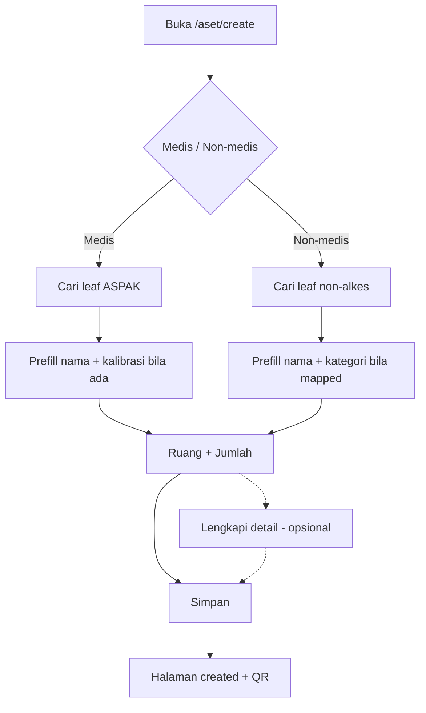

# Desain: Tambah Aset — Progressive Single Page

**Date:** 2026-07-24  
**Status:** Approved (2026-07-24) · Implemented  
**Stack:** Laravel 12 + Inertia React (PortalSifast)  
**Halaman:** `/aset/create`  
**Pendekatan:** A — satu halaman progresif (cepat di atas, detail opsional)

---

## Overview

Merapikan alur **bikin aset baru** agar petugas lapangan bisa selesai dengan sedikit field, sementara admin tetap bisa melengkapi merk/tipe/kategori/regulasi di collapse yang sama.

Bukan mengganti model data atau API store; fokus **UX rewrite** pada form create.

---

## Keputusan terkunci

| Topik | Keputusan |
|-------|-----------|
| Persona | Campuran (cepat + lengkap) |
| Identifikasi barang | **Bikin baru** via katalog (ASPAK / non-alkes), bukan “barang sudah ada” di UI utama |
| Pola UI | Satu halaman, progressive disclosure |
| Wajib simpan | Kelas aset + leaf katalog + ruang + jumlah unit (≥1) |
| Detail opsional | Collapse “Lengkapi detail” (default tertutup) |
| Wizard 3-step | **Dihapus** |
| Mode barang existing | **Tidak** dikembalikan di v1 desain ini |
| Backend | `StoreAsetRequest` + `BuatAsetBatch` tetap; reuse barang by `aset_aspak_alat_id` / `aset_non_alkes_id` |

---

## Alur pengguna

---

## Layout UI

### Area wajib (selalu terlihat)

1. Header singkat: judul + satu kalimat (“Pilih jenis, katalog, ruang — detail boleh nanti”).
2. Dua ModeCard: **Aset medis** / **Aset non-medis**.
3. Search katalog sesuai kelas (`AspakLeafSearchSelect` atau `NonAlkesLeafSearchSelect`).
4. Ringkas item terpilih (nama + kode badge).
5. **Ruang** (`SearchSelect`) + **Jumlah unit** (default `1`, max `50`).
6. Sticky footer: ringkas satu baris (nama / kelas) + **Simpan** + **Batal**.

### Collapse “Lengkapi detail” (default `open = false`)

| Field | Catatan |
|-------|---------|
| Nama barang | Prefill katalog; boleh edit |
| Merk → Tipe/jenis | Cascade; creatable; opsional |
| Kategori | Non-medis: auto dari mapping non-alkes bila ada |
| Produsen | Opsional |
| Wajib kalibrasi | Medis: prefill ASPAK |
| Harga, asal barang, tanggal pengadaan | Opsional |
| No. seri per unit | Tampil jika jumlah > 1; partial OK |
| Distributor, AKL/AKD, daya, level teknologi, foto | Opsional |
| Regulasi lanjutan | Nested collapse: tahun produksi/operasi, umur ekonomis, residu |

---

## Validasi & perilaku

### Client

- Tombol **Simpan** aktif hanya jika: `kelas_aset` + leaf id + `aset_ruang_id` + `jumlah_unit` valid.
- Ganti kelas (`switchKelas`): clear katalog terpilih, `nama_barang`, `wajib_kalibrasi`, serta `aset_merk_id` / `aset_jenis_id` / `aset_kategori_id` / `aset_produsen_id` / id ASPAK & non-alkes.

### Server

- Aturan `StoreAsetRequest` yang ada tetap berlaku (medis wajib ASPAK leaf; non-medis wajib non-alkes **atau** nama; ruang wajib; konsistensi merk↔jenis).
- Setelah redirect back dengan errors: jika ada error pada field di dalam “Lengkapi detail”, UI **auto-open** collapse tersebut dan scroll ke error pertama jika memungkinkan.

### Dropdown

- Pertahankan `menuPortalTarget={document.body}` pada SearchSelect / Creatable / Async katalog agar tidak terpotong sticky footer.

---

## Perubahan teknis

| Area | Perubahan |
|------|-----------|
| `resources/js/pages/aset/create.tsx` | Rewrite layout: hapus `step` / step rail; satu form + Collapsible detail |
| Komponen select | Reuse yang ada; tidak wajib komponen baru |
| Controller / routes / `BuatAsetBatch` | Tidak berubah kecuali diperlukan props tambahan (tidak diharapkan) |
| Edit aset | Di luar scope (tetap form lengkap) |

---

## Testing

| Kasus | Harapan |
|-------|---------|
| Medis + ASPAK leaf + ruang | Redirect sukses; barang `kelas_aset=medis` |
| Non-medis + non-alkes leaf + ruang | Redirect sukses |
| Medis tanpa ASPAK | Error `aset_aspak_alat_id` |
| Tanpa ruang | Error `aset_ruang_id` |
| Payload dengan merk+jenis valid | Tersimpan di `aset_barang` |
| Regression ASPAK / non-alkes / merk-jenis yang ada | Tetap lulus |

Pest feature tests yang sudah ada cukup sebagai baseline; tambah/sesuaikan hanya jika perilaku UI mengubah kontrak request.

---

## Di luar scope (v1)

- UI “pilih barang sudah ada” (`aset_barang_id`)
- Sync live ASPAK Kemenkes
- Halaman CRUD master baru selain yang sudah ada
- Browser / smoke Pest wajib untuk layout ini

---

## Acceptance criteria

1. Petugas bisa membuat aset baru hanya dengan: pilih kelas → pilih leaf katalog → pilih ruang → jumlah → Simpan.
2. Field master/regulasi tidak wajib dan tersembunyi di collapse default.
3. Tidak ada navigasi step 1/2/3.
4. Ganti kelas membersihkan field yang tidak relevan.
5. Error validasi pada field detail membuka collapse detail.
6. Test feature create medis/non-medis yang relevan lulus setelah perubahan UI.
