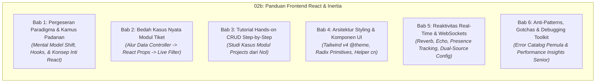

# 📐 Spesifikasi Desain: Panduan Frontend React & Inertia untuk Developer Laravel (Transisi dari Blade & jQuery) serta Koreksi Audit Onboarding

**Tanggal Dokumen:** 2026-09-03  
**Status:** Direvisi (Inkorporasi Pendekatan Dual-Audience: Junior-Friendly & Senior-Engaging)  
**Target Pembaca:** 
1. **Junior Developer:** Membutuhkan analogi intuitif, diagram alur visual, penjelasan baris demi baris, serta penanganan error/gotchas yang jelas.
2. **Senior Developer:** Membutuhkan *TL;DR Cheatsheet*, pemahaman arsitektur *under the hood*, *design rationale* (mengapa memilih teknologi X dibanding Y), dan pola kode produksi nyata tanpa bertele-tele.

---

## 1. Latar Belakang & Filosofi Penulisan

Portal Sifast dibangun dengan arsitektur modern full-stack: **Laravel 12**, **Inertia.js v2**, **React 19**, **TypeScript**, **Tailwind CSS v4**, **Radix UI**, dan **Laravel Wayfinder**. 

Bagi developer Laravel yang terbiasa dengan pola monolitik tradisional (Blade templates, jQuery `$('#id')`, manual AJAX, dan routing Ziggy `route()`), transisi ini menghadirkan perubahan paradigma besar. 

### Prinsip Desain Dual-Audience ("Skim or Deep Dive"):
Dokumentasi ini dirancang dengan struktur lapis ganda (*Dual-Layer Information Architecture*):
* **Bagi Developer Senior (Fast-Track / Skim-Friendly):**
  * Di setiap awal bab disediakan **"TL;DR & Quick Reference Table"** berisi padanan sintaks instan. Senior dapat memindai tabel dalam 10 detik dan langsung produktif.
  * Dilengkapi callout **"Under the Hood & Architectural Rationale"**: Mengapa Wayfinder alih-alih Ziggy? Mengapa React 19 Compiler alih-alih manual `useMemo`? Bagaimana mekanisme protokol Inertia XHR bekerja?
* **Bagi Developer Junior (Guided / Intuitive-Friendly):**
  * Disertai **analogi dunia nyata** yang menjembatani kebiasaan lama di Blade & jQuery.
  * **Diagram alur visual (Mermaid)** untuk memahami siklus request-response dan perpindahan state.
  * Anotasi kode **baris demi baris** pada studi kasus nyata.
  * Bagian khusus **"Gotchas & Jebakan Pemula"** yang merinci pesan error umum (misal: *"Objects are not valid as a React child"*, *"Why is my page blank?"*, *"Why is my input frozen?"*) beserta solusinya.

---

## 2. Struktur Modul Baru: `02b-PANDUAN-FRONTEND-REACT-INERTIA-UNTUK-LARAVEL-DEV.md`

Modul `02b` disusun ke dalam 6 bab komprehensif dengan pola *Dual-Layer*:

---

### Rincian Isi Bab:

#### Bab 1: Pergeseran Paradigma & Kamus Padanan
* **TL;DR Matrix (Untuk Senior):** Tabel ringkas padanan fitur Blade/jQuery vs React 19/Inertia v2.
* **Arsitektur Single Blade Shell:** Mengapa Portal Sifast hanya memiliki satu file HTML induk ([`resources/views/app.blade.php`](file:///Users/adijaya/MyFiles/Projects/RSAisyiahSitiFatimahTulangan/PortalSifast/resources/views/app.blade.php)) dan bagaimana Inertia me-mount React ke DOM melalui direktif `@inertia`.
* **Anatomi & Intuisi React Hooks:**
  * *Analogi:* Hook adalah "colokan listrik" yang menyambungkan fungsi JavaScript biasa ke siklus hidup reaktif browser.
  * `useState`: State reaktif vs manipulasi DOM manual.
  * `useEffect`: Siklus hidup komponen, padanan `$(document).ready()`, dan fungsi *cleanup* pencegah memory leak.
  * `useForm` (Inertia): Form state management, submit handling, progress tracking, dan error mapping otomatis.
  * `usePage` (Inertia): Akses data global shared props (`auth.user`, `flash`, `errors`) tanpa *prop drilling*.
  * Custom Hooks Portal Sifast: `useEcho`, `useUserPresence`, `useAppearance`.
* **Konsep Inti React yang Wajib Dipahami:**
  * Aturan sintaks JSX/TSX (`className`, `htmlFor`, self-closing tag `<input />`, Fragment `<> ... </>`).
  * Komponen & Props (mengapa Props bersifat *Read-Only / Immutable*).
  * Controlled vs Uncontrolled Components (mengapa input form tidak bisa diketik jika state-nya tidak diupdate).
  * Lifting State Up (koordinasi data antar-komponen bersaudara).
  * Atribut wajib `key` pada looping `.map()` dan cara kerja Virtual DOM Diffing.
  * React Context sebagai bus data global ringan.
  * TypeScript dasar untuk komponen (antarmuka `type Props = { ... }`).
* **Under the Hood (Untuk Senior):** Bagaimana Inertia menangani navigasi tanpa full reload via header HTTP `X-Inertia`, partial reloads dengan opsi `only: [...]`, serta penanganan browser history (`pushState` vs `replaceState`).

#### Bab 2: Bedah Kasus Nyata Modul Tiket ITIL (Tahap 1: Analisis)
* **Peta Alur Data Controller ke React:**
  * Mengambil contoh baris nyata dari [`TicketController.php`](file:///Users/adijaya/MyFiles/Projects/RSAisyiahSitiFatimahTulangan/PortalSifast/app/Http/Controllers/TicketController.php) baris 83 (`Inertia::render('tickets/index', [...])`).
  * Membedah bagaimana data Eloquent, pagination, dan filter dipetakan ke prop komponen pada [`resources/js/pages/tickets/index.tsx`](file:///Users/adijaya/MyFiles/Projects/RSAisyiahSitiFatimahTulangan/PortalSifast/resources/js/pages/tickets/index.tsx).
* **Live Search & Filter Tanpa Reload:**
  * Analisis fungsi `applyFilters` menggunakan `router.get('/tickets', newFilters, { preserveState: true, replace: true })`.
  * Mengapa `preserveState: true` menjaga scroll posisi dan input fokus user tetap utuh.
* **Bedah Form Kompleks (`tickets/create.tsx`):**
  * Analisis hook `useForm` dengan belasan field input, relasi kategori-subkategori dinamis, dan multi-select tags.
  * Integrasi komponen `<InputError message={errors.field} />` yang otomatis membaca validasi `StoreTicketRequest`.
* **Wayfinder Routing Aktual:**
  * Menunjukkan sintaks impor modular dari `@/routes/tickets` dan penggunaan fungsi type-safe `show(ticket.id).url`.

#### Bab 3: Tutorial Hands-on CRUD Step-by-Step (Tahap 2: Praktik)
Studi kasus konkret menggunakan modul **Proyek / Rencana Kerja (`projects`)** ([`ProjectController.php`](file:///Users/adijaya/MyFiles/Projects/RSAisyiahSitiFatimahTulangan/PortalSifast/app/Http/Controllers/ProjectController.php) & [`resources/js/pages/projects/`](file:///Users/adijaya/MyFiles/Projects/RSAisyiahSitiFatimahTulangan/PortalSifast/resources/js/pages/projects/)):
* **Langkah 1 (Backend Controller):** Menyusun method `index`, `create`, `store`, dan `destroy` yang mengembalikan response Inertia.
* **Langkah 2 (TypeScript Definition):** Mendefinisikan interface data `ProjectItem`, `PaginatedProjects`, dan `Props` secara disiplin.
* **Langkah 3 (Halaman Index):** Membangun tabel data dengan layout `<AppLayout>`, tombol aksi, filter search bar, dan modal konfirmasi hapus `<ConfirmDialog>`.
* **Langkah 4 (Halaman Form Create):** Membangun form controlled dengan `useForm`, mengaitkan input teks & select option, menampilkan error validasi server, serta proteksi tombol submit saat `processing`.
* **Langkah 5 (Flash Notification):** Menangkap feedback sukses dari redirect controller via `usePage().props.flash`.

#### Bab 4: Arsitektur Styling & Desain Antarmuka (Tailwind v4 & Radix)
* **Tailwind CSS v4 (CSS-First):**
  * Penjelasan arsitektur baru: mengapa file `tailwind.config.js` tidak ada.
  * Peta token tema di `@theme` pada [`resources/css/app.css`](file:///Users/adijaya/MyFiles/Projects/RSAisyiahSitiFatimahTulangan/PortalSifast/resources/css/app.css).
  * Mekanisme Dark Mode menggunakan class `.dark` pada tag `<html>`.
* **Komponen Primitif UI (`resources/js/components/ui/`):**
  * Penggunaan komponen standar: `Button`, `Input`, `Dialog`, `DropdownMenu`, `Badge`, `Select`.
  * Helper `cn()` (`clsx` + `tailwind-merge`): Mengapa kita wajib menggunakan `cn()` saat menggabungkan class Tailwind agar tidak terjadi konflik spesifisitas CSS.

#### Bab 5: Reaktivitas Real-Time & WebSockets
* Arsitektur integrasi **Laravel Reverb** dan **Laravel Echo** di React.
* **Dual-Source Config Pattern:** Mengapa `resources/js/echo.js` mengutamakan objek `window.REVERB_CONFIG` yang disuntikkan dari Blade `resources/views/app.blade.php` (menghindari bug mismatch environment Vite antara local vs production HTTPS/WSS).
* Contoh praktis penggunaan hook `useEcho` untuk mendengarkan channel `presence-online-users` dan `private-chat.{id}`.

#### Bab 6: Anti-Patterns, Gotchas & Debugging Toolkit
* **Daftar Larangan Keras bagi Developer Transisi jQuery:**
  * ❌ Dilarang keras memakai `document.getElementById` atau `$('#id')` untuk manipulasi DOM.
  * ❌ Dilarang melakukan mutasi state langsung (`data.title = 'baru'`; wajib gunakan `setData`).
* **Katalog Gotchas & Solusi Cepat (Penyelamat Developer Junior):**
  * *Gotcha 1:* Input form tidak bisa diketik -> Lupa memasang `onChange` handler pada controlled component.
  * *Gotcha 2:* Error *"Objects are not valid as a React child"* -> Mencoba merender objek `{user}` langsung alih-alih `{user.name}`.
  * *Gotcha 3:* Layar putih kosong (*White Screen of Death*) -> Memeriksa tab Console browser untuk melihat error sintaks/props undefined.
* **Catatan Performa untuk Developer Senior:**
  * **React 19 Compiler:** Penjelasan bahwa Vite mengaktifkan `babel-plugin-react-compiler`. Compiler melakukan auto-memoization AST otomatis, sehingga manual `useMemo` dan `useCallback` tidak lagi diperlukan untuk 95% use-case.
* **Toolkit Debugging:**
  * Cara inspect payload JSON Inertia via Network Tab browser (`XHR/Fetch`).
  * Menggunakan React Developer Tools dan Inertia DevTools.

---

## 3. Rencana Koreksi Audit Dokumen Existing

### A. [`docs/developer-onboarding/00-INDEX-DAN-PANDUAN-MEMBACA.md`](file:///Users/adijaya/MyFiles/Projects/RSAisyiahSitiFatimahTulangan/PortalSifast/docs/developer-onboarding/00-INDEX-DAN-PANDUAN-MEMBACA.md)
* Menambahkan modul `02b` pada tabel daftar modul.
* Menyesuaikan peta alur belajar: Menempatkan `02b` di Hari ke-1/ke-2 tepat setelah `02` agar developer memahami frontend sebelum masuk ke modul bisnis.

### B. [`docs/developer-onboarding/01-ARSITEKTUR-DAN-TECH-STACK.md`](file:///Users/adijaya/MyFiles/Projects/RSAisyiahSitiFatimahTulangan/PortalSifast/docs/developer-onboarding/01-ARSITEKTUR-DAN-TECH-STACK.md)
* Menambahkan rincian **React 19 Compiler** (`babel-plugin-react-compiler`).
* Memperjelas arsitektur **Tailwind CSS v4 (CSS-first)** via `@theme` di `app.css`.
* Menegaskan status **Single Blade Shell** (`resources/views/app.blade.php`).

### C. [`docs/developer-onboarding/02-STRUKTUR-PROJECT-DAN-STANDAR-KODE.md`](file:///Users/adijaya/MyFiles/Projects/RSAisyiahSitiFatimahTulangan/PortalSifast/docs/developer-onboarding/02-STRUKTUR-PROJECT-DAN-STANDAR-KODE.md)
* **Koreksi Kritis Sintaks Wayfinder:** Menghapus sintaks tiruan Ziggy (`import { route } from '@/wayfinder'`) dan menggantinya dengan sintaks resmi Wayfinder di codebase ini (`import { show } from '@/routes/tickets'; show(id).url`).

### D. [`docs/developer-onboarding/11-REALTIME-WEBSOCKET-DAN-PRESENSI.md`](file:///Users/adijaya/MyFiles/Projects/RSAisyiahSitiFatimahTulangan/PortalSifast/docs/developer-onboarding/11-REALTIME-WEBSOCKET-DAN-PRESENSI.md)
* Memperbarui cuplikan kode client Echo agar akurat dengan `resources/js/echo.js` dan menjelaskan peran `window.REVERB_CONFIG` dari `resources/views/app.blade.php`.

---

## 4. Kriteria Keberhasilan (Acceptance Criteria)

1. Modul [`docs/developer-onboarding/02b-PANDUAN-FRONTEND-REACT-INERTIA-UNTUK-LARAVEL-DEV.md`](file:///Users/adijaya/MyFiles/Projects/RSAisyiahSitiFatimahTulangan/PortalSifast/docs/developer-onboarding/02b-PANDUAN-FRONTEND-REACT-INERTIA-UNTUK-LARAVEL-DEV.md) selesai ditulis dengan format *Dual-Layer* (TL;DR untuk senior, visual & step-by-step untuk junior).
2. Memuat katalog Gotchas pemula dan catatan performa arsitektural senior.
3. Seluruh contoh kode bersumber langsung dan terverifikasi dari modul tiket dan proyek di repositori ini.
4. Dokumen `00`, `01`, `02`, dan `11` terupdate dan bebas dari kesalahan fakta/sintaks.
5. Dokumen spesifikasi desain ini dikomit ke dalam Git.
