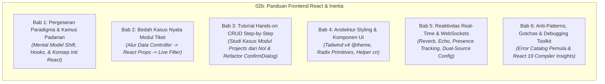

# 📐 Spesifikasi Desain: Panduan Frontend React & Inertia untuk Developer Laravel (Transisi dari Blade & jQuery) serta Koreksi Audit Onboarding

**Tanggal Dokumen:** 2026-09-03  
**Status:** Disetujui & Dimutakhirkan (Standar Superpower & GitHub-Compatible Relative Links)  
**Target Pembaca:** 
1. **Junior Developer:** Membutuhkan analogi intuitif, diagram alur visual, penjelasan baris demi baris, serta penanganan error/gotchas yang jelas.
2. **Senior Developer:** Membutuhkan *TL;DR Cheatsheet*, pemahaman arsitektur *under the hood*, *design rationale* (mengapa memilih teknologi X dibanding Y), dan pola kode produksi nyata tanpa bertele-tele.

---

## 1. Latar Belakang & Filosofi Penulisan

Portal Sifast dibangun dengan arsitektur modern full-stack: **Laravel 12**, **Inertia.js v2**, **React 19**, **TypeScript**, **Tailwind CSS v4**, **Radix UI**, dan **Laravel Wayfinder**. 

Bagi developer Laravel yang terbiasa dengan pola monolitik tradisional (Blade templates, jQuery `$('#id')`, manual AJAX, dan routing Ziggy `route()`), transisi ini menghadirkan perubahan paradigma besar. 

### Prinsip Desain Dual-Audience ("Skim or Deep Dive"):
Dokumentasi ini dirancang dengan struktur lapis ganda (*Dual-Layer Information Architecture*):
* **Bagi Developer Senior (Fast-Track / Skim-Friendly):**
  * Di setiap awal bab disediakan **"TL;DR & Quick Reference Table"** berisi padanan sintaks instan. Senior dapat memindai tabel dalam 10 detik dan langsung produktif.
  * Dilengkapi callout **"Under the Hood & Architectural Rationale"**: Mengapa Wayfinder alih-alih Ziggy? Mengapa React 19 Compiler alih-alih manual `useMemo`? Bagaimana mekanisme protokol Inertia XHR bekerja?
* **Bagi Developer Junior (Guided / Intuitive-Friendly):**
  * Disertai **analogi dunia nyata** yang menjembatani kebiasaan lama di Blade & jQuery.
  * **Diagram alur visual (Mermaid)** untuk memahami siklus request-response dan perpindahan state.
  * Anotasi kode **baris demi baris** pada studi kasus nyata.
  * Bagian khusus **"Gotchas & Jebakan Pemula"** yang merinci pesan error umum (misal: *"Objects are not valid as a React child"*, *"Why is my page blank?"*, *"Why is my input frozen?"*) beserta solusinya.

---

## 2. Ruang Lingkup & Batasan (*Scope & Non-Goals*)

Untuk menjaga fokus dan mencegah *scope creep*, batasan dokumen didefinisikan secara tegas:

### ✅ Termasuk dalam Ruang Lingkup (In-Scope):
1. Penulisan modul baru [`02b-PANDUAN-FRONTEND-REACT-INERTIA-UNTUK-LARAVEL-DEV.md`](../../developer-onboarding/02b-PANDUAN-FRONTEND-REACT-INERTIA-UNTUK-LARAVEL-DEV.md) dengan 6 bab mendalam.
2. Pemutakhiran dan sinkronisasi 4 dokumen existing ([`00`](../../developer-onboarding/00-INDEX-DAN-PANDUAN-MEMBACA.md), [`01`](../../developer-onboarding/01-ARSITEKTUR-DAN-TECH-STACK.md), [`02`](../../developer-onboarding/02-STRUKTUR-PROJECT-DAN-STANDAR-KODE.md), [`11`](../../developer-onboarding/11-REALTIME-WEBSOCKET-DAN-PRESENSI.md)) agar bebas dari miskonsepsi sintaksis rute Wayfinder dan konfigurasi WebSocket Reverb.
3. Seluruh contoh kode bersumber langsung dari modul produksi aktif: Modul Tiket ITIL ([`TicketController.php`](../../../app/Http/Controllers/TicketController.php)) dan Modul Proyek ([`ProjectController.php`](../../../app/Http/Controllers/ProjectController.php)).

### 🚫 Di Luar Ruang Lingkup (Non-Goals):
1. **Tidak Membahas Server-Side Rendering (SSR):** Portal Sifast murni mengadopsi *Client-Side Rendered (CSR)* berbasis *Single Blade Shell* ([`resources/views/app.blade.php`](../../../resources/views/app.blade.php)). Pembahasan Inertia SSR tidak relevan dan dihindari agar tidak membingungkan pembaca.
2. **Tidak Membahas Global State Manager Eksternal (Redux, Zustand, Pinia):** Inertia memposisikan backend Laravel sebagai penyimpan state utama (*shared props*). Tidak ada state library eksternal yang diintroduksi.
3. **Tidak Mengubah Kode Fungsional Produksi:** Dokumen ini merupakan inisiatif dokumentasi dan standarisasi panduan teknis, bukan *refactoring* modul bisnis tiket atau proyek yang sedang aktif di production.

---

## 3. Batasan Implementasi Tiga Tingkat (*Boundaries*)

* **Selalu Lakukan (Always Do):**
  * Selalu gunakan contoh kode nyata yang teruji dari file produksi aktif di repositori.
  * Gunakan format *GitHub Flavored Markdown* (GFM) dengan callout alerts resmi (`> [!NOTE]`, `> [!TIP]`, `> [!IMPORTANT]`, `> [!WARNING]`).
  * **Standar Tautan Relatif GitHub-Compatible:** Seluruh tautan berkas dan referensi dokumen wajib menggunakan *relative path* Markdown (contoh: `../../developer-onboarding/...` atau `../../../app/...`) dan **DILARANG KERAS** menggunakan skema absolut `file:///...` agar seluruh tautan dapat diklik dan berfungsi sempurna saat dibuka di antarmuka web GitHub maupun editor lokal.
  * Pertahankan gaya bahasa Indonesia formal, profesional, dan mudah dipahami dengan istilah teknis bahasa Inggris yang umum.
* **Tanyakan Terlebih Dahulu (Ask First):**
  * Mengubah isi file kode aplikasi di luar folder `docs/developer-onboarding/` dan `docs/superpowers/`.
  * Menambah atau memodifikasi dependensi package di [`package.json`](../../../package.json) atau [`composer.json`](../../../composer.json).
* **Dilarang Keras (Never Do):**
  * Memasukkan tautan absolut lokal `file:///...` ke dalam dokumen repositori.
  * Memasukkan sintaks rute tiruan/palsu (seperti `route('tickets.show', id)` ala Ziggy atau `import { route } from '@/wayfinder'`).
  * Menuliskan contoh kode fiktif yang tidak sesuai dengan tipe data TypeScript dan skema model database riil.
  * Menghapus materi panduan penting pada dokumen onboarding yang sudah ada tanpa alasan koreksi audit yang jelas.

---

## 4. Perintah Eksekutabel & Verifikasi (*Commands*)

Seluruh pengembang dan AI executor dapat menjalankan perintah-perintah berikut untuk memvalidasi tipe data, linting, dan build frontend sebelum dan sesudah memperbarui dokumentasi:

```bash
# 1. Verifikasi Type-Checking TypeScript (memastikan tidak ada type error di JSX/TSX)
npm run types

# 2. Verifikasi Linter ESLint
npm run lint

# 3. Verifikasi Build Produksi Vite (memastikan compiler React 19 & Tailwind v4 berjalan sukses)
npm run build

# 4. Verifikasi Format Prettier (opsional untuk styling resources)
npm run format:check

# 5. Pengecekan Rute Laravel Wayfinder
php artisan route:list --name=projects
php artisan route:list --name=tickets
```

---

## 5. Struktur Modul Baru: `02b-PANDUAN-FRONTEND-REACT-INERTIA-UNTUK-LARAVEL-DEV.md`

Modul `02b` disusun ke dalam 6 bab komprehensif dengan pola *Dual-Layer*:



---

### Rincian Rinci Setiap Bab:

#### Bab 1: Pergeseran Paradigma & Kamus Padanan
* **TL;DR Matrix (Untuk Senior):** Tabel ringkas padanan fitur Blade/jQuery vs React 19/Inertia v2:
  * `@if(...) ... @endif` ↔ `{condition && <Component />}` atau ternary `{condition ? <A /> : <B />}`.
  * `@foreach($items as $item)` ↔ `{items.map((item) => <Item key={item.id} data={item} />)}`.
  * `@csrf` ↔ Otomatis via cookie `XSRF-TOKEN` & header HTTP `X-XSRF-TOKEN` oleh Axios/Inertia.
  * `$('#element').html('...')` ↔ `setCount(...)` / Reaktif state render.
  * `route('users.show', id)` (Ziggy) ↔ `import { show } from '@/routes/users'; show(id).url` (Wayfinder).
* **Arsitektur Single Blade Shell:** Mengapa Portal Sifast hanya memiliki satu file HTML induk ([`resources/views/app.blade.php`](../../../resources/views/app.blade.php)) dan bagaimana Inertia me-mount React ke DOM melalui direktif `@inertia` dan `@inertiaHead`.
* **Anatomi & Intuisi React Hooks:**
  * *Analogi:* Hook adalah "colokan listrik" yang menyambungkan fungsi JavaScript biasa ke siklus hidup reaktif browser.
  * `useState`: State reaktif vs manipulasi DOM manual.
  * `useEffect`: Siklus hidup komponen, padanan `$(document).ready()`, dan fungsi *cleanup* pencegah memory leak.
  * `useForm` (Inertia): Form state management, submit handling, progress tracking, dan error mapping otomatis.
  * `usePage` (Inertia): Akses data global shared props (`auth.user`, `flash`, `errors`) tanpa *prop drilling*.
  * Custom Hooks Portal Sifast: `useEcho`, `useUserPresence`, `useAppearance`.
* **Konsep Inti React yang Wajib Dipahami:**
  * Aturan sintaks JSX/TSX (`className`, `htmlFor`, self-closing tag `<input />`, Fragment `<> ... </>`).
  * Komponen & Props (mengapa Props bersifat *Read-Only / Immutable*).
  * Controlled vs Uncontrolled Components (mengapa input form tidak bisa diketik jika state-nya tidak diupdate).
  * Lifting State Up (koordinasi data antar-komponen bersaudara).
  * Atribut wajib `key` pada looping `.map()` dan cara kerja Virtual DOM Diffing.
  * React Context sebagai bus data global ringan.
  * TypeScript dasar untuk komponen (antarmuka `type Props = { ... }`).
* **Under the Hood (Untuk Senior):** Bagaimana Inertia menangani navigasi tanpa full reload via header HTTP `X-Inertia`, partial reloads dengan opsi `only: [...]`, serta penanganan browser history (`pushState` vs `replaceState`).

#### Bab 2: Bedah Kasus Nyata Modul Tiket ITIL (Tahap 1: Analisis)
* **Peta Alur Data Controller ke React:**
  * Mengambil contoh baris nyata dari [`TicketController.php`](../../../app/Http/Controllers/TicketController.php) baris 83–94 (`Inertia::render('tickets/index', [...])`).
  * Membedah bagaimana data Eloquent, pagination, dan filter dipetakan ke prop komponen pada [`resources/js/pages/tickets/index.tsx`](../../../resources/js/pages/tickets/index.tsx).
* **Live Search & Filter Tanpa Reload:**
  * Analisis fungsi `applyFilters` menggunakan `router.get('/tickets', newFilters, { preserveState: true, replace: true })`.
  * Mengapa `preserveState: true` menjaga scroll posisi dan input fokus user tetap utuh.
* **Bedah Form Kompleks ([`resources/js/pages/tickets/create.tsx`](../../../resources/js/pages/tickets/create.tsx)):**
  * Analisis hook `useForm` dengan belasan field input, relasi kategori-subkategori dinamis, dan multi-select tags.
  * Integrasi komponen `<InputError message={errors.field} />` yang otomatis membaca validasi `StoreTicketRequest`.
* **Wayfinder Routing Aktual:**
  * Menunjukkan sintaks impor modular dari `@/routes/tickets` dan penggunaan fungsi type-safe `show(ticket.id).url` atau `show(ticket).url`.

#### Bab 3: Tutorial Hands-on CRUD Step-by-Step (Tahap 2: Praktik)
Studi kasus konkret menggunakan modul **Proyek / Rencana Kerja (`projects`)** ([`ProjectController.php`](../../../app/Http/Controllers/ProjectController.php) & [`resources/js/pages/projects/`](../../../resources/js/pages/projects/)):
* **Langkah 1 (Backend Controller):** Menyusun method `index`, `create`, `store`, dan `destroy` yang mengembalikan response Inertia.
* **Langkah 2 (TypeScript Definition):** Mendefinisikan interface data `ProjectItem`, `PaginatedProjects`, dan `Props` secara disiplin.
* **Langkah 3 (Halaman Index):** Membangun tabel data dengan layout `<AppLayout>`, tombol aksi, filter search bar.
* **Langkah 3b (Studi Kasus Modernisasi Konfirmasi Hapus):**
  * Membandingkan cara lama di [`resources/js/pages/projects/index.tsx:201`](../../../resources/js/pages/projects/index.tsx#L201-L203) yang memakai `confirm()` bawaan browser.
  * Menunjukkan cara *refactoring* ke komponen modal yang elegan menggunakan [`ConfirmDialog`](../../../resources/js/components/confirm-dialog.tsx) (`@/components/confirm-dialog`), lengkap dengan *state* `isOpen` dan handling `router.delete(...)`.
* **Langkah 4 (Halaman Form Create):** Membangun form controlled dengan `useForm`, mengaitkan input teks & select option, menampilkan error validasi server, serta proteksi tombol submit saat `processing`.
* **Langkah 5 (Flash Notification):** Menangkap feedback sukses dari redirect controller via `usePage().props.flash`.

#### Bab 4: Arsitektur Styling & Desain Antarmuka (Tailwind v4 & Radix)
* **Tailwind CSS v4 (CSS-First):**
  * Penjelasan arsitektur baru: mengapa file `tailwind.config.js` tidak ada.
  * Peta token tema di `@theme` pada [`resources/css/app.css`](../../../resources/css/app.css) (variabel `--font-sans: Inter`, skala heading `--text-h1` s/d `--text-h6`, dan display scale).
  * Mekanisme Dark Mode menggunakan directive `@custom-variant dark (&:is(.dark *));` dan class `.dark` pada tag `<html>`.
* **Komponen Primitif UI (`resources/js/components/ui/`):**
  * Penggunaan komponen standar: `Button`, `Input`, `Dialog`, `DropdownMenu`, `Badge`, `Select`.
  * Helper `cn()` (`clsx` + `tailwind-merge`): Mengapa kita wajib menggunakan `cn()` saat menggabungkan class Tailwind agar tidak terjadi konflik spesifisitas CSS.

#### Bab 5: Reaktivitas Real-Time & WebSockets
* Arsitektur integrasi **Laravel Reverb** dan **Laravel Echo** di React.
* **Dual-Source Config Pattern:** 
  * Membandingkan cuplikan konvensional (yang hanya mengandalkan `import.meta.env`) dengan implementasi tangguh di [`resources/js/echo.js`](../../../resources/js/echo.js).
  * Mengapa `resources/js/echo.js` mengutamakan objek `window.REVERB_CONFIG` yang disuntikkan dari Blade [`resources/views/app.blade.php`](../../../resources/views/app.blade.php) (menghindari bug mismatch environment Vite antara local vs production HTTPS/WSS).
* Contoh praktis penggunaan hook `useEcho` untuk mendengarkan channel `presence-online-users` dan `private-chat.{id}`.

#### Bab 6: Anti-Patterns, Gotchas & Debugging Toolkit
* **Daftar Larangan Keras bagi Developer Transisi jQuery:**
  * ❌ Dilarang keras memakai `document.getElementById` atau `$('#id')` untuk manipulasi DOM.
  * ❌ Dilarang melakukan mutasi state langsung (`data.title = 'baru'`; wajib gunakan `setData`).
* **Katalog Gotchas & Solusi Cepat (Penyelamat Developer Junior):**
  * *Gotcha 1:* Input form tidak bisa diketik -> Lupa memasang `onChange` handler pada controlled component.
  * *Gotcha 2:* Error *"Objects are not valid as a React child"* -> Mencoba merender objek `{user}` langsung alih-alih `{user.name}`.
  * *Gotcha 3:* Layar putih kosong (*White Screen of Death*) -> Memeriksa tab Console browser untuk melihat error sintaks/props undefined.
* **Catatan Performa untuk Developer Senior:**
  * **React 19 Compiler:** Penjelasan bahwa Vite mengaktifkan `babel-plugin-react-compiler`. Compiler melakukan auto-memoization AST otomatis, sehingga manual `useMemo` dan `useCallback` tidak lagi diperlukan untuk 95% use-case, kecuali kasus escape hatch tertentu.
* **Toolkit Debugging:**
  * Cara inspect payload JSON Inertia via Network Tab browser (`XHR/Fetch`).
  * Menggunakan React Developer Tools dan Inertia DevTools.

---

## 6. Rencana Koreksi Audit Dokumen Existing

### A. [`00-INDEX-DAN-PANDUAN-MEMBACA.md`](../../developer-onboarding/00-INDEX-DAN-PANDUAN-MEMBACA.md)
* Menambahkan modul `02b` pada tabel daftar modul onboarding.
* Menyesuaikan peta alur belajar: Menempatkan `02b` di Hari ke-1/ke-2 tepat setelah `02` agar developer memahami frontend sebelum masuk ke modul bisnis.
* Membersihkan seluruh tautan lama berskema `file:///...` menjadi tautan relatif dokumen Markdown.

### B. [`01-ARSITEKTUR-DAN-TECH-STACK.md`](../../developer-onboarding/01-ARSITEKTUR-DAN-TECH-STACK.md)
* Menambahkan rincian **React 19 Compiler** (`babel-plugin-react-compiler`).
* Memperjelas arsitektur **Tailwind CSS v4 (CSS-first)** via `@theme` di `resources/css/app.css`.
* Menegaskan status **Single Blade Shell** (`resources/views/app.blade.php`).
* Mengonversi seluruh tautan `file:///...` menjadi tautan relatif.

### C. [`02-STRUKTUR-PROJECT-DAN-STANDAR-KODE.md`](../../developer-onboarding/02-STRUKTUR-PROJECT-DAN-STANDAR-KODE.md)
* **Koreksi Kritis Sintaks Wayfinder:** Menghapus sintaks tiruan Ziggy (`import { route } from '@/wayfinder'`) dan menggantinya dengan sintaks resmi Wayfinder di codebase ini (`import { show } from '@/routes/tickets'; show(id).url`).
* Mengonversi seluruh tautan `file:///...` menjadi tautan relatif.

### D. [`11-REALTIME-WEBSOCKET-DAN-PRESENSI.md`](../../developer-onboarding/11-REALTIME-WEBSOCKET-DAN-PRESENSI.md)
* Memperbarui cuplikan kode client Echo agar akurat dengan `resources/js/echo.js` dan menjelaskan peran `window.REVERB_CONFIG` dari `resources/views/app.blade.php`.
* Mengonversi seluruh tautan `file:///...` menjadi tautan relatif.

---

## 7. Kriteria Keberhasilan & Strategi Verifikasi (*Acceptance Criteria*)

Dokumen dan pembaruan ini dinyatakan selesai dan memenuhi standar kualitas jika seluruh kriteria berikut terpenuhi:

1. **Kelengkapan Modul `02b`:** Berkas [`02b-PANDUAN-FRONTEND-REACT-INERTIA-UNTUK-LARAVEL-DEV.md`](../../developer-onboarding/02b-PANDUAN-FRONTEND-REACT-INERTIA-UNTUK-LARAVEL-DEV.md) selesai ditulis secara lengkap mencakup seluruh 6 bab dengan format *Dual-Layer*.
2. **Kesesuaian Fakta & Bebas Sintaks Palsu:** Tidak ada satu pun contoh kode yang menggunakan sintaks palsu Ziggy (`route(...)` global) atau manipulasi DOM jQuery. Seluruh contoh rute menggunakan modul Wayfinder (`@/routes/...`).
3. **Standar Tautan Relatif & Kompatibilitas GitHub:** Bebas 100% dari tautan berkas lokal `file:///...`. Seluruh tautan menggunakan jalur relatif yang dapat dinavigasi langsung di GitHub web browser dan markdown viewer.
4. **Integritas Tautan & Baris Kode:** Setiap file yang direferensikan dalam dokumentasi ([`TicketController.php`](../../../app/Http/Controllers/TicketController.php), [`ProjectController.php`](../../../app/Http/Controllers/ProjectController.php), [`ConfirmDialog`](../../../resources/js/components/confirm-dialog.tsx), [`echo.js`](../../../resources/js/echo.js), [`app.blade.php`](../../../resources/views/app.blade.php)) valid dan baris kodenya sinkron dengan kode di repositori.
5. **Verifikasi Audit Dokumen Existing:** Dokumen `00`, `01`, `02`, dan `11` telah diperbarui dan tidak lagi mengandung inkonsistensi teknis maupun tautan `file:///...`.
6. **Kesiapan Implementation Plan:** Spesifikasi ini lulus uji mandiri (*self-review*) tanpa placeholder (tidak ada "TBD", "TODO", atau instruksi mengambang) sehingga siap dieksekusi melalui skill `superpowers:writing-plans`.
